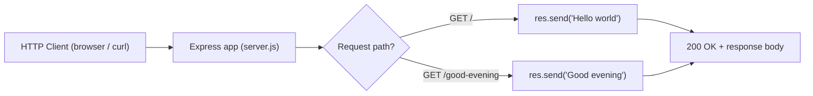

# Artifact2

## Overview

This is a tutorial project: a minimal Node.js HTTP greeting server built with the
[Express](https://www.npmjs.com/package/express) framework. It exposes two `GET`
endpoints — `/`, which responds with `Hello world`, and `/good-evening`, which
responds with `Good evening`. The goal is to demonstrate, end to end, how to install
Express, run a server, and call its routes. (Source: `server.js`)

## Prerequisites

- **Node.js `>= 18`** — Express 5 requires Node.js 18 or higher. This project was
  validated on Node `v22.22.2`. (The engine requirement is declared in
  `package.json` under `engines.node`.)
- **npm** — bundled with Node.js; used to install dependencies and run the server.
  Validated on npm `11.1.0`.

## Installation

Install the project dependencies from the repository root:

```bash
npm install
```

This reads `package.json`, resolves and installs Express `^5.2.1` into
`node_modules/`, and writes the exact resolved dependency tree to
`package-lock.json`. (Source: `package.json`)

## Running the Server

Start the server with the npm `start` script:

```bash
npm start
```

`npm start` is equivalent to running `node server.js` directly. By default the
server listens on port `3000`. The port is overridable via the `PORT` environment
variable (`process.env.PORT || 3000`):

```bash
PORT=8080 npm start
```

Once running, the server logs `Server is listening on http://localhost:3000`
(or the overridden port). (Source: `package.json` `scripts.start`; `server.js`
`app.listen`)

## Endpoints

| Method | Path             | Response       |
| ------ | ---------------- | -------------- |
| GET    | `/`              | `Hello world`  |
| GET    | `/good-evening`  | `Good evening` |

Both endpoints are defined as plain-text `GET` route handlers in `server.js`:

```js
app.get('/', (req, res) => res.send('Hello world'));
app.get('/good-evening', (req, res) => res.send('Good evening'));
```

Behavior is defined in the `server.js` route handlers. (Source: `server.js`)

## Examples

With the server running (see [Running the Server](#running-the-server)), invoke each
endpoint with `curl`:

```bash
# Baseline endpoint
curl http://localhost:3000/
# Response:
# Hello world

# New endpoint
curl http://localhost:3000/good-evening
# Response:
# Good evening
```

## Project Structure

The project is a flat, single-server layout at the repository root:

```text
.
├── README.md           # This tutorial
├── package.json        # Manifest: express dependency, start script, engines
├── package-lock.json   # npm-generated lockfile (exact resolved versions)
├── server.js           # Express app: GET / and GET /good-evening
└── .gitignore          # Ignores node_modules/
```

## Request Routing

The diagram below maps each incoming request path to its handler and exact response:


