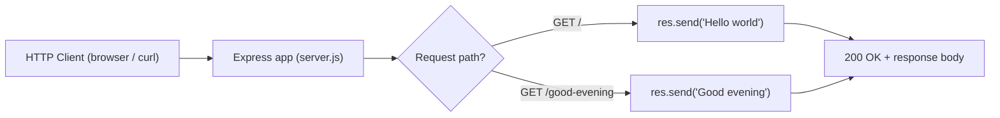

# Technical Specification

# 0. Agent Action Plan

## 0.1 Intent Clarification

Based on the provided requirements, the Blitzy platform understands that the objective is to evolve a minimal Node.js HTTP greeting server into an **Express-based** application that exposes two endpoints — the baseline route returning the response `Hello world` and a **new** route returning the response `Good evening` — and, as the companion deliverable for this documentation-focused Agent Action Plan, to document the resulting server (setup, run, and endpoint reference) as a tutorial. The user explicitly frames this as adding a feature to an existing product.

The user's request is preserved verbatim below:

> add feature to a existing product
>
> this is a tutorial of node js server hosting one endpoint that returns the response "Hello world". Could you add expressjs into the project and add another endpoint that return the reponse of "Good evening"?

**Critical premise reconciliation (read first).** Repository inspection contradicts the prompt's premise that a Node.js "Hello world" server already exists. The indexed repository is a null-state placeholder whose only file is `README.md`, containing a single heading `# Artifact2` [README.md:L1]. The Technical Specification independently confirms this: Section 1.2.2 records that "No system capabilities have been implemented or documented," and Section 3.2.2 explicitly verifies that `package.json` (Node.js / JavaScript / TypeScript) is "Not Present." There is therefore no pre-existing server, dependency manifest, or `Hello world` endpoint to extend. To faithfully honor the request, the platform will **bootstrap** the described starting point (create the project manifest and the base server with the `/` → `Hello world` endpoint) and then **add** the requested `Good evening` endpoint, documenting the whole as a tutorial.

### 0.1.1 Core Objective and Request Categorization

| Dimension | Determination |
|-----------|---------------|
| Primary request type | Add Feature (source code) — the user's own label |
| Companion request type (this section's flavor) | Documentation — Create new + Update existing |
| Net effective action (given null-state repo) | Bootstrap base server → Add new endpoint → Create/Update documentation |
| Documentation type | Tutorial / README with a lightweight HTTP endpoint reference |
| Affected surface | Backend HTTP only — no UI, no database, no authentication |
| Target language / runtime | JavaScript on Node.js (`>=18`); validated against environment Node v22.22.2, npm 11.1.0 |

The discrete requirements, restated with enhanced clarity:

- **R1 — Introduce Express:** Add the `express` framework as a project dependency and use it as the HTTP layer.
- **R2 — New endpoint:** Add a second endpoint whose response body is exactly `Good evening`.
- **R3 — Baseline endpoint (implicit):** Ensure the described endpoint returning exactly `Hello world` exists; because the repository is empty, this baseline must be created rather than merely extended.
- **R4 — Documentation (companion):** Document installation, how to run the server, and the two endpoints as a tutorial in `README.md`.

### 0.1.2 Special Instructions and Constraints

- **No explicit user rules:** The user supplied no implementation rules, style guides, or templates (the rules input was empty), so no `USER PROVIDED TEMPLATE` exists to reproduce. Standard Node.js/Express tutorial conventions and GitHub-Flavored Markdown will be applied.
- **Exact-string preservation (mandatory):** The two response strings are literal user-provided values and must be reproduced verbatim — `Hello world` and `Good evening` — including capitalization and spacing.
- **Minimal-change principle for existing content:** The existing `README.md` heading `# Artifact2` [README.md:L1] is the repository's only declared identity (Section 1.3.1 lists "Project naming declaration" as in-scope); it will be retained and expanded beneath rather than deleted.
- **Default documentation format:** Markdown with embedded Mermaid diagrams and fenced, syntax-highlighted code blocks.
- **Web research performed:** The current Express release was verified against the npm registry to pin an accurate dependency version (see Section 0.2.3).

### 0.1.3 Technical Interpretation

These requirements translate to the following technical strategy, expressed as direct requirement-to-action mappings:

- To **introduce Express**, the platform will create `package.json` declaring `express ^5.2.1` and an npm `start` script, then resolve the dependency into `package-lock.json`.
- To **host the baseline endpoint**, the platform will implement `GET /` in `server.js` returning the string `Hello world`.
- To **add the requested feature**, the platform will implement `GET /good-evening` in `server.js` returning the string `Good evening`.
- To **document the tutorial**, the platform will expand `README.md` with prerequisites, install/run instructions, an endpoints table, runnable `curl` examples, a project-structure listing, and a Mermaid request-routing diagram.

A representative two-line shape of the route layer (full file detailed in Section 0.5):

```js
app.get('/', (req, res) => res.send('Hello world'));
app.get('/good-evening', (req, res) => res.send('Good evening'));
```

### 0.1.4 Inferred and Companion Needs

Beyond the literal request, the following needs are inferred from the null-state repository and standard Node.js project structure:

- A dependency manifest (`package.json`) and lockfile (`package-lock.json`) — none exist today (Section 3.2.2).
- A run/`start` script so the tutorial can be launched with a single command.
- A `.gitignore` to exclude `node_modules/` from version control.
- README sections that a newcomer needs: prerequisites, installation, running, endpoint reference, examples, and project structure.
- A Mermaid diagram visualizing request routing, satisfying the "diagrams for workflows" documentation default.

The following ambiguities are resolved with explicit, conservative defaults; each is flagged for confirmation:

| # | Ambiguity | Resolved Default | Rationale |
|---|-----------|------------------|-----------|
| A1 | No `Hello world` server actually exists in the repo | Bootstrap the base server as part of the change | Establishes the user's described starting point so the feature can be "added" |
| A2 | Route path for the new endpoint not specified | `GET /good-evening` | Descriptive, lowercase-kebab path matching the response intent |
| A3 | Server entry filename not specified | `server.js` | Common Express tutorial convention; referenced by `main` and `start` |
| A4 | Listening port not specified | `3000`, overridable via `process.env.PORT` | De facto Express convention; environment-friendly |
| A5 | HTTP method not specified | `GET` for both endpoints | Greeting responses are read-only |
| A6 | Response content type not specified | Plain string body via `res.send('…')` | Directly returns the exact user-provided strings |

## 0.2 Repository Discovery and Analysis

Repository analysis reveals a documentation-only project shell with no implementation artifacts. The findings below ground every downstream scope and mapping decision in verifiable evidence.

### 0.2.1 Existing Documentation Infrastructure Assessment

| Infrastructure Dimension | Current State | Evidence |
|--------------------------|---------------|----------|
| Documentation files | `README.md` only (title stub) | Root contains a single file `README.md` = `# Artifact2` [README.md:L1] |
| Documentation framework / generator | None | No `mkdocs.yml`, `docusaurus.config.js`, Sphinx `conf.py`, `typedoc.json`, or `.readthedocs.yml` present |
| Markup variants | Markdown only | No `.rst` or `.mdx` files present |
| API documentation tooling | None | No JSDoc/Sphinx/Godoc configuration; no source files to annotate |
| Diagram tooling | None configured | Mermaid will be embedded directly in Markdown (renders on GitHub without additional tooling) |
| Documentation hosting / deployment | None | No docs site, CI doc build, or hosting configuration present |
| `docs/` directory | Absent | No nested documentation tree exists |

The repository's documentation surface is therefore exactly one title-only file. The Technical Specification corroborates this minimal state: Section 1.3.1 enumerates only "Project naming declaration" and "Repository skeleton initialization" as in-scope items observable today.

### 0.2.2 Repository Code Analysis

No source code exists to analyze. Both the repository index and a direct filesystem search confirm the absence of any Node.js project files (no `package.json`, `server.js`, `index.js`, or `app.js`), consistent with Section 3.2.2, which verifies `package.json` as "Not Present," and Section 3.3.1, which records "No framework of any category has been declared" with an empty Code Graph (`{}`).

Consequently, the code units that **will** require documentation are the ones to be created by this effort:

| Module (to be created) | Public Surface | Current Documentation | Documentation Needed |
|------------------------|----------------|-----------------------|----------------------|
| `server.js` | `GET /` → `Hello world`; `GET /good-evening` → `Good evening`; `app.listen(PORT)` | Missing (file does not exist) | Endpoint reference, request/response examples, routing diagram |
| `package.json` | `start` script, `express` dependency, `engines.node` | Missing (file does not exist) | Prerequisites, install, run instructions |

There is no `src/` tree, `config/` directory, or CLI surface to document — the project is a single-file server at the repository root.

### 0.2.3 Web Search Research Conducted

Targeted research validated the dependency version and runtime compatibility that anchor this plan:

- **Express current release:** The npm registry lists Express at version `5.2.1`, and Express 5 is the Express Technical Committee's production-recommended release. Source: npm registry, `npmjs.com/package/express`.
- **Runtime requirement:** Express requires Node.js 18 or higher. The build environment provides Node.js v22.22.2 (current LTS line) and npm 11.1.0, which satisfy this requirement.
- **Documentation tooling:** No documentation-generator research was needed — GitHub-Flavored Markdown with embedded Mermaid requires no build dependency, which keeps the tutorial dependency-free beyond the Express runtime requirement.

## 0.3 Scope Analysis

This section maps the work to be created onto its documentation and identifies the gaps the effort closes. Because the repository is null-state, every mapping below describes artifacts that will be brought into existence by this plan.

### 0.3.1 Code-to-Documentation Mapping

| Code Artifact (to be created) | Public Element | Documentation Target | Documentation Deliverable |
|-------------------------------|----------------|----------------------|---------------------------|
| `server.js` | `GET /` → `Hello world` | `README.md` → Endpoints table + Examples | Method, path, exact response, `curl` example |
| `server.js` | `GET /good-evening` → `Good evening` | `README.md` → Endpoints table + Examples | Method, path, exact response, `curl` example |
| `server.js` | `app.listen(process.env.PORT \|\| 3000)` | `README.md` → Running the server | Start command, default port, `PORT` override |
| `package.json` | `dependencies.express`, `scripts.start`, `engines.node` | `README.md` → Prerequisites + Installation | Node version, `npm install`, `npm start` |
| `server.js` routing | `/` vs `/good-evening` dispatch | `README.md` → Mermaid diagram | Request-routing flow visualization |

Configuration options requiring documentation:

- `PORT` — environment variable consumed by `server.js`; documented in the "Running the server" section with its default of `3000`.

Features requiring a user guide:

- Greeting endpoints — the README serves as the consolidated tutorial covering setup, run, and invocation of both routes.

### 0.3.2 Documentation Gap Analysis

Given the requirements and repository analysis, documentation gaps are total at the outset because no functional documentation exists:

- **Undocumented public endpoints:** Both planned endpoints (`GET /`, `GET /good-evening`) — current coverage `0/2`.
- **Missing setup documentation:** No prerequisites, installation, or run instructions exist; `README.md` is a one-line title [README.md:L1].
- **Missing project orientation:** No project-structure overview, no dependency rationale, no example invocations.
- **No diagrams:** No visual representation of request routing exists.

The effort closes these gaps by producing a complete tutorial README backed by the newly created `server.js` and `package.json`. There is no outdated documentation to reconcile (nothing beyond the title stub exists), and no design-system or UI documentation is applicable (the deliverable is a backend HTTP server with no user interface).

## 0.4 Implementation Design

This section defines the target project layout, the strategy for generating documentation content from the created code, and the visual assets to include.

### 0.4.1 Project and Documentation Structure Planning

The deliverable is a flat, root-level tutorial project (no nested `docs/` tree, which would be disproportionate for a two-endpoint greeting server). The target layout after the change:

```
. (repository root)
├── README.md           # Tutorial: overview, prerequisites, install, run, endpoints, examples, diagram
├── package.json        # Project manifest: express dependency, start script, engines
├── package-lock.json   # npm-generated lockfile (exact resolved versions)
├── server.js           # Express app: GET / and GET /good-evening
└── .gitignore          # Ignores node_modules/
```

The `README.md` content hierarchy:

```
# Artifact2  (retained existing heading)

#### Overview

#### Prerequisites
#### Installation

#### Running the Server
#### Endpoints           (table: Method | Path | Response)

#### Examples            (curl invocations for both endpoints)
#### Project Structure

#### Request Routing     (Mermaid diagram)
```

### 0.4.2 Content Generation Strategy

- **Information extraction:** Endpoint documentation is derived directly from the route handlers in `server.js`; installation and run instructions are derived from `package.json` (`scripts.start`, `engines.node`, `dependencies.express`).
- **Template application:** No user template was provided; the platform applies a standard Node.js/Express tutorial README structure (the hierarchy in Section 0.4.1).
- **Documentation standards:**
  - Markdown headers (`#`, `##`, `###`) for structure.
  - Fenced code blocks with language tags (` ```bash `, ` ```js `) for commands and snippets.
  - A Mermaid block for the routing diagram.
  - An endpoints table for method/path/response.
  - Inline source citations linking documented behavior to code, for example `Source: server.js` route definitions.
  - Verbatim reproduction of the response strings `Hello world` and `Good evening`.

### 0.4.3 Diagram and Visual Strategy

A single Mermaid flowchart visualizes request routing and will be embedded in `README.md`. It maps each incoming path to its handler and exact response:



No screenshots, UI mockups, or architecture diagrams are required, as the deliverable is a headless HTTP server. This single workflow diagram satisfies the documentation default of including a visual for the primary request flow.

## 0.5 File Transformation Mapping

Every file to be created or updated is enumerated below with the target listed first. Transformation modes are **CREATE** (new file), **UPDATE** (modify existing), **DELETE** (remove), and **REFERENCE** (used as a style/structure exemplar). Because the user explicitly requested source-code changes, source files are in scope alongside the documentation deliverable; both categories are shown for completeness. There are no DELETE operations.

### 0.5.1 File-by-File Transformation Table

| Target File | Category | Mode | Source | Content / Changes |
|-------------|----------|------|--------|-------------------|
| `README.md` | Documentation | UPDATE | `README.md` (stub) + `server.js` (new) | Expand the `# Artifact2` title stub into a full tutorial: overview, prerequisites, installation, running, endpoints table, `curl` examples, project structure, and Mermaid routing diagram |
| `server.js` | Source code | CREATE | — (new) | Express entry point: `require('express')`, `GET /` → `res.send('Hello world')`, `GET /good-evening` → `res.send('Good evening')`, `app.listen(process.env.PORT \|\| 3000)` |
| `package.json` | Manifest | CREATE | — (new) | `name`, `version`, `description`, `main: server.js`, `scripts.start: node server.js`, `engines.node: >=18`, `dependencies.express: ^5.2.1` |
| `package-lock.json` | Manifest (generated) | CREATE | Generated by `npm install` | Exact dependency tree lock (npm lockfile v3) pinning `express` and its transitive dependencies |
| `.gitignore` | Config | CREATE | — (new) | Ignore `node_modules/` (and npm debug logs) |

All file paths are at the repository root. No file is left "pending" or "to be discovered"; the list above is exhaustive for this change.

### 0.5.2 New Documentation and Source Files Detail

```
File: server.js
Type: Express application entry point (source)
Source: new file (no predecessor in repo)
Behavior:
    - Import express and instantiate the app
    - GET /              -> res.send('Hello world')   (baseline endpoint)
    - GET /good-evening  -> res.send('Good evening')  (NEW endpoint requested by user)
    - app.listen(process.env.PORT || 3000)
Key Citations: server.js (route handlers); package.json (dependency, start script)
```

```
File: package.json
Type: Node.js project manifest (source)
Source: new file
Sections:
    - name, version, description
    - main: server.js
    - scripts: { "start": "node server.js" }
    - engines: { "node": ">=18" }
    - dependencies: { "express": "^5.2.1" }
Key Citations: server.js (entry referenced by main/start)
```

```
File: .gitignore
Type: VCS ignore config
Source: new file
Content:
    - node_modules/
    - npm-debug.log*
```

### 0.5.3 Documentation Files to Update Detail

- **`README.md`** — expand the existing title-only stub (`# Artifact2` [README.md:L1]) into a complete tutorial while retaining the existing H1:
  - New sections: Overview, Prerequisites, Installation, Running the Server, Endpoints (table), Examples, Project Structure, Request Routing (Mermaid).
  - New examples: `curl http://localhost:3000/` → `Hello world`; `curl http://localhost:3000/good-evening` → `Good evening`.
  - New diagram: the request-routing Mermaid flowchart from Section 0.4.3.
  - Source citations: behavior traced to `server.js` route definitions and `package.json` scripts.

### 0.5.4 Configuration and Cross-File Dependencies

- **Documentation configuration:** None required. There is no `mkdocs.yml`, `docusaurus.config.js`, `.readthedocs.yml`, or Sphinx `conf.py` to update because no documentation generator is used; the README renders natively on GitHub.
- **Build/run configuration:** `package.json` `scripts.start` is the single entry the README references for running the server.
- **Cross-file links:** `README.md` references `server.js` (endpoint behavior) and `package.json` (install/run). No inter-document navigation, table of contents across multiple files, or glossary updates are needed for this single-README deliverable.

## 0.6 Dependency Inventory

This change introduces a single runtime dependency and requires no documentation-build tooling. All versions below are verified against the npm registry and the build environment rather than placeholders.

### 0.6.1 Runtime and Documentation Dependencies

| Registry | Package Name | Version | Purpose |
|----------|--------------|---------|---------|
| npm | express | ^5.2.1 | HTTP server framework providing routing for the `/` and `/good-evening` endpoints |
| (runtime) | Node.js | >=18 (engines); validated on v22.22.2 | JavaScript runtime executing `server.js`; Express 5 requires Node 18+ |
| (runtime) | npm | 11.1.0 (environment) | Dependency installation and lockfile generation |

Notes:

- `express ^5.2.1` reflects the current stable release per the npm registry; Express 5 is the project's production-recommended major version.
- No documentation generator (e.g., MkDocs, Sphinx, Docusaurus, TypeDoc) is added — the tutorial is GitHub-Flavored Markdown with embedded Mermaid, which requires no build step or additional dependency.
- No test, lint, or build dependencies are introduced, as those are out of scope (Section 0.8.2).

### 0.6.2 Documentation Reference Updates

Not applicable. The repository contains no pre-existing documentation links to migrate: `README.md` is a one-line title stub [README.md:L1] and no other Markdown files exist. The README is authored fresh with internally consistent references to `server.js` and `package.json`, so no link-transformation rules are required.

## 0.7 Coverage and Quality Targets

This section defines the measurable completion bar for both the implemented feature and its documentation.

### 0.7.1 Coverage Metrics

| Coverage Dimension | Current | Target |
|--------------------|---------|--------|
| Public endpoints documented | 0/2 (0%) | 2/2 (100%) |
| Setup steps documented (install, run) | 0% | 100% |
| Configuration options documented (`PORT`) | 0/1 | 1/1 |
| Runnable examples per endpoint | 0 | ≥1 (`curl`) |
| Diagrams for the primary workflow | 0 | 1 (Mermaid routing) |

### 0.7.2 Quality Criteria

- **Completeness:** Every endpoint documents its HTTP method, path, and exact response body; the README covers prerequisites, installation, running, and invocation for both routes.
- **Accuracy:** The README endpoints table must match the routes defined in `server.js` exactly, and the documented response strings must be the verbatim values `Hello world` and `Good evening`.
- **Runnable examples:** Documented commands must work as written — `npm install` resolves `express ^5.2.1`, `npm start` (or `node server.js`) boots the server, and the `curl` examples return the documented strings.
- **Validation performed during planning:** The planned `server.js` pattern passed `node --check` (syntax OK) and the planned `package.json` was confirmed to be valid JSON, both exercised on Node v22.22.2 / npm 11.1.0.
- **Clarity:** Progressive disclosure ordered install → run → call, with consistent terminology.
- **Maintainability:** Documentation traces behavior to source via inline citations (`server.js`, `package.json`).

### 0.7.3 Example and Diagram Requirements

- Minimum one `curl` example per endpoint (two total), each showing the request and expected response.
- One Mermaid request-routing diagram (Section 0.4.3).
- Example verification method: start the server locally and confirm `curl http://localhost:3000/` and `curl http://localhost:3000/good-evening` return the exact strings.

## 0.8 Scope Boundaries

### 0.8.1 Exhaustively In Scope

- **Source files (explicitly requested by the user):**
  - `server.js` — Express application with `GET /` (`Hello world`) and `GET /good-evening` (`Good evening`).
  - `package.json` — manifest declaring `express ^5.2.1`, `start` script, and `engines.node >=18`.
  - `package-lock.json` — generated lockfile.
  - `.gitignore` — ignore `node_modules/`.
- **Documentation files:**
  - `README.md` — full tutorial (overview, prerequisites, installation, running, endpoints table, examples, project structure, Mermaid diagram), expanding the existing `# Artifact2` heading [README.md:L1].
- **Dependency:** Addition of `express ^5.2.1` and the Node `>=18` engine declaration.
- **Behavioral surface:** Exactly two `GET` endpoints with the verbatim response strings.

### 0.8.2 Explicitly Out of Scope

- Any framework other than Express; any database, cache, ORM, or persistence layer.
- Authentication, authorization, sessions, or middleware beyond what Express provides by default.
- Automated tests, test runners, or fixtures (none were requested).
- TypeScript or any transpilation/build pipeline.
- Continuous integration (`.github/workflows`, etc.), linting, or formatting configuration.
- Containerization (`Dockerfile`, `docker-compose.yml`) and any cloud deployment or Infrastructure-as-Code.
- Documentation-site generators or hosting (MkDocs, Docusaurus, Sphinx, Read the Docs) and a nested `docs/` tree.
- Additional endpoints, HTTP methods, or response formats beyond the two specified `GET` routes.
- Any front-end, UI, design system, or component library (none specified; no Figma provided).
- A `LICENSE` file or licensing declaration (not requested; absent per Section 1.3.3).

## 0.9 Execution Parameters

These are the concrete commands and conventions that govern building, running, documenting, and validating the deliverable.

### 0.9.1 Commands

| Purpose | Command |
|---------|---------|
| Install dependencies | `npm install` |
| Run the server | `npm start` (equivalently `node server.js`) |
| Invoke baseline endpoint | `curl http://localhost:3000/` |
| Invoke new endpoint | `curl http://localhost:3000/good-evening` |
| Syntax-check source | `node --check server.js` |
| Documentation build | None — Markdown renders without a build step |
| Documentation preview | Open `README.md` in any Markdown viewer (Mermaid renders on GitHub) |

### 0.9.2 Conventions and Validation

- **Listening port:** `3000` by default, overridable via the `PORT` environment variable (`process.env.PORT || 3000`).
- **Default documentation format:** Markdown with embedded Mermaid diagrams and syntax-highlighted code blocks.
- **Citation requirement:** Documentation sections that describe runtime behavior cite their source file (`server.js` for routes, `package.json` for scripts/dependencies).
- **Style guide:** No repository-specific style guide exists; standard Node.js/Express tutorial conventions and GitHub-Flavored Markdown apply.
- **Validation:** Confirm `npm install` resolves `express ^5.2.1`, the server boots via `npm start`, and both `curl` calls return the exact strings `Hello world` and `Good evening`. (Planning-time checks already passed: `node --check` on the route pattern and JSON validity of the manifest, on Node v22.22.2 / npm 11.1.0.)

## 0.10 Rules and Constraints

The user specified **no explicit implementation rules** (the rules input was empty), and no `.blitzyignore` files exist anywhere in the repository. In the absence of user-mandated directives, the Blitzy platform will adhere to the following self-imposed constraints derived from the request and standard conventions:

- **Preserve exact strings:** Reproduce the response bodies verbatim — `Hello world` and `Good evening`.
- **Use Express as the HTTP layer:** Per the explicit request to "add expressjs into the project."
- **Minimal change to existing content:** Retain the existing `README.md` heading `# Artifact2` [README.md:L1] and expand beneath it rather than replacing it.
- **Pin a verified dependency version:** Declare `express ^5.2.1` (no `latest` or placeholder versions).
- **Keep the footprint proportional:** Do not introduce frameworks, tests, build tooling, or a `docs/` site that the request does not require (see Section 0.8.2).
- **Document with diagrams and runnable examples:** Include a Mermaid routing diagram and at least one working `curl` example per endpoint.
- **Cite sources in documentation:** Trace documented behavior to `server.js` and `package.json`.

No rule-mandated files exist to add beyond those already enumerated in Section 0.5.

## 0.11 Attachments and References

### 0.11.1 Attachments

- **File attachments:** None provided.
- **Figma screens:** None provided. No design system or component library was specified, so the Design System Alignment Protocol and a "Design System Compliance" sub-section are not applicable to this backend-only change.

### 0.11.2 References

Repository artifacts inspected:

- `README.md` — sole existing file; content `# Artifact2` [README.md:L1].

Technical Specification sections consulted (all corroborate the null-state baseline):

- Section 1.2 System Overview — "No system capabilities have been implemented or documented" [§1.2.2].
- Section 1.3 Scope — in-scope items limited to project naming and skeleton initialization [§1.3.1]; source code, dependency management, and API contracts explicitly absent [§1.3.3].
- Section 3.2 Programming Languages — `package.json` verified "Not Present" [§3.2.2].
- Section 3.3 Frameworks & Libraries — "No framework of any category has been declared"; Code Graph `{}` [§3.3.1]; zero supporting libraries [§3.3.2].

External sources:

- npm registry — `express` package, version `5.2.1`, Node.js 18+ requirement: `https://www.npmjs.com/package/express`.

Environment baseline:

- Node.js v22.22.2 and npm 11.1.0 available in the build environment; used to validate the planned `server.js` syntax and `package.json` JSON validity.

