# Technical Specification

# 1. Introduction

## 1.1 EXECUTIVE SUMMARY

### 1.1.1 Project Overview

The repository documented in this Technical Specification is identified as **Artifact2**, as declared in the single H1 heading of the only file present in the repository (`README.md`). At the time of this specification's authoring, Artifact2 exists exclusively as a documentation-only placeholder shell. The repository contains no source code, no configuration files, no build manifests, no dependency declarations, no test infrastructure, no deployment artifacts, and no submodules of any kind.

The Code Graph schema for this repository is explicitly recorded as an empty object (`{}`), confirming the absence of indexable code structures, modules, classes, functions, or other implementation entities. Consequently, this Technical Specification documents the **initial baseline state** of an unimplemented project skeleton rather than an operational system. All forward-looking statements about business purpose, system capabilities, or technical approach are intentionally deferred until substantive artifacts are committed to the repository.

### 1.1.2 Core Business Problem

| Aspect | Current State in Repository |
|--------|------------------------------|
| Core Business Problem | Not Yet Defined |
| Value Proposition | Not Yet Defined |
| Market Differentiation | Not Yet Defined |
| Strategic Rationale | Not Yet Defined |

No business problem statement, value proposition, strategic rationale, or market positioning has been articulated in the repository contents. The single `README.md` file contains only the project title "Artifact2" with no accompanying descriptive prose, mission statement, or stated objectives.

### 1.1.3 Key Stakeholders and Users

| Stakeholder Category | Identification Status |
|----------------------|------------------------|
| Primary End Users | Not Identified in Repository |
| Business Sponsors | Not Identified in Repository |
| Technical Owners | Not Identified in Repository |
| Operations and Support | Not Identified in Repository |

The repository provides no stakeholder analysis, user persona definitions, target audience documentation, or ownership metadata. No `CODEOWNERS` file, `CONTRIBUTORS.md`, license declaration, or maintainer manifest is present.

### 1.1.4 Expected Business Impact and Value Proposition

Because no functional requirements, features, or capabilities are present in the repository, no measurable business impact can be attributed to the current state of Artifact2. Any projection of business impact at this stage would constitute unsupported speculation. Quantification of expected value will be revisited in future revisions of this specification once implementation artifacts—source modules, dependency manifests, configuration, and tests—are introduced into the repository.

---

## 1.2 SYSTEM OVERVIEW

### 1.2.1 Project Context

#### Business Context and Market Positioning

No business context, competitive landscape analysis, or market positioning statement is documented within the repository. The `README.md` file contains no descriptive content beyond the project name.

#### Current System Limitations

Artifact2 is not a replacement for, nor an upgrade of, any pre-existing system based on the contents of the repository. The repository contains no references to legacy systems, predecessor projects, migration paths, or interoperability requirements. There is no prior system whose limitations could be characterized as motivation for the present effort.

#### Integration with the Enterprise Landscape

| Integration Dimension | Current State |
|-----------------------|---------------|
| Upstream Systems | None Declared |
| Downstream Consumers | None Declared |
| External APIs | None Declared |
| Enterprise Services | None Declared |

The repository declares no integrations, external dependencies, service connections, or API contracts. No environment-specific conditions, runtime triggers, or generated outputs have been defined.

### 1.2.2 High-Level Description

#### Primary System Capabilities

No system capabilities have been implemented or documented. Exhaustive file-system inspection and four independent semantic searches (for application source code, source modules, configuration manifests, and documentation overview content) all returned empty result sets, confirming the absence of any executable artifacts.

#### Major System Components

The following diagram illustrates the complete component inventory of the repository in its current state, distinguishing what is present from what has not yet been introduced:

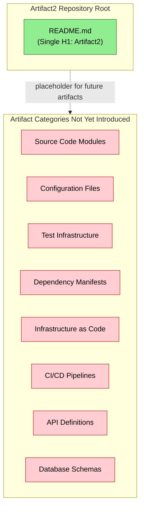

#### Core Technical Approach

No technical approach, architectural style, design pattern selection, technology stack, or framework choice can be inferred from the repository. The absence of any package manifest (such as `package.json`, `requirements.txt`, `pom.xml`, `Cargo.toml`, `go.mod`, `Gemfile`, or `pyproject.toml`) precludes the identification of a target programming language, runtime environment, or dependency graph. No architectural decision records (ADRs), design documents, or RFCs exist in the repository to inform technology selection.

### 1.2.3 Success Criteria

#### Measurable Objectives

| Objective Category | Defined? | Notes |
|--------------------|----------|-------|
| Functional Objectives | No | No requirements documented |
| Performance Objectives | No | No targets specified |
| Quality Objectives | No | No quality gates defined |
| Delivery Objectives | No | No milestones articulated |

#### Critical Success Factors

No critical success factors have been documented. The current placeholder state of the repository cannot support a success-factor analysis because no implementation work, planning artifacts, or constraint declarations have been initiated.

#### Key Performance Indicators (KPIs)

| KPI Category | Metric | Target Value |
|--------------|--------|--------------|
| Business KPIs | Not Defined | Not Defined |
| Technical KPIs | Not Defined | Not Defined |
| Operational KPIs | Not Defined | Not Defined |
| User Experience KPIs | Not Defined | Not Defined |

---

## 1.3 SCOPE

### 1.3.1 In-Scope Elements

#### Core Features and Functionalities

The following table enumerates the in-scope items presently observable in the repository, grounded strictly in the evidence available:

| In-Scope Item | Evidence in Repository |
|---------------|------------------------|
| Project naming declaration | `README.md` contains H1 heading `# Artifact2` |
| Repository skeleton initialization | Single-file project shell present at root |

No must-have capabilities, user workflows, integrations, or technical requirements have been formally inscribed into the repository at the time of this specification.

#### Primary User Workflows

No user workflows are defined. No UI mockups, sequence diagrams, journey maps, or interaction specifications are present in the repository.

#### Essential Integrations

No integrations are in scope based on repository evidence. No integration adapters, client SDK declarations, or external service configurations exist.

#### Key Technical Requirements

No technical requirements have been formally specified. No requirements document, specification file, RFC, or ADR is present in the repository.

### 1.3.2 Implementation Boundaries

#### System Boundaries

| Boundary Dimension | Current Definition |
|--------------------|---------------------|
| Logical System Boundary | Single repository named "Artifact2" |
| Physical Deployment Boundary | Not Yet Defined |
| Trust and Security Boundary | Not Yet Defined |
| Data Ownership Boundary | Not Yet Defined |

#### User Groups Covered

No user groups have been identified or documented within the repository. No role definitions, permission matrices, or access-control declarations exist.

#### Geographic and Market Coverage

No geographic deployment regions, target markets, regional compliance requirements, localization scope, or jurisdictional considerations are documented.

#### Data Domains Included

No data domains, entity models, schema definitions, or data dictionaries are present in the repository. No database migrations, ORM definitions, message contracts, or data exchange specifications have been declared.

### 1.3.3 Out-of-Scope Elements

Because the repository contains no implementation, no features have been positively included nor formally excluded by deliberate design choice. However, the following artifact categories are documented as **explicitly absent**, and therefore out of scope for the current revision of this Technical Specification, based on the verified absence of corresponding files in the repository:

| Out-of-Scope Category | Rationale |
|-----------------------|-----------|
| Source Code Implementation | No source files of any programming language present |
| Build and Compilation | No build scripts, makefiles, or compilation manifests |
| Automated Testing | No test files, fixtures, or test runner configurations |
| Continuous Integration | No `.github/workflows`, `.gitlab-ci.yml`, or CI configuration |
| Container and Deployment Packaging | No `Dockerfile`, `docker-compose.yml`, or Helm charts |
| Infrastructure as Code | No Terraform, Pulumi, CloudFormation, or Ansible artifacts |
| Database and Persistence | No schemas, migrations, or persistence configuration |
| API Contracts | No OpenAPI, gRPC `.proto`, or GraphQL schema files |
| Dependency Management | No package manifests for any ecosystem |
| Licensing Declaration | No `LICENSE` or `LICENSE.md` file present |

#### Future Phase Considerations

Future-phase considerations cannot be enumerated until baseline implementation work has commenced. Subsequent revisions of this Technical Specification will reintroduce in-scope and out-of-scope determinations once functional artifacts are committed to the repository and corresponding planning documents are authored.

#### Integration Points Not Covered

No integration points have been planned or excluded by design. The absence of any integration configuration in the repository means all potential integration scenarios remain entirely undefined; neither inclusion nor exclusion has been declared by any artifact in the repository.

#### Unsupported Use Cases

No use cases—supported or unsupported—have been articulated in the repository. The placeholder state of Artifact2 precludes any positive or negative use-case determination at this time.

---

## 1.4 REFERENCES

### 1.4.1 Files Examined

- `README.md` — The sole file present in the repository, containing only the H1 heading `# Artifact2`; serves as the singular evidence of the project's declared name and confirms the placeholder state of the artifact.

### 1.4.2 Folders Explored

- `/` (repository root, depth 0) — Confirmed via folder enumeration to contain only `README.md` as its sole first-order child; no subdirectories are present. The 3-level minimum depth requirement is inapplicable because the repository has only one level of hierarchy.

### 1.4.3 Repository Inspection Activities

| Activity | Result |
|----------|--------|
| Direct file read of `README.md` | Verified complete contents (single H1 heading) |
| Folder enumeration of repository root | Confirmed single-file presence; no subfolders |
| Semantic search: source code | Empty result set |
| Semantic search: source modules | Empty result set |
| Semantic search: configuration manifests | Empty result set |
| Semantic search: documentation overview | Empty result set |
| Code Graph schema inspection | Confirmed empty object (`{}`) |
| Git history verification | Single "Initial commit" recorded |

### 1.4.4 Technical Specification Cross-References

No other Technical Specification sections were available for cross-reference retrieval at the time of authoring this Introduction (the provided list of retrievable section headings was empty). As subsequent sections of this document are produced, this Introduction may be revisited to incorporate consistent forward references.

# 2. Product Requirements

## 2.1 REQUIREMENTS BASELINE STATEMENT

### 2.1.1 Repository Evidence Summary

The Product Requirements section of this Technical Specification is authored under the same evidence-strict reporting standard applied throughout Sections 1.1 through 1.4. Direct inspection of the **Artifact2** repository confirms that no product requirements, features, functional specifications, or implementation artifacts have been committed at the time of this revision. The sole positively-identifiable artifact in the repository is `README.md`, whose entire content is a single H1 heading declaring the project name. The Code Graph schema for the repository is recorded as an empty object (`{}`), confirming the absence of indexable code structures, modules, classes, functions, or other implementation entities (refer to Section 1.1.1 — Project Overview).

Consequently, this section documents the **verified null baseline state** of product requirements rather than enumerating concrete features, requirement identifiers, priorities, complexity ratings, or acceptance criteria. No `F-XXX` feature identifiers, no `F-XXX-RQ-YYY` requirement identifiers, no priority assignments (Must-Have/Should-Have/Could-Have), and no complexity classifications (High/Medium/Low) can be issued for this revision because there are no observable artifacts from which to derive them. Any such enumeration would constitute fabrication and would violate the evidence-based reporting standard adopted in Section 1.1.

### 2.1.2 Applicability of Section Components

The following table maps each subsection mandated by the Product Requirements section prompt to its applicability against the current repository state. Each "Not Applicable" determination is anchored to verified absence rather than incomplete investigation. Cross-references to Section 1.3.3 — Out-of-Scope Elements provide independent corroboration of each absence.

| Section Component | Applicability to Current Revision | Anchoring Evidence |
|-------------------|-----------------------------------|--------------------|
| Feature Catalog | Not Applicable — no features exist | Section 1.2.2; Code Graph `{}` |
| Functional Requirements Table | Not Applicable — no requirements articulated | Section 1.3.1; `README.md` content |
| Feature Relationships | Not Applicable — zero features to interrelate | Section 1.2.2; Section 1.3.3 |
| Implementation Considerations | Not Applicable — no implementation initiated | Section 1.3.3 (10 categories absent) |

### 2.1.3 Section Authoring Standard

All entries in this section conform to the documentation discipline established in Section 1.1.4, which states that quantification of expected business impact and value at this stage would constitute unsupported speculation. By the same principle, enumeration of fabricated features or requirements at this stage would constitute unsupported speculation and is therefore avoided. The section is intentionally structured to be re-evaluated in future revisions as substantive artifacts are committed to the repository.

---

## 2.2 FEATURE CATALOG

### 2.2.1 Feature Catalog Status

The Feature Catalog enumerates discrete, testable features of a system, each identified by a unique `F-XXX` identifier and accompanied by metadata, description, and dependency information. For **Artifact2** in its current revision, the Feature Catalog contains **zero entries**. This is not a documentation gap — it is a verified property of the repository confirmed by the following independent observations:

1. The repository's only file (`README.md`) contains no feature declarations, capability descriptions, or functional narratives beyond the project name itself.
2. The repository contains no source code modules, no configuration files, no API contracts, no schema definitions, no design documents, no RFCs, and no architectural decision records (per Section 1.2.2 and Section 1.3.3).
3. Four independent semantic searches (for application source code, source modules, configuration manifests, and documentation overview content) all returned empty result sets (per Section 1.4.3).
4. The Code Graph schema is recorded as an empty object `{}`, confirming the absence of indexable code structures from which features could be derived.

### 2.2.2 Feature Metadata State

| Metadata Field | Current State | Justification |
|----------------|---------------|---------------|
| Unique ID (`F-XXX`) | None Issued | No features exist to identify |
| Feature Name | None Defined | No capabilities described in repository |
| Feature Category | None Assigned | No categorization framework established |
| Priority Level | None Assigned | No prioritization framework declared |
| Status | None Tracked | No development lifecycle initiated |

No `F-001`, `F-002`, or higher-numbered feature identifiers are issued in this revision. No feature names, categories (e.g., Authentication, Data Processing, Reporting), priority levels (Critical/High/Medium/Low), or status values (Proposed/Approved/In Development/Completed) are assigned. The repository contains no precedent or precedent template from which such assignments could be derived without fabrication.

### 2.2.3 Feature Description and Dependency State

| Description Field | Current State |
|-------------------|---------------|
| Overview | Not Authored — no features to describe |
| Business Value | Not Articulated — refer to Section 1.1.2 (Core Business Problem: Not Yet Defined) |
| User Benefits | Not Articulated — refer to Section 1.1.3 (Stakeholders: Not Identified) |
| Technical Context | Not Authored — refer to Section 1.2.2 (no technical approach inferable) |

| Dependency Field | Current State |
|------------------|---------------|
| Prerequisite Features | None — no features exist as prerequisites or dependents |
| System Dependencies | None Declared — no package manifests present (Section 1.2.2) |
| External Dependencies | None Declared — no integrations documented (Section 1.2.1) |
| Integration Requirements | None Declared — no integration points planned (Section 1.3.3) |

The absence of dependencies is consistent with the broader system observations recorded in Section 1.2.1, where the integration landscape table reports "None Declared" across upstream systems, downstream consumers, external APIs, and enterprise services.

---

## 2.3 FUNCTIONAL REQUIREMENTS TABLE

### 2.3.1 Requirement Identifier State

The Functional Requirements Table is conventionally populated with one or more rows per feature, each row carrying a `F-XXX-RQ-YYY` requirement identifier and a complete specification of behavior, acceptance criteria, and validation rules. Because the Feature Catalog (Section 2.2) contains zero entries, the Functional Requirements Table also contains zero rows. No `F-XXX-RQ-YYY` identifiers can be issued without a corresponding `F-XXX` feature identifier to anchor them, and no `F-XXX` feature identifiers can be issued without observable artifacts in the repository.

| Requirement Detail Field | Current State |
|--------------------------|---------------|
| Requirement ID (`F-XXX-RQ-YYY`) | None Issued |
| Description | None Authored |
| Acceptance Criteria | None Defined |
| Priority (Must-Have/Should-Have/Could-Have) | None Assigned |
| Complexity (High/Medium/Low) | None Rated |

### 2.3.2 Technical Specifications State

| Technical Specification Field | Current State |
|-------------------------------|---------------|
| Input Parameters | Not Specified — no API or interface contracts present |
| Output / Response | Not Specified — no return values or response shapes defined |
| Performance Criteria | Not Specified — refer to Section 1.2.3 KPI table (all "Not Defined") |
| Data Requirements | Not Specified — no data domains documented (Section 1.3.2) |

The absence of input/output contracts is corroborated by Section 1.3.3, which documents "API Contracts" as explicitly absent on the basis that no OpenAPI, gRPC `.proto`, or GraphQL schema files are present in the repository. Performance criteria absence is corroborated by Section 1.2.3, which records "Not Defined" across Business KPIs, Technical KPIs, Operational KPIs, and User Experience KPIs.

### 2.3.3 Validation Rules State

| Validation Rule Field | Current State |
|-----------------------|---------------|
| Business Rules | None Documented — no business logic implemented |
| Data Validation | None Documented — no data domains or schemas (Section 1.3.2) |
| Security Requirements | None Documented — Trust and Security Boundary not yet defined |
| Compliance Requirements | None Documented — no jurisdictional considerations articulated |

The Trust and Security Boundary is explicitly recorded as "Not Yet Defined" in Section 1.3.2 (System Boundaries table). The Data Ownership Boundary is similarly recorded as "Not Yet Defined". The absence of geographic deployment regions, target markets, regional compliance requirements, localization scope, and jurisdictional considerations is documented in Section 1.3.2 (Geographic and Market Coverage).

---

## 2.4 FEATURE RELATIONSHIPS

### 2.4.1 Feature Dependency Map

A feature dependency map is a directed graph in which nodes represent features and edges represent prerequisite, integration, or composition relationships between them. With zero features in the catalog (Section 2.2), the feature dependency map for this revision is the **empty graph** — a graph with zero nodes and zero edges.

The following diagram visually represents the null state of the feature dependency map, contrasting the absence of feature nodes with the single positively-identified evidentiary anchor (`README.md`) that establishes only the project's name:

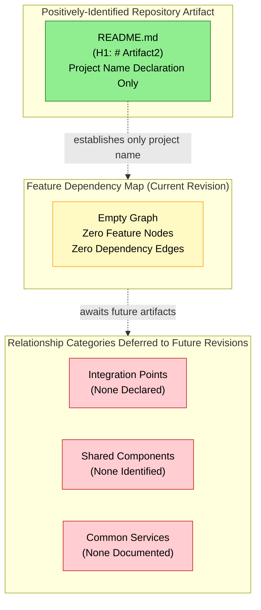

### 2.4.2 Integration Points, Shared Components, and Common Services

| Relationship Category | Current State | Corroborating Section |
|-----------------------|---------------|-----------------------|
| Integration Points | None Declared | Section 1.2.1 (all integration dimensions "None Declared") |
| Shared Components | None Identified | Section 1.2.2 (no component inventory beyond `README.md`) |
| Common Services | None Documented | Section 1.2.1 (no enterprise services declared) |
| Cross-Feature Contracts | None Defined | Section 1.3.3 (API Contracts explicitly absent) |

No feature relationships of any kind are imagined, inferred, or projected. Section 1.3.3 explicitly notes that no integration points have been planned or excluded by design and that all potential integration scenarios remain entirely undefined.

---

## 2.5 IMPLEMENTATION CONSIDERATIONS

### 2.5.1 Technical Constraints and Performance Requirements

| Consideration Category | Current State | Anchoring Evidence |
|------------------------|---------------|--------------------|
| Technical Constraints | None Documented | No package manifests, ADRs, or RFCs present (Section 1.2.2) |
| Performance Requirements | None Documented | Section 1.2.3 (all Performance Objectives: "No targets specified") |
| Resource Requirements | None Documented | No infrastructure manifests (Section 1.3.3) |
| Platform Constraints | None Documented | No target runtime identifiable (Section 1.2.2) |

The absence of a programming language, runtime environment, or dependency graph is anchored in Section 1.2.2, which states that no package manifest exists across any common ecosystem (such as `package.json`, `requirements.txt`, `pom.xml`, `Cargo.toml`, `go.mod`, `Gemfile`, or `pyproject.toml`). Without an identified runtime, no platform-specific technical constraints can be specified.

### 2.5.2 Scalability, Security, and Maintenance Considerations

| Consideration Category | Current State | Anchoring Evidence |
|------------------------|---------------|--------------------|
| Scalability Considerations | None Documented | No deployment topology (Section 1.3.2: Physical Deployment Boundary "Not Yet Defined") |
| Security Implications | None Documented | Section 1.3.2: Trust and Security Boundary "Not Yet Defined" |
| Maintenance Requirements | None Documented | No CODEOWNERS, CONTRIBUTORS.md, or maintainer manifest (Section 1.1.3) |
| Operational Considerations | None Documented | No CI/CD, container, or IaC artifacts (Section 1.3.3) |

The Physical Deployment Boundary, Trust and Security Boundary, and Data Ownership Boundary are each recorded as "Not Yet Defined" in Section 1.3.2 (System Boundaries table). The absence of `CODEOWNERS`, `CONTRIBUTORS.md`, license declarations, and maintainer manifests is recorded in Section 1.1.3 (Key Stakeholders and Users).

### 2.5.3 Implementation Initiation Threshold

Implementation considerations are documented per-feature in conventional Product Requirements sections. Because the Feature Catalog (Section 2.2) is empty, per-feature implementation considerations are likewise undocumented. Future revisions will populate this subsection as features are introduced, and the considerations will be expressed in terms compatible with whatever programming language, runtime, and architectural style are selected when implementation begins.

---

## 2.6 TRACEABILITY MATRIX

### 2.6.1 Requirement Artifact Traceability

The following traceability matrix maps each requirement artifact category prescribed by the Product Requirements section prompt to its current definition status and the repository evidence supporting that status.

| Requirement Artifact | Defined? | Evidence |
|----------------------|----------|----------|
| Feature Catalog Entries (`F-XXX`) | No | No source code, no design docs, no RFCs present |
| Functional Requirement IDs (`F-XXX-RQ-YYY`) | No | No requirements specifications in repository |
| Acceptance Criteria | No | No testable behaviors articulated |
| Priority Assignments | No | No prioritization framework declared |
| Complexity Ratings | No | No estimation artifacts present |
| Input/Output Contracts | No | No API definitions present (Section 1.3.3) |
| Performance Criteria | No | No SLOs, SLAs, or KPIs articulated (Section 1.2.3) |
| Validation Rules | No | No business or data validation logic present |
| Feature Dependency Map | No | Zero features to interrelate |
| Implementation Constraints | No | No implementation initiated |

### 2.6.2 Evidentiary Anchor Traceability

| Traceability Dimension | Source | Result |
|------------------------|--------|--------|
| Project name declaration | `README.md` line 1 (`# Artifact2`) | Verified — only positively-identified artifact |
| Code Graph schema | Repository metadata | Empty object `{}` (Section 1.1.1) |
| Subdirectory hierarchy | Folder enumeration of `/` | None present (Section 1.4.2) |
| Git history | Repository state | Single "Initial commit" (Section 1.4.3) |

### 2.6.3 Cross-Section Traceability

The Product Requirements section is consistent with, and traceable to, the following sections of this Technical Specification. Readers seeking corroboration for any "Not Defined" or "Not Applicable" determination in Section 2 should consult the indicated section.

| Section 2 Topic | Cross-Referenced Section | Relationship |
|-----------------|--------------------------|--------------|
| Feature absence | Section 1.1.2 (Core Business Problem) | Both record "Not Yet Defined" |
| Capability absence | Section 1.2.2 (High-Level Description) | Mermaid diagram of absent artifact categories |
| KPI absence | Section 1.2.3 (Success Criteria) | All KPI categories "Not Defined" |
| Scope baseline | Section 1.3.1 (In-Scope Elements) | Only two in-scope items: name + skeleton |
| Boundary absence | Section 1.3.2 (Implementation Boundaries) | All boundary dimensions undefined |
| Artifact category absence | Section 1.3.3 (Out-of-Scope Elements) | 10 artifact categories explicitly absent |
| Evidentiary inventory | Section 1.4 (References) | Single file, single folder, single commit |

---

## 2.7 ASSUMPTIONS, CONSTRAINTS, AND VERSIONING

### 2.7.1 Documented Assumptions

The following assumptions are explicitly recorded for this revision of the Product Requirements section. Each assumption is forward-looking and does not introduce any fact-claim about the current repository state.

| Assumption ID | Statement |
|---------------|-----------|
| A-2-001 | Subsequent commits will introduce features, requirements, and implementation artifacts that can be cataloged in revised versions of this section. |
| A-2-002 | Feature identifiers (`F-XXX`) and requirement identifiers (`F-XXX-RQ-YYY`) will be issued sequentially as features are introduced, beginning from `F-001` in the first revision that introduces features. |
| A-2-003 | The metadata schema, priority framework, and complexity rating scale defined in the section prompt will remain the authoritative classification scheme for future revisions unless explicitly amended. |
| A-2-004 | Future revisions will populate the Functional Requirements Table, Feature Relationships, and Implementation Considerations subsections in concert with corresponding entries in the Feature Catalog. |

### 2.7.2 Constraints Bounding This Section

The following constraints bound the present revision of the Product Requirements section. These constraints are factual properties of the current repository state, not authoring preferences.

| Constraint ID | Statement |
|---------------|-----------|
| C-2-001 | This revision is bound by the evidence-based reporting standard established in Section 1.1. No requirements may be invented or inferred beyond what exists in the repository. |
| C-2-002 | The repository has only one level of hierarchy (root containing `README.md` only); documentation depth necessarily matches the artifact depth. |
| C-2-003 | The Code Graph schema is empty (`{}`); no indexable code structures exist from which to derive features, modules, classes, or functions. |
| C-2-004 | No feature relationships of any kind may be imagined or projected; only relationships clearly evident in the requirements or source code may be documented, and none are evident. |

### 2.7.3 Version Tracking

| Version Tracking Field | Current State |
|------------------------|---------------|
| Specification Revision | Initial baseline revision |
| Corresponding Repository State | Single "Initial commit" recorded in git history (Section 1.4.3) |
| Number of Cataloged Features | 0 |
| Number of Functional Requirements | 0 |
| Next Re-Evaluation Trigger | Introduction of substantive artifacts to the repository (e.g., source modules, package manifests, design documents, ADRs, or specification files) |

All future revisions of this section should re-evaluate every subsection against newly committed artifacts. The version tracking row "Number of Cataloged Features" should increment as `F-XXX` identifiers are issued, and the row "Number of Functional Requirements" should increment as `F-XXX-RQ-YYY` identifiers are issued.

---

## 2.8 REFERENCES

### 2.8.1 Files Examined

- `README.md` — The sole file present in the repository, containing only the H1 heading `# Artifact2`. Confirmed via direct inspection that no feature declarations, capability descriptions, requirement statements, acceptance criteria, dependency declarations, or implementation guidance are present. Serves as the singular evidentiary anchor for the project name declaration referenced throughout Section 2.

### 2.8.2 Folders Explored

- `/` (repository root, depth 0) — Confirmed to contain only `README.md` as its sole first-order child; no subdirectories present. The folder enumeration provides independent corroboration of the absence of source code modules, configuration directories, test directories, documentation directories, build output directories, or any other artifact category that could contain product requirements information.

### 2.8.3 Technical Specification Cross-References

- **Section 1.1.1 (Project Overview)** — Establishes the documentation-only placeholder framing and the empty Code Graph schema `{}` cited throughout Section 2.
- **Section 1.1.2 (Core Business Problem)** — Records "Not Yet Defined" across Core Business Problem, Value Proposition, Market Differentiation, and Strategic Rationale; corroborates the absence of Business Value and User Benefits content in Section 2.2.3.
- **Section 1.1.3 (Key Stakeholders and Users)** — Records "Not Identified in Repository" across all stakeholder categories; corroborates the absence of User Benefits and Maintenance Requirements content in Sections 2.2.3 and 2.5.2.
- **Section 1.2.1 (Project Context)** — Records "None Declared" across all integration dimensions; corroborates the Integration Points and External Dependencies absence in Section 2.4.2.
- **Section 1.2.2 (High-Level Description)** — Provides the component inventory Mermaid diagram and the explicit non-inferability of a technical approach; corroborates Technical Context absence in Section 2.2.3 and Technical Constraints absence in Section 2.5.1.
- **Section 1.2.3 (Success Criteria)** — Records "Not Defined" across all KPI categories; corroborates the Performance Criteria absence in Section 2.3.2 and Performance Requirements absence in Section 2.5.1.
- **Section 1.3.1 (In-Scope Elements)** — Enumerates only two in-scope items (naming declaration + repository skeleton); establishes the upper bound on what features could be derived from the repository.
- **Section 1.3.2 (Implementation Boundaries)** — Records "Not Yet Defined" across Physical Deployment, Trust and Security, and Data Ownership boundaries; corroborates the Security Implications and Scalability Considerations absence in Section 2.5.2.
- **Section 1.3.3 (Out-of-Scope Elements)** — Documents 10 explicitly-absent artifact categories with rationales; provides independent corroboration for every "Not Applicable" or "None Documented" determination in Sections 2.2 through 2.5.
- **Section 1.4 (References)** — Provides the evidentiary inventory (single file `README.md`, single folder `/`, single git commit) on which Section 2's null-baseline reporting depends.

### 2.8.4 Repository Inspection Activities Relied Upon

| Activity | Result Relied Upon by Section 2 |
|----------|---------------------------------|
| Direct file read of `README.md` | Confirmed no feature or requirement content present |
| Folder enumeration of `/` | Confirmed no subdirectories that could contain requirements |
| Semantic search: requirements & features | Empty result set (independent verification) |
| Semantic search: source code & modules | Empty result set (independent verification) |
| Semantic search: source folders | Empty result set (independent verification) |
| Code Graph schema inspection | Confirmed empty object (`{}`) |
| Git history verification | Single "Initial commit" recorded |

# 3. Technology Stack

## 3.1 TECHNOLOGY STACK BASELINE STATEMENT

### 3.1.1 Repository Evidence Summary

The Technology Stack section of this Technical Specification is authored under the same evidence-strict reporting standard established in Section 1.1 and reinforced by Section 2.1. Direct inspection of the **Artifact2** repository confirms that no programming languages, frameworks, libraries, third-party services, databases, storage configurations, or development/deployment tooling have been committed at the time of this revision. The sole positively-identifiable artifact in the repository is `README.md`, whose entire content is a single H1 heading declaring the project name `# Artifact2`. The Code Graph schema for the repository is recorded as an empty object (`{}`) per Section 1.1.1, confirming the absence of indexable code structures from which a technology stack could be inferred.

Consequently, this section documents the **verified null baseline state** of the technology stack rather than enumerating concrete language selections, framework versions, dependency registries, service providers, database engines, or build/deployment tooling. No version numbers, compatibility matrices, integration contracts, or selection justifications can be issued in this revision because there are no observable artifacts from which to derive them. Section 1.2.2 explicitly states that "no technical approach, architectural style, design pattern selection, technology stack, or framework choice can be inferred from the repository," and Section 2.5.1 reaffirms that "without an identified runtime, no platform-specific technical constraints can be specified."

### 3.1.2 Default Technology Stack Applicability Determination

A Default Technology Stack was provided as authoring guidance, enumerating prescribed defaults including AWS for cloud platform, Docker for containerization, Terraform for infrastructure as code, GitHub Actions for CI/CD, Python with Flask for backend, Auth0 for authentication, MongoDB for database, Langchain for AI framework, React with TypeScript for web frontend, TailwindCSS for CSS, React-Native with TypeScript for mobile, Swift for iOS, Kotlin for Android, Objective-C for macOS, and ElectronJS for desktop.

| Determination Criterion | Result | Anchoring Evidence |
|--------------------------|--------|--------------------|
| Repository evidence supporting any prescribed default | None Found | Sections 1.2.2, 1.3.3, 2.5.1 |
| Constraint compliance if defaults were applied | Violation of C-2-001 | Section 2.7.2 |
| Documentation standard if defaults were applied | Unsupported speculation | Sections 1.1.4, 2.1.3 |
| Final disposition of Default Technology Stack | Not Applied to Current Revision | Combined evidence above |

The Default Technology Stack is **not applied** in this revision because no artifact in the repository supports the selection of any specific item from that list. Application of any default in the absence of corroborating repository evidence would constitute fabrication and would violate Constraint C-2-001 (Section 2.7.2), which states: "No requirements may be invented or inferred beyond what exists in the repository." The same constraint, by extension, prohibits the invention of technology selections beyond what exists in the repository. Section 1.1.4 establishes that "any projection of business impact at this stage would constitute unsupported speculation," and Section 2.1.3 establishes the parallel principle that "enumeration of fabricated features or requirements at this stage would constitute unsupported speculation and is therefore avoided." These principles govern technology selection enumeration in this section.

The Default Technology Stack is preserved as a candidate reference set for future revisions of this specification. When substantive artifacts are committed to the repository — for example, a `package.json`, `requirements.txt`, `Dockerfile`, `terraform/` directory, or any other identifying manifest — the defaults will be evaluated for adoption against the evidence then available, and accepted or replaced based on the artifacts actually committed.

### 3.1.3 Authoring Standard

All entries in this section conform to the documentation discipline established in Section 1.1.4 and Section 2.1.3. Each subsection that follows enumerates a category prescribed by the Technology Stack section prompt (Programming Languages, Frameworks & Libraries, Open Source Dependencies, Third-Party Services, Databases & Storage, Development & Deployment), and records the verified absence of evidence for that category, anchored to specific cross-referenced Technical Specification sections and repository inspection activities. The section is intentionally structured to be re-evaluated in future revisions as substantive artifacts are committed to the repository.

---

## 3.2 PROGRAMMING LANGUAGES

### 3.2.1 Language Identification State

| Language Dimension | Current State | Anchoring Evidence |
|--------------------|---------------|--------------------|
| Primary Backend Language | None Identified | Section 1.2.2 (no package manifest) |
| Primary Frontend Language | None Identified | Section 1.2.2 (no package manifest) |
| Mobile/Cross-Platform Languages | None Identified | Section 1.2.2 (no package manifest) |
| Native Desktop Languages | None Identified | Section 1.2.2 (no package manifest) |
| Scripting Languages | None Identified | Section 1.4.2 (no source files) |
| Domain-Specific Languages | None Identified | Section 1.3.3 (no schemas, no IaC) |

No programming language can be identified for any platform or component of Artifact2. The repository contains zero source files in any language. The sole file present, `README.md`, is a Markdown document containing only a project name declaration. Markdown is documentation markup rather than a programming language, and its presence establishes only the project's name — not its implementation language.

### 3.2.2 Package Manifest Absence Verification

Section 1.2.2 documents the verified absence of every common package manifest, which precludes the identification of a target programming language, runtime environment, or dependency graph. The following manifests were each searched for and confirmed absent:

| Package Manifest | Associated Ecosystem | Verification Result |
|------------------|---------------------|---------------------|
| `package.json` | Node.js / JavaScript / TypeScript | Not Present |
| `requirements.txt` | Python | Not Present |
| `pyproject.toml` | Python (PEP 518/621) | Not Present |
| `setup.py` / `setup.cfg` | Python (Setuptools) | Not Present |
| `Pipfile` / `Pipfile.lock` | Python (Pipenv) | Not Present |
| `poetry.lock` | Python (Poetry) | Not Present |
| `pom.xml` | Java / Maven | Not Present |
| `build.gradle` / `build.gradle.kts` | Java / Kotlin / Gradle | Not Present |
| `Cargo.toml` | Rust | Not Present |
| `go.mod` | Go | Not Present |
| `Gemfile` | Ruby | Not Present |
| `composer.json` | PHP | Not Present |
| `*.csproj` / `*.sln` | C# / .NET | Not Present |
| `Package.swift` / `*.xcodeproj` | Swift / Xcode | Not Present |
| `pubspec.yaml` | Dart / Flutter | Not Present |
| `mix.exs` | Elixir | Not Present |
| `stack.yaml` / `*.cabal` | Haskell | Not Present |

The absence of every common package manifest is independently corroborated by the four semantic searches recorded in Section 1.4.3 (for source code, source modules, configuration manifests, and documentation overview content), each of which returned an empty result set.

### 3.2.3 Selection Criteria and Constraints

| Selection Dimension | Current State |
|---------------------|---------------|
| Selection Criteria | Not Yet Established |
| Performance Constraints | None Documented (Section 2.5.1) |
| Platform Constraints | None Documented (Section 2.5.1) |
| Team Expertise Constraints | Not Identified (Section 1.1.3) |
| Ecosystem Lock-In Considerations | Not Applicable — no ecosystem committed |
| Licensing Constraints on Language | Not Documented (no LICENSE file per Section 1.3.3) |

No selection criteria for programming languages have been documented. Because Section 1.1.3 records "Not Identified in Repository" across all stakeholder categories (Primary End Users, Business Sponsors, Technical Owners, Operations and Support), no team-expertise or organizational preferences can be referenced to justify language choices. Because Section 1.2.3 records "Not Defined" across all performance KPI categories, no performance-driven language selection criteria can be specified. Future revisions will populate this subsection once the first source-bearing commit introduces language-specific files into the repository.

---

## 3.3 FRAMEWORKS & LIBRARIES

### 3.3.1 Framework Declaration State

| Framework Dimension | Current State | Anchoring Evidence |
|---------------------|---------------|--------------------|
| Backend Framework | None Declared | Section 1.2.2; Code Graph `{}` |
| Web Frontend Framework | None Declared | Section 1.2.2; Code Graph `{}` |
| Mobile Framework | None Declared | Section 1.2.2; Code Graph `{}` |
| Desktop Framework | None Declared | Section 1.2.2; Code Graph `{}` |
| Testing Framework | None Declared | Section 1.3.3 (Automated Testing absent) |
| AI / ML Framework | None Declared | Section 1.2.2 |
| ORM / Data Access Framework | None Declared | Section 1.3.3 (Database and Persistence absent) |

No framework of any category has been declared in the Artifact2 repository. The Code Graph schema is recorded as an empty object (`{}`) per Section 1.1.1, confirming that no framework-specific code structures (controllers, components, routes, services, models, decorators, hooks, providers, or any other framework idioms) exist for indexing. Section 1.2.2 states that no architectural style, design pattern selection, technology stack, or framework choice can be inferred from the repository.

### 3.3.2 Supporting Library Inventory

| Library Category | Inventory Count | Evidence |
|------------------|-----------------|----------|
| HTTP Client Libraries | 0 | No package manifests present |
| Authentication Libraries | 0 | No package manifests present |
| Logging Libraries | 0 | No package manifests present |
| Serialization Libraries | 0 | No package manifests present |
| Validation Libraries | 0 | No package manifests present |
| Cryptography Libraries | 0 | No package manifests present |
| UI Component Libraries | 0 | No package manifests present |
| State Management Libraries | 0 | No package manifests present |
| Utility Libraries | 0 | No package manifests present |

The supporting library inventory contains zero entries across every category conventionally documented in a Technology Stack section. This finding is independently corroborated by the empty Code Graph schema (Section 1.1.1), the empty dependency state recorded in Section 2.2.3 ("System Dependencies: None Declared — no package manifests present"), and the absence of every common package manifest enumerated in Section 3.2.2 above.

### 3.3.3 Compatibility and Version State

| Compatibility Dimension | Current State |
|-------------------------|---------------|
| Framework Version Pinning | Not Applicable — no frameworks declared |
| Library Version Constraints | Not Applicable — no libraries declared |
| Runtime Version Requirements | Not Applicable — no runtime identified |
| Compatibility Matrix | Not Applicable — no components to interrelate |
| Major-Version Upgrade Paths | Not Applicable — no baseline versions established |
| Deprecated API Avoidance | Not Applicable — no APIs in use |

No version numbers, semantic-versioning ranges, lockfile contents, or compatibility constraints exist in the repository. Compatibility and version-management documentation will be authored in future revisions once package manifests are introduced, at which point lockfile contents (e.g., `package-lock.json`, `poetry.lock`, `Cargo.lock`, `Gemfile.lock`) will provide the authoritative version inventory.

---

## 3.4 OPEN SOURCE DEPENDENCIES

### 3.4.1 Dependency Manifest State

| Dependency Manifest Dimension | Current State | Anchoring Evidence |
|-------------------------------|---------------|--------------------|
| Direct Dependencies | None Declared | Section 2.2.3 |
| Transitive Dependencies | None Declared | Section 2.2.3 |
| Development Dependencies | None Declared | Section 1.3.3 |
| Peer Dependencies | None Declared | Section 1.3.3 |
| Optional Dependencies | None Declared | Section 1.3.3 |
| Bundled Dependencies | None Declared | Section 1.3.3 |

Section 2.2.3 records "System Dependencies: None Declared — no package manifests present" and "External Dependencies: None Declared — no integrations documented." Section 1.3.3 lists "Dependency Management" as one of the ten explicitly-absent artifact categories, with the rationale "No package manifests for any ecosystem." These determinations are mutually reinforcing.

### 3.4.2 Package Registry Inventory

| Registry | Configured? | Evidence |
|----------|-------------|----------|
| npm Registry (`registry.npmjs.org`) | No | No `package.json` or `.npmrc` present |
| PyPI (`pypi.org`) | No | No `requirements.txt` or `pip.conf` present |
| Maven Central (`repo.maven.apache.org`) | No | No `pom.xml` or `settings.xml` present |
| Gradle Central / JCenter | No | No `build.gradle` or `gradle.properties` present |
| Crates.io | No | No `Cargo.toml` present |
| Go Proxy (`proxy.golang.org`) | No | No `go.mod` present |
| RubyGems (`rubygems.org`) | No | No `Gemfile` present |
| Packagist (`packagist.org`) | No | No `composer.json` present |
| NuGet (`nuget.org`) | No | No `*.csproj` or `nuget.config` present |
| Private / Internal Registries | No | No registry configuration files present |

No package registry configuration of any kind has been introduced into the repository. No `.npmrc`, `.pip.conf`, `settings.xml`, `gradle.properties`, `~/.cargo/config.toml`, `.gemspec`, or comparable registry-locating file exists in the repository file system per the folder enumeration recorded in Section 1.4.2.

### 3.4.3 License Declaration State

| License Dimension | Current State |
|-------------------|---------------|
| Repository LICENSE File | Not Present (Section 1.3.3) |
| License Identifier in Manifest | Not Applicable — no manifest present |
| Third-Party License Inventory | Not Applicable — no dependencies present |
| License Compatibility Matrix | Not Applicable — no licenses to interrelate |
| Open Source Compliance Tooling | Not Configured |

Section 1.3.3 explicitly enumerates "Licensing Declaration" as one of the ten out-of-scope categories with the rationale "No `LICENSE` or `LICENSE.md` file present." Because there are no third-party dependencies, no third-party license inventory exists. Future revisions will reintroduce this subsection once dependency manifests and a top-level LICENSE file are committed to the repository.

---

## 3.5 THIRD-PARTY SERVICES

### 3.5.1 External Integration State

The Integration Landscape table in Section 1.2.1 records the complete null-state across all four integration dimensions, reproduced here for traceability:

| Integration Dimension | Current State | Source Section |
|-----------------------|---------------|----------------|
| Upstream Systems | None Declared | Section 1.2.1 |
| Downstream Consumers | None Declared | Section 1.2.1 |
| External APIs | None Declared | Section 1.2.1 |
| Enterprise Services | None Declared | Section 1.2.1 |

Section 2.4.2 reinforces this state by recording "Integration Points: None Declared," "Shared Components: None Identified," "Common Services: None Documented," and "Cross-Feature Contracts: None Defined." Section 1.3.3 lists "API Contracts" as explicitly absent with the rationale "No OpenAPI, gRPC `.proto`, or GraphQL schema files." No external system integration of any kind exists in this revision.

### 3.5.2 Authentication and Authorization Services

| Authentication / Authorization Dimension | Current State |
|------------------------------------------|---------------|
| Identity Provider (IdP) | None Configured |
| OAuth 2.0 / OIDC Client Configuration | None Present |
| SAML Service Provider Configuration | None Present |
| API Key / Bearer Token Vault | None Present |
| Role-Based Access Control (RBAC) Policy | None Defined |
| Attribute-Based Access Control (ABAC) Policy | None Defined |
| Trust and Security Boundary | Not Yet Defined (Section 1.3.2) |

No authentication service, authorization framework, identity broker, secret manager, or trust boundary has been configured in the Artifact2 repository. Section 2.3.3 records "Security Requirements: None Documented — Trust and Security Boundary not yet defined," and Section 2.5.2 records "Security Implications: None Documented." The Trust and Security Boundary is explicitly recorded as "Not Yet Defined" in the System Boundaries table of Section 1.3.2.

### 3.5.3 Cloud, Monitoring, and Observability Services

| Service Category | Current State |
|------------------|---------------|
| Cloud Compute Provider (e.g., AWS, GCP, Azure) | None Configured |
| Cloud Storage Provider | None Configured |
| Content Delivery Network (CDN) | None Configured |
| DNS / Domain Registrar | None Documented |
| Application Performance Monitoring (APM) | None Configured |
| Log Aggregation Service | None Configured |
| Distributed Tracing Service | None Configured |
| Metrics / Telemetry Backend | None Configured |
| Error Tracking Service | None Configured |
| Alerting / Paging Service | None Configured |
| Feature Flag Service | None Configured |
| Email / Notification Service | None Configured |
| Payment Service Provider | None Configured |
| Search Service (e.g., Elasticsearch SaaS) | None Configured |

No cloud platform, monitoring tool, observability backend, or third-party service of any category has been integrated. Section 2.5.2 records "Operational Considerations: None Documented" with anchoring evidence "No CI/CD, container, or IaC artifacts (Section 1.3.3)." The Default Technology Stack identifies AWS as the prescribed cloud platform and Auth0 as the prescribed authentication service, but neither selection is supported by any artifact in the repository; per the determination in Section 3.1.2, these defaults are not applied in this revision.

---

## 3.6 DATABASES & STORAGE

### 3.6.1 Database Configuration State

| Database Category | Current State | Anchoring Evidence |
|-------------------|---------------|--------------------|
| Relational (SQL) Database | None Configured | Section 1.3.2; Section 1.3.3 |
| Document Database | None Configured | Section 1.3.2; Section 1.3.3 |
| Key-Value Store | None Configured | Section 1.3.2; Section 1.3.3 |
| Graph Database | None Configured | Section 1.3.2; Section 1.3.3 |
| Time-Series Database | None Configured | Section 1.3.2; Section 1.3.3 |
| Search Index Backend | None Configured | Section 1.3.2; Section 1.3.3 |
| Vector Database | None Configured | Section 1.3.2; Section 1.3.3 |
| Embedded Database | None Configured | Section 1.3.2; Section 1.3.3 |

Section 1.3.2 explicitly records: "No data domains, entity models, schema definitions, or data dictionaries are present in the repository. No database migrations, ORM definitions, message contracts, or data exchange specifications have been declared." Section 1.3.3 enumerates "Database and Persistence" as one of the ten explicitly-absent artifact categories with the rationale "No schemas, migrations, or persistence configuration."

### 3.6.2 Persistence Strategy State

| Persistence Dimension | Current State |
|-----------------------|---------------|
| Data Domain Model | None Defined (Section 1.3.2) |
| Entity-Relationship Definition | None Defined (Section 1.3.2) |
| Schema / DDL Files | None Present (Section 1.3.3) |
| Migration Framework | None Configured (Section 1.3.3) |
| ORM / Query Builder | None Configured (Section 3.3.1) |
| Transaction Boundary Policy | None Defined |
| Replication / Sharding Topology | None Defined (Physical Deployment Boundary "Not Yet Defined" per Section 1.3.2) |
| Backup and Restore Policy | None Defined |
| Data Retention Policy | None Defined |
| Data Ownership Boundary | Not Yet Defined (Section 1.3.2) |

No persistence strategy of any kind has been documented. The Data Ownership Boundary is explicitly recorded as "Not Yet Defined" in the System Boundaries table of Section 1.3.2. The absence of geographic deployment regions, target markets, regional compliance requirements, localization scope, and jurisdictional considerations is documented in Section 1.3.2, which means no data-residency persistence constraints can be specified.

### 3.6.3 Caching and Storage Services

| Caching / Storage Category | Current State |
|----------------------------|---------------|
| In-Process Cache | None Configured |
| Distributed Cache (e.g., Redis, Memcached) | None Configured |
| HTTP Response Cache / Reverse Proxy Cache | None Configured |
| Object Storage (e.g., S3-compatible) | None Configured |
| Block Storage Volume | None Configured |
| File Storage Service | None Configured |
| Archival / Cold Storage Tier | None Configured |
| Message Queue / Event Stream | None Configured |
| Static Asset Hosting | None Configured |

No caching layer, storage service, or message bus has been configured. The Default Technology Stack identifies MongoDB as the prescribed database, but no `mongod.conf`, MongoDB driver dependency, connection string, schema file, or migration artifact exists in the repository to corroborate that selection; per the determination in Section 3.1.2, this default is not applied in this revision.

---

## 3.7 DEVELOPMENT & DEPLOYMENT

### 3.7.1 Development Tooling State

| Development Tool Category | Current State | Anchoring Evidence |
|---------------------------|---------------|--------------------|
| Editor / IDE Configuration | None Present | No `.editorconfig`, `.vscode/`, `.idea/` per Section 1.4.2 |
| Code Formatter Configuration | None Present | No `.prettierrc`, `pyproject.toml`, `rustfmt.toml`, etc. |
| Linter Configuration | None Present | No `.eslintrc`, `.flake8`, `.rubocop.yml`, etc. |
| Type Checker Configuration | None Present | No `tsconfig.json`, `mypy.ini`, etc. |
| Pre-Commit Hook Configuration | None Present | No `.pre-commit-config.yaml` |
| Code Coverage Configuration | None Present | No coverage tool configuration |
| Dependency Audit Tooling | None Present | No `audit-ci`, `safety`, or `dependabot` configuration |
| Code Owners File | None Present | No `CODEOWNERS` per Section 1.1.3 |
| Contributor Guide | None Present | No `CONTRIBUTORS.md` per Section 1.1.3 |
| Issue / PR Templates | None Present | No `.github/ISSUE_TEMPLATE/` per Section 1.4.2 |

Section 1.1.3 explicitly records the absence of `CODEOWNERS`, `CONTRIBUTORS.md`, license declarations, and maintainer manifests. Section 2.5.2 reinforces this by recording "Maintenance Requirements: None Documented" with the anchoring evidence "No CODEOWNERS, CONTRIBUTORS.md, or maintainer manifest (Section 1.1.3)."

### 3.7.2 Build System State

| Build System Dimension | Current State |
|------------------------|---------------|
| Build Script (e.g., `Makefile`, `Taskfile`) | None Present (Section 1.3.3) |
| Build Tool Configuration (e.g., Gradle, Bazel, Buck) | None Present (Section 1.3.3) |
| Frontend Bundler (e.g., webpack, esbuild, Vite, Rollup) | None Present (Section 1.3.3) |
| Asset Pipeline | None Present (Section 1.3.3) |
| Output / Artifact Directory | None Present (Section 1.4.2) |
| Reproducible Build Configuration | None Present (Section 1.3.3) |
| Build Caching Strategy | None Present (Section 1.3.3) |
| Cross-Compilation Targets | None Defined (Section 2.5.1) |

Section 1.3.3 explicitly enumerates "Build and Compilation" as one of the ten out-of-scope categories with the rationale "No build scripts, makefiles, or compilation manifests." No build artifact directory, output directory, or compilation manifest of any kind exists in the repository.

### 3.7.3 Containerization and Infrastructure as Code

| Containerization / IaC Dimension | Current State |
|----------------------------------|---------------|
| Dockerfile | Not Present (Section 1.3.3) |
| Docker Compose Configuration | Not Present (Section 1.3.3) |
| Container Image Registry Configuration | Not Present (Section 1.3.3) |
| Kubernetes Manifests / Helm Charts | Not Present (Section 1.3.3) |
| Terraform Configuration | Not Present (Section 1.3.3) |
| Pulumi Configuration | Not Present (Section 1.3.3) |
| AWS CloudFormation Templates | Not Present (Section 1.3.3) |
| Azure Resource Manager Templates | Not Present (Section 1.3.3) |
| Google Cloud Deployment Manager | Not Present (Section 1.3.3) |
| Ansible / Chef / Puppet Configuration | Not Present (Section 1.3.3) |
| Service Mesh Configuration | Not Present (Section 1.3.3) |

Section 1.3.3 enumerates two distinct out-of-scope categories that govern this subsection: "Container and Deployment Packaging" (with the rationale "No `Dockerfile`, `docker-compose.yml`, or Helm charts") and "Infrastructure as Code" (with the rationale "No Terraform, Pulumi, CloudFormation, or Ansible artifacts"). The Default Technology Stack identifies Docker for containerization and Terraform for infrastructure as code, but no artifact in the repository corroborates either selection; per the determination in Section 3.1.2, these defaults are not applied in this revision.

### 3.7.4 Continuous Integration and Delivery

| CI/CD Dimension | Current State |
|-----------------|---------------|
| GitHub Actions Workflows (`.github/workflows/`) | None Present (Section 1.3.3) |
| GitLab CI Configuration (`.gitlab-ci.yml`) | None Present (Section 1.3.3) |
| CircleCI Configuration (`.circleci/config.yml`) | None Present (Section 1.3.3) |
| Jenkins Pipeline (`Jenkinsfile`) | None Present (Section 1.3.3) |
| Azure Pipelines (`azure-pipelines.yml`) | None Present (Section 1.3.3) |
| Bitbucket Pipelines (`bitbucket-pipelines.yml`) | None Present (Section 1.3.3) |
| Build Status Badges | None Present |
| Deployment Pipeline Definition | None Present |
| Release Automation | None Configured |
| Environment Promotion Strategy | None Defined |

Section 1.3.3 enumerates "Continuous Integration" as one of the ten out-of-scope categories with the rationale "No `.github/workflows`, `.gitlab-ci.yml`, or CI configuration." The folder enumeration recorded in Section 1.4.2 confirms that no `.github/` directory or any CI-related folder is present in the repository. The Default Technology Stack identifies GitHub Actions as the prescribed CI/CD platform, but no workflow file exists to corroborate that selection; per the determination in Section 3.1.2, this default is not applied in this revision.

---

## 3.8 TECHNOLOGY STACK VISUALIZATION

### 3.8.1 Null-State Technology Stack Diagram

The following diagram visually represents the null state of the Technology Stack section, mirroring the validated Mermaid diagram pattern established in Sections 1.2.2 and 2.4.1. It contrasts the single positively-identified evidentiary anchor (`README.md`) with the six prescribed Technology Stack categories, each annotated with its verified null determination from Sections 3.2 through 3.7.

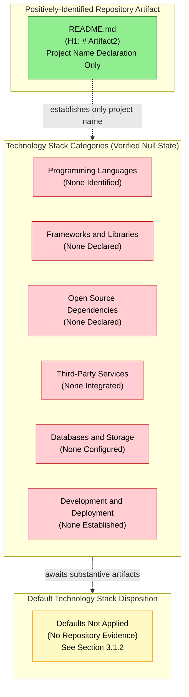

### 3.8.2 Subsection Applicability Map

| Section 3 Subsection | Applicability to Current Revision | Anchoring Evidence |
|----------------------|-----------------------------------|--------------------|
| 3.2 Programming Languages | Not Applicable — no language identifiable | Section 1.2.2; Section 2.5.1; Section 3.2.2 (manifest absence verification) |
| 3.3 Frameworks & Libraries | Not Applicable — no frameworks declared | Section 1.2.2; Section 1.1.1 (Code Graph `{}`) |
| 3.4 Open Source Dependencies | Not Applicable — no dependencies declared | Section 2.2.3; Section 1.3.3 (Dependency Management absent) |
| 3.5 Third-Party Services | Not Applicable — no integrations declared | Section 1.2.1 (all "None Declared"); Section 1.3.3 (API Contracts absent) |
| 3.6 Databases & Storage | Not Applicable — no persistence configured | Section 1.3.2; Section 1.3.3 (Database and Persistence absent) |
| 3.7 Development & Deployment | Not Applicable — no tooling configured | Section 1.3.3 (Build, CI, Container, IaC all absent) |

### 3.8.3 Cross-Section Traceability

The Technology Stack section is consistent with, and traceable to, the following Sections of this Technical Specification. Readers seeking corroboration for any "Not Applicable" or "None Declared" determination in Section 3 should consult the indicated section.

| Section 3 Topic | Cross-Referenced Section | Relationship |
|-----------------|--------------------------|--------------|
| Language non-inferability | Section 1.2.2 (High-Level Description) | Both record absence of all common package manifests |
| Framework non-inferability | Section 1.2.2 + Section 1.1.1 | Both record Code Graph as empty object `{}` |
| Dependency null state | Section 2.2.3 (Feature Description and Dependency State) | Both record "None Declared" across system and external dependencies |
| Integration null state | Section 1.2.1 (Project Context) + Section 2.4.2 (Integration Points) | Both record "None Declared" across all integration dimensions |
| Persistence null state | Section 1.3.2 (Implementation Boundaries) + Section 1.3.3 (Out-of-Scope) | Both record absence of data domains, schemas, and persistence configuration |
| Tooling null state | Section 1.3.3 (Out-of-Scope) | Records Build, CI, Container, and IaC each as explicitly absent |
| Constraint compliance | Section 2.7.2 (Constraints C-2-001 through C-2-004) | Section 3 inherits the same constraints |
| Evidentiary inventory | Section 1.4 (References) + Section 2.8 (References) | Section 3 relies on the same single file, single folder, single commit baseline |

---

## 3.9 ASSUMPTIONS, CONSTRAINTS, AND VERSIONING

### 3.9.1 Documented Assumptions

The following assumptions are explicitly recorded for this revision of the Technology Stack section. Each assumption is forward-looking and does not introduce any fact-claim about the current repository state.

| Assumption ID | Statement |
|---------------|-----------|
| A-3-001 | Subsequent commits will introduce package manifests, build configurations, infrastructure files, or comparable artifacts that will identify a target programming language, runtime, framework, dependency set, and deployment topology. |
| A-3-002 | The Default Technology Stack provided as authoring guidance (AWS, Docker, Terraform, GitHub Actions, Python/Flask, Auth0, MongoDB, Langchain, React/TypeScript, TailwindCSS, React-Native, Swift, Kotlin, Objective-C, ElectronJS) will be evaluated as a candidate selection set in future revisions, with adoption contingent on corroborating repository evidence. |
| A-3-003 | Version numbers, registry endpoints, license identifiers, and compatibility matrices will be authored in future revisions once lockfiles or equivalent version-pinning artifacts are committed. |
| A-3-004 | Security implications of technology selections (per the Notes guidance in the section prompt) will be evaluated against the Trust and Security Boundary once that boundary is positively defined in a future revision (currently "Not Yet Defined" per Section 1.3.2). |
| A-3-005 | Integration requirements between components will be documented once two or more distinct technology selections are committed, providing the relationship endpoints required for integration documentation. |

### 3.9.2 Constraints Bounding This Section

| Constraint ID | Statement |
|---------------|-----------|
| C-3-001 | This section is bound by Constraint C-2-001 (Section 2.7.2): no technology selections may be invented or inferred beyond what exists in the repository. The Default Technology Stack may not be applied in the absence of corroborating evidence. |
| C-3-002 | This section is bound by Constraint C-2-003 (Section 2.7.2): the empty Code Graph schema (`{}`) precludes the inference of framework idioms, library usage, or architectural patterns. |
| C-3-003 | This section is bound by the single-level repository hierarchy recorded in Constraint C-2-002 (Section 2.7.2): no nested directory structure exists from which build-system layout, source-tree layout, or deployment-layer separation could be inferred. |
| C-3-004 | This section may not articulate version numbers, vendor identifiers, or specific service endpoints absent direct evidence in the repository, in conformance with the documentation discipline established in Sections 1.1.4 and 2.1.3. |

### 3.9.3 Re-Evaluation Trigger and Version Tracking

| Version Tracking Field | Current State |
|------------------------|---------------|
| Specification Revision | Initial baseline revision (consistent with Section 2.7.3) |
| Corresponding Repository State | Single "Initial commit" recorded in git history (Section 1.4.3) |
| Number of Identified Languages | 0 |
| Number of Declared Frameworks | 0 |
| Number of Declared Dependencies | 0 |
| Number of Integrated Third-Party Services | 0 |
| Number of Configured Databases | 0 |
| Number of Configured Build/CI/CD Pipelines | 0 |
| Default Technology Stack Adoption Status | Not Applied (See Section 3.1.2) |
| Next Re-Evaluation Trigger | Introduction of any of: package manifest, Dockerfile, IaC artifact, CI workflow, database schema, source file in any language, or third-party service configuration |

All future revisions of this section should re-evaluate every subsection against newly committed artifacts. When the re-evaluation trigger is satisfied, the corresponding subsection should transition from "Not Applicable" / "None Declared" to a populated state that enumerates the actually-committed technology selections with their version numbers, justifications, and integration requirements as prescribed by the section prompt.

---

## 3.10 REFERENCES

### 3.10.1 Files Examined

- `README.md` — The sole file present in the repository, containing only the H1 heading `# Artifact2`. Confirmed via direct inspection that no programming language source, framework declaration, dependency manifest, service configuration, database schema, build script, container definition, or CI configuration is present. Serves as the singular evidentiary anchor for the project name declaration and as the baseline against which all "Not Applicable" determinations in Section 3 are anchored.

### 3.10.2 Folders Explored

- `/` (repository root, depth 0) — Confirmed via folder enumeration to contain only `README.md` as its sole first-order child; no subdirectories present. The absence of conventional Technology Stack-bearing directories (such as `src/`, `lib/`, `pkg/`, `cmd/`, `app/`, `node_modules/`, `vendor/`, `.github/`, `.gitlab/`, `.circleci/`, `terraform/`, `infra/`, `deploy/`, `k8s/`, `docker/`, `db/`, `migrations/`, `schemas/`, or `proto/`) provides independent corroboration of every null determination recorded in Sections 3.2 through 3.7.

### 3.10.3 Technical Specification Cross-References

- **Section 1.1.1 (Project Overview)** — Establishes the documentation-only placeholder framing and records the Code Graph schema as an empty object `{}`; cited throughout Section 3 for the inability to derive framework or library usage.
- **Section 1.1.3 (Key Stakeholders and Users)** — Records "Not Identified in Repository" across all stakeholder categories and the absence of `CODEOWNERS`, `CONTRIBUTORS.md`, and maintainer manifests; cited in Section 3.7.1 (Development Tooling State).
- **Section 1.1.4 (Expected Business Impact and Value Proposition)** — Establishes the principle that any projection at this stage would constitute unsupported speculation; cited in Sections 3.1.2 and 3.1.3 as a foundational documentation standard.
- **Section 1.2.1 (Project Context)** — Records "None Declared" across all four integration dimensions (Upstream Systems, Downstream Consumers, External APIs, Enterprise Services); cited in Section 3.5.1 (External Integration State).
- **Section 1.2.2 (High-Level Description)** — States that no technical approach, architectural style, design pattern, technology stack, or framework choice can be inferred; enumerates all common package manifests as absent; provides the validated Mermaid diagram pattern mirrored in Section 3.8.1.
- **Section 1.2.3 (Success Criteria)** — Records "Not Defined" across all KPI categories; cited in Section 3.2.3 for the absence of performance-driven selection criteria.
- **Section 1.3.2 (Implementation Boundaries)** — Records "Not Yet Defined" across Physical Deployment, Trust and Security, and Data Ownership boundaries; cited in Sections 3.5.2 (Authentication), 3.6.1 (Database Configuration), and 3.6.2 (Persistence Strategy).
- **Section 1.3.3 (Out-of-Scope Elements)** — Enumerates ten explicitly-absent artifact categories with rationales; provides direct anchoring evidence for every null determination in Sections 3.2 through 3.7.
- **Section 1.4 (References)** — Documents the evidentiary inventory (single file `README.md`, single folder `/`, single git commit) on which Section 3's null-baseline reporting depends; Section 1.4.3 enumerates the four semantic searches that returned empty result sets.
- **Section 2.1.3 (Section Authoring Standard)** — Establishes the parallel principle to Section 1.1.4 that enumeration of fabricated requirements would constitute unsupported speculation; cited in Sections 3.1.2 and 3.1.3.
- **Section 2.2.3 (Feature Description and Dependency State)** — Records "None Declared" across System Dependencies, External Dependencies, and Integration Requirements; cited in Section 3.4.1 (Dependency Manifest State).
- **Section 2.3.3 (Validation Rules State)** — Records "Security Requirements: None Documented"; cited in Section 3.5.2 (Authentication and Authorization Services).
- **Section 2.4.1 (Feature Dependency Map)** — Provides the validated Mermaid diagram pattern (subgraph composition with edge connections outside subgraphs) mirrored in Section 3.8.1.
- **Section 2.4.2 (Integration Points)** — Records "None Declared," "None Identified," and "None Documented" across Integration Points, Shared Components, Common Services, and Cross-Feature Contracts; cited in Section 3.5.1.
- **Section 2.5.1 (Technical Constraints and Performance Requirements)** — States that without an identified runtime, no platform-specific technical constraints can be specified; cited in Sections 3.2.1 and 3.2.3.
- **Section 2.5.2 (Scalability, Security, and Maintenance Considerations)** — Records "None Documented" across Scalability, Security, Maintenance, and Operational considerations; cited in Sections 3.5.2, 3.5.3, and 3.7.1.
- **Section 2.7.2 (Constraints Bounding This Section)** — Defines Constraints C-2-001 (evidence-based reporting standard), C-2-002 (single-level hierarchy), C-2-003 (empty Code Graph), and C-2-004 (no feature relationships); explicitly inherited by Constraints C-3-001 through C-3-004 of this section.
- **Section 2.7.3 (Version Tracking)** — Establishes the re-evaluation trigger pattern mirrored in Section 3.9.3.

### 3.10.4 Repository Inspection Activities Relied Upon

| Activity | Result Relied Upon by Section 3 |
|----------|---------------------------------|
| Direct file read of `README.md` | Confirmed no language, framework, dependency, service, database, or tooling content |
| Folder enumeration of `/` (repository root) | Confirmed no subdirectories that could contain technology stack artifacts |
| Semantic search: package manifests / dependency declarations / build configuration | Empty result set (independent verification of Section 3.4 null state) |
| Semantic search: programming language source code / implementation | Empty result set (independent verification of Section 3.2 null state) |
| Semantic search: Dockerfile / container / infrastructure | Empty result set (independent verification of Section 3.7.3 null state) |
| Semantic search: database / storage / configuration / models | Empty result set (independent verification of Section 3.6 null state) |
| Semantic search: application source code modules folder | Empty result set (independent verification of Section 3.2 and Section 3.3 null state) |
| Code Graph schema inspection | Confirmed empty object (`{}`) — independent verification of Section 3.3 null state |
| Git history verification | Single "Initial commit" recorded — confirms baseline revision aligns with Section 2.7.3 |

# 4. Process Flowchart

## 4.1 PROCESS FLOWCHART BASELINE STATEMENT

### 4.1.1 Repository Evidence Summary

The Process Flowchart section of this Technical Specification is authored under the same evidence-strict reporting standard established in Section 1.1 — Executive Summary and reinforced by Section 2.1 — Requirements Baseline Statement and Section 3.1 — Technology Stack Baseline Statement. Direct inspection of the **Artifact2** repository confirms that no business processes, user workflows, integration sequences, decision points, state machines, validation rules, error-handling pathways, retry policies, recovery procedures, or SLA definitions have been committed at the time of this revision. The sole positively-identifiable artifact in the repository is `README.md`, whose entire content is a single H1 heading declaring the project name (`# Artifact2`). The Code Graph schema for the repository is recorded as an empty object (`{}`) per Section 1.1.1 — Project Overview, confirming the absence of indexable code structures from which workflows, control-flow graphs, or state transitions could be derived.

Consequently, this section documents the **verified null baseline state** of process flows rather than enumerating concrete workflows, swim lanes, decision diamonds, transition arrows, error paths, or timing constraints. No `P-XXX` process identifiers, no `W-XXX` workflow identifiers, no `S-XXX` state identifiers, and no `E-XXX` error-path identifiers can be issued for this revision because there are no observable artifacts from which to derive them. Section 1.3.1 — In-Scope Elements explicitly records "No user workflows are defined. No UI mockups, sequence diagrams, journey maps, or interaction specifications are present in the repository," and Section 2.2.1 records that the Feature Catalog contains zero entries. Any enumeration of fabricated processes, sequences, or state transitions would constitute unsupported speculation in direct violation of the documentation discipline established in Sections 1.1.4, 2.1.3, and 3.1.3.

### 4.1.2 Applicability Determination of Section Components

The following table maps each subsection mandated by the Process Flowchart section prompt to its applicability against the current repository state. Each "Not Applicable" determination is anchored to verified absence rather than incomplete investigation. Cross-references to upstream Technical Specification sections provide independent corroboration of each absence.

| Section Component | Applicability to Current Revision | Anchoring Evidence |
|-------------------|-----------------------------------|--------------------|
| Core Business Processes | Not Applicable — no business processes exist | Section 1.3.1 (no user workflows); Section 2.2.1 (zero feature entries) |
| End-to-End User Journeys | Not Applicable — no journeys defined | Section 1.3.1 (no UI mockups, sequence diagrams, journey maps) |
| System Interactions | Not Applicable — no interactions declared | Section 1.2.1 (all four integration dimensions "None Declared") |
| Decision Points | Not Applicable — no decision logic present | Section 2.3.3 (Business Rules: None Documented) |
| Error Handling Paths | Not Applicable — no error handling configured | Section 3.5.3 (Error Tracking, Alerting, Paging all "None Configured") |
| Integration Workflows | Not Applicable — no integrations declared | Section 1.2.1; Section 2.4.2 (Integration Points: None Declared) |
| Data Flow Between Systems | Not Applicable — no data domains defined | Section 1.3.2 (Data Ownership Boundary: Not Yet Defined) |
| API Interactions | Not Applicable — no API contracts present | Section 1.3.3 (API Contracts explicitly absent) |
| Event Processing Flows | Not Applicable — no event stream configured | Section 3.6.3 (Message Queue / Event Stream: None Configured) |
| Batch Processing Sequences | Not Applicable — no CI/CD or scheduler configured | Section 1.3.3 (Continuous Integration explicitly absent) |
| Validation Rules | Not Applicable — no validation logic present | Section 2.3.3 (all four validation rule categories "None Documented") |
| Authorization Checkpoints | Not Applicable — no auth services configured | Section 3.5.2 (IdP, OAuth/OIDC, SAML, RBAC, ABAC all "None Configured/Defined") |
| Regulatory Compliance Checks | Not Applicable — no jurisdictional scope | Section 1.3.2 (no geographic, market, or compliance scope) |
| State Management | Not Applicable — no state model defined | Section 3.6.1 (all 8 database categories "None Configured") |
| State Transitions | Not Applicable — no state machine present | Section 3.6.2 (Data Domain Model: None Defined) |
| Caching Requirements | Not Applicable — no caching configured | Section 3.6.3 (all 9 caching/storage categories "None Configured") |
| Transaction Boundaries | Not Applicable — no transactions defined | Section 3.6.2 (Transaction Boundary Policy: None Defined) |
| Retry Mechanisms | Not Applicable — no retry logic present | Section 3.5.3 (no observability backend); Section 2.5.2 (Operational Considerations: None Documented) |
| Timing and SLA Considerations | Not Applicable — no SLAs articulated | Section 1.2.3 (all four KPI categories "Not Defined"); Section 2.3.2 (Performance Criteria: Not Specified) |
| System Boundaries (for Flowcharts) | Not Applicable — boundaries not yet defined | Section 1.3.2 (Physical, Trust, and Data Ownership boundaries all "Not Yet Defined") |
| User Touchpoints | Not Applicable — no user groups identified | Section 1.3.2 (no user groups documented); Section 1.1.3 (no stakeholders identified) |

### 4.1.3 Authoring Standard

All entries in this section conform to the documentation discipline established in Section 1.1.4, Section 2.1.3, and Section 3.1.3. Each subsection that follows enumerates a category prescribed by the Process Flowchart section prompt (System Workflows, Flowchart Components, Validation Rules, Technical Implementation, Required Diagrams) and records the verified absence of evidence for that category, anchored to specific cross-referenced Technical Specification sections and repository inspection activities. The section is intentionally structured to be re-evaluated in future revisions as substantive artifacts are committed to the repository.

By the principles established in Sections 1.1.4 and 2.1.3, the invention of even illustrative or hypothetical flowcharts at this stage would constitute unsupported speculation and is therefore avoided. The Required Diagrams subsection (Section 4.6) accordingly presents null-state visualizations following the validated Mermaid pattern mirrored from Sections 1.2.2, 2.4.1, and 3.8.1, rather than fabricated process flows that would misrepresent the actual repository state.

---

## 4.2 SYSTEM WORKFLOWS

### 4.2.1 Core Business Process State

A business process, in the conventional sense of this section prompt, is a sequence of activities executed by actors (human or automated) that consumes inputs, applies business logic, and produces outputs in service of a stated business objective. The complete cataloging of business processes for this revision yields the **empty set**, anchored to the following evidence:

| Business Process Element | Current State | Source Section |
|--------------------------|---------------|----------------|
| End-to-End User Journeys | None Defined | Section 1.3.1 — "No user workflows are defined. No UI mockups, sequence diagrams, journey maps, or interaction specifications are present in the repository" |
| Process Actors / Roles | None Identified | Section 1.3.2 — "No user groups have been identified or documented within the repository. No role definitions, permission matrices, or access-control declarations exist" |
| Process Triggers | None Documented | Section 1.2.1 — "No environment-specific conditions, runtime triggers, or generated outputs have been defined" |
| Process Inputs | Not Specified | Section 2.3.2 — "Input Parameters: Not Specified — no API or interface contracts present" |
| Process Outputs | Not Specified | Section 2.3.2 — "Output / Response: Not Specified — no return values or response shapes defined" |
| Process Steps | None Authored | Section 2.2.1 — Feature Catalog contains zero entries |
| Business Objectives Served | Not Yet Defined | Section 1.2.3 — all KPI categories (Business, Technical, Operational, User Experience) recorded as "Not Defined" |

Section 1.3.1 — In-Scope Elements expressly records: "No must-have capabilities, user workflows, integrations, or technical requirements have been formally inscribed into the repository at the time of this specification." This statement, combined with the zero-entry Feature Catalog of Section 2.2.1, establishes the upper bound of zero business processes for this revision.

### 4.2.2 Integration Workflow State

An integration workflow describes the orchestrated sequence of data movements, API invocations, event publications, and consumer responses across two or more independent systems. With all four integration dimensions of Section 1.2.1 recorded as "None Declared" — Upstream Systems, Downstream Consumers, External APIs, and Enterprise Services — the integration workflow inventory for this revision is also the empty set. The detailed null state is captured below:

| Integration Workflow Dimension | Current State | Anchoring Evidence |
|--------------------------------|---------------|--------------------|
| Data Flow Between Systems | None Declared | Section 1.2.1 (all four integration dimensions "None Declared"); Section 2.4.2 (Integration Points: None Declared) |
| API Interactions | None Declared | Section 1.3.3 — "API Contracts: No OpenAPI, gRPC `.proto`, or GraphQL schema files" |
| Event Processing Flows | None Configured | Section 3.6.3 — "Message Queue / Event Stream: None Configured" |
| Batch Processing Sequences | None Configured | Section 1.3.3 — "Continuous Integration: No `.github/workflows`, `.gitlab-ci.yml`, or CI configuration"; Section 3.7 (Development & Deployment: None Established) |
| Synchronous Request/Response Contracts | None Defined | Section 2.4.2 — "Cross-Feature Contracts: None Defined"; Section 3.5.1 — "No external system integration of any kind exists in this revision" |
| Asynchronous Message Contracts | None Defined | Section 1.3.2 — "No message contracts or data exchange specifications have been declared" |
| File Transfer / ETL Pipelines | None Configured | Section 3.6.3 (all storage and message categories "None Configured") |
| Webhook Subscriptions | None Configured | Section 3.5.1 (no external integration); Section 3.5.3 (no notification service) |
| Inter-Service Authentication | None Configured | Section 3.5.2 — all six auth/authz dimensions recorded as "None Configured" or "None Defined" |

### 4.2.3 Workflow Identification Verification

The null state of system workflows is independently corroborated by repository inspection activities documented in Section 1.4.3. The semantic searches enumerated in the Context Gathering activity for Section 4 — for workflow / business process / automation, for state machine / transitions / events, for API endpoint / controller / route, for source code modules / application logic, and for user journey / interactions / sequence diagram — each returned empty result sets. The combined effect of the Code Graph being recorded as an empty object (`{}`), the file system containing only `README.md`, the absence of any subdirectory in the repository, and the absence of any package manifest (enumerated in Section 1.2.2) is the complete absence of any artifact from which a workflow could be derived.

---

## 4.3 FLOWCHART COMPONENTS STATE

A flowchart, by the requirements of the section prompt, comprises a set of standard graphical components: start and end points, process steps, decision diamonds, system boundaries, user touchpoints, error states, recovery paths, and timing/SLA annotations. The state of each component category is enumerated below.

### 4.3.1 Process Step and Decision Point State

| Flowchart Component | Current State | Anchoring Evidence |
|---------------------|---------------|--------------------|
| Start Points | None Documented | Section 1.2.1 (no triggers defined); Section 2.2.1 (zero features) |
| End Points | None Documented | Section 2.3.2 (no output/response defined) |
| Process Steps | None Documented | Section 1.3.1 (no workflows defined); Section 2.2.1 (zero features) |
| Decision Diamonds | None Documented | Section 2.3.3 — "Business Rules: None Documented — no business logic implemented" |
| Branching Conditions | None Documented | Section 2.3.3 (no business logic); Section 2.5.1 (no platform-specific technical constraints) |
| Loop / Iteration Constructs | None Documented | Section 1.1.1 (Code Graph `{}` — no control-flow structures indexable) |
| Parallel Process Forks | None Documented | Section 1.2.2 (no architectural style identifiable) |
| Process Joins / Merges | None Documented | Section 2.4.1 (empty feature dependency graph) |

### 4.3.2 System Boundary and User Touchpoint State

| Boundary / Touchpoint Component | Current State | Anchoring Evidence |
|----------------------------------|---------------|--------------------|
| Logical System Boundary | Single repository named "Artifact2" | Section 1.3.2 (only positively-defined boundary) |
| Physical Deployment Boundary | Not Yet Defined | Section 1.3.2 (System Boundaries table) |
| Trust and Security Boundary | Not Yet Defined | Section 1.3.2 (System Boundaries table) |
| Data Ownership Boundary | Not Yet Defined | Section 1.3.2 (System Boundaries table) |
| User Touchpoints (Web) | None Documented | Section 1.3.2 (no user groups); Section 3.3 (no UI frameworks declared) |
| User Touchpoints (Mobile) | None Documented | Section 1.3.2 (no user groups); Section 3.3 (no mobile frameworks declared) |
| User Touchpoints (API) | None Documented | Section 1.3.3 (API Contracts explicitly absent) |
| External System Interfaces | None Declared | Section 1.2.1 (all four integration dimensions "None Declared") |
| Swim Lane Assignments | None Possible | Zero actors × zero processes = zero swim lanes |

The section prompt requirement to "Add swim lanes for different actors/systems" is governed by the verified absence of both actors (Section 1.3.2 — no user groups) and systems (Section 1.2.1 — no integration parties). With zero actors and zero systems, no swim-lane allocation is possible in this revision.

### 4.3.3 Error State and Recovery Path State

| Error / Recovery Component | Current State | Anchoring Evidence |
|----------------------------|---------------|--------------------|
| Error State Definitions | None Documented | Section 2.3.3 (no validation rules); Section 3.5.3 (no error tracking) |
| Exception Categories | None Documented | Section 1.1.1 (Code Graph `{}` — no exception hierarchies indexable) |
| Error Notification Flows | None Configured | Section 3.5.3 — "Email / Notification Service: None Configured"; "Alerting / Paging Service: None Configured" |
| Recovery Procedures | None Documented | Section 2.5.2 — "Operational Considerations: None Documented" |
| Compensation Logic | None Documented | Section 3.6.2 — "Transaction Boundary Policy: None Defined" |
| Rollback Mechanisms | None Documented | Section 3.6.2 (no transaction model); Section 3.6.1 (no database to roll back) |
| Circuit Breaker Patterns | None Configured | Section 3.3 (no resilience libraries declared) |
| Timeout Handlers | None Configured | Section 2.5.1 (no performance requirements); Section 2.3.2 (no input/output contracts) |

### 4.3.4 Timing and SLA State

| Timing / SLA Component | Current State | Anchoring Evidence |
|------------------------|---------------|--------------------|
| Service Level Objectives (SLOs) | None Defined | Section 1.2.3 (all KPI categories "Not Defined") |
| Service Level Agreements (SLAs) | None Defined | Section 1.2.3; Section 2.3.2 — "Performance Criteria: Not Specified" |
| Latency Targets (P50, P95, P99) | None Defined | Section 2.5.1 — "Performance Requirements: None Documented" |
| Throughput Targets | None Defined | Section 2.5.1 — "Performance Requirements: None Documented" |
| Scheduled Process Cadence | None Defined | Section 1.3.3 (no CI/CD configuration); no scheduler artifacts present |
| Timeout Thresholds | None Defined | Section 2.3.2 — "Input Parameters: Not Specified"; no contracts defining timeout semantics |
| Synchronous Response Budget | None Defined | Section 2.3.2 — no API contracts; Section 1.3.3 — API Contracts explicitly absent |
| Asynchronous Processing Budget | None Defined | Section 3.6.3 — "Message Queue / Event Stream: None Configured" |
| Batch Window Constraints | None Defined | Section 1.3.3 (no CI/CD or batch configuration) |

---

## 4.4 VALIDATION RULES STATE

The section prompt requires the enumeration of validation rules at each process step, including business rules, data validation requirements, authorization checkpoints, and regulatory compliance checks. The validation rules state, as recorded in Section 2.3.3, is verified-null across all four prescribed categories. This subsection re-articulates that null state with explicit cross-references to Section 4.

### 4.4.1 Business Rules State

| Business Rule Dimension | Current State | Source |
|--------------------------|---------------|--------|
| Pre-condition Rules | None Documented | Section 2.3.3 — "Business Rules: None Documented — no business logic implemented" |
| Post-condition Rules | None Documented | Section 2.3.3 |
| Invariant Rules | None Documented | Section 2.3.3 |
| Cross-Entity Business Constraints | None Documented | Section 2.3.3; Section 1.3.2 (no entity models defined) |
| Workflow Gating Rules | None Documented | Section 1.3.1 (no workflows defined) |

The verified absence of business logic is anchored to Section 2.3.3, which records: "Business Rules: None Documented — no business logic implemented." No business-rule engine, decision table, rule-set file, or policy document is present in the repository.

### 4.4.2 Data Validation State

| Data Validation Dimension | Current State | Source |
|----------------------------|---------------|--------|
| Schema Validation Rules | None Documented | Section 2.3.3; Section 1.3.2 (no schema definitions) |
| Input Format Validation | None Documented | Section 2.3.2 — "Input Parameters: Not Specified" |
| Range / Boundary Checks | None Documented | Section 2.3.3 — "Data Validation: None Documented — no data domains or schemas" |
| Referential Integrity Rules | None Documented | Section 3.6.1 (no relational database configured); Section 3.6.2 (no entity-relationship definition) |
| Uniqueness Constraints | None Documented | Section 3.6.2 (no schema/DDL files) |
| Cardinality Constraints | None Documented | Section 3.6.2 (no data domain model) |

### 4.4.3 Authorization Checkpoint State

| Authorization Checkpoint Dimension | Current State | Source |
|-------------------------------------|---------------|--------|
| Authentication Checkpoints | None Defined | Section 3.5.2 — Identity Provider: None Configured |
| OAuth 2.0 / OIDC Token Validation | None Defined | Section 3.5.2 — "OAuth 2.0 / OIDC Client Configuration: None Present" |
| SAML Assertion Validation | None Defined | Section 3.5.2 — "SAML Service Provider Configuration: None Present" |
| API Key / Bearer Token Validation | None Defined | Section 3.5.2 — "API Key / Bearer Token Vault: None Present" |
| Role-Based Access Control (RBAC) | None Defined | Section 3.5.2 — "RBAC Policy: None Defined" |
| Attribute-Based Access Control (ABAC) | None Defined | Section 3.5.2 — "ABAC Policy: None Defined" |
| Per-Step Authorization Guards | None Defined | Section 2.3.3 — "Security Requirements: None Documented" |
| Trust Boundary Crossings | None Defined | Section 1.3.2 — "Trust and Security Boundary: Not Yet Defined" |

### 4.4.4 Regulatory Compliance State

| Compliance Dimension | Current State | Source |
|----------------------|---------------|--------|
| Jurisdictional Compliance Scope | None Defined | Section 1.3.2 — "No geographic deployment regions, target markets, regional compliance requirements, localization scope, or jurisdictional considerations are documented" |
| Data Residency Rules | None Defined | Section 1.3.2; Section 3.6.2 (no persistence strategy) |
| Audit Logging Requirements | None Defined | Section 3.5.3 — "Log Aggregation Service: None Configured" |
| Personally Identifiable Information (PII) Handling | None Defined | Section 1.3.2 (no data domains); Section 2.3.3 (no compliance requirements documented) |
| Industry-Specific Compliance Checks | None Defined | Section 2.3.3 — "Compliance Requirements: None Documented" |
| Retention / Deletion Compliance | None Defined | Section 3.6.2 — "Data Retention Policy: None Defined" |

---

## 4.5 TECHNICAL IMPLEMENTATION STATE

The section prompt requires the documentation of state management (state transitions, data persistence points, caching requirements, transaction boundaries) and error handling (retry mechanisms, fallback processes, error notification flows, recovery procedures). The state of each is documented below with anchoring evidence.

### 4.5.1 State Management State

| State Management Dimension | Current State | Anchoring Evidence |
|-----------------------------|---------------|--------------------|
| Defined Entity States | None Defined | Section 3.6.2 — "Data Domain Model: None Defined" |
| State Transitions | None Defined | Section 2.3.3 (no business logic implemented); Section 1.1.1 (Code Graph `{}`) |
| Transition Guards | None Defined | Section 2.3.3 (no business rules); Section 4.4.1 (above) |
| State Persistence Points | None Defined | Section 3.6.1 (all 8 database categories "None Configured") |
| Cache Tiers | None Configured | Section 3.6.3 — "In-Process Cache: None Configured"; "Distributed Cache: None Configured"; "HTTP Response Cache / Reverse Proxy Cache: None Configured" |
| Cache Invalidation Policy | None Defined | Section 3.6.3 (no caching layer configured) |
| Transaction Boundaries | None Defined | Section 3.6.2 — "Transaction Boundary Policy: None Defined" |
| Distributed Transaction Coordination | None Defined | Section 3.6.2; Section 3.5.1 (no external integration) |
| Saga / Compensation Patterns | None Defined | Section 3.6.2; Section 4.3.3 (no compensation logic) |
| Event Sourcing / CQRS | None Configured | Section 3.6.3 — "Message Queue / Event Stream: None Configured"; Section 3.6.1 (no event store) |
| Optimistic / Pessimistic Locking | None Defined | Section 3.6.2 (no transaction model defined) |
| Replication / Sharding Topology | None Defined | Section 3.6.2 — "Physical Deployment Boundary 'Not Yet Defined' per Section 1.3.2" |

### 4.5.2 Error Handling State

| Error Handling Dimension | Current State | Anchoring Evidence |
|---------------------------|---------------|--------------------|
| Exception Class Hierarchy | None Defined | Section 1.1.1 (Code Graph `{}` — no indexable code structures) |
| Try / Catch / Finally Patterns | None Documented | Section 3.2 (no programming language identifiable) |
| Retry Mechanisms | None Configured | Section 3.3 (no resilience libraries declared); Section 2.5.2 — "Operational Considerations: None Documented" |
| Retry Back-off Policy | None Defined | Section 2.5.2 (no operational considerations) |
| Circuit Breaker Configuration | None Configured | Section 3.3 (no resilience libraries); Section 3.5.1 (no external systems to protect) |
| Bulkhead Isolation Policy | None Defined | Section 1.3.2 — "Physical Deployment Boundary: Not Yet Defined" |
| Fallback Process Definitions | None Documented | Section 2.5.2 — "Operational Considerations: None Documented" |
| Dead-Letter Queue Configuration | None Configured | Section 3.6.3 — "Message Queue / Event Stream: None Configured" |
| Error Notification Channels | None Configured | Section 3.5.3 — "Email / Notification Service: None Configured"; "Alerting / Paging Service: None Configured" |
| Error Tracking Integration | None Configured | Section 3.5.3 — "Error Tracking Service: None Configured" |
| Recovery Procedure Documentation | None Documented | Section 2.5.2 — "Maintenance Requirements: None Documented" |
| Runbook / Playbook Inventory | None Present | Section 1.3.3 (no operational documentation among the ten explicitly-absent categories' analogues) |
| Monitoring & Observability Stack | None Configured | Section 3.5.3 — "APM: None Configured"; "Log Aggregation: None Configured"; "Distributed Tracing: None Configured"; "Metrics Backend: None Configured" |

---

## 4.6 REQUIRED DIAGRAMS (NULL-STATE MERMAID VISUALIZATIONS)

The section prompt mandates the generation of five categories of Mermaid.js diagrams. In conformance with the documentation discipline established in Section 1.1.4 (no projections beyond evidence), Section 2.1.3 (no fabricated requirements), and Section 3.1.3 (no fabricated technology selections), each required diagram below is rendered as a **null-state visualization** following the validated Mermaid pattern from Sections 1.2.2, 2.4.1, and 3.8.1. Each diagram contrasts the single positively-identified evidentiary anchor (`README.md`) with the verified-absent components in the relevant category, and explicitly cites the upstream section that corroborates the null state.

### 4.6.1 High-Level System Workflow Diagram

The following diagram represents the verified null state of the end-to-end system workflow, anchored to the four core business-process elements prescribed by the section prompt (user journeys, system interactions, decision points, error handling paths). With zero features in the catalog (Section 2.2.1) and zero workflows defined (Section 1.3.1), the workflow graph is the empty graph.

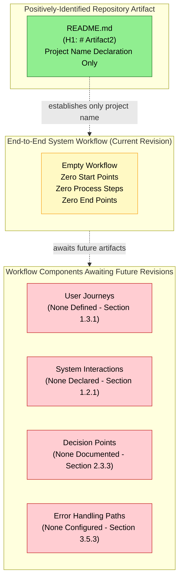

### 4.6.2 Detailed Process Flow Diagram

The section prompt requires "detailed process flows for each core feature." Section 2.2.1 establishes that the Feature Catalog contains zero entries, no `F-XXX` identifiers have been issued, and no `F-XXX-RQ-YYY` requirement identifiers have been issued. The cardinality of "one detailed process flow per core feature" multiplied by zero core features yields zero detailed process flows for this revision. The following diagram visualizes that null derivation.

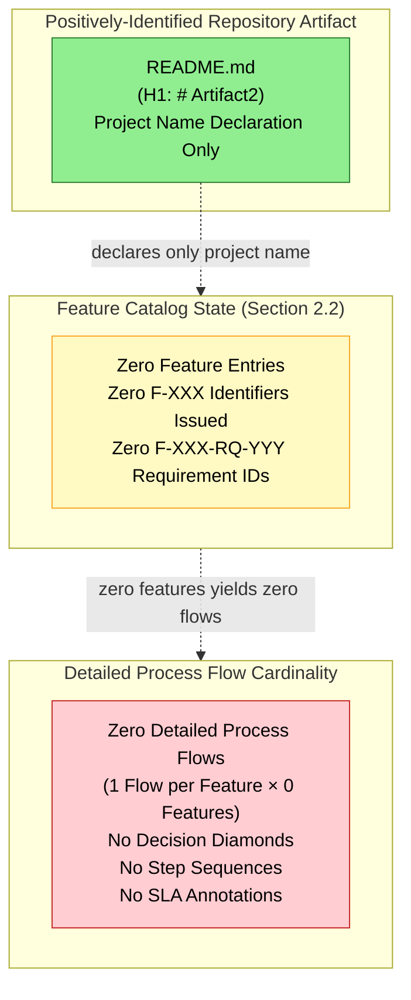

### 4.6.3 Error Handling Flowchart

The following diagram represents the verified null state of the error handling subsystem, anchored to the four error-handling categories prescribed by the section prompt (retry mechanisms, fallback processes, error notification flows, recovery procedures). The absence is doubly anchored: first to the verified absence of error-handling implementation logic (Sections 2.3.3 and 2.5.2), and second to the verified absence of observability infrastructure that would receive or process error signals (Section 3.5.3).

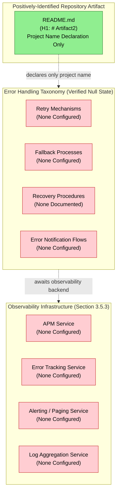

### 4.6.4 Integration Sequence Diagram

A conventional Mermaid `sequenceDiagram` requires at minimum two participants and one message exchanged between them. Section 1.2.1 records "None Declared" across all four integration dimensions (Upstream Systems, Downstream Consumers, External APIs, Enterprise Services), Section 1.3.3 records "API Contracts" as explicitly absent, and Section 3.6.3 records "Message Queue / Event Stream: None Configured." With zero integration parties and zero message contracts, no valid sequence diagram can be authored. The following null-state visualization, rendered using the validated `graph TB` pattern for consistency with Sections 1.2.2, 2.4.1, and 3.8.1, represents the verified absence of the components required for any sequence diagram.

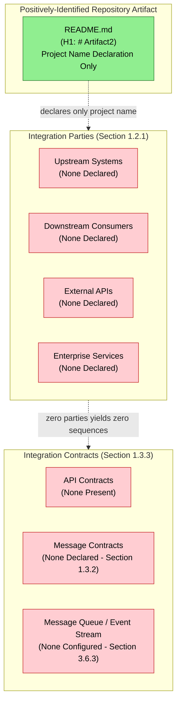

### 4.6.5 State Transition Diagram

A conventional Mermaid `stateDiagram-v2` requires at minimum two distinct states and one labeled transition between them. Section 3.6.2 records "Data Domain Model: None Defined" and "Entity-Relationship Definition: None Defined." Section 2.3.3 records "Business Rules: None Documented — no business logic implemented" (precluding transition guards). Section 3.6.1 records all eight database categories as "None Configured" (precluding state persistence). With zero defined states and zero transitions, no valid state-transition diagram can be authored. The following null-state visualization, rendered using the validated `graph TB` pattern, represents the verified absence of the components required for any state-transition diagram.

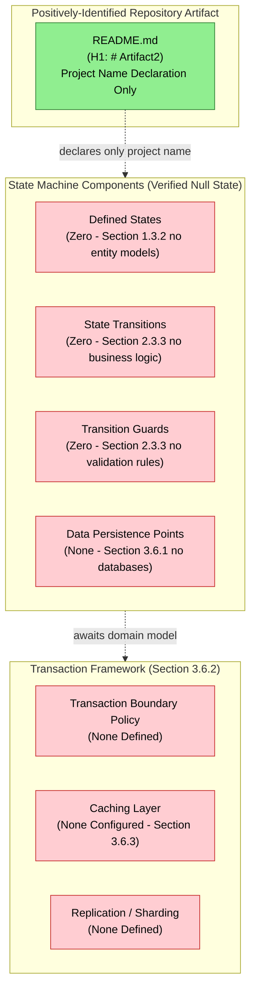

### 4.6.6 Diagram Re-Authoring Trigger

Each of the five diagrams above will be re-authored in future revisions when the corresponding upstream null state is broken. Specifically:

| Diagram | Re-Authoring Trigger |
|---------|----------------------|
| 4.6.1 High-Level System Workflow | First commit introducing a feature, user journey, or workflow specification |
| 4.6.2 Detailed Process Flow | First `F-XXX` feature identifier issued in Section 2.2 |
| 4.6.3 Error Handling Flowchart | First retry policy, fallback handler, exception class, or observability service configured |
| 4.6.4 Integration Sequence Diagram | First commit declaring an upstream system, downstream consumer, external API, or enterprise service |
| 4.6.5 State Transition Diagram | First entity model, database schema, or state-machine definition committed |

---

## 4.7 ASSUMPTIONS, CONSTRAINTS, AND VERSIONING

### 4.7.1 Documented Assumptions

The following assumptions are explicitly recorded for this revision of the Process Flowchart section. Each assumption is forward-looking and does not introduce any fact-claim about the current repository state. The assumption identifier convention `A-4-XXX` is consistent with the assumption identifier conventions established in Sections 2.7.1 (`A-2-XXX`) and 3.9.1 (`A-3-XXX`).

| Assumption ID | Statement |
|---------------|-----------|
| A-4-001 | Subsequent commits will introduce features, source code, API specifications, or comparable artifacts from which business processes, user workflows, integration sequences, and state machines can be derived. |
| A-4-002 | When the Feature Catalog (Section 2.2) is populated with `F-XXX` identifiers in future revisions, this Process Flowchart section will be re-authored to provide a detailed process flow per feature, with start/end points, process steps, decision diamonds, and SLA annotations. |
| A-4-003 | When third-party services (Section 3.5), authentication/authorization services (Section 3.5.2), or observability services (Section 3.5.3) are configured in future revisions, the Error Handling Flowchart (Section 4.6.3) will be re-authored to depict retry, fallback, notification, and recovery flows traversing those services. |
| A-4-004 | When databases (Section 3.6.1) and/or persistence strategies (Section 3.6.2) are configured in future revisions, the State Transition Diagram (Section 4.6.5) will be re-authored to depict the entity states, transitions, transaction boundaries, and caching boundaries actually implemented. |
| A-4-005 | When integration parties (Section 1.2.1) and integration contracts (Section 1.3.3 — API Contracts category) are declared in future revisions, the Integration Sequence Diagram (Section 4.6.4) will be re-authored as a proper Mermaid `sequenceDiagram` enumerating participants and messages. |
| A-4-006 | When KPIs (Section 1.2.3) and performance criteria (Section 2.3.2) are populated in future revisions, the timing and SLA annotations required for each process flowchart will be authored against the targets then articulated. |
| A-4-007 | The Trust and Security Boundary, Data Ownership Boundary, and Physical Deployment Boundary (Section 1.3.2) will be positively defined in future revisions, enabling the authorization checkpoint and system boundary annotations required by the Process Flowchart section prompt. |
| A-4-008 | Process identifier conventions (suggested: `P-XXX` for processes, `W-XXX` for workflows, `S-XXX` for states, `E-XXX` for error paths) will be formally adopted when the first such artifact is committed; until then, no identifiers in those namespaces are issued. |

### 4.7.2 Constraints Bounding This Section

The following constraints bound the present revision of the Process Flowchart section. These constraints are factual properties of the current repository state, not authoring preferences. The constraint identifier convention `C-4-XXX` is consistent with the conventions established in Sections 2.7.2 (`C-2-XXX`) and 3.9.2 (`C-3-XXX`).

| Constraint ID | Statement |
|---------------|-----------|
| C-4-001 | This section is bound by Constraint C-2-001 (Section 2.7.2): no requirements, and therefore no process flows derivable from requirements, may be invented or inferred beyond what exists in the repository. |
| C-4-002 | This section is bound by Constraint C-2-002 (Section 2.7.2): the single-level repository hierarchy (root containing `README.md` only) precludes the inference of layered, tiered, or pipelined process structures from any directory layout. |
| C-4-003 | This section is bound by Constraint C-2-003 (Section 2.7.2): the empty Code Graph schema (`{}`) precludes the extraction of control flow, exception hierarchies, state machines, or event handlers from any indexable code structure. |
| C-4-004 | This section is bound by Constraint C-2-004 (Section 2.7.2): no feature relationships may be imagined or projected, and therefore no inter-feature process flows, sequence diagrams, or state-transition diagrams may be authored in the absence of features. |
| C-4-005 | This section is bound by Constraint C-3-001 (Section 3.9.2): the Default Technology Stack may not be applied to infer technology-specific process patterns (such as Flask request lifecycles, React component state machines, or MongoDB transaction semantics) in the absence of repository evidence for those selections. |
| C-4-006 | This section is bound by Constraint C-3-002 (Section 3.9.2): the empty Code Graph schema (`{}`) precludes the inference of framework-idiomatic process patterns (such as middleware chains, route handler sequences, or ORM transaction boundaries). |
| C-4-007 | Mermaid sequence diagrams (Section 4.6.4) and state-transition diagrams (Section 4.6.5) require at minimum two participants/states and one message/transition to render meaningfully; with zero of each present in the repository, those diagram types are rendered as null-state `graph TB` visualizations following the validated pattern from Sections 1.2.2, 2.4.1, and 3.8.1. |
| C-4-008 | This section may not articulate SLA values, latency targets, throughput goals, or any timing constraints absent direct evidence in the repository (Section 1.2.3 — all KPI categories "Not Defined"; Section 2.3.2 — "Performance Criteria: Not Specified"). |

### 4.7.3 Re-Evaluation Trigger and Version Tracking

| Version Tracking Field | Current State |
|------------------------|---------------|
| Specification Revision | Initial baseline revision (consistent with Sections 2.7.3 and 3.9.3) |
| Corresponding Repository State | Single "Initial commit" recorded in git history (Section 1.4.3) |
| Number of Cataloged Business Processes | 0 |
| Number of End-to-End User Journeys | 0 |
| Number of Integration Workflows | 0 |
| Number of Documented Decision Points | 0 |
| Number of Defined Process Steps | 0 |
| Number of Defined Start Points | 0 |
| Number of Defined End Points | 0 |
| Number of Defined Error-Handling Paths | 0 |
| Number of Defined State Transitions | 0 |
| Number of Configured Retry Mechanisms | 0 |
| Number of Configured Fallback Processes | 0 |
| Number of Documented Recovery Procedures | 0 |
| Number of Defined Transaction Boundaries | 0 |
| Number of Configured Cache Tiers | 0 |
| Number of Documented Business Rules | 0 |
| Number of Documented Data Validation Rules | 0 |
| Number of Defined Authorization Checkpoints | 0 |
| Number of Documented Compliance Checks | 0 |
| Number of Articulated SLAs / SLOs | 0 |
| Number of Defined Swim Lanes | 0 |
| Diagrams Rendered as Null-State | 5 (Sections 4.6.1 through 4.6.5) |
| Next Re-Evaluation Trigger | Introduction of any of: a feature entry in Section 2.2 (`F-XXX`), a programming language source file, a sequence diagram or workflow specification, an API contract (OpenAPI / gRPC / GraphQL), a state-machine definition, a database schema, a message contract, a retry/fallback handler, or an SLA articulation. |

All future revisions of this section should re-evaluate every subsection against newly committed artifacts. When the re-evaluation trigger is satisfied, the corresponding subsection should transition from "None Documented" / "None Configured" / "None Defined" to a populated state that enumerates the actually-committed processes, workflows, decision points, validation rules, state transitions, and SLAs as prescribed by the section prompt. The five null-state diagrams in Section 4.6 should likewise transition to populated process flowcharts, sequence diagrams, and state-transition diagrams that accurately depict the implemented behavior.

---

## 4.8 REFERENCES

### 4.8.1 Files Examined

- `README.md` — The sole file present in the repository, containing only the H1 heading `# Artifact2`. Confirmed via direct inspection that no process specifications, workflow definitions, state machine artifacts, sequence diagrams, integration contracts, error-handling configurations, validation-rule files, or SLA articulations are present. Serves as the singular evidentiary anchor in every null-state diagram of Section 4.6 and as the baseline against which all "Not Applicable" / "None Documented" / "None Configured" determinations in Section 4 are anchored.

### 4.8.2 Folders Explored

- `/` (repository root, depth 0) — Confirmed via folder enumeration to contain only `README.md` as its sole first-order child; no subdirectories present. The absence of conventional process-bearing directories (such as `workflows/`, `processes/`, `flows/`, `bpmn/`, `state-machines/`, `sagas/`, `runbooks/`, `playbooks/`, `error-handlers/`, `middleware/`, `interceptors/`, `validators/`, `policies/`, or `slo/`) provides independent corroboration of every null determination recorded in Sections 4.2 through 4.5.

### 4.8.3 Technical Specification Cross-References

The following sections of this Technical Specification were retrieved and synthesized in the authoring of Section 4. Each is cited at the specific point of corroboration above.

- **Section 1.1.1 (Project Overview)** — Establishes the documentation-only placeholder framing and records the Code Graph schema as an empty object (`{}`); cited throughout Section 4 for the inability to derive process flows, state machines, or error handlers from indexable code structures.
- **Section 1.1.3 (Key Stakeholders and Users)** — Records "Not Identified in Repository" across all stakeholder categories; cited in Sections 4.3.2 (no user touchpoints) and 4.5.2 (no maintainer manifest for runbook/recovery ownership).
- **Section 1.1.4 (Expected Business Impact and Value Proposition)** — Establishes the principle that any projection at this stage would constitute unsupported speculation; cited in Section 4.1.3 as a foundational documentation standard governing the authoring of null-state diagrams instead of fabricated flowcharts.
- **Section 1.2.1 (Project Context)** — Records "None Declared" across all four integration dimensions (Upstream Systems, Downstream Consumers, External APIs, Enterprise Services); cited in Sections 4.2.2 (Integration Workflow State), 4.3.2 (System Boundary State), and 4.6.4 (Integration Sequence Diagram null state).
- **Section 1.2.2 (High-Level Description)** — States that no technical approach, architectural style, design pattern, technology stack, or framework choice can be inferred from the repository; provides the validated Mermaid diagram pattern mirrored in all five diagrams of Section 4.6.
- **Section 1.2.3 (Success Criteria)** — Records "Not Defined" across all KPI categories (Business, Technical, Operational, User Experience); cited in Sections 4.3.4 (Timing and SLA State), 4.4 (Validation Rules State), and the timing-related rows of Section 4.7.3.
- **Section 1.3.1 (In-Scope Elements)** — Records "No user workflows are defined. No UI mockups, sequence diagrams, journey maps, or interaction specifications are present in the repository"; cited as the foundational anchor for Sections 4.2.1 and 4.6.1.
- **Section 1.3.2 (Implementation Boundaries)** — Records "Not Yet Defined" across Physical Deployment, Trust and Security, and Data Ownership boundaries, plus the absence of user groups, geographic coverage, and data domains; cited extensively throughout Sections 4.3.2, 4.4.3, 4.4.4, and 4.5.1.
- **Section 1.3.3 (Out-of-Scope Elements)** — Enumerates ten explicitly-absent artifact categories with rationales; provides direct anchoring evidence for the null determinations in Sections 4.2.2 (API Contracts absent), 4.3 (no flowchart-relevant artifacts), and 4.5 (no CI/CD, container, or IaC for batch processing).
- **Section 1.4 (References)** — Documents the evidentiary inventory (single file `README.md`, single folder `/`, single git commit) on which Section 4's null-baseline reporting depends; Section 1.4.3 enumerates the four semantic searches that returned empty result sets.
- **Section 2.1.3 (Section Authoring Standard)** — Establishes the parallel principle to Section 1.1.4 that enumeration of fabricated requirements would constitute unsupported speculation; cited in Section 4.1.3.
- **Section 2.2.1 (Feature Catalog State)** — Confirms the Feature Catalog contains zero entries; cited as the foundational anchor for Section 4.6.2 (zero detailed process flows by cardinality).
- **Section 2.3.2 (Technical Specifications State)** — Records "Input Parameters: Not Specified," "Output / Response: Not Specified," and "Performance Criteria: Not Specified"; cited in Sections 4.2.1, 4.3.4, and 4.7.3.
- **Section 2.3.3 (Validation Rules State)** — Records "None Documented" across Business Rules, Data Validation, Security Requirements, and Compliance Requirements; cited as the primary anchor for all of Section 4.4 (Validation Rules State).
- **Section 2.4.1 (Feature Dependency Map)** — Provides the validated Mermaid diagram pattern (subgraph composition with edge connections outside subgraphs, green/yellow/red fill conventions) mirrored in all five diagrams of Section 4.6.
- **Section 2.4.2 (Integration Points)** — Records "None Declared," "None Identified," and "None Documented" across Integration Points, Shared Components, Common Services, and Cross-Feature Contracts; cited in Sections 4.2.2 and 4.6.4.
- **Section 2.5.1 (Technical Constraints and Performance Requirements)** — Records "Performance Requirements: None Documented"; cited in Section 4.3.4.
- **Section 2.5.2 (Scalability, Security, and Maintenance Considerations)** — Records "Operational Considerations: None Documented" with anchoring evidence to the absence of CI/CD, container, and IaC artifacts; cited in Sections 4.3.3, 4.5.2, and 4.7.
- **Section 2.7.2 (Constraints Bounding This Section)** — Defines Constraints C-2-001 through C-2-004; explicitly inherited by Constraints C-4-001 through C-4-004 of this section.
- **Section 2.7.3 (Version Tracking)** — Establishes the re-evaluation trigger pattern mirrored in Section 4.7.3.
- **Section 3.1.2 (Default Technology Stack Applicability Determination)** — Establishes that the Default Technology Stack is not applied in this revision; cited in Constraint C-4-005 (Section 4.7.2).
- **Section 3.5.1 (External Integration State)** — Records "No external system integration of any kind exists in this revision"; cited in Sections 4.2.2 and 4.6.4.
- **Section 3.5.2 (Authentication and Authorization Services)** — Records all six auth/authz dimensions as "None Configured" or "None Defined"; cited as the primary anchor for Section 4.4.3 (Authorization Checkpoint State).
- **Section 3.5.3 (Cloud, Monitoring, and Observability Services)** — Records all 14 service categories as "None Configured"; cited as the primary anchor for Sections 4.3.3, 4.5.2, and 4.6.3 (Error Handling Flowchart null state).
- **Section 3.6.1 (Database Configuration State)** — Records all 8 database categories as "None Configured"; cited in Section 4.5.1 (state persistence absence) and Section 4.6.5 (State Transition Diagram null state).
- **Section 3.6.2 (Persistence Strategy State)** — Records "Data Domain Model: None Defined," "Entity-Relationship Definition: None Defined," and "Transaction Boundary Policy: None Defined"; cited in Sections 4.5.1 and 4.6.5.
- **Section 3.6.3 (Caching and Storage Services)** — Records all 9 caching/storage categories (including Message Queue / Event Stream) as "None Configured"; cited in Sections 4.2.2 (Event Processing Flows) and 4.5.1 (Cache Tiers).
- **Section 3.8 (Technology Stack Visualization)** — Provides the validated Mermaid null-state diagram pattern explicitly mirrored in all five diagrams of Section 4.6; Section 3.10.3 documents the diagram pattern as "validated."
- **Section 3.9.2 (Constraints Bounding This Section)** — Defines Constraints C-3-001 through C-3-004; constraints C-3-001 and C-3-002 are explicitly inherited by Constraints C-4-005 and C-4-006 of this section.
- **Section 3.9.3 (Re-Evaluation Trigger and Version Tracking)** — Establishes the version-tracking field conventions mirrored in Section 4.7.3.

### 4.8.4 Repository Inspection Activities Relied Upon

| Activity | Result Relied Upon by Section 4 |
|----------|---------------------------------|
| Direct file read of `README.md` | Confirmed no process specifications, workflow definitions, state-machine artifacts, sequence diagrams, integration contracts, error handlers, or validation-rule files present |
| Folder enumeration of `/` (repository root) | Confirmed no subdirectories that could contain workflow, process, state-machine, error-handler, or validation artifacts |
| Semantic search: workflow / business process / automation flow | Empty result set (independent verification of Section 4.2.1 null state) |
| Semantic search: state machine / transitions / event handlers | Empty result set (independent verification of Section 4.5.1 and Section 4.6.5 null states) |
| Semantic search: API endpoint / controller / route handler | Empty result set (independent verification of Section 4.2.2 and Section 4.6.4 null states) |
| Semantic search: source code modules / application logic (folder search) | Empty result set (independent verification of Section 4.2 and Section 4.3 null states) |
| Semantic search: user journey / interactions / sequence diagram | Empty result set (independent verification of Section 4.2.1 and Section 4.6.4 null states) |
| Code Graph schema inspection | Confirmed empty object (`{}`) — independent verification of every null determination in Sections 4.2 through 4.5 |
| Git history verification | Single "Initial commit" recorded — confirms baseline revision aligns with Section 4.7.3 |

---

# 5. System Architecture

## 5.1 SYSTEM ARCHITECTURE BASELINE STATEMENT

### 5.1.1 Repository Evidence Summary

The System Architecture section of this Technical Specification is authored under the same evidence-strict reporting standard established in Section 1.1 — Executive Summary and reinforced by Section 2.1 — Requirements Baseline Statement, Section 3.1 — Technology Stack Baseline Statement, and Section 4.1 — Process Flowchart Baseline Statement. Direct inspection of the **Artifact2** repository confirms that no architectural style declarations, component inventories, system boundary definitions, integration contracts, data flow specifications, technical decision records, or cross-cutting concern configurations have been committed at the time of this revision. The sole positively-identifiable artifact in the repository is `README.md`, whose entire content is a single H1 heading declaring the project name (`# Artifact2`). The Code Graph schema for the repository is recorded as an empty object (`{}`) per Section 1.1.1 — Project Overview, confirming the absence of indexable code structures from which architectural patterns, component relationships, communication protocols, or deployment topologies could be derived.

Consequently, this section documents the **verified null baseline state** of the system architecture rather than enumerating concrete components, interfaces, data flows, technical decisions, or cross-cutting concern implementations. No component identifiers, no integration contract identifiers, no Architecture Decision Record (ADR) identifiers, and no service level agreement (SLA) values can be issued for this revision because there are no observable artifacts from which to derive them. Section 1.2.2 — High-Level Description explicitly records that "no technical approach, architectural style, design pattern selection, technology stack, or framework choice can be inferred from the repository," and Section 1.2.2 — Major System Components establishes `README.md` as the sole positively-identified component in the inventory. Any enumeration of fabricated architectural components, communication patterns, or decision rationales in this section would constitute unsupported speculation in direct violation of the documentation discipline established in Sections 1.1.4, 2.1.3, 3.1.3, and 4.1.3.

### 5.1.2 Applicability Determination of Section Components

The following table maps each subsection mandated by the System Architecture section prompt to its applicability against the current repository state. Each "Not Applicable" determination is anchored to verified absence rather than incomplete investigation. Cross-references to upstream Technical Specification sections provide independent corroboration of every absence.

| Section Component | Applicability to Current Revision | Anchoring Evidence |
|-------------------|-----------------------------------|--------------------|
| System Overview (architectural style, principles, boundaries) | Not Applicable — no style inferable | Section 1.2.2 (no technical approach inferable); Section 1.3.2 (Physical/Trust/Data boundaries "Not Yet Defined") |
| Core Components Table | Not Applicable — zero components exist | Section 1.2.2 (component inventory limited to `README.md`); Section 2.4.2 (Shared Components "None Identified") |
| Data Flow Description | Not Applicable — no flows exist | Section 1.3.2 (no data domains); Section 3.6.1 (all 8 database categories "None Configured") |
| External Integration Points Table | Not Applicable — no integrations declared | Section 1.2.1 (all four integration dimensions "None Declared"); Section 3.5.1 (no external integration of any kind) |
| Component Details (per major component) | Not Applicable — zero components × N attributes = zero rows | Section 2.2.1 (Feature Catalog: 0 entries); Section 1.2.2 (no components beyond `README.md`) |
| Architecture Style Decisions | Not Applicable — no architectural style identified | Section 1.2.2 (no architectural style inferable); Section 3.1.2 (Default Stack not applied) |
| Communication Pattern Choices | Not Applicable — no communication patterns evident | Section 2.4.2 (Cross-Feature Contracts "None Defined"); Section 1.3.3 (API Contracts explicitly absent) |
| Data Storage Solution Rationale | Not Applicable — no storage configured | Section 3.6.1 (all 8 database categories "None Configured") |
| Caching Strategy Justification | Not Applicable — no caching configured | Section 3.6.3 (all 9 caching/storage categories "None Configured") |
| Security Mechanism Selection | Not Applicable — no auth/authz configured | Section 3.5.2 (all six auth/authz dimensions "None Configured/Defined"); Section 1.3.2 (Trust and Security Boundary "Not Yet Defined") |
| Monitoring and Observability Approach | Not Applicable — no observability stack present | Section 3.5.3 (APM, Log Aggregation, Distributed Tracing, Metrics Backend all "None Configured") |
| Logging and Tracing Strategy | Not Applicable — no logging service configured | Section 3.5.3 (Log Aggregation and Distributed Tracing both "None Configured") |
| Error Handling Patterns | Not Applicable — no error handling evident | Section 4.5.2 (all 13 error-handling dimensions "None Configured/Documented") |
| Authentication and Authorization Framework | Not Applicable — no framework configured | Section 3.5.2 (IdP, OAuth/OIDC, SAML, RBAC, ABAC all "None Configured/Defined") |
| Performance Requirements and SLAs | Not Applicable — no targets specified | Section 1.2.3 (all four KPI categories "Not Defined"); Section 2.3.2 (Performance Criteria "Not Specified") |
| Disaster Recovery Procedures | Not Applicable — no recovery procedures documented | Section 2.5.2 (Maintenance Requirements "None Documented"); Section 4.5.2 (Recovery Procedure Documentation "None Documented") |
| Component Interaction Diagrams | Null-State Visualization Required | Section 4.6 pattern; zero components × zero interactions yields the empty graph |
| State Transition Diagrams | Null-State Visualization Required (`graph TB`) | Section 4.6.5 pattern; Mermaid `stateDiagram-v2` requires ≥2 states and ≥1 transition; zero of each present |
| Sequence Diagrams for Key Flows | Null-State Visualization Required (`graph TB`) | Section 4.6.4 pattern; Mermaid `sequenceDiagram` requires ≥2 participants and ≥1 message; zero of each present |
| Decision Tree Diagrams | Null-State Visualization Required | Zero technical decisions documented; no decision branches to enumerate |
| Architecture Decision Records (ADRs) | Not Applicable — no ADRs present | Section 1.2.2 ("No architectural decision records (ADRs), design documents, or RFCs exist in the repository") |
| Error Handling Flows | Null-State Visualization Required | Section 4.6.3 pattern; error-handling taxonomy and observability infrastructure both "None Configured" |

### 5.1.3 Authoring Standard

All entries in this section conform to the documentation discipline established in Section 1.1.4, Section 2.1.3, Section 3.1.3, and Section 4.1.3. Each subsection that follows enumerates a category prescribed by the System Architecture section prompt (High-Level Architecture, Component Details, Technical Decisions, Cross-Cutting Concerns, Required Diagrams) and records the verified absence of evidence for that category, anchored to specific cross-referenced Technical Specification sections and repository inspection activities. The section is intentionally structured to be re-evaluated in future revisions as substantive artifacts are committed to the repository.

By the principles established in Sections 1.1.4, 2.1.3, 3.1.3, and 4.1.3, the invention of even illustrative or hypothetical architectural components, communication patterns, or decision rationales at this stage would constitute unsupported speculation and is therefore avoided. The Required Diagrams subsection (Section 5.6) accordingly presents null-state visualizations following the validated Mermaid pattern mirrored from Sections 1.2.2, 2.4.1, 3.8.1, and 4.6, rather than fabricated architecture diagrams that would misrepresent the actual repository state. The Default Technology Stack — including but not limited to AWS, Docker, Terraform, GitHub Actions, Python with Flask, Auth0, MongoDB, Langchain, React with TypeScript, TailwindCSS, React-Native, Swift, Kotlin, Objective-C, and ElectronJS — is explicitly **not applied** in this section per the determination in Section 3.1.2. Application of any default in the absence of corroborating repository evidence would constitute fabrication and would violate Constraint C-2-001 (Section 2.7.2).

---

## 5.2 HIGH-LEVEL ARCHITECTURE

### 5.2.1 System Overview State

The section prompt for System Overview requires documentation of: (a) overall system architecture style and rationale; (b) key architectural principles and patterns; and (c) system boundaries and major interfaces. Each is documented below with anchoring evidence to verified absence.

| System Overview Dimension | Current State | Anchoring Evidence |
|---------------------------|---------------|--------------------|
| Overall System Architecture Style | None Inferable | Section 1.2.2 — "no technical approach, architectural style, design pattern selection, technology stack, or framework choice can be inferred from the repository" |
| Architectural Style Rationale | Not Articulated | Section 1.2.2 (no ADRs, design documents, or RFCs); Section 1.1.4 (any projection at this stage would constitute unsupported speculation) |
| Key Architectural Principles | None Documented | Section 1.2.2 (no design documents); Section 2.5.1 (Technical Constraints "None Documented") |
| Architectural Patterns Applied | None Identifiable | Section 1.1.1 (Code Graph `{}`); Section 3.3.1 (all framework categories "None Declared") |
| Logical System Boundary | "Single repository named Artifact2" | Section 1.3.2 — System Boundaries table |
| Physical Deployment Boundary | Not Yet Defined | Section 1.3.2 — System Boundaries table |
| Trust and Security Boundary | Not Yet Defined | Section 1.3.2 — System Boundaries table |
| Data Ownership Boundary | Not Yet Defined | Section 1.3.2 — System Boundaries table |
| Major System Interfaces | None Present | Section 1.3.3 — API Contracts explicitly absent ("No OpenAPI, gRPC `.proto`, or GraphQL schema files") |
| Inter-Process Communication Protocols | None Configured | Section 3.6.3 (Message Queue / Event Stream "None Configured"); Section 1.3.3 (no API contracts) |

The only positively-defined boundary is the Logical System Boundary, which is established by the repository's existence under the name "Artifact2." No physical deployment topology, no trust zone partitioning, no data ownership domains, and no interface specifications have been authored. No architectural style — whether monolithic, layered, microservices, event-driven, hexagonal, clean architecture, or any other paradigm — is identifiable from the repository contents. Section 1.2.2 enumerates the absence of all common package manifests (`package.json`, `requirements.txt`, `pom.xml`, `Cargo.toml`, `go.mod`, `Gemfile`, `pyproject.toml`), each of which would otherwise have provided evidence for a runtime selection and, by extension, a candidate architectural paradigm.

### 5.2.2 Core Components State

The section prompt for the Core Components Table mandates four columns: Component Name, Primary Responsibility, Key Dependencies, and Critical Considerations. The cardinality of the Core Components Table for this revision is **zero rows**, derived as follows:

| Cardinality Term | Value | Anchoring Evidence |
|------------------|-------|--------------------|
| Number of positively-identified system components | 0 | Section 1.2.2 — component inventory shows `README.md` as the only artifact (a documentation file, not a system component) |
| Number of `F-XXX` feature identifiers issued | 0 | Section 2.2.1 — Feature Catalog State: zero entries |
| Number of source code modules | 0 | Section 1.3.3 — Source Code Implementation explicitly absent |
| Number of services declared | 0 | Section 1.2.1 — Enterprise Services "None Declared" |
| Number of shared components identified | 0 | Section 2.4.2 — Shared Components "None Identified" |
| Number of common services documented | 0 | Section 2.4.2 — Common Services "None Documented" |
| **Computed Core Components Table cardinality** | **0 rows** | **Product of all evidence above** |

The Core Components Table is therefore presented as an empty table conforming to the prompt's required schema:

| Component Name | Primary Responsibility | Key Dependencies | Critical Considerations |
|----------------|------------------------|------------------|--------------------------|
| *(No entries — see cardinality derivation above)* | — | — | — |

### 5.2.3 Data Flow State

The section prompt for Data Flow Description mandates documentation of primary data flows between components, integration patterns and protocols, data transformation points, and key data stores and caches. Each dimension is documented below with anchoring evidence.

| Data Flow Dimension | Current State | Anchoring Evidence |
|---------------------|---------------|--------------------|
| Primary Data Flows Between Components | None Defined | Section 5.2.2 (zero components yields zero inter-component flows); Section 1.3.2 (no data domains) |
| Integration Patterns | None Declared | Section 1.2.1 (all four integration dimensions "None Declared"); Section 2.4.2 (Cross-Feature Contracts "None Defined") |
| Integration Protocols | None Configured | Section 1.3.3 (API Contracts explicitly absent); Section 3.6.3 (Message Queue / Event Stream "None Configured") |
| Synchronous Communication Patterns | None Defined | Section 3.3.1 (no HTTP/RPC frameworks declared); Section 1.3.3 (no API contracts) |
| Asynchronous Communication Patterns | None Defined | Section 3.6.3 (Message Queue / Event Stream "None Configured") |
| Data Transformation Points | None Defined | Section 1.3.3 (no source code); Section 4.2.2 ("File Transfer / ETL Pipelines: None Configured") |
| Schema Translation / Mapping | None Defined | Section 1.3.2 (no schema definitions, no data dictionaries) |
| Key Data Stores | None Configured | Section 3.6.1 — all 8 database categories "None Configured" |
| Key Caches | None Configured | Section 3.6.3 — all 9 caching/storage categories "None Configured" |
| Object / Blob Storage | None Configured | Section 3.6.3 — "Object Storage (e.g., S3-compatible): None Configured" |
| Static Asset Hosting | None Configured | Section 3.6.3 — "Static Asset Hosting: None Configured" |
| Event Stream Backbone | None Configured | Section 3.6.3 — "Message Queue / Event Stream: None Configured" |

No data flows exist between zero components. No integration protocols (REST, GraphQL, gRPC, AMQP, MQTT, Kafka, Server-Sent Events, WebSocket, or otherwise) are evident. No ETL pipelines, no event sourcing patterns, no CQRS partitioning, no API gateways, no service meshes, no caching tiers, and no data stores of any kind have been configured. The Default Technology Stack identifies MongoDB as the prescribed database; per Section 3.6.3 and Section 3.1.2, this default is not applied because no `mongod.conf`, MongoDB driver dependency, connection string, schema file, or migration artifact exists in the repository to corroborate that selection.

### 5.2.4 External Integration Points State

The section prompt for the External Integration Points Table mandates four columns: System Name, Integration Type, Data Exchange Pattern, and Protocol/Format. The SLA Requirements requested by the prompt are addressed in Section 5.5.5 with anchoring evidence to all KPI categories being "Not Defined." The cardinality of the External Integration Points Table for this revision is **zero rows**, derived from the Integration Landscape table in Section 1.2.1:

| Integration Dimension | Current State | Source Section |
|-----------------------|---------------|----------------|
| Upstream Systems | None Declared | Section 1.2.1 |
| Downstream Consumers | None Declared | Section 1.2.1 |
| External APIs | None Declared | Section 1.2.1 |
| Enterprise Services | None Declared | Section 1.2.1 |

Section 3.5.1 reinforces: "No external system integration of any kind exists in this revision." Section 2.4.2 records "Integration Points: None Declared," "Shared Components: None Identified," "Common Services: None Documented," and "Cross-Feature Contracts: None Defined."

The External Integration Points Table is therefore presented as an empty table conforming to the prompt's required schema:

| System Name | Integration Type | Data Exchange Pattern | Protocol/Format |
|-------------|------------------|------------------------|------------------|
| *(No entries — zero integrations across all four dimensions)* | — | — | — |

---

## 5.3 COMPONENT DETAILS

### 5.3.1 Component Inventory State

The section prompt for Component Details requires documentation of each major component along five dimensions: purpose and responsibilities, technologies and frameworks used, key interfaces and APIs, data persistence requirements, and scaling considerations. The cardinality of major components in the system is **zero**, as established in Section 5.2.2 above. Consequently, the per-component documentation cardinality for this revision is:

**1 component description × 0 components = 0 component descriptions**

### 5.3.2 Component Specification Dimension State

For traceability, each prompt-required component specification dimension is documented below with anchoring evidence to its null state. This documentation persists across the zero-component inventory so that future revisions inherit the dimensional framework once components are committed.

| Component Specification Dimension | Current State | Anchoring Evidence |
|-----------------------------------|---------------|--------------------|
| Purpose and Responsibilities | None Defined | Section 2.2.1 — Feature Catalog: 0 entries |
| Technologies Used | None Identified | Section 3.2.1 — all 6 language dimensions "None Identified"; Section 3.3.1 — all 7 framework categories "None Declared" |
| Frameworks Applied | None Declared | Section 3.3.1 — all 7 framework categories "None Declared" |
| Key Interfaces and APIs | None Present | Section 1.3.3 — API Contracts explicitly absent |
| Data Persistence Requirements | None Defined | Section 3.6.2 — Data Domain Model, Entity-Relationship Definition, Transaction Boundary Policy all "None Defined" |
| Scaling Considerations | None Documented | Section 2.5.2 — Scalability Considerations "None Documented" (anchored to Physical Deployment Boundary "Not Yet Defined") |
| Vertical Scaling Strategy | None Defined | Section 1.3.2 — Physical Deployment Boundary "Not Yet Defined" |
| Horizontal Scaling Strategy | None Defined | Section 1.3.2 — Physical Deployment Boundary "Not Yet Defined" |
| Replication Topology | None Defined | Section 3.6.2 — Replication / Sharding Topology "None Defined" |
| Stateless / Stateful Classification | None Determined | Section 4.5.1 — State Persistence Points "None Defined" |

### 5.3.3 Per-Component Documentation Cardinality Derivation

The per-component documentation that would normally appear in this subsection follows the cardinality principle: documentation density tracks artifact density. With zero components identified in the repository (Section 5.2.2) and zero features cataloged (Section 2.2.1), the per-component documentation block contains zero entries. The dimensional framework in Section 5.3.2 is preserved as the schema that future revisions will populate when the first component (and the first `F-XXX` feature identifier) is committed.

---

## 5.4 TECHNICAL DECISIONS

### 5.4.1 Architecture Style Decisions State

The section prompt requires documentation and justification of architecture style decisions and tradeoffs. No architecture style has been documented or implied in the repository.

| Architecture Style Decision Dimension | Current State | Anchoring Evidence |
|---------------------------------------|---------------|--------------------|
| Selected Architectural Style | None Selected | Section 1.2.2 — no architectural style inferable |
| Tradeoff Analysis | None Documented | Section 1.2.2 — no ADRs, design documents, or RFCs |
| Style Rationale | Not Articulated | Section 1.1.4 — projections at this stage would constitute unsupported speculation |
| Alternative Styles Considered | None Documented | Section 1.2.2 — no design documents |
| Deployment Style (e.g., monolith vs. microservices) | None Determined | Section 1.3.2 — Physical Deployment Boundary "Not Yet Defined" |
| Decomposition Strategy | None Defined | Section 2.2.1 — Feature Catalog: 0 entries |

### 5.4.2 Communication Pattern State

The section prompt requires documentation of communication pattern choices. No communication patterns are evident in the repository.

| Communication Pattern Dimension | Current State | Anchoring Evidence |
|---------------------------------|---------------|--------------------|
| Synchronous vs. Asynchronous Selection | None Determined | Section 2.4.2 — Cross-Feature Contracts "None Defined" |
| Request/Response Protocol | None Configured | Section 1.3.3 — API Contracts explicitly absent |
| Publish/Subscribe Backbone | None Configured | Section 3.6.3 — Message Queue / Event Stream "None Configured" |
| Streaming Protocol (e.g., gRPC streams, WebSocket, SSE) | None Configured | Section 3.3.1 — no streaming frameworks declared |
| Service Mesh / Sidecar Pattern | None Configured | Section 3.5.3 — no cloud or networking services configured |
| API Gateway Pattern | None Configured | Section 3.5.3 — no third-party services integrated |
| Inter-Process Communication (IPC) Mechanism | None Configured | Section 1.3.2 — Physical Deployment Boundary "Not Yet Defined" |

### 5.4.3 Data Storage Decision State

The section prompt requires documentation of data storage solution rationale. No storage solution has been selected.

| Data Storage Decision Dimension | Current State | Anchoring Evidence |
|---------------------------------|---------------|--------------------|
| Database Engine Selection | None Configured | Section 3.6.1 — all 8 database categories "None Configured" |
| Polyglot Persistence Strategy | None Defined | Section 3.6.2 — Data Domain Model "None Defined" |
| Selection Rationale | Not Articulated | Section 1.2.2 — no design documents or ADRs |
| Consistency Model (e.g., strong, eventual, causal) | None Determined | Section 3.6.2 — Transaction Boundary Policy "None Defined" |
| Backup and Restore Policy | None Defined | Section 3.6.2 — Backup and Restore Policy "None Defined" |
| Data Retention Policy | None Defined | Section 3.6.2 — Data Retention Policy "None Defined" |
| Schema Evolution / Migration Strategy | None Defined | Section 1.3.3 — no migrations present |

### 5.4.4 Caching Strategy State

The section prompt requires documentation of caching strategy justification. No caching strategy has been adopted.

| Caching Strategy Dimension | Current State | Anchoring Evidence |
|----------------------------|---------------|--------------------|
| Cache Tier Architecture | None Configured | Section 3.6.3 — all 9 caching/storage categories "None Configured" |
| In-Process Cache | None Configured | Section 3.6.3 — "In-Process Cache: None Configured" |
| Distributed Cache | None Configured | Section 3.6.3 — "Distributed Cache: None Configured" |
| HTTP Response / Reverse Proxy Cache | None Configured | Section 3.6.3 — "HTTP Response Cache / Reverse Proxy Cache: None Configured" |
| Cache Invalidation Policy | None Defined | Section 4.5.1 — Cache Invalidation Policy "None Defined" |
| Cache Coherence Model | None Defined | Section 4.5.1 — Cache Tiers "None Configured" |
| Cache Warming Strategy | None Defined | Section 4.5.1 — Cache Tiers "None Configured" |

### 5.4.5 Security Mechanism State

The section prompt requires documentation of security mechanism selection. No security mechanism has been selected, configured, or even partially defined.

| Security Mechanism Dimension | Current State | Anchoring Evidence |
|------------------------------|---------------|--------------------|
| Identity Provider (IdP) | None Configured | Section 3.5.2 — "Identity Provider (IdP): None Configured" |
| OAuth 2.0 / OIDC Client Configuration | None Present | Section 3.5.2 — "OAuth 2.0 / OIDC Client Configuration: None Present" |
| SAML Service Provider Configuration | None Present | Section 3.5.2 — "SAML Service Provider Configuration: None Present" |
| API Key / Bearer Token Vault | None Present | Section 3.5.2 — "API Key / Bearer Token Vault: None Present" |
| Role-Based Access Control (RBAC) Policy | None Defined | Section 3.5.2 — "Role-Based Access Control (RBAC) Policy: None Defined" |
| Attribute-Based Access Control (ABAC) Policy | None Defined | Section 3.5.2 — "Attribute-Based Access Control (ABAC) Policy: None Defined" |
| Encryption in Transit | None Configured | Section 1.3.2 — Trust and Security Boundary "Not Yet Defined" |
| Encryption at Rest | None Configured | Section 3.6.1 — all 8 database categories "None Configured" |
| Secret Management Strategy | None Defined | Section 3.5.2 — no token vault present |
| Threat Model | None Documented | Section 2.5.2 — Security Implications "None Documented" |

### 5.4.6 Architecture Decision Record (ADR) Inventory State

The section prompt requires the documentation of Architecture Decision Records (ADRs). Section 1.2.2 explicitly records that "no architectural decision records (ADRs), design documents, or RFCs exist in the repository to inform technology selection." The ADR inventory cardinality for this revision is therefore **zero**.

| ADR Inventory Dimension | Current State | Anchoring Evidence |
|-------------------------|---------------|--------------------|
| Number of ADRs Authored | 0 | Section 1.2.2 — no ADRs exist |
| Number of Design Documents Present | 0 | Section 1.2.2 — no design documents |
| Number of RFCs Present | 0 | Section 1.2.2 — no RFCs |
| ADR Repository Layout | Not Established | Section 1.3.3 — single-level repository hierarchy |
| ADR Numbering Convention | Not Adopted | Section 2.7.1 — identifier conventions not yet adopted for non-existent artifacts |

### 5.4.7 Default Technology Stack Disposition

The Default Technology Stack identified in Section 3.1.2 — namely AWS for cloud platform, Docker for containerization, Terraform for infrastructure as code, GitHub Actions for CI/CD, Python with Flask for backend, Auth0 for authentication, MongoDB for database, Langchain for AI framework, React with TypeScript for web frontend, TailwindCSS for CSS styling, React-Native with TypeScript for mobile, Swift for iOS, Kotlin for Android, Objective-C for macOS, and ElectronJS for desktop — is **not applied** to any of the technical decision categories in Sections 5.4.1 through 5.4.6. The determination is anchored to Section 3.1.2 (Default Technology Stack Applicability Determination), which records "Final disposition of Default Technology Stack: Not Applied to Current Revision" with anchoring evidence to Constraint C-2-001 (Section 2.7.2). Each default is preserved as a candidate reference set for future revisions, to be evaluated for adoption against the artifacts then committed.

---

## 5.5 CROSS-CUTTING CONCERNS

### 5.5.1 Monitoring and Observability State

| Observability Dimension | Current State | Anchoring Evidence |
|--------------------------|---------------|--------------------|
| Application Performance Monitoring (APM) | None Configured | Section 3.5.3 — "Application Performance Monitoring (APM): None Configured" |
| Metrics / Telemetry Backend | None Configured | Section 3.5.3 — "Metrics / Telemetry Backend: None Configured" |
| Health Check Endpoints | None Defined | Section 1.3.3 — API Contracts explicitly absent |
| Service Dashboard / Visualization | None Configured | Section 3.5.3 — no observability services configured |
| Synthetic Monitoring | None Configured | Section 3.5.3 — no observability services configured |
| Real User Monitoring (RUM) | None Configured | Section 3.5.3 — no observability services configured |
| Observability Budget / Sampling Strategy | None Defined | Section 3.5.3 — no observability services configured |

### 5.5.2 Logging and Tracing State

| Logging / Tracing Dimension | Current State | Anchoring Evidence |
|------------------------------|---------------|--------------------|
| Log Aggregation Service | None Configured | Section 3.5.3 — "Log Aggregation Service: None Configured" |
| Distributed Tracing Service | None Configured | Section 3.5.3 — "Distributed Tracing Service: None Configured" |
| Log Schema / Structured Logging Format | None Defined | Section 3.3.1 — no logging frameworks declared |
| Trace Context Propagation Standard | None Selected | Section 3.5.3 — no distributed tracing service configured |
| Log Retention Policy | None Defined | Section 3.5.3 — no log aggregation service configured |
| Sensitive Data Redaction Policy | None Defined | Section 2.5.2 — Security Implications "None Documented" |
| Audit Log Trail | None Configured | Section 3.5.2 — no auth service configured (precluding audit subject identification) |

### 5.5.3 Error Handling State

| Error Handling Dimension | Current State | Anchoring Evidence |
|---------------------------|---------------|--------------------|
| Exception Class Hierarchy | None Defined | Section 4.5.2 — "Exception Class Hierarchy: None Defined" |
| Try / Catch / Finally Patterns | None Documented | Section 4.5.2 — "Try / Catch / Finally Patterns: None Documented" |
| Retry Mechanisms | None Configured | Section 4.5.2 — "Retry Mechanisms: None Configured" |
| Retry Back-off Policy | None Defined | Section 4.5.2 — "Retry Back-off Policy: None Defined" |
| Circuit Breaker Configuration | None Configured | Section 4.5.2 — "Circuit Breaker Configuration: None Configured" |
| Bulkhead Isolation Policy | None Defined | Section 4.5.2 — "Bulkhead Isolation Policy: None Defined" |
| Fallback Process Definitions | None Documented | Section 4.5.2 — "Fallback Process Definitions: None Documented" |
| Dead-Letter Queue Configuration | None Configured | Section 4.5.2 — "Dead-Letter Queue Configuration: None Configured" |
| Error Notification Channels | None Configured | Section 4.5.2 — "Error Notification Channels: None Configured" |
| Error Tracking Integration | None Configured | Section 4.5.2 — "Error Tracking Integration: None Configured" |
| Recovery Procedure Documentation | None Documented | Section 4.5.2 — "Recovery Procedure Documentation: None Documented" |
| Runbook / Playbook Inventory | None Present | Section 4.5.2 — "Runbook / Playbook Inventory: None Present" |
| Monitoring & Observability Stack | None Configured | Section 4.5.2 — "Monitoring & Observability Stack: None Configured" |

### 5.5.4 Authentication and Authorization Framework State

The Authentication and Authorization Framework is documented in Section 5.4.5 with anchoring evidence to Section 3.5.2 (all six auth/authz dimensions "None Configured/Defined") and Section 1.3.2 (Trust and Security Boundary "Not Yet Defined"). Cross-referenced here for completeness in the cross-cutting concerns inventory:

| Auth / Authz Dimension | Current State | Source Section |
|------------------------|---------------|----------------|
| Identity Provider (IdP) | None Configured | Section 3.5.2 |
| OAuth 2.0 / OIDC | None Present | Section 3.5.2 |
| SAML Service Provider | None Present | Section 3.5.2 |
| API Key / Bearer Token Vault | None Present | Section 3.5.2 |
| RBAC Policy | None Defined | Section 3.5.2 |
| ABAC Policy | None Defined | Section 3.5.2 |
| Trust and Security Boundary | Not Yet Defined | Section 1.3.2 |

### 5.5.5 Performance Requirements and SLA State

| Performance / SLA Dimension | Current State | Anchoring Evidence |
|------------------------------|---------------|--------------------|
| Business KPIs | Not Defined | Section 1.2.3 — Business KPIs "Not Defined" |
| Technical KPIs | Not Defined | Section 1.2.3 — Technical KPIs "Not Defined" |
| Operational KPIs | Not Defined | Section 1.2.3 — Operational KPIs "Not Defined" |
| User Experience KPIs | Not Defined | Section 1.2.3 — User Experience KPIs "Not Defined" |
| Performance Criteria | Not Specified | Section 2.3.2 — "Performance Criteria: Not Specified" |
| Performance Requirements | None Documented | Section 2.5.1 — "Performance Requirements: None Documented" |
| Latency Targets | None Articulated | Section 1.2.3 + Section 2.3.2 (combined null state) |
| Throughput Targets | None Articulated | Section 1.2.3 + Section 2.3.2 (combined null state) |
| Availability SLA / SLO | None Defined | Section 2.5.2 — Operational Considerations "None Documented" |
| Error Budget Policy | None Defined | Section 2.5.2 — Operational Considerations "None Documented" |
| Capacity Planning Targets | None Documented | Section 2.5.1 — Resource Requirements "None Documented" |

Per Constraint C-4-008 inherited by this section, no SLA values, latency targets, throughput goals, or any timing constraints may be articulated absent direct evidence in the repository. All such values are recorded as null state and will be authored against the targets articulated in future revisions of Section 1.2.3 (KPIs) and Section 2.3.2 (Performance Criteria).

### 5.5.6 Disaster Recovery State

| Disaster Recovery Dimension | Current State | Anchoring Evidence |
|-----------------------------|---------------|--------------------|
| Recovery Time Objective (RTO) | Not Defined | Section 1.2.3 — all KPI categories "Not Defined" |
| Recovery Point Objective (RPO) | Not Defined | Section 1.2.3 — all KPI categories "Not Defined" |
| Backup Strategy | None Defined | Section 3.6.2 — "Backup and Restore Policy: None Defined" |
| Restore Procedure | None Documented | Section 3.6.2 — "Backup and Restore Policy: None Defined" |
| Failover Topology | None Defined | Section 1.3.2 — Physical Deployment Boundary "Not Yet Defined" |
| Multi-Region / Multi-AZ Strategy | None Defined | Section 1.3.2 — no geographic deployment regions documented |
| Disaster Recovery Drill Cadence | None Established | Section 2.5.2 — Maintenance Requirements "None Documented" |
| Runbook / Playbook Inventory | None Present | Section 4.5.2 — "Runbook / Playbook Inventory: None Present" |
| Incident Response Process | None Documented | Section 2.5.2 — Operational Considerations "None Documented" |
| Business Continuity Plan | None Documented | Section 1.1.4 — no business impact projections at this stage |

---

## 5.6 REQUIRED DIAGRAMS (NULL-STATE MERMAID VISUALIZATIONS)

The section prompt mandates the generation of multiple categories of Mermaid.js diagrams. In conformance with the documentation discipline established in Section 1.1.4 (no projections beyond evidence), Section 2.1.3 (no fabricated requirements), Section 3.1.3 (no fabricated technology selections), and Section 4.1.3 (no fabricated processes), each required diagram below is rendered as a **null-state visualization** following the validated Mermaid pattern from Sections 1.2.2, 2.4.1, 3.8.1, and 4.6. Each diagram contrasts the single positively-identified evidentiary anchor (`README.md`) with the verified-absent components in the relevant category, and explicitly cites the upstream section that corroborates the null state.

### 5.6.1 Component Interaction Diagram

A component interaction diagram requires at minimum two components and one interaction between them. Section 5.2.2 establishes that the Core Components Table has zero rows, derived from the verified absence of source code modules (Section 1.3.3), feature entries (Section 2.2.1), shared components (Section 2.4.2), and services declared (Section 1.2.1). With zero components present, no interaction graph can be authored. The following null-state visualization represents the verified absence of the components required for any component interaction diagram.

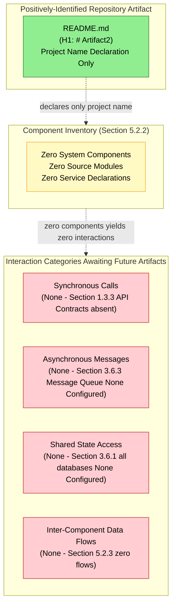

### 5.6.2 State Transition Diagram

A conventional Mermaid `stateDiagram-v2` requires at minimum two distinct states and one labeled transition between them. Section 3.6.2 records "Data Domain Model: None Defined" and "Entity-Relationship Definition: None Defined." Section 2.3.3 records "Business Rules: None Documented — no business logic implemented" (precluding transition guards). Section 3.6.1 records all eight database categories as "None Configured" (precluding state persistence). With zero defined states and zero transitions, no valid state-transition diagram can be authored. The following null-state visualization, rendered using the validated `graph TB` pattern per Constraint C-4-007, represents the verified absence of the components required for any state-transition diagram. This diagram mirrors the null-state State Transition Diagram of Section 4.6.5.

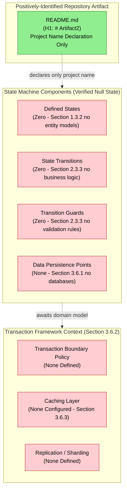

### 5.6.3 Sequence Diagram for Key Flows

A conventional Mermaid `sequenceDiagram` requires at minimum two participants and one message exchanged between them. Section 1.2.1 records "None Declared" across all four integration dimensions (Upstream Systems, Downstream Consumers, External APIs, Enterprise Services), Section 1.3.3 records "API Contracts" as explicitly absent, and Section 3.6.3 records "Message Queue / Event Stream: None Configured." With zero integration parties, zero internal components (Section 5.2.2), and zero message contracts, no valid sequence diagram can be authored. The following null-state visualization, rendered using the validated `graph TB` pattern per Constraint C-4-007, represents the verified absence of the components required for any sequence diagram. This diagram mirrors the null-state Integration Sequence Diagram of Section 4.6.4.

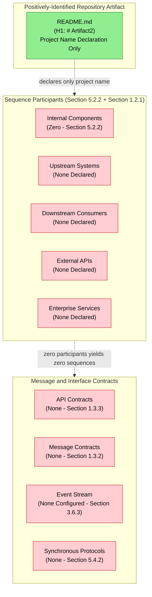

### 5.6.4 Decision Tree Diagram

A decision tree diagram requires at minimum one decision node and two outcome branches. Section 5.4 establishes that zero technical decisions have been documented across all five decision categories (Architecture Style, Communication Pattern, Data Storage, Caching, Security). Section 1.2.2 records that no ADRs, design documents, or RFCs exist. With zero documented decisions and zero documented alternatives, no valid decision tree can be authored. The following null-state visualization represents the verified absence of the components required for any decision tree.

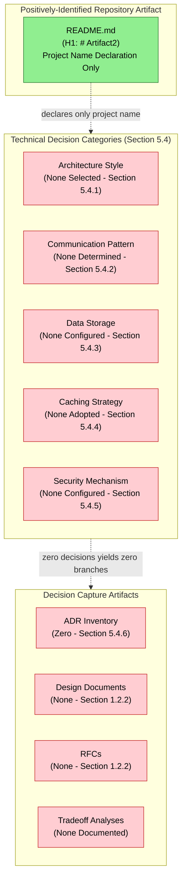

### 5.6.5 Architecture Decision Records (ADR) Null-State Visualization

Section 1.2.2 records that "no architectural decision records (ADRs), design documents, or RFCs exist in the repository to inform technology selection." The ADR inventory cardinality is zero. The following null-state visualization represents the verified absence of the ADR inventory.

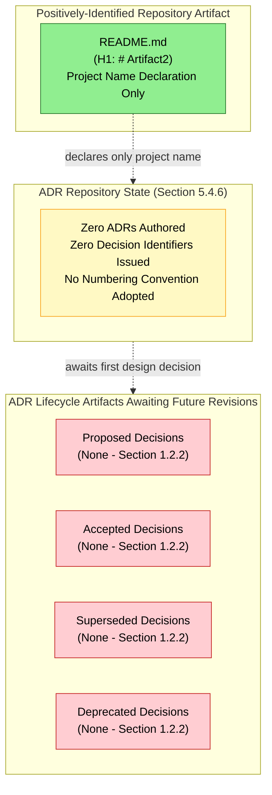

### 5.6.6 Error Handling Flow Diagram

The following diagram represents the verified null state of the error handling subsystem for the System Architecture section, doubly anchored: first to the verified absence of error-handling implementation logic (Section 5.5.3 referencing Section 4.5.2), and second to the verified absence of observability infrastructure that would receive or process error signals (Section 5.5.1 referencing Section 3.5.3). This diagram mirrors the null-state Error Handling Flowchart of Section 4.6.3.

```mermaid
graph TB
    subgraph ErrArchAnchor["Positively-Identified Repository Artifact"]
        ReadmeErrArch["README.md<br/>(H1: # Artifact2)<br/>Project Name Declaration Only"]
    end

    subgraph ErrHandlingArch["Error Handling Taxonomy (Section 5.5.3)"]
        RetriesArch["Retry Mechanisms<br/>(None Configured)"]
        FallbacksArch["Fallback Processes<br/>(None Configured)"]
        RecoveryArch["Recovery Procedures<br/>(None Documented)"]
        ErrNotifyArch["Error Notification Flows<br/>(None Configured)"]
        CircuitBrkArch["Circuit Breakers<br/>(None Configured)"]
        BulkheadArch["Bulkhead Isolation<br/>(None Defined)"]
    end

    subgraph ObsStackArch["Observability Infrastructure (Section 5.5.1)"]
        APMArch["APM Service<br/>(None Configured)"]
        ErrorTrackArch["Error Tracking Service<br/>(None Configured)"]
        AlertingArch["Alerting / Paging Service<br/>(None Configured)"]
        LoggingArch["Log Aggregation Service<br/>(None Configured)"]
        TracingArch["Distributed Tracing Service<br/>(None Configured)"]
    end

    ReadmeErrArch -.->|"declares only project name"| ErrHandlingArch
    ErrHandlingArch -.->|"awaits observability backend"| ObsStackArch

    style ReadmeErrArch fill:#90EE90,stroke:#2E7D32,color:#000
    style RetriesArch fill:#FFCDD2,stroke:#C62828,color:#000
    style FallbacksArch fill:#FFCDD2,stroke:#C62828,color:#000
    style RecoveryArch fill:#FFCDD2,stroke:#C62828,color:#000
    style ErrNotifyArch fill:#FFCDD2,stroke:#C62828,color:#000
    style CircuitBrkArch fill:#FFCDD2,stroke:#C62828,color:#000
    style BulkheadArch fill:#FFCDD2,stroke:#C62828,color:#000
    style APMArch fill:#FFCDD2,stroke:#C62828,color:#000
    style ErrorTrackArch fill:#FFCDD2,stroke:#C62828,color:#000
    style AlertingArch fill:#FFCDD2,stroke:#C62828,color:#000
    style LoggingArch fill:#FFCDD2,stroke:#C62828,color:#000
    style TracingArch fill:#FFCDD2,stroke:#C62828,color:#000
```

### 5.6.7 Diagram Re-Authoring Trigger

Each of the six diagrams above will be re-authored in future revisions when the corresponding upstream null state is broken. The triggers are documented below for traceability and consistency with the re-authoring trigger table in Section 4.6.6.

| Diagram | Re-Authoring Trigger |
|---------|----------------------|
| 5.6.1 Component Interaction Diagram | First source module, service declaration, or `F-XXX` feature identifier committed to the repository |
| 5.6.2 State Transition Diagram | First entity model, database schema, business rule, or state-machine definition committed |
| 5.6.3 Sequence Diagram for Key Flows | First integration party declared (upstream/downstream/external API/enterprise service) and first API contract or message contract committed |
| 5.6.4 Decision Tree Diagram | First technical decision documented across any of the five categories enumerated in Section 5.4 |
| 5.6.5 Architecture Decision Records | First ADR, design document, or RFC committed to the repository |
| 5.6.6 Error Handling Flow Diagram | First retry policy, fallback handler, circuit breaker configuration, exception class, or observability service configured |

---

## 5.7 ASSUMPTIONS, CONSTRAINTS, AND VERSIONING

### 5.7.1 Documented Assumptions

The following assumptions are explicitly recorded for this revision of the System Architecture section. Each assumption is forward-looking and does not introduce any fact-claim about the current repository state. The assumption identifier convention `A-5-XXX` is consistent with the conventions established in Sections 2.7.1 (`A-2-XXX`), 3.9.1 (`A-3-XXX`), and 4.7.1 (`A-4-XXX`).

| Assumption ID | Statement |
|---------------|-----------|
| A-5-001 | Subsequent commits will introduce source code modules, service declarations, integration manifests, or comparable artifacts from which a system architecture (architectural style, components, data flows, integration points, and cross-cutting concerns) can be derived. |
| A-5-002 | When the Feature Catalog (Section 2.2) is populated with `F-XXX` identifiers in future revisions, this System Architecture section will be re-authored to enumerate the components corresponding to each feature, with the Core Components Table populated as the prompt prescribes. |
| A-5-003 | When integration parties (Section 1.2.1) and integration contracts (Section 1.3.3 — API Contracts category) are declared in future revisions, the External Integration Points Table will be populated with concrete system names, integration types, data exchange patterns, and protocol/format selections, and the Sequence Diagram for Key Flows (Section 5.6.3) will be re-authored as a proper Mermaid `sequenceDiagram` enumerating participants and messages. |
| A-5-004 | When databases (Section 3.6.1), persistence strategies (Section 3.6.2), and/or caching tiers (Section 3.6.3) are configured in future revisions, the Data Flow State (Section 5.2.3), Component Specification Dimensions (Section 5.3.2 — Data Persistence Requirements), and the State Transition Diagram (Section 5.6.2) will be re-authored to depict the entity states, transitions, transaction boundaries, and caching boundaries actually implemented. |
| A-5-005 | When the Trust and Security Boundary, Data Ownership Boundary, and Physical Deployment Boundary (Section 1.3.2) are positively defined in future revisions, the System Overview State (Section 5.2.1), Component Specification (Section 5.3.2 — Scaling Considerations), Security Mechanism State (Section 5.4.5), and Authentication and Authorization Framework State (Section 5.5.4) will be re-authored against the boundaries then articulated. |
| A-5-006 | When third-party services (Section 3.5), authentication/authorization services (Section 3.5.2), or observability services (Section 3.5.3) are configured in future revisions, the Cross-Cutting Concerns subsections (Sections 5.5.1 through 5.5.4) and the Error Handling Flow Diagram (Section 5.6.6) will be re-authored to depict the actual monitoring, logging, tracing, error-handling, and security control planes in operation. |
| A-5-007 | When KPIs (Section 1.2.3) and performance criteria (Section 2.3.2) are populated in future revisions, the Performance Requirements and SLA State (Section 5.5.5) and the Disaster Recovery State (Section 5.5.6 — RTO, RPO) will be authored against the targets then articulated. |
| A-5-008 | When the first Architecture Decision Record (ADR), design document, or RFC is committed (Section 1.2.2), the Technical Decisions subsections (Sections 5.4.1 through 5.4.6) and the Decision Tree Diagram (Section 5.6.4) and ADR Inventory Visualization (Section 5.6.5) will be re-authored to enumerate the actual decisions, alternatives considered, and tradeoffs accepted. |
| A-5-009 | Component identifier conventions (suggested: `CMP-XXX` for components, `INT-XXX` for integration points, `ADR-XXX` for architecture decisions, `XCC-XXX` for cross-cutting concerns) will be formally adopted when the first such artifact is committed; until then, no identifiers in those namespaces are issued. |
| A-5-010 | The Default Technology Stack enumerated in Section 3.1.2 will be re-evaluated against the artifacts committed in future revisions; specific defaults will be accepted, replaced, or supplemented based on the evidence then available, but no default is applied in this revision. |

### 5.7.2 Constraints Bounding This Section

The following constraints bound the present revision of the System Architecture section. These constraints are factual properties of the current repository state, not authoring preferences. The constraint identifier convention `C-5-XXX` is consistent with the conventions established in Sections 2.7.2 (`C-2-XXX`), 3.9.2 (`C-3-XXX`), and 4.7.2 (`C-4-XXX`). This section explicitly inherits the foundational constraints from those upstream sections.

| Constraint ID | Statement |
|---------------|-----------|
| C-5-001 | This section is bound by Constraint C-2-001 (Section 2.7.2): no requirements, and therefore no architectural components, integration points, or technical decisions derivable from requirements, may be invented or inferred beyond what exists in the repository. |
| C-5-002 | This section is bound by Constraint C-2-002 (Section 2.7.2): the single-level repository hierarchy (root containing `README.md` only) precludes the inference of layered, tiered, hexagonal, microservice, or any other multi-component architectural structures from any directory layout. |
| C-5-003 | This section is bound by Constraint C-2-003 (Section 2.7.2): the empty Code Graph schema (`{}`) precludes the extraction of components, classes, modules, services, interfaces, or any other indexable code structures from which a system architecture could be derived. |
| C-5-004 | This section is bound by Constraint C-2-004 (Section 2.7.2): no feature relationships may be imagined or projected, and therefore no inter-component interactions, data flows, sequence diagrams, or state-transition diagrams may be authored in the absence of features. |
| C-5-005 | This section is bound by Constraint C-3-001 (Section 3.9.2): the Default Technology Stack (AWS, Docker, Terraform, GitHub Actions, Python/Flask, Auth0, MongoDB, Langchain, React/TypeScript, TailwindCSS, React-Native, Swift, Kotlin, Objective-C, ElectronJS) may not be applied to populate any architectural component, communication pattern, data storage choice, caching strategy, or security mechanism in the absence of repository evidence for those selections. |
| C-5-006 | This section is bound by Constraint C-3-002 (Section 3.9.2): the empty Code Graph schema precludes the inference of framework-idiomatic architectural patterns (such as Flask request lifecycles, React component hierarchies, Express middleware chains, or MongoDB aggregation pipelines) from which technology-specific architectural diagrams could be authored. |
| C-5-007 | This section is bound by Constraint C-3-003 (Section 3.9.2): the single-level repository hierarchy precludes the inference of build-system layout, source-tree layout, or deployment-layer separation from which an architectural style (monolith, modular monolith, microservices, serverless functions) could be derived. |
| C-5-008 | This section is bound by Constraint C-3-004 (Section 3.9.2): no version numbers, vendor identifiers, or specific service endpoints may be specified absent direct evidence in the repository. |
| C-5-009 | This section is bound by Constraint C-4-007 (Section 4.7.2): Mermaid sequence diagrams and state-transition diagrams require at minimum two participants/states and one message/transition to render meaningfully; with zero of each present in the repository, the corresponding diagrams in Sections 5.6.2 and 5.6.3 are rendered as null-state `graph TB` visualizations following the validated pattern from Sections 1.2.2, 2.4.1, 3.8.1, and 4.6. |
| C-5-010 | This section is bound by Constraint C-4-008 (Section 4.7.2): no SLA values, latency targets, throughput goals, RTO/RPO values, capacity targets, or any timing or performance constraints may be articulated absent direct evidence in the repository (Section 1.2.3 — all KPI categories "Not Defined"; Section 2.3.2 — "Performance Criteria: Not Specified"). |
| C-5-011 | The Core Components Table (Section 5.2.2) and External Integration Points Table (Section 5.2.4) prescribed by the section prompt are rendered with zero rows; the prompt's required columns are preserved as schema for future revisions. |
| C-5-012 | The per-component documentation prescribed by Section 5.3 (purpose, technologies, interfaces, persistence, scaling) is rendered as zero per-component entries, derived from the cardinality product `1 component description × 0 components = 0 entries`. |

### 5.7.3 Re-Evaluation Trigger and Version Tracking

| Version Tracking Field | Current State |
|------------------------|---------------|
| Specification Revision | Initial baseline revision (consistent with Sections 2.7.3, 3.9.3, and 4.7.3) |
| Corresponding Repository State | Single "Initial commit" recorded in git history (Section 1.4.3) |
| Number of Identified System Components | 0 |
| Number of Core Components Table Rows | 0 |
| Number of External Integration Points Table Rows | 0 |
| Number of Defined Data Flows | 0 |
| Number of Defined Integration Protocols | 0 |
| Number of Defined Architectural Patterns | 0 |
| Number of Architecture Decision Records (ADRs) | 0 |
| Number of Documented Tradeoff Analyses | 0 |
| Number of Configured Monitoring Services | 0 |
| Number of Configured Logging Services | 0 |
| Number of Configured Tracing Services | 0 |
| Number of Configured Error Handling Mechanisms | 0 |
| Number of Configured Auth/Authz Mechanisms | 0 |
| Number of Defined SLAs / SLOs | 0 |
| Number of Defined RTO / RPO Values | 0 |
| Number of Documented Disaster Recovery Procedures | 0 |
| Number of Defined Capacity Targets | 0 |
| Diagrams Rendered as Null-State | 6 (Sections 5.6.1 through 5.6.6) |
| Diagrams Using `graph TB` Pattern per C-4-007 | 2 (Sections 5.6.2 and 5.6.3) |
| Constraints Explicitly Inherited from Prior Sections | C-2-001 through C-2-004; C-3-001 through C-3-004; C-4-007 and C-4-008 |
| Next Re-Evaluation Trigger | Introduction of any of: a source code module, a service declaration, an `F-XXX` feature identifier, an integration party declaration, an API/message contract, an Architecture Decision Record (ADR), a database/cache configuration, an auth/authz configuration, an observability service configuration, an error-handling configuration, an SLA articulation, a deployment topology declaration, or a security boundary positive definition |

All future revisions of this section should re-evaluate every subsection against newly committed artifacts. When the re-evaluation trigger is satisfied, the corresponding subsection should transition from "None Documented" / "None Configured" / "None Defined" to a populated state that enumerates the actually-committed components, integration points, technical decisions, and cross-cutting concern implementations as prescribed by the section prompt. The six null-state diagrams in Section 5.6 should likewise transition to populated component interaction, state transition, sequence, decision tree, ADR inventory, and error handling diagrams that accurately depict the implemented architecture.

---

## 5.8 REFERENCES

### 5.8.1 Files Examined

- `README.md` — The sole file present in the repository, containing only the H1 heading `# Artifact2`. Confirmed via direct inspection that no architectural specifications, component manifests, integration contracts, technical decision documents, ADRs, observability configurations, error handling artifacts, security policies, or SLA articulations are present. Serves as the singular evidentiary anchor in every null-state diagram of Section 5.6 and as the baseline against which all "Not Applicable" / "None Documented" / "None Configured" determinations in Section 5 are anchored.

### 5.8.2 Folders Explored

- `/` (repository root, depth 0) — Confirmed via folder enumeration to contain only `README.md` as its sole first-order child; no subdirectories present. The absence of conventional architecture-bearing directories (such as `src/`, `lib/`, `modules/`, `services/`, `components/`, `gateways/`, `adapters/`, `interfaces/`, `contracts/`, `proto/`, `api/`, `docs/adr/`, `architecture/`, `design/`, `rfcs/`, `infrastructure/`, `deploy/`, `helm/`, `terraform/`, `monitoring/`, `observability/`, or `security/`) provides independent corroboration of every null determination recorded in Sections 5.2 through 5.6.

### 5.8.3 Technical Specification Cross-References

The following sections of this Technical Specification were retrieved and synthesized in the authoring of Section 5. Each is cited at the specific point of corroboration above.

- **Section 1.1.1 (Project Overview)** — Establishes the documentation-only placeholder framing and records the Code Graph schema as an empty object (`{}`); cited throughout Section 5 for the inability to derive components, interactions, or architectural patterns from indexable code structures.
- **Section 1.1.4 (Expected Business Impact and Value Proposition)** — Establishes the principle that any projection at this stage would constitute unsupported speculation; cited in Section 5.1.3 as a foundational documentation standard governing the authoring of null-state diagrams instead of fabricated architecture diagrams.
- **Section 1.2.1 (Project Context)** — Records "None Declared" across all four integration dimensions (Upstream Systems, Downstream Consumers, External APIs, Enterprise Services); cited in Sections 5.2.3 (Data Flow State), 5.2.4 (External Integration Points State), and 5.6.3 (Sequence Diagram null state).
- **Section 1.2.2 (High-Level Description)** — States that no technical approach, architectural style, design pattern, technology stack, or framework choice can be inferred from the repository, and that no ADRs, design documents, or RFCs exist; provides the validated Mermaid diagram pattern mirrored in all six diagrams of Section 5.6, and is the primary anchor for Sections 5.2.1, 5.2.2, 5.4.1, and 5.4.6.
- **Section 1.2.3 (Success Criteria)** — Records "Not Defined" across all KPI categories (Business, Technical, Operational, User Experience); cited in Sections 5.5.5 (Performance Requirements and SLA State) and 5.5.6 (Disaster Recovery State).
- **Section 1.3.1 (In-Scope Elements)** — Records "No user workflows are defined. No UI mockups, sequence diagrams, journey maps, or interaction specifications are present in the repository"; cited as supporting evidence in Sections 5.2.2 and 5.2.3.
- **Section 1.3.2 (Implementation Boundaries)** — Records "Not Yet Defined" across Physical Deployment, Trust and Security, and Data Ownership boundaries; cited extensively throughout Section 5.2.1, 5.3.2 (Scaling Considerations), 5.4.5 (Security Mechanism State), and 5.5.4 (Authentication and Authorization Framework State).
- **Section 1.3.3 (Out-of-Scope Elements)** — Enumerates ten explicitly-absent artifact categories with rationales; provides direct anchoring evidence for Section 5.2.1 (no API interfaces), Section 5.2.3 (no API contracts in data flow), Section 5.2.4 (no integrations), and Sections 5.4 (no decisions across all five categories).
- **Section 1.4 (References)** — Documents the evidentiary inventory (single file `README.md`, single folder `/`, single git commit, four empty semantic searches) on which Section 5's null-baseline reporting depends.
- **Section 2.1.3 (Section Authoring Standard)** — Establishes the parallel principle to Section 1.1.4 that enumeration of fabricated requirements would constitute unsupported speculation; cited in Section 5.1.3.
- **Section 2.2.1 (Feature Catalog State)** — Confirms the Feature Catalog contains zero entries; cited as the foundational anchor for Section 5.2.2 (Core Components State), Section 5.3.1 (Component Inventory State), and Section 5.6.1 (Component Interaction Diagram null state).
- **Section 2.3.2 (Technical Specifications State)** — Records "Performance Criteria: Not Specified"; cited in Section 5.5.5.
- **Section 2.3.3 (Validation Rules State)** — Records "None Documented" across Business Rules, Data Validation, Security Requirements, and Compliance Requirements; cited in Sections 5.6.2 (State Transition Diagram null state) and 5.4.5.
- **Section 2.4.1 (Feature Dependency Map)** — Provides the validated Mermaid diagram pattern (subgraph composition with edge connections outside subgraphs, green/yellow/red fill conventions) mirrored in all six diagrams of Section 5.6.
- **Section 2.4.2 (Integration Points)** — Records "None Declared," "None Identified," and "None Documented" across Integration Points, Shared Components, Common Services, and Cross-Feature Contracts; cited in Sections 5.2.2, 5.2.4, and 5.4.2.
- **Section 2.5.1 (Technical Constraints and Performance Requirements)** — Records "Performance Requirements: None Documented"; cited in Sections 5.5.5 and 5.5.6.
- **Section 2.5.2 (Scalability, Security, and Maintenance Considerations)** — Records "Scalability Considerations: None Documented," "Security Implications: None Documented," "Maintenance Requirements: None Documented," and "Operational Considerations: None Documented"; cited extensively throughout Sections 5.3.2, 5.4.5, 5.5.5, and 5.5.6.
- **Section 2.7.2 (Constraints Bounding This Section)** — Defines Constraints C-2-001 through C-2-004; explicitly inherited by Constraints C-5-001 through C-5-004 of this section.
- **Section 2.7.3 (Version Tracking)** — Establishes the re-evaluation trigger pattern mirrored in Section 5.7.3.
- **Section 3.1.2 (Default Technology Stack Applicability Determination)** — Establishes that the Default Technology Stack is not applied in this revision; cited in Section 5.1.3, Section 5.4.7, and Constraint C-5-005 (Section 5.7.2).
- **Section 3.2.1 (Programming Language State)** — Records all 6 language dimensions as "None Identified"; cited in Section 5.3.2 (Technologies Used).
- **Section 3.3.1 (Framework and Library State)** — Records all 7 framework categories as "None Declared"; cited in Section 5.3.2 (Frameworks Applied), Section 5.4.2 (Communication Patterns), and Section 5.5.2 (Logging and Tracing — no logging frameworks).
- **Section 3.5.1 (External Integration State)** — Records "No external system integration of any kind exists in this revision"; cited in Sections 5.2.3, 5.2.4, and 5.6.3.
- **Section 3.5.2 (Authentication and Authorization Services)** — Records all six auth/authz dimensions as "None Configured" or "None Defined"; cited as the primary anchor for Sections 5.4.5 and 5.5.4.
- **Section 3.5.3 (Cloud, Monitoring, and Observability Services)** — Records all 14 service categories as "None Configured"; cited as the primary anchor for Sections 5.5.1 (Monitoring and Observability State), 5.5.2 (Logging and Tracing State), and 5.6.6 (Error Handling Flow Diagram null state).
- **Section 3.6.1 (Database Configuration State)** — Records all 8 database categories as "None Configured"; cited in Section 5.2.3 (data stores), 5.4.3 (Data Storage Decision State), and 5.6.2 (State Transition Diagram null state).
- **Section 3.6.2 (Persistence Strategy State)** — Records "Data Domain Model: None Defined," "Entity-Relationship Definition: None Defined," and "Transaction Boundary Policy: None Defined"; cited in Sections 5.3.2, 5.4.3, 5.5.6, and 5.6.2.
- **Section 3.6.3 (Caching and Storage Services)** — Records all 9 caching/storage categories as "None Configured"; cited in Sections 5.2.3 (caches), 5.4.4 (Caching Strategy State), and 5.6.3.
- **Section 3.8 (Technology Stack Visualization)** — Provides the validated Mermaid null-state diagram pattern explicitly mirrored in all six diagrams of Section 5.6.
- **Section 3.9.2 (Constraints Bounding This Section)** — Defines Constraints C-3-001 through C-3-004; explicitly inherited by Constraints C-5-005 through C-5-008 of this section.
- **Section 4.1.3 (Authoring Standard)** — Establishes the parallel principle that the invention of illustrative or hypothetical flowcharts would constitute unsupported speculation; cited in Section 5.1.3 for the parallel principle governing architecture diagrams.
- **Section 4.2.2 (Integration Workflow State)** — Records "File Transfer / ETL Pipelines: None Configured"; cited in Section 5.2.3 (Data Transformation Points).
- **Section 4.5.1 (State Management State)** — Records all 12 state-management dimensions as "None Defined" or "None Configured"; cited in Section 5.4.4 and Section 5.6.2.
- **Section 4.5.2 (Error Handling State)** — Records all 13 error-handling dimensions as "None Configured" or "None Documented"; cited as the primary anchor for Section 5.5.3 (Error Handling State) and Section 5.6.6 (Error Handling Flow Diagram).
- **Section 4.6 (Required Diagrams)** — Provides five null-state Mermaid diagram templates (High-Level Workflow, Detailed Process Flow, Error Handling, Integration Sequence, State Transition) that Section 5.6 mirrors for its six required diagrams.
- **Section 4.7.2 (Constraints Bounding This Section)** — Defines Constraints C-4-001 through C-4-008, particularly C-4-007 (Mermaid sequence/state diagrams require minimum participants/states; must use `graph TB` for null state) and C-4-008 (no SLA values absent evidence); explicitly inherited by Constraints C-5-009 and C-5-010 of this section.
- **Section 4.7.3 (Re-Evaluation Trigger and Version Tracking)** — Establishes the version-tracking field conventions mirrored in Section 5.7.3.

### 5.8.4 Repository Inspection Activities Relied Upon

| Activity | Result Relied Upon by Section 5 |
|----------|----------------------------------|
| Direct file read of `README.md` | Confirmed no architectural specifications, component manifests, integration contracts, technical decision documents, ADRs, observability configurations, error handling artifacts, security policies, or SLA articulations present |
| Folder enumeration of `/` (repository root) | Confirmed no subdirectories that could contain source modules, services, infrastructure manifests, ADRs, design documents, monitoring configurations, security policies, or runbooks |
| Code Graph schema inspection | Confirmed empty object (`{}`) — independent verification of every null determination in Sections 5.2 through 5.6 |
| Semantic search: application source code modules / implementation files | Empty result set (independent verification of Section 5.2.2 Core Components State and Section 5.6.1 Component Interaction Diagram null state) |
| Semantic search: configuration manifest / dependency declaration / package | Empty result set (independent verification of Section 5.3.2 Technologies Used and Section 5.4.7 Default Technology Stack non-application) |
| Semantic folder search: source code application directories | Empty result set (independent verification of Section 5.2.2 and the entire null-state framing of Section 5) |
| Bash filesystem search for source files | Confirmed only system/Python library files outside the repository scope; zero repository source files (independent verification of every null determination in Section 5) |
| Git history verification | Single "Initial commit" recorded — confirms baseline revision aligns with Section 5.7.3 |

#### References

- `README.md` — Sole repository artifact; serves as the singular evidentiary anchor for Sections 5.1 through 5.7 and the green-filled "Positively-Identified Repository Artifact" node in all six null-state diagrams of Section 5.6
- `/` (repository root) — Sole repository folder; confirmed zero subdirectories, providing independent corroboration of every "Not Applicable" / "None Configured" / "None Defined" determination in Section 5

# 6. SYSTEM COMPONENTS DESIGN

## 6.1 Core Services Architecture

### 6.1.1 Applicability Statement

**Core Services Architecture is not applicable for this system in the current revision.**

Direct inspection of the **Artifact2** repository confirms that no service components, microservice boundaries, distributed architectural elements, inter-service communication channels, service discovery mechanisms, load balancing strategies, circuit breaker configurations, retry policies, fallback handlers, scalability provisions, or resilience artifacts of any kind have been committed at the time of this revision. The sole positively-identifiable artifact in the repository is `README.md`, whose entire content is a single H1 heading declaring the project name (`# Artifact2`). The Code Graph schema for the repository is recorded as an empty object (`{}`) per Section 1.1.1 — Project Overview, confirming the absence of indexable code structures from which service decomposition, distribution topology, or operational resilience patterns could be derived.

This section is authored under the same evidence-strict reporting standard established in Section 1.1 — Executive Summary and reinforced by Section 2.1 — Requirements Baseline Statement, Section 3.1 — Technology Stack Baseline Statement, Section 4.1 — Process Flowchart Baseline Statement, and Section 5.1 — System Architecture Baseline Statement. The Default Technology Stack identified in Section 3.1.2 — including AWS, Docker, Terraform, GitHub Actions, Python with Flask, Auth0, MongoDB, Langchain, React with TypeScript, TailwindCSS, React-Native, Swift, Kotlin, Objective-C, and ElectronJS — is **explicitly not applied** to populate any service component, scalability provision, or resilience mechanism documented in this section. Application of any default in the absence of corroborating repository evidence would constitute fabrication and would violate Constraint C-2-001 (Section 2.7.2).

#### 6.1.1.1 Repository Evidence Summary

The applicability determination is anchored to the following verified properties of the repository:

| Evidentiary Anchor | Verified State | Source Section |
|--------------------|----------------|----------------|
| Repository Hierarchy | Single-level (root contains `README.md` only) | Section 1.3.3 |
| Code Graph Schema | Empty object (`{}`) | Section 1.1.1 |
| Source Code Modules | Zero | Section 1.3.3 |
| Services Declared | Zero | Section 1.2.1 |
| Integration Parties (Upstream / Downstream / External APIs / Enterprise) | None Declared | Section 1.2.1 |
| Number of Identified System Components | 0 | Section 5.7.3 |

#### 6.1.1.2 Why Core Services Architecture is Not Applicable

The Core Services Architecture section prompt prescribes documentation across three principal domains — Service Components, Scalability Design, and Resilience Patterns — and three required Mermaid diagrams (Service Interaction, Scalability Architecture, Resilience Pattern Implementations). Each domain presupposes the existence of distinct service components, deployment topology, or operational telemetry from which the prescribed analysis can be conducted. The repository in its current state provides none of these preconditions, as established in:

- **Section 5.2.2** — Core Components Table cardinality is **zero rows** (no system components exist from which to define service boundaries)
- **Section 5.4.2** — All seven communication pattern dimensions (synchronous vs. asynchronous, request/response protocol, publish/subscribe backbone, streaming protocol, service mesh/sidecar pattern, API gateway pattern, inter-process communication mechanism) are recorded as "None Determined" or "None Configured"
- **Section 5.5.3** — All thirteen error-handling dimensions (including circuit breaker, retry mechanisms, bulkhead isolation, fallback process definitions, dead-letter queue, recovery procedures) are recorded as "None Configured," "None Defined," or "None Documented"
- **Section 5.5.5** — All eleven performance and SLA dimensions (latency targets, throughput targets, availability SLA/SLO, capacity planning targets, etc.) are recorded as "Not Defined," "Not Specified," or "None Documented"
- **Section 5.5.6** — All ten disaster recovery dimensions (RTO, RPO, backup strategy, failover topology, multi-region/multi-AZ strategy, DR drill cadence, runbook/playbook inventory, incident response process, business continuity plan, restore procedure) are recorded as "Not Defined," "None Defined," "None Documented," or "None Established"

Consequently, this section documents the **verified null baseline state** of the Core Services Architecture rather than enumerating fabricated services, scalability provisions, or resilience mechanisms. By the principles established in Sections 1.1.4, 2.1.3, 3.1.3, 4.1.3, and 5.1.3, the invention of even illustrative or hypothetical service boundaries, auto-scaling rules, or circuit breaker thresholds at this stage would constitute unsupported speculation and is therefore avoided.

---

### 6.1.2 Authoring Standard and Section Structure

#### 6.1.2.1 Authoring Discipline

All entries in this section conform to the documentation discipline established in Section 1.1.4 (no projection beyond evidence), Section 2.1.3 (no fabricated requirements), Section 3.1.3 (no fabricated technology selections), Section 4.1.3 (no fabricated processes), and Section 5.1.3 (no fabricated architecture components). Each subsection enumerates a domain prescribed by the Core Services Architecture section prompt and records the verified absence of evidence for that domain, anchored to specific cross-referenced Technical Specification sections.

#### 6.1.2.2 Applicability Determination Matrix

The following table maps each subsection mandated by the Core Services Architecture section prompt to its applicability against the current repository state. Each "Not Applicable" determination is anchored to verified absence rather than incomplete investigation.

| Prompt-Required Domain | Applicability | Anchoring Evidence |
|------------------------|---------------|--------------------|
| Service Components | Not Applicable — zero services exist | Section 1.2.1; Section 5.2.2 |
| Scalability Design | Not Applicable — no deployment topology defined | Section 1.3.2; Section 5.3.2 |
| Resilience Patterns | Not Applicable — no fault-tolerance artifacts present | Section 5.5.3; Section 5.5.6 |
| Service Interaction Diagram | Null-State Visualization Required | Section 5.6.1 pattern |
| Scalability Architecture Diagram | Null-State Visualization Required | Section 5.6 pattern |
| Resilience Pattern Diagram | Null-State Visualization Required | Section 5.6.6 pattern |

---

### 6.1.3 Service Components State

The Core Services Architecture prompt for Service Components mandates documentation of six dimensions: service boundaries and responsibilities, inter-service communication patterns, service discovery mechanisms, load balancing strategy, circuit breaker patterns, and retry and fallback mechanisms. Each dimension is recorded below with anchoring evidence to its verified null state.

#### 6.1.3.1 Service Boundaries and Responsibilities

| Service Component Dimension | Current State | Anchoring Evidence |
|-----------------------------|---------------|--------------------|
| Number of Services Declared | 0 | Section 1.2.1 — Enterprise Services "None Declared" |
| Service Identifier Convention | Not Adopted | Section 5.7.1 — A-5-009 (identifier conventions deferred) |
| Service Boundary Definitions | None Defined | Section 5.2.2 — zero components in inventory |
| Service Responsibility Mapping | None Defined | Section 2.2.1 — Feature Catalog: 0 entries |

The cardinality derivation is: **0 services × N responsibility dimensions = 0 service boundary descriptions**. Section 1.2.2 records that "no technical approach, architectural style, design pattern selection, technology stack, or framework choice can be inferred from the repository," precluding the imputation of monolithic, modular monolithic, microservice, service-oriented, or serverless decomposition strategies from any directory layout (Constraint C-5-007).

#### 6.1.3.2 Inter-Service Communication Patterns

| Communication Pattern Dimension | Current State | Anchoring Evidence |
|---------------------------------|---------------|--------------------|
| Synchronous vs. Asynchronous Selection | None Determined | Section 5.4.2 |
| Request/Response Protocol (REST, gRPC, GraphQL) | None Configured | Section 1.3.3 — API Contracts explicitly absent |
| Publish/Subscribe Backbone | None Configured | Section 3.6.3 — Message Queue / Event Stream "None Configured" |
| Streaming Protocol (gRPC streams, WebSocket, SSE) | None Configured | Section 3.3.1 — no streaming frameworks declared |
| Inter-Process Communication Mechanism | None Configured | Section 5.4.2 |

No OpenAPI specifications, gRPC `.proto` definitions, GraphQL schema files, AMQP exchange declarations, Kafka topic definitions, MQTT broker configurations, or comparable contract artifacts exist in the repository (Section 1.3.3). With zero services and zero contracts, no inter-service communication pattern is observable.

#### 6.1.3.3 Service Discovery Mechanisms

| Service Discovery Dimension | Current State | Anchoring Evidence |
|-----------------------------|---------------|--------------------|
| Service Registry (Consul, Eureka, etcd) | None Configured | Section 3.5.3 — no cloud or networking services configured |
| DNS-Based Service Discovery | None Configured | Section 1.3.2 — Physical Deployment Boundary "Not Yet Defined" |
| Service Mesh / Sidecar Pattern | None Configured | Section 5.4.2 |
| Client-Side Discovery Library | None Configured | Section 3.3.1 — all framework categories "None Declared" |
| Server-Side Discovery (Load Balancer / API Gateway) | None Configured | Section 5.4.2 — API Gateway Pattern "None Configured" |

#### 6.1.3.4 Load Balancing Strategy

| Load Balancing Dimension | Current State | Anchoring Evidence |
|--------------------------|---------------|--------------------|
| Load Balancer Type (L4 / L7) | None Configured | Section 1.3.2 — Physical Deployment Boundary "Not Yet Defined" |
| Distribution Algorithm | None Selected | Section 3.7 — no IaC artifacts present |
| Health-Check-Driven Routing | None Configured | Section 5.5.1 — Health Check Endpoints "None Defined" |
| Sticky Session Policy | None Defined | Section 1.3.3 — no application configuration present |

#### 6.1.3.5 Circuit Breaker Patterns

| Circuit Breaker Dimension | Current State | Anchoring Evidence |
|---------------------------|---------------|--------------------|
| Circuit Breaker Configuration | None Configured | Section 5.5.3 |
| Failure Threshold | Not Defined | Section 5.5.3 — anchored to Section 4.5.2 |
| Half-Open Probe Policy | Not Defined | Section 5.5.3 — anchored to Section 4.5.2 |
| Breaker Reset Timeout | Not Defined | Section 5.5.3 — anchored to Section 4.5.2 |
| Resilience Library Selection (e.g., Resilience4j, Polly) | None Declared | Section 3.3.1 — all 7 framework categories "None Declared" |

#### 6.1.3.6 Retry and Fallback Mechanisms

| Retry / Fallback Dimension | Current State | Anchoring Evidence |
|----------------------------|---------------|--------------------|
| Retry Mechanisms | None Configured | Section 5.5.3 |
| Retry Back-off Policy (linear, exponential, jittered) | None Defined | Section 5.5.3 |
| Maximum Retry Attempts | Not Defined | Section 5.5.3 |
| Fallback Process Definitions | None Documented | Section 5.5.3 |
| Dead-Letter Queue Configuration | None Configured | Section 5.5.3 |
| Bulkhead Isolation Policy | None Defined | Section 5.5.3 |

---

### 6.1.4 Scalability Design State

The Core Services Architecture prompt for Scalability Design mandates documentation of five dimensions: horizontal/vertical scaling approach, auto-scaling triggers and rules, resource allocation strategy, performance optimization techniques, and capacity planning guidelines. Each dimension is recorded below with anchoring evidence to its verified null state.

#### 6.1.4.1 Horizontal and Vertical Scaling Approach

| Scaling Dimension | Current State | Anchoring Evidence |
|-------------------|---------------|--------------------|
| Horizontal Scaling Strategy | None Defined | Section 5.3.2 — anchored to Physical Deployment Boundary "Not Yet Defined" |
| Vertical Scaling Strategy | None Defined | Section 5.3.2 — anchored to Physical Deployment Boundary "Not Yet Defined" |
| Replication Topology | None Defined | Section 5.3.2; Section 3.6.2 |
| Stateless / Stateful Classification | None Determined | Section 5.3.2; Section 4.5.1 — State Persistence Points "None Defined" |

Per Constraint C-5-007 (Section 5.7.2), the single-level repository hierarchy precludes the inference of build-system layout, source-tree layout, or deployment-layer separation from which a horizontal or vertical scaling posture could be derived.

#### 6.1.4.2 Auto-Scaling Triggers and Rules

| Auto-Scaling Dimension | Current State | Anchoring Evidence |
|------------------------|---------------|--------------------|
| Scaling Trigger Metrics (CPU, memory, RPS, latency) | None Configured | Section 5.5.1 — Metrics / Telemetry Backend "None Configured" |
| Scale-Out Threshold Rules | None Defined | Section 2.5.2 — Scalability Considerations "None Documented" |
| Scale-In Threshold Rules | None Defined | Section 2.5.2 — Scalability Considerations "None Documented" |
| Cooldown / Stabilization Window | None Defined | Section 2.5.2 — Scalability Considerations "None Documented" |
| Minimum / Maximum Replica Bounds | None Defined | Section 3.7 — no IaC artifacts present |

#### 6.1.4.3 Resource Allocation Strategy

| Resource Allocation Dimension | Current State | Anchoring Evidence |
|-------------------------------|---------------|--------------------|
| CPU Allocation Profiles | Not Documented | Section 2.5.1 — Resource Requirements "None Documented" |
| Memory Allocation Profiles | Not Documented | Section 2.5.1 — Resource Requirements "None Documented" |
| Storage Allocation Profiles | Not Documented | Section 3.6.1 — all 8 database categories "None Configured" |
| Network Bandwidth Allocation | Not Documented | Section 1.3.2 — Physical Deployment Boundary "Not Yet Defined" |
| Container Resource Requests / Limits | Not Configured | Section 3.7 — no container or orchestration artifacts present |

#### 6.1.4.4 Performance Optimization Techniques

| Performance Optimization Dimension | Current State | Anchoring Evidence |
|------------------------------------|---------------|--------------------|
| Caching Tier Architecture | None Configured | Section 5.4.4 — all 9 caching/storage categories "None Configured" |
| Database Query Optimization | None Defined | Section 3.6.1 — all 8 database categories "None Configured" |
| Connection Pooling Strategy | None Configured | Section 3.6.2 — no persistence strategies defined |
| Asynchronous Processing Patterns | None Defined | Section 3.6.3 — Message Queue / Event Stream "None Configured" |
| Content Delivery Network (CDN) | None Configured | Section 3.5.3 — no cloud services configured |
| Compression / Payload Optimization | None Configured | Section 1.3.3 — no application configuration present |

#### 6.1.4.5 Capacity Planning Guidelines

| Capacity Planning Dimension | Current State | Anchoring Evidence |
|-----------------------------|---------------|--------------------|
| Capacity Planning Targets | None Documented | Section 5.5.5; Section 2.5.1 |
| Baseline Load Profile | Not Established | Section 1.2.3 — all KPI categories "Not Defined" |
| Peak Load Projections | Not Defined | Section 2.3.2 — Performance Criteria "Not Specified" |
| Headroom Reservation Policy | Not Defined | Section 2.5.2 — Operational Considerations "None Documented" |
| Growth Forecasting Model | Not Established | Section 1.2.3 — Business KPIs "Not Defined" |

Per Constraint C-5-010 (Section 5.7.2) inherited from C-4-008 (Section 4.7.2), no SLA values, latency targets, throughput goals, RTO/RPO values, capacity targets, or any timing or performance constraints may be articulated absent direct evidence in the repository.

---

### 6.1.5 Resilience Patterns State

The Core Services Architecture prompt for Resilience Patterns mandates documentation of five dimensions: fault tolerance mechanisms, disaster recovery procedures, data redundancy approach, failover configurations, and service degradation policies. Each dimension is recorded below with anchoring evidence to its verified null state.

#### 6.1.5.1 Fault Tolerance Mechanisms

| Fault Tolerance Dimension | Current State | Anchoring Evidence |
|---------------------------|---------------|--------------------|
| Exception Class Hierarchy | None Defined | Section 5.5.3 — anchored to Section 4.5.2 |
| Try / Catch / Finally Patterns | None Documented | Section 5.5.3 — anchored to Section 4.5.2 |
| Circuit Breaker Configuration | None Configured | Section 5.5.3 |
| Bulkhead Isolation Policy | None Defined | Section 5.5.3 |
| Timeout Configuration | None Defined | Section 5.5.3 — anchored to Section 4.5.2 |
| Idempotency Policy | None Defined | Section 1.3.3 — no API contracts; Section 5.4.3 — no consistency model |

#### 6.1.5.2 Disaster Recovery Procedures

| Disaster Recovery Dimension | Current State | Anchoring Evidence |
|-----------------------------|---------------|--------------------|
| Recovery Time Objective (RTO) | Not Defined | Section 5.5.6; Section 1.2.3 |
| Recovery Point Objective (RPO) | Not Defined | Section 5.5.6; Section 1.2.3 |
| Disaster Recovery Drill Cadence | None Established | Section 5.5.6 |
| Incident Response Process | None Documented | Section 5.5.6 |
| Business Continuity Plan | None Documented | Section 5.5.6 |
| Runbook / Playbook Inventory | None Present | Section 5.5.6; Section 5.5.3 |

#### 6.1.5.3 Data Redundancy Approach

| Data Redundancy Dimension | Current State | Anchoring Evidence |
|---------------------------|---------------|--------------------|
| Replication / Sharding Topology | None Defined | Section 5.3.2; Section 3.6.2 |
| Backup Strategy | None Defined | Section 5.5.6; Section 3.6.2 — "Backup and Restore Policy: None Defined" |
| Restore Procedure | None Documented | Section 5.5.6 |
| Backup Retention Policy | Not Defined | Section 3.6.2 — Data Retention Policy "None Defined" |
| Cross-Region Backup Replication | None Configured | Section 1.3.2 — no geographic deployment regions documented |

#### 6.1.5.4 Failover Configurations

| Failover Dimension | Current State | Anchoring Evidence |
|--------------------|---------------|--------------------|
| Failover Topology | None Defined | Section 5.5.6 |
| Multi-Region / Multi-AZ Strategy | None Defined | Section 5.5.6 |
| Active-Active vs. Active-Passive | Not Determined | Section 1.3.2 — Physical Deployment Boundary "Not Yet Defined" |
| Failover Trigger Criteria | None Defined | Section 5.5.1 — Health Check Endpoints "None Defined" |
| Failback Procedure | None Documented | Section 5.5.6 — Restore Procedure "None Documented" |

#### 6.1.5.5 Service Degradation Policies

| Service Degradation Dimension | Current State | Anchoring Evidence |
|-------------------------------|---------------|--------------------|
| Graceful Degradation Tiers | None Defined | Section 5.5.3 — Fallback Process Definitions "None Documented" |
| Feature Flagging / Kill-Switch Mechanism | None Configured | Section 3.5.3 — no third-party services configured |
| Rate Limiting / Throttling Policy | None Configured | Section 5.4.2 — API Gateway Pattern "None Configured" |
| Load Shedding Policy | None Defined | Section 5.5.3 — Bulkhead Isolation Policy "None Defined" |
| Read-Only Mode Definition | None Defined | Section 4.5.1 — State Persistence Points "None Defined" |

---

### 6.1.6 Required Diagrams — Null-State Mermaid Visualizations

The Core Services Architecture section prompt mandates three Mermaid.js diagrams: a Service Interaction Diagram, a Scalability Architecture Diagram, and a Resilience Pattern Implementations Diagram. In conformance with the documentation discipline established in Section 1.1.4 (no projections beyond evidence) and the validated Mermaid null-state pattern from Sections 1.2.2, 2.4.1, 3.8.1, 4.6, and 5.6, each diagram is rendered as a null-state visualization using the `graph TB` pattern per Constraint C-5-009 (inherited from C-4-007 of Section 4.7.2).

Each diagram presents three groupings: the single positively-identified repository artifact (green, anchoring `README.md`), the category-specific inventory showing zero items (yellow), and the verified-absent components in the relevant category (red). Each absent component cites the upstream Technical Specification section that corroborates its absence.

#### 6.1.6.1 Service Interaction Diagram (Null-State)

A conventional service interaction diagram requires at minimum two services and one communication link between them. Section 1.2.1 records all four integration dimensions (Upstream Systems, Downstream Consumers, External APIs, Enterprise Services) as "None Declared," and Section 5.2.2 records zero internal components. With zero services and zero contracts, no service interaction graph can be authored.

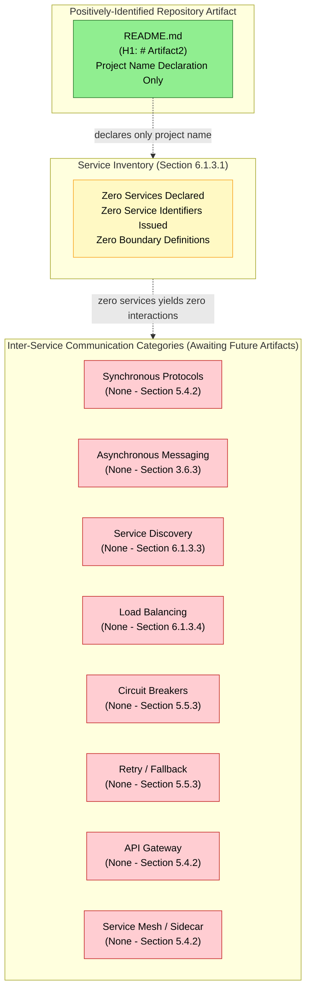

#### 6.1.6.2 Scalability Architecture Diagram (Null-State)

A conventional scalability architecture diagram requires at minimum a defined deployment unit and one elasticity dimension across which the unit may scale. Section 1.3.2 records Physical Deployment Boundary as "Not Yet Defined," Section 5.3.2 records both Horizontal Scaling Strategy and Vertical Scaling Strategy as "None Defined," and Section 2.5.2 records Scalability Considerations as "None Documented." With zero deployment units and zero scaling dimensions, no scalability topology can be drawn.

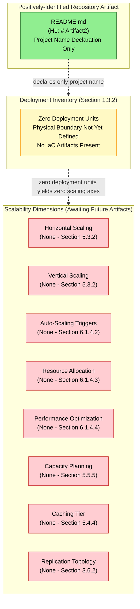

#### 6.1.6.3 Resilience Pattern Implementations Diagram (Null-State)

A conventional resilience pattern diagram requires at minimum one fault-tolerance mechanism and one observability or recovery pathway linked to it. Section 5.5.3 records all thirteen error-handling dimensions as null, Section 5.5.1 records all seven observability dimensions as null, and Section 5.5.6 records all ten disaster recovery dimensions as null. With zero resilience artifacts and zero observability backbones, no resilience flow can be drawn.

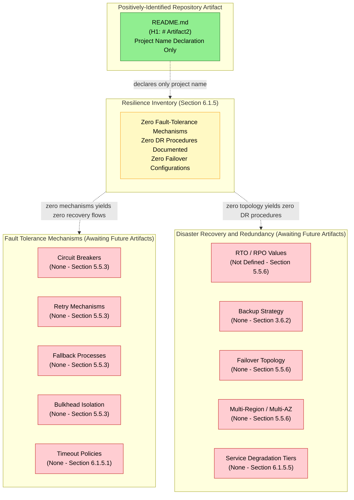

---

### 6.1.7 Assumptions and Constraints

#### 6.1.7.1 Documented Assumptions

The following assumptions are explicitly recorded for this revision of the Core Services Architecture section. Each assumption is forward-looking and does not introduce any fact-claim about the current repository state. The assumption identifier convention `A-6-XXX` is consistent with the conventions established in Sections 2.7.1 (`A-2-XXX`), 3.9.1 (`A-3-XXX`), 4.7.1 (`A-4-XXX`), and 5.7.1 (`A-5-XXX`).

| Assumption ID | Statement |
|---------------|-----------|
| A-6-001 | Subsequent commits will introduce service declarations, container manifests, orchestration configurations, or comparable artifacts from which service boundaries, inter-service communication patterns, service discovery mechanisms, and load balancing strategies can be derived. |
| A-6-002 | When deployment topology declarations (Section 1.3.2 — Physical Deployment Boundary), Infrastructure-as-Code artifacts (Section 3.7), or auto-scaling configurations are introduced in future revisions, this Core Services Architecture section will be re-authored to enumerate horizontal/vertical scaling postures, auto-scaling triggers, resource allocation profiles, and capacity planning targets against the topology then declared. |
| A-6-003 | When resilience-library configurations (circuit breakers, retry policies, bulkhead isolation, fallback handlers) are committed in future revisions, the Resilience Patterns subsection will be re-authored to enumerate the fault-tolerance mechanisms, timeouts, and degradation tiers actually implemented. |
| A-6-004 | When KPIs (Section 1.2.3), performance criteria (Section 2.3.2), and SLA targets are populated in future revisions, the Scalability Design and Resilience Patterns subsections will be authored against the latency, throughput, RTO, RPO, and availability targets then articulated. |
| A-6-005 | When integration parties (Section 1.2.1) and integration contracts (Section 1.3.3) are declared in future revisions, the Service Interaction Diagram (Section 6.1.6.1) will be re-authored as a proper service interaction graph enumerating service participants, communication protocols, and traffic-shaping policies. |
| A-6-006 | When third-party services (Section 3.5) or observability services (Section 3.5.3) are configured in future revisions, the Resilience Pattern Implementations Diagram (Section 6.1.6.3) will be re-authored to depict the actual fault-detection, alerting, and recovery control planes in operation. |
| A-6-007 | Service identifier convention (suggested: `SVC-XXX` for services, `SCL-XXX` for scaling policies, `RES-XXX` for resilience policies) will be formally adopted when the first such artifact is committed; until then, no identifiers in those namespaces are issued. |
| A-6-008 | The Default Technology Stack enumerated in Section 3.1.2 will be re-evaluated against the artifacts committed in future revisions; specific defaults will be accepted, replaced, or supplemented based on the evidence then available, but no default is applied in this revision. |

#### 6.1.7.2 Constraints Bounding This Section

The following constraints bound the present revision of the Core Services Architecture section. These constraints are factual properties of the current repository state, not authoring preferences. The constraint identifier convention `C-6-XXX` is consistent with the conventions established in Sections 2.7.2 (`C-2-XXX`), 3.9.2 (`C-3-XXX`), 4.7.2 (`C-4-XXX`), and 5.7.2 (`C-5-XXX`). This section explicitly inherits the foundational constraints from those upstream sections.

| Constraint ID | Statement |
|---------------|-----------|
| C-6-001 | This section is bound by Constraint C-2-001 (Section 2.7.2): no requirements, and therefore no service components, scalability provisions, or resilience mechanisms derivable from requirements, may be invented or inferred beyond what exists in the repository. |
| C-6-002 | This section is bound by Constraint C-2-002 (Section 2.7.2): the single-level repository hierarchy (root containing `README.md` only) precludes the inference of microservice decomposition, service-tier separation, or distributed-system component layout from any directory structure. |
| C-6-003 | This section is bound by Constraint C-2-003 (Section 2.7.2): the empty Code Graph schema (`{}`) precludes the extraction of services, classes, modules, interfaces, or any other indexable code structures from which a Core Services Architecture could be derived. |
| C-6-004 | This section is bound by Constraint C-3-001 (Section 3.9.2): the Default Technology Stack may not be applied to populate any service component, communication pattern, scalability provision, or resilience mechanism in the absence of repository evidence for those selections. |
| C-6-005 | This section is bound by Constraint C-5-007 (Section 5.7.2): the single-level repository hierarchy precludes the inference of build-system layout, source-tree layout, or deployment-layer separation from which a service decomposition style (monolith, modular monolith, microservices, serverless functions) could be derived. |
| C-6-006 | This section is bound by Constraint C-4-007 (Section 4.7.2) inherited via Constraint C-5-009 (Section 5.7.2): Mermaid service interaction diagrams, scalability topology diagrams, and resilience pattern diagrams require at minimum two service participants and one interaction or transition between them to render meaningfully; with zero of each present in the repository, the corresponding diagrams in Sections 6.1.6.1, 6.1.6.2, and 6.1.6.3 are rendered as null-state `graph TB` visualizations following the validated pattern from Sections 1.2.2, 2.4.1, 3.8.1, 4.6, and 5.6. |
| C-6-007 | This section is bound by Constraint C-4-008 (Section 4.7.2) inherited via Constraint C-5-010 (Section 5.7.2): no SLA values, latency targets, throughput goals, RTO/RPO values, capacity planning targets, auto-scaling threshold values, or any timing/performance constraints may be articulated absent direct evidence in the repository (Section 1.2.3 — all KPI categories "Not Defined"; Section 2.3.2 — "Performance Criteria: Not Specified"). |
| C-6-008 | This section is bound by Constraint C-3-004 (Section 3.9.2) inherited via Constraint C-5-008 (Section 5.7.2): no version numbers, vendor identifiers (e.g., AWS service names, specific message broker products, named load balancers), or specific service endpoints may be specified absent direct evidence in the repository. |
| C-6-009 | The Service Components, Scalability Design, and Resilience Patterns subsections prescribed by the section prompt are rendered with all dimensions in their verified null state ("None Configured," "None Defined," "None Documented," or "Not Determined"); the prompt's required dimensional structure is preserved as schema for future revisions. |

---

### 6.1.8 Re-Authoring Triggers and Version Tracking

#### 6.1.8.1 Diagram Re-Authoring Trigger Table

Each of the three null-state diagrams in Section 6.1.6 will be re-authored in future revisions when the corresponding upstream null state is broken. The triggers below align with the trigger pattern established in Sections 4.6.6 and 5.6.7.

| Diagram | Re-Authoring Trigger |
|---------|----------------------|
| 6.1.6.1 Service Interaction Diagram | First service declaration, container manifest, API contract, or message contract committed |
| 6.1.6.2 Scalability Architecture Diagram | First deployment topology declaration, IaC artifact, container orchestration manifest, or auto-scaling configuration committed |
| 6.1.6.3 Resilience Pattern Diagram | First retry policy, circuit breaker, bulkhead isolation, fallback handler, failover topology, or disaster recovery configuration committed |

#### 6.1.8.2 Re-Evaluation Trigger and Version Tracking

| Version Tracking Field | Current State |
|------------------------|---------------|
| Specification Revision | Initial baseline revision (consistent with Sections 2.7.3, 3.9.3, 4.7.3, and 5.7.3) |
| Corresponding Repository State | Single "Initial commit" recorded in git history (Section 1.4.3) |
| Number of Services Declared | 0 |
| Number of Inter-Service Communication Patterns | 0 |
| Number of Service Discovery Mechanisms | 0 |
| Number of Load Balancing Configurations | 0 |
| Number of Circuit Breaker Configurations | 0 |
| Number of Retry / Fallback Mechanisms | 0 |
| Number of Defined Horizontal Scaling Policies | 0 |
| Number of Defined Vertical Scaling Policies | 0 |
| Number of Auto-Scaling Trigger Rules | 0 |
| Number of Documented Resource Allocation Profiles | 0 |
| Number of Documented Performance Optimization Techniques | 0 |
| Number of Documented Capacity Planning Targets | 0 |
| Number of Fault Tolerance Mechanisms | 0 |
| Number of Documented Disaster Recovery Procedures | 0 |
| Number of Defined Data Redundancy Configurations | 0 |
| Number of Defined Failover Configurations | 0 |
| Number of Defined Service Degradation Policies | 0 |
| Diagrams Rendered as Null-State | 3 (Sections 6.1.6.1, 6.1.6.2, and 6.1.6.3) |
| Diagrams Using `graph TB` Pattern per C-6-006 | 3 (all three required diagrams) |
| Constraints Explicitly Inherited from Prior Sections | C-2-001 through C-2-004; C-3-001 and C-3-004; C-4-007 and C-4-008; C-5-007 through C-5-010 |
| Next Re-Evaluation Trigger | Introduction of any of: a service declaration, a container manifest, an orchestration configuration, an API/message contract, an IaC artifact, an auto-scaling rule, a circuit breaker / retry / fallback configuration, a failover topology declaration, a backup/restore policy, an RTO/RPO articulation, or any deployment-topology positive definition |

All future revisions of this section should re-evaluate every subsection against newly committed artifacts. When the re-evaluation trigger is satisfied, the corresponding subsection should transition from "None Configured" / "None Defined" / "None Documented" / "Not Determined" to a populated state that enumerates the actually-committed services, scalability provisions, and resilience mechanisms as prescribed by the section prompt. The three null-state diagrams in Section 6.1.6 should likewise transition to populated service interaction, scalability architecture, and resilience pattern diagrams that accurately depict the implemented Core Services Architecture.

---

### 6.1.9 References

#### 6.1.9.1 Repository Artifacts Examined

- `README.md` — Sole positively-identifiable artifact in the repository; entire content consists of a single H1 heading (`# Artifact2`) declaring the project name. Provides the evidentiary anchor for the null-state determination across all subsections of 6.1.
- `/` (repository root, depth 0) — Single-level hierarchy confirmed; `README.md` is the only first-order child. No subdirectories, no source folders, no configuration manifests, no build directories, and no implementation files are present.

#### 6.1.9.2 Technical Specification Sections Cross-Referenced

- **Section 1.1 — Executive Summary** — Establishes the documentation-only placeholder status of Artifact2 and the empty Code Graph schema (`{}`); anchors the no-projection authoring discipline applied in Section 6.1.
- **Section 1.2 — System Overview** — Provides the Integration Landscape table (all four dimensions "None Declared") and the Major System Components diagram (sole positive artifact: `README.md`); also records the absence of architectural style inferability and KPI definition.
- **Section 1.3 — Scope** — Documents the System Boundaries table (Physical Deployment, Trust and Security, and Data Ownership boundaries all "Not Yet Defined") and the explicit absence of API Contracts.
- **Section 2.5 — Implementation Considerations** — Records Scalability Considerations and Resource Requirements as "None Documented"; provides anchoring evidence for Section 6.1.4.
- **Section 2.7 — Assumptions, Constraints, and Versioning** — Establishes Constraints C-2-001 through C-2-004 (inherited by Section 6.1) and the `A-2-XXX` / `C-2-XXX` identifier conventions.
- **Section 3.1 — Technology Stack Baseline Statement** — Confirms the Default Technology Stack is "Not Applied" per Constraint C-2-001; precludes the application of AWS, Docker, Terraform, MongoDB, etc. to any subsection of 6.1.
- **Section 3.5 — Third-Party Services** — Records all cloud, observability, auth, monitoring, and tracing services as "None Configured"; anchors Sections 6.1.3.3, 6.1.3.4, 6.1.4.4, and 6.1.5.5.
- **Section 3.6 — Databases & Storage** — Records all 8 database categories and all 9 caching/storage categories as "None Configured"; anchors Sections 6.1.4.4 and 6.1.5.3.
- **Section 3.7 — Development & Deployment** — Records all IaC, container, and orchestration artifacts as "None Present"; anchors the deployment-topology dependent subsections of Section 6.1.4.
- **Section 3.9 — Assumptions, Constraints, and Versioning (Technology Stack)** — Establishes Constraints C-3-001 through C-3-004 (inherited by Section 6.1).
- **Section 4.5 — Technical Implementation State** — Records all 13 error-handling dimensions and 12 state-management dimensions as null; anchors Sections 6.1.3.5, 6.1.3.6, 6.1.5.1, and 6.1.5.5.
- **Section 4.7 — Assumptions, Constraints, and Versioning (Process Flowchart)** — Establishes Constraints C-4-007 (null-state Mermaid pattern) and C-4-008 (no SLA/timing values without evidence), both inherited by Section 6.1.
- **Section 5.1 — System Architecture Baseline Statement** — Provides the validated three-tier applicability determination template adopted by Section 6.1.2.2.
- **Section 5.2 — High-Level Architecture** — Provides the zero-row Core Components Table and External Integration Points Table; anchors Section 6.1.3.1's service-boundary cardinality derivation.
- **Section 5.3 — Component Details** — Records Horizontal Scaling Strategy, Vertical Scaling Strategy, Replication Topology, and Stateless/Stateful Classification as null; anchors Section 6.1.4.1.
- **Section 5.4 — Technical Decisions** — Records all seven communication pattern dimensions (Service Mesh, API Gateway, IPC, etc.) as null; anchors Section 6.1.3.2.
- **Section 5.5 — Cross-Cutting Concerns** — Records all 13 error-handling dimensions, all 11 performance/SLA dimensions, and all 10 disaster recovery dimensions as null; anchors Sections 6.1.3.5, 6.1.3.6, 6.1.4.5, and the entirety of Section 6.1.5.
- **Section 5.6 — Required Diagrams (Null-State Mermaid Visualizations)** — Establishes the validated three-subgraph null-state Mermaid pattern with color coding (`#90EE90` green for evidentiary anchor, `#FFF9C4` yellow for category inventory, `#FFCDD2` red for absent components) replicated in Section 6.1.6.
- **Section 5.7 — Assumptions, Constraints, and Versioning (System Architecture)** — Establishes Constraints C-5-001 through C-5-012 (inherited by Section 6.1) and the `A-5-XXX` / `C-5-XXX` identifier conventions extended to `A-6-XXX` / `C-6-XXX` in Section 6.1.7.

## 6.2 Database Design

### 6.2.1 Applicability Statement

**Database Design is not applicable for this system in the current revision.**

Direct inspection of the **Artifact2** repository confirms that no database engines, schema definitions, entity-relationship models, data dictionaries, migration scripts, ORM configurations, query builders, persistence layers, caching tiers, storage services, replication topologies, backup policies, or any other database design artifacts of any kind have been committed at the time of this revision. The sole positively-identifiable artifact in the repository is `README.md`, whose entire content is a single H1 heading declaring the project name (`# Artifact2`). The Code Graph schema for the repository is recorded as an empty object (`{}`) per Section 1.1.1 — Project Overview, confirming the absence of indexable code structures from which entity models, schemas, or persistence configurations could be derived.

This section is authored under the same evidence-strict reporting standard established in Section 1.1 — Executive Summary, Section 2.1 — Requirements Baseline Statement, Section 3.1 — Technology Stack Baseline Statement, Section 4.1 — Process Flowchart Baseline Statement, Section 5.1 — System Architecture Baseline Statement, and reinforced by the immediately-preceding Section 6.1 — Core Services Architecture. The Default Technology Stack identified in Section 3.1.2 — which prescribes **MongoDB** as the database engine alongside other defaults (AWS, Docker, Terraform, GitHub Actions, Python with Flask, Auth0, Langchain, React with TypeScript, TailwindCSS, React-Native, Swift, Kotlin, Objective-C, and ElectronJS) — is **explicitly not applied** to populate any schema, persistence configuration, caching layer, or replication topology documented in this section. Application of MongoDB or any default storage technology in the absence of corroborating repository evidence would constitute fabrication and would violate Constraint C-2-001 (Section 2.7.2) as inherited via Constraint C-6-004 (Section 6.1.7.2).

#### 6.2.1.1 Repository Evidence Summary

The applicability determination is anchored to the following verified properties of the repository:

| Evidentiary Anchor | Verified State | Source Section |
|--------------------|----------------|----------------|
| Repository Hierarchy | Single-level (root contains `README.md` only) | Section 1.3.3 |
| Code Graph Schema | Empty object (`{}`) | Section 1.1.1 |
| Database Engines Configured | Zero across all 8 categories | Section 3.6.1 |
| Persistence Strategy Dimensions Defined | Zero across all 10 dimensions | Section 3.6.2 |
| Caching and Storage Services Configured | Zero across all 9 categories | Section 3.6.3 |
| Data Domain Model | None Defined | Section 3.6.2 |
| Entity-Relationship Definition | None Defined | Section 3.6.2 |
| Schema / DDL Files Present | None | Section 3.6.2 |
| Migration Framework | None Configured | Section 3.6.2 |
| ORM / Query Builder | None Configured | Section 3.6.2 |
| Data Ownership Boundary | Not Yet Defined | Section 1.3.2 |

#### 6.2.1.2 Why Database Design is Not Applicable

The Database Design section prompt prescribes documentation across four principal domains — Schema Design, Data Management, Compliance Considerations, and Performance Optimization — plus three required Mermaid diagrams (Database Schema / ERD, Data Flow, Replication Architecture). Each domain presupposes the existence of at least one configured database engine, one defined entity, or one persistence configuration from which the prescribed analysis can be conducted. The repository in its current state provides none of these preconditions, as established in:

- **Section 3.6.1** — All eight database categories (Relational/SQL, Document, Key-Value, Graph, Time-Series, Search Index, Vector, Embedded) are recorded as "None Configured" with anchoring evidence to Sections 1.3.2 and 1.3.3
- **Section 3.6.2** — All ten persistence strategy dimensions (Data Domain Model, Entity-Relationship Definition, Schema/DDL Files, Migration Framework, ORM/Query Builder, Transaction Boundary Policy, Replication/Sharding Topology, Backup and Restore Policy, Data Retention Policy, Data Ownership Boundary) are recorded as "None Defined," "None Present," "None Configured," or "Not Yet Defined"
- **Section 3.6.3** — All nine caching and storage service categories (In-Process Cache, Distributed Cache, HTTP Response/Reverse Proxy Cache, Object Storage, Block Storage Volume, File Storage Service, Archival/Cold Storage Tier, Message Queue/Event Stream, Static Asset Hosting) are recorded as "None Configured"
- **Section 5.4.3** — All seven Data Storage Decision dimensions (Database Engine Selection, Polyglot Persistence Strategy, Selection Rationale, Consistency Model, Backup and Restore Policy, Data Retention Policy, Schema Evolution/Migration Strategy) are recorded as "None Configured," "None Defined," "Not Articulated," or "None Determined"
- **Section 5.4.4** — All seven Caching Strategy dimensions (Cache Tier Architecture, In-Process Cache, Distributed Cache, HTTP Response/Reverse Proxy Cache, Cache Invalidation Policy, Cache Coherence Model, Cache Warming Strategy) are recorded as "None Configured" or "None Defined"
- **Section 5.5.6** — All ten Disaster Recovery dimensions (RTO, RPO, Backup Strategy, Restore Procedure, Failover Topology, Multi-Region/Multi-AZ Strategy, DR Drill Cadence, Runbook/Playbook Inventory, Incident Response Process, Business Continuity Plan) are recorded as "Not Defined," "None Defined," "None Documented," or "None Established"
- **Section 1.3.3** — "Database and Persistence" is explicitly enumerated as one of the absent artifact categories with the rationale "No schemas, migrations, or persistence configuration"
- **Section 1.3.2** — Records: "No data domains, entity models, schema definitions, or data dictionaries are present in the repository. No database migrations, ORM definitions, message contracts, or data exchange specifications have been declared."

Consequently, this section documents the **verified null baseline state** of the Database Design rather than enumerating fabricated schemas, entities, indexes, partitioning schemes, caching policies, or compliance controls. By the principles established in Sections 1.1.4, 2.1.3, 3.1.3, 4.1.3, 5.1.3, and 6.1.1, the invention of even illustrative entity-relationship diagrams, hypothetical indexes, or representative backup policies at this stage would constitute unsupported speculation and is therefore avoided.

---

### 6.2.2 Authoring Standard and Section Structure

#### 6.2.2.1 Authoring Discipline

All entries in this section conform to the documentation discipline established in Section 1.1.4 (no projection beyond evidence), Section 2.1.3 (no fabricated requirements), Section 3.1.3 (no fabricated technology selections), Section 4.1.3 (no fabricated processes), Section 5.1.3 (no fabricated architecture components), and Section 6.1.2.1 (no fabricated service or scalability artifacts). Each subsection enumerates a domain prescribed by the Database Design section prompt and records the verified absence of evidence for that domain, anchored to specific cross-referenced Technical Specification sections.

#### 6.2.2.2 Applicability Determination Matrix

The following table maps each subsection mandated by the Database Design section prompt to its applicability against the current repository state. Each "Not Applicable" determination is anchored to verified absence rather than incomplete investigation.

| Prompt-Required Domain | Applicability | Anchoring Evidence |
|------------------------|---------------|--------------------|
| Schema Design — Entity Relationships | Not Applicable — zero entities defined | Section 3.6.2 |
| Schema Design — Data Models and Structures | Not Applicable — no data domain model | Section 1.3.2; Section 3.6.2 |
| Schema Design — Indexing Strategy | Not Applicable — no databases configured | Section 3.6.1 |
| Schema Design — Partitioning Approach | Not Applicable — no replication/sharding topology | Section 3.6.2 |
| Schema Design — Replication Configuration | Not Applicable — no replication topology | Section 3.6.2; Section 5.3.2 |
| Schema Design — Backup Architecture | Not Applicable — no backup policy | Section 3.6.2; Section 5.5.6 |
| Data Management — Migration Procedures | Not Applicable — no migration framework | Section 3.6.2; Section 1.3.3 |
| Data Management — Versioning Strategy | Not Applicable — no schema evolution strategy | Section 5.4.3 |
| Data Management — Archival Policies | Not Applicable — no archival tier configured | Section 3.6.3 |
| Data Management — Storage and Retrieval Mechanisms | Not Applicable — no databases configured | Section 3.6.1 |
| Data Management — Caching Policies | Not Applicable — no caching layer configured | Section 3.6.3; Section 5.4.4 |
| Compliance — Data Retention Rules | Not Applicable — no retention policy | Section 3.6.2 |
| Compliance — Backup and Fault Tolerance | Not Applicable — no backup or DR policy | Section 3.6.2; Section 5.5.6 |
| Compliance — Privacy Controls | Not Applicable — no trust/security boundary | Section 1.3.2; Section 5.4.5 |
| Compliance — Audit Mechanisms | Not Applicable — no audit logging configured | Section 5.5.2 |
| Compliance — Access Controls | Not Applicable — no RBAC/ABAC defined | Section 3.5.2; Section 5.4.5 |
| Performance — Query Optimization | Not Applicable — no queries to optimize | Section 6.1.4.4 |
| Performance — Caching Strategy | Not Applicable — no cache tier architecture | Section 5.4.4 |
| Performance — Connection Pooling | Not Applicable — no persistence layer | Section 6.1.4.4 |
| Performance — Read/Write Splitting | Not Applicable — no replication topology | Section 3.6.2 |
| Performance — Batch Processing Approach | Not Applicable — no ETL/pipeline artifacts | Section 4.2.2 |
| Database Schema Diagram (ERD) | Null-State Visualization Required | Section 5.6.2 pattern |
| Data Flow Diagram | Null-State Visualization Required | Section 5.6 pattern |
| Replication Architecture Diagram | Null-State Visualization Required | Section 5.6 pattern |

---

### 6.2.3 Schema Design State

The Database Design section prompt for Schema Design mandates documentation of six dimensions: entity relationships, data models and structures, indexing strategy, partitioning approach, replication configuration, and backup architecture. Each dimension is recorded below with anchoring evidence to its verified null state.

#### 6.2.3.1 Entity Relationships

| Entity Relationship Dimension | Current State | Anchoring Evidence |
|-------------------------------|---------------|--------------------|
| Defined Entities | Zero | Section 3.6.2 — Data Domain Model "None Defined" |
| Entity-Relationship Definition | None Defined | Section 3.6.2 |
| Cardinality Specifications (1:1, 1:N, M:N) | None Defined | Section 1.3.2 — no entity models present |
| Foreign Key Constraints | None Defined | Section 3.6.1 — all 8 DB categories "None Configured" |
| Aggregate Root Definitions | None Defined | Section 2.2.1 — Feature Catalog: 0 entries |
| Bounded Context Boundaries | None Defined | Section 1.3.2 — Data Ownership Boundary "Not Yet Defined" |

The cardinality derivation is: **0 entities × N relationship dimensions = 0 entity-relationship definitions**. Section 1.3.2 records that "no data domains, entity models, schema definitions, or data dictionaries are present in the repository," precluding the imputation of any conceptual, logical, or physical data model from any directory layout (Constraint C-6-002 inherited from C-2-002).

#### 6.2.3.2 Data Models and Structures

| Data Model Dimension | Current State | Anchoring Evidence |
|----------------------|---------------|--------------------|
| Conceptual Data Model | None Defined | Section 3.6.2 — Data Domain Model "None Defined" |
| Logical Data Model | None Defined | Section 3.6.2 |
| Physical Data Model | None Defined | Section 3.6.1 — all 8 DB categories "None Configured" |
| Schema / DDL Files | None Present | Section 3.6.2; Section 1.3.3 |
| Data Type Conventions | Not Established | Section 2.7.1 — identifier conventions not yet adopted |
| Normalization Strategy (1NF/2NF/3NF/BCNF) | None Determined | Section 5.4.3 — no Selection Rationale articulated |

No conceptual, logical, or physical data model has been authored. No DDL files (CREATE TABLE, ALTER TABLE, CREATE INDEX), no JSON Schema files, no Avro/Protobuf schemas, no GraphQL type definitions, and no ORM entity class declarations exist in the repository.

#### 6.2.3.3 Indexing Strategy

| Indexing Dimension | Current State | Anchoring Evidence |
|--------------------|---------------|--------------------|
| Primary Key Indexes | None Defined | Section 3.6.1 — all 8 DB categories "None Configured" |
| Secondary / Composite Indexes | None Defined | Section 3.6.1 |
| Full-Text Search Indexes | None Configured | Section 3.6.1 — Search Index Backend "None Configured" |
| Vector / Embedding Indexes | None Configured | Section 3.6.1 — Vector Database "None Configured" |
| Index Maintenance Policy | Not Established | Section 5.4.3 — no Schema Evolution Strategy |
| Query-to-Index Coverage Map | None Defined | Section 6.1.4.4 — Database Query Optimization "None Defined" |

With zero database engines configured and zero queries authored, no indexing strategy is observable. Per Constraint C-6-008 (Section 6.1.7.2), no specific index-type vendor identifiers (e.g., B-Tree, Hash, GIN, GIST, HNSW) may be specified absent direct evidence.

#### 6.2.3.4 Partitioning Approach

| Partitioning Dimension | Current State | Anchoring Evidence |
|------------------------|---------------|--------------------|
| Horizontal Partitioning (Sharding) | None Defined | Section 3.6.2 — Replication/Sharding Topology "None Defined" |
| Vertical Partitioning | None Defined | Section 3.6.2 |
| Shard Key Selection | None Determined | Section 3.6.2 — no data model from which to derive |
| Partition Pruning Strategy | None Defined | Section 5.3.2 — Replication Topology "None Defined" |
| Tenant Isolation Model (single/multi-tenant) | None Determined | Section 1.3.2 — Data Ownership Boundary "Not Yet Defined" |

Per Constraint C-6-005 (Section 6.1.7.2) inherited from C-5-007, the single-level repository hierarchy precludes the inference of any partitioning strategy from directory structure.

#### 6.2.3.5 Replication Configuration

| Replication Dimension | Current State | Anchoring Evidence |
|-----------------------|---------------|--------------------|
| Replication Topology | None Defined | Section 3.6.2; Section 5.3.2 |
| Primary / Secondary Role Definitions | None Defined | Section 3.6.2 |
| Replication Mode (Synchronous / Asynchronous) | None Determined | Section 5.4.3 — Consistency Model "None Determined" |
| Replication Lag SLA | Not Defined | Section 5.5.5 — no SLA values articulated |
| Cross-Region Replication | None Configured | Section 1.3.2 — no geographic deployment regions |
| Read Replica Count | None Configured | Section 3.6.1 — all 8 DB categories "None Configured" |

Per Constraint C-6-007 (Section 6.1.7.2) inherited from C-4-008, no replication-lag SLA, RPO target, or replica-count target may be articulated absent direct evidence.

#### 6.2.3.6 Backup Architecture

| Backup Architecture Dimension | Current State | Anchoring Evidence |
|-------------------------------|---------------|--------------------|
| Backup Strategy | None Defined | Section 3.6.2; Section 5.5.6 |
| Backup Type (Full / Incremental / Differential) | None Determined | Section 5.4.3 — Backup and Restore Policy "None Defined" |
| Backup Frequency / Schedule | Not Defined | Section 5.5.6 — Backup Strategy "None Defined" |
| Backup Destination (local / object storage / cold) | None Configured | Section 3.6.3 — Archival/Cold Storage "None Configured" |
| Backup Encryption Policy | None Defined | Section 5.4.5 — Encryption at Rest "None Configured" |
| Point-in-Time Recovery (PITR) Configuration | None Configured | Section 5.5.6 — Restore Procedure "None Documented" |

---

### 6.2.4 Data Management State

The Database Design section prompt for Data Management mandates documentation of five dimensions: migration procedures, versioning strategy, archival policies, data storage and retrieval mechanisms, and caching policies. Each dimension is recorded below with anchoring evidence to its verified null state.

#### 6.2.4.1 Migration Procedures

| Migration Dimension | Current State | Anchoring Evidence |
|---------------------|---------------|--------------------|
| Migration Framework (e.g., Alembic, Flyway, Liquibase) | None Configured | Section 3.6.2 |
| Migration Script Inventory | Zero | Section 1.3.3 — no migrations present |
| Migration Numbering Convention | Not Adopted | Section 2.7.1 — identifier conventions not yet adopted |
| Forward / Backward Migration Support | None Defined | Section 5.4.3 — Schema Evolution Strategy "None Defined" |
| Migration Execution Pipeline | None Configured | Section 3.7 — no CI/CD artifacts present |
| Migration Verification / Smoke-Test Process | None Defined | Section 1.3.3 — Test Suites explicitly absent |

#### 6.2.4.2 Versioning Strategy

| Versioning Dimension | Current State | Anchoring Evidence |
|----------------------|---------------|--------------------|
| Schema Versioning Approach | None Defined | Section 5.4.3 — Schema Evolution/Migration Strategy "None Defined" |
| Schema Compatibility Policy (Backward/Forward) | None Defined | Section 5.4.3 |
| Schema Registry | None Configured | Section 3.5.3 — no third-party services configured |
| Data Format Versioning | Not Established | Section 1.3.3 — no data exchange specifications |
| Breaking Change Communication Protocol | None Defined | Section 1.2.1 — no Downstream Consumers declared |

#### 6.2.4.3 Archival Policies

| Archival Dimension | Current State | Anchoring Evidence |
|--------------------|---------------|--------------------|
| Archival / Cold Storage Tier | None Configured | Section 3.6.3 |
| Archival Trigger Criteria (age / size / event) | None Defined | Section 3.6.2 — Data Retention Policy "None Defined" |
| Archive Storage Destination | None Configured | Section 3.6.3 — Object Storage "None Configured" |
| Archive Retrieval Service-Level Expectation | Not Defined | Section 5.5.5 — no SLA values articulated |
| Archive Deletion / Purge Policy | None Defined | Section 3.6.2 — Data Retention Policy "None Defined" |

#### 6.2.4.4 Data Storage and Retrieval Mechanisms

| Storage / Retrieval Dimension | Current State | Anchoring Evidence |
|-------------------------------|---------------|--------------------|
| Relational (SQL) Storage | None Configured | Section 3.6.1 |
| Document Storage | None Configured | Section 3.6.1 |
| Key-Value Storage | None Configured | Section 3.6.1 |
| Graph Storage | None Configured | Section 3.6.1 |
| Time-Series Storage | None Configured | Section 3.6.1 |
| Search Index Backend | None Configured | Section 3.6.1 |
| Vector Storage | None Configured | Section 3.6.1 |
| Embedded Database | None Configured | Section 3.6.1 |
| Object Storage | None Configured | Section 3.6.3 |
| Block Storage Volume | None Configured | Section 3.6.3 |
| File Storage Service | None Configured | Section 3.6.3 |
| ORM / Query Builder | None Configured | Section 3.6.2 |
| Repository / Data-Access Pattern | None Defined | Section 5.2.2 — zero internal components |

#### 6.2.4.5 Caching Policies

| Caching Policy Dimension | Current State | Anchoring Evidence |
|--------------------------|---------------|--------------------|
| Cache Tier Architecture | None Configured | Section 5.4.4; Section 3.6.3 |
| In-Process Cache | None Configured | Section 3.6.3 |
| Distributed Cache (e.g., Redis, Memcached) | None Configured | Section 3.6.3 |
| HTTP Response / Reverse Proxy Cache | None Configured | Section 3.6.3 |
| Cache Invalidation Policy | None Defined | Section 5.4.4; Section 4.5.1 |
| Cache Coherence Model | None Defined | Section 5.4.4 |
| Cache Warming Strategy | None Defined | Section 5.4.4 |
| Cache TTL / Eviction Policy | None Defined | Section 4.5.1 — Cache Tiers "None Configured" |

---

### 6.2.5 Compliance Considerations State

The Database Design section prompt for Compliance Considerations mandates documentation of five dimensions: data retention rules, backup and fault tolerance policies, privacy controls, audit mechanisms, and access controls. Each dimension is recorded below with anchoring evidence to its verified null state.

#### 6.2.5.1 Data Retention Rules

| Data Retention Dimension | Current State | Anchoring Evidence |
|--------------------------|---------------|--------------------|
| Data Retention Policy | None Defined | Section 3.6.2 |
| Retention Period by Data Class | None Defined | Section 3.6.2 — Data Domain Model "None Defined" |
| Regulatory Retention Mapping (e.g., GDPR, HIPAA, SOX) | None Defined | Section 1.3.2 — no jurisdictional considerations |
| Retention Enforcement Mechanism | None Configured | Section 3.6.1 — all 8 DB categories "None Configured" |
| Right-to-be-Forgotten / Erasure Workflow | None Defined | Section 4.2.2 — no workflow definitions present |

Per Constraint C-6-007 (Section 6.1.7.2) inherited from C-4-008, no retention durations, regulatory mappings, or compliance SLAs may be articulated absent direct evidence in the repository.

#### 6.2.5.2 Backup and Fault Tolerance Policies

| Backup / FT Dimension | Current State | Anchoring Evidence |
|-----------------------|---------------|--------------------|
| Backup Strategy | None Defined | Section 5.5.6; Section 3.6.2 |
| Restore Procedure | None Documented | Section 5.5.6 |
| Recovery Time Objective (RTO) | Not Defined | Section 5.5.6 |
| Recovery Point Objective (RPO) | Not Defined | Section 5.5.6 |
| Backup Retention Period | Not Defined | Section 3.6.2 |
| Failover Topology | None Defined | Section 5.5.6 |
| Multi-Region / Multi-AZ Strategy | None Defined | Section 5.5.6 |
| DR Drill Cadence | None Established | Section 5.5.6 |

#### 6.2.5.3 Privacy Controls

| Privacy Control Dimension | Current State | Anchoring Evidence |
|---------------------------|---------------|--------------------|
| Personally Identifiable Information (PII) Classification | None Defined | Section 1.3.2 — no data domains |
| Field-Level Encryption | None Configured | Section 5.4.5 — Encryption at Rest "None Configured" |
| Data Masking / Tokenization | None Configured | Section 5.4.5 |
| Pseudonymization / Anonymization | None Configured | Section 5.4.5 |
| Consent Management | None Defined | Section 5.4.5 — no security mechanisms configured |
| Trust and Security Boundary | Not Yet Defined | Section 1.3.2 |

#### 6.2.5.4 Audit Mechanisms

| Audit Mechanism Dimension | Current State | Anchoring Evidence |
|---------------------------|---------------|--------------------|
| Audit Log Trail | None Configured | Section 5.5.2 |
| Change Data Capture (CDC) | None Configured | Section 3.6.3 — Message Queue/Event Stream "None Configured" |
| Data Access Logging | None Configured | Section 5.5.1 — Log Aggregation Service "None Configured" |
| Tamper-Evident Audit Storage | None Configured | Section 3.6.3 — Archival/Cold Storage "None Configured" |
| Audit Retention Period | Not Defined | Section 3.6.2 — Data Retention Policy "None Defined" |
| Audit Review Process | None Defined | Section 5.5.6 — Incident Response Process "None Documented" |

#### 6.2.5.5 Access Controls

| Access Control Dimension | Current State | Anchoring Evidence |
|--------------------------|---------------|--------------------|
| Role-Based Access Control (RBAC) Policy | None Defined | Section 3.5.2; Section 5.4.5 |
| Attribute-Based Access Control (ABAC) Policy | None Defined | Section 3.5.2; Section 5.4.5 |
| Database User / Role Inventory | Zero | Section 3.6.1 — all 8 DB categories "None Configured" |
| Connection-Level Authentication | None Configured | Section 5.4.5 — Identity Provider "None Configured" |
| Row-Level / Column-Level Security | None Configured | Section 5.4.5 — no security mechanisms |
| Secret Management for Connection Strings | None Defined | Section 5.4.5 — Secret Management Strategy "None Defined" |

---

### 6.2.6 Performance Optimization State

The Database Design section prompt for Performance Optimization mandates documentation of five dimensions: query optimization patterns, caching strategy, connection pooling, read/write splitting, and batch processing approach. Each dimension is recorded below with anchoring evidence to its verified null state.

#### 6.2.6.1 Query Optimization Patterns

| Query Optimization Dimension | Current State | Anchoring Evidence |
|------------------------------|---------------|--------------------|
| Database Query Optimization | None Defined | Section 6.1.4.4 |
| Query Plan Analysis Process | None Established | Section 1.2.2 — no design documents |
| Slow Query Logging | None Configured | Section 5.5.1 — Log Aggregation Service "None Configured" |
| Materialized Views | None Defined | Section 3.6.1 — all 8 DB categories "None Configured" |
| Denormalization Strategy | None Defined | Section 5.4.3 — no Selection Rationale articulated |
| Prepared Statement / Parameterization Policy | None Defined | Section 3.6.2 — ORM/Query Builder "None Configured" |

#### 6.2.6.2 Caching Strategy

| Caching Strategy Dimension | Current State | Anchoring Evidence |
|----------------------------|---------------|--------------------|
| Cache Tier Architecture | None Configured | Section 5.4.4 |
| Cache-Aside / Read-Through / Write-Through Pattern | None Selected | Section 5.4.4 — Cache Coherence Model "None Defined" |
| Cache Warming Strategy | None Defined | Section 5.4.4 |
| Cache Hit / Miss Telemetry | None Configured | Section 5.5.1 — Metrics Backend "None Configured" |
| Eviction Policy (LRU/LFU/TTL) | None Defined | Section 4.5.1 — Cache Tiers "None Configured" |

#### 6.2.6.3 Connection Pooling

| Connection Pooling Dimension | Current State | Anchoring Evidence |
|------------------------------|---------------|--------------------|
| Connection Pooling Strategy | None Configured | Section 6.1.4.4 |
| Pool Size Configuration (min/max) | Not Defined | Section 2.5.1 — Resource Requirements "None Documented" |
| Connection Lifetime / Idle Timeout | Not Defined | Section 5.5.5 — no SLA values |
| Connection Validation / Health-Check Policy | None Configured | Section 5.5.1 — Health Check Endpoints "None Defined" |
| Connection Pool Telemetry | None Configured | Section 5.5.1 — Metrics Backend "None Configured" |

#### 6.2.6.4 Read/Write Splitting

| Read/Write Splitting Dimension | Current State | Anchoring Evidence |
|--------------------------------|---------------|--------------------|
| Read Replica Topology | None Defined | Section 3.6.2 — Replication/Sharding Topology "None Defined" |
| Read/Write Routing Policy | None Defined | Section 5.4.2 — Communication Patterns "None Configured" |
| Read-After-Write Consistency Policy | None Defined | Section 5.4.3 — Consistency Model "None Determined" |
| Replica Lag-Aware Routing | None Configured | Section 3.6.2 — Replication Topology "None Defined" |
| CQRS / Read Model Materialization | None Defined | Section 4.5.1 — Event Sourcing/CQRS "None Defined" |

#### 6.2.6.5 Batch Processing Approach

| Batch Processing Dimension | Current State | Anchoring Evidence |
|----------------------------|---------------|--------------------|
| Batch Processing Framework | None Configured | Section 3.3.1 — all framework categories "None Declared" |
| File Transfer / ETL Pipelines | None Configured | Section 4.2.2 |
| Bulk Insert / Bulk Update Policy | None Defined | Section 3.6.1 — all 8 DB categories "None Configured" |
| Job Scheduling Mechanism | None Configured | Section 3.7 — no scheduling artifacts present |
| Batch Window / Throughput Target | Not Defined | Section 5.5.5 — no throughput targets |
| Stream Processing Backbone | None Configured | Section 3.6.3 — Message Queue/Event Stream "None Configured" |

---

### 6.2.7 Required Diagrams — Null-State Mermaid Visualizations

The Database Design section prompt mandates three Mermaid.js diagrams: a Database Schema Diagram (ERD), a Data Flow Diagram, and a Replication Architecture Diagram. In conformance with the documentation discipline established in Section 1.1.4 (no projections beyond evidence) and the validated Mermaid null-state pattern from Sections 1.2.2, 2.4.1, 3.8.1, 4.6, 5.6, and 6.1.6, each diagram is rendered as a null-state visualization using the `graph TB` pattern per Constraint C-6-006 (inherited from C-4-007 of Section 4.7.2 via C-5-009 of Section 5.7.2).

Each diagram presents three groupings: the single positively-identified repository artifact (green, anchoring `README.md`), the category-specific inventory showing zero items (yellow), and the verified-absent components in the relevant category (red). Each absent component cites the upstream Technical Specification section that corroborates its absence.

#### 6.2.7.1 Database Schema Diagram (Null-State ERD)

A conventional Mermaid `erDiagram` requires at minimum two distinct entities and one relationship between them. Section 3.6.2 records "Data Domain Model: None Defined" and "Entity-Relationship Definition: None Defined." Section 3.6.1 records all eight database categories as "None Configured" (precluding the existence of any tables, collections, nodes, or key spaces in which entities could reside). With zero defined entities and zero relationships, no valid ERD can be authored. The following null-state visualization represents the verified absence of the components required for any Database Schema Diagram.

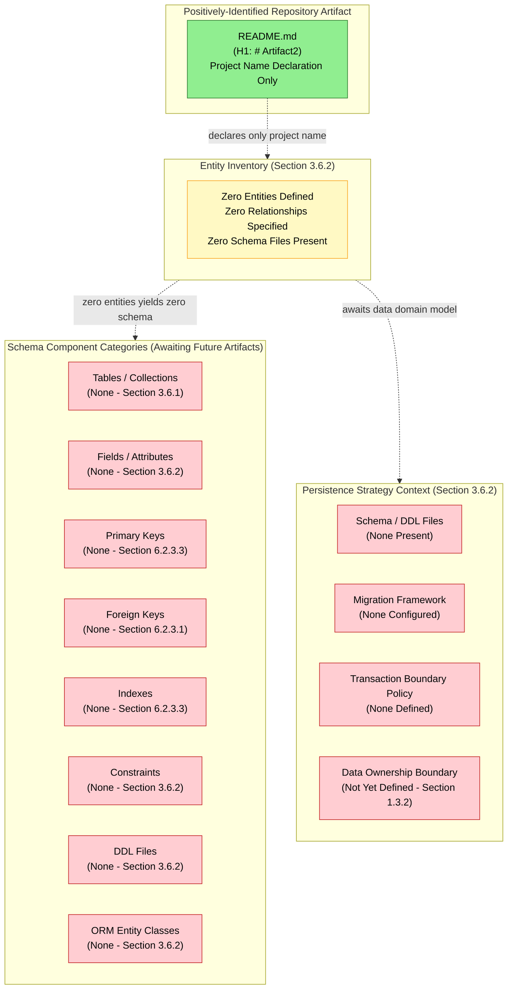

#### 6.2.7.2 Data Flow Diagram (Null-State)

A conventional data flow diagram requires at minimum one data source, one data sink, and one transformation or movement between them. Section 5.2.3 records all data flow dimensions as null (zero internal data flows, zero external data flows). Section 1.2.1 records "None Declared" across all four integration dimensions (Upstream Systems, Downstream Consumers, External APIs, Enterprise Services). Section 3.6.1 records all eight database categories as "None Configured," precluding the existence of any source or sink. With zero data sources, zero sinks, and zero transformations, no valid data flow diagram can be authored.

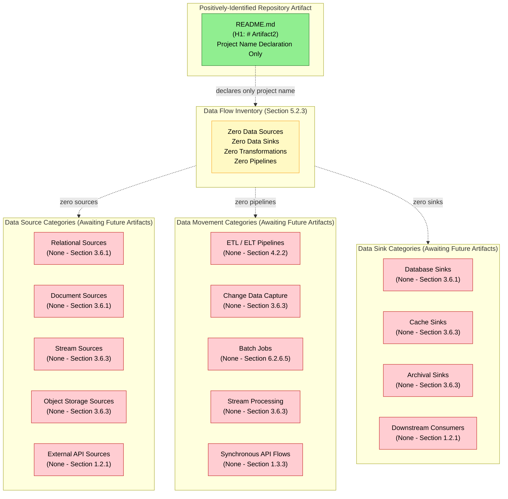

#### 6.2.7.3 Replication Architecture Diagram (Null-State)

A conventional replication architecture diagram requires at minimum one primary node, one replica node, and one defined replication link between them. Section 3.6.2 records "Replication / Sharding Topology: None Defined." Section 5.3.2 records "Replication Topology: None Defined" and "Stateless / Stateful Classification: None Determined." Section 1.3.2 records the Physical Deployment Boundary as "Not Yet Defined" and notes the absence of geographic deployment regions. Section 5.5.6 records the entirety of disaster-recovery dimensions (failover topology, multi-region/multi-AZ strategy) as null. With zero database nodes, zero replication links, and zero failover targets, no replication architecture can be drawn.

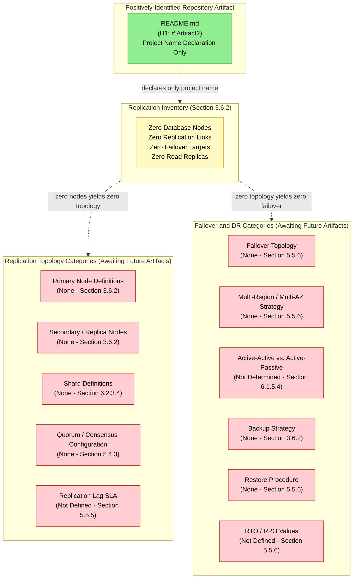

---

### 6.2.8 Assumptions and Constraints

#### 6.2.8.1 Documented Assumptions

The following assumptions are explicitly recorded for this revision of the Database Design section. Each assumption is forward-looking and does not introduce any fact-claim about the current repository state. The assumption identifier convention `A-6-XXX` continues from Section 6.1.7.1 (where `A-6-001` through `A-6-008` were issued) and is consistent with the conventions established in Sections 2.7.1 (`A-2-XXX`), 3.9.1 (`A-3-XXX`), 4.7.1 (`A-4-XXX`), and 5.7.1 (`A-5-XXX`).

| Assumption ID | Statement |
|---------------|-----------|
| A-6-009 | Subsequent commits will introduce data domain models, schema/DDL files, ORM entity classes, JSON Schema definitions, or comparable artifacts from which entity relationships, data models, and schema structures can be derived; this Database Design section will be re-authored against the artifacts then committed. |
| A-6-010 | When a database engine selection (relational, document, key-value, graph, time-series, search index, vector, or embedded) is corroborated by a configuration file, driver dependency, connection-string artifact, or migration script committed to the repository, the Schema Design subsection will be populated with the indexing strategy, partitioning approach, and replication configuration actually committed. |
| A-6-011 | When a migration framework (e.g., Alembic, Flyway, Liquibase, or comparable) is configured and migration scripts are present, the Data Management subsection will be re-authored to enumerate the migration procedures, versioning strategy, and schema-evolution approach implemented; identifier convention (suggested: `MIG-XXX` for migration scripts, `ENT-XXX` for entities, `IDX-XXX` for indexes) will be adopted at that time. |
| A-6-012 | When a caching layer (in-process, distributed, HTTP response/reverse proxy) is configured, the Caching Policies and Performance Optimization subsections will be re-authored to enumerate the cache tier architecture, invalidation policy, coherence model, warming strategy, and TTL/eviction policy actually adopted. |
| A-6-013 | When jurisdictional context, regulatory compliance scope (e.g., GDPR, HIPAA, SOX, PCI-DSS), or data-residency requirements are articulated in future revisions of Section 1.3.2, the Compliance Considerations subsection will be re-authored to enumerate the data retention rules, privacy controls, audit mechanisms, and access controls implemented against those obligations. |
| A-6-014 | When connection pooling configurations, query optimization patterns, read/write splitting routes, or batch processing pipelines are committed, the Performance Optimization subsection will be re-authored to enumerate the pool sizing, query plans, routing policies, and batch windows actually configured. |
| A-6-015 | When backup/restore policies, replication topologies, or disaster recovery configurations are committed, the Replication Configuration and Backup Architecture subsections will be re-authored, and the Replication Architecture Diagram (Section 6.2.7.3) will be re-authored as a proper replication topology graph. |
| A-6-016 | The Default Technology Stack identification of **MongoDB** as the prescribed database (per Section 3.1.2) will be re-evaluated against the artifacts committed in future revisions; MongoDB will be accepted, replaced, or supplemented based on the evidence then available, but it is **not applied** in this revision per the determination in Section 3.1.2 and Constraint C-6-004. |

#### 6.2.8.2 Constraints Bounding This Section

The following constraints bound the present revision of the Database Design section. These constraints are factual properties of the current repository state, not authoring preferences. The constraint identifier convention `C-6-XXX` continues from Section 6.1.7.2 (where `C-6-001` through `C-6-009` were issued) and is consistent with the conventions established in Sections 2.7.2 (`C-2-XXX`), 3.9.2 (`C-3-XXX`), 4.7.2 (`C-4-XXX`), and 5.7.2 (`C-5-XXX`). This section explicitly inherits the foundational constraints from those upstream sections.

| Constraint ID | Statement |
|---------------|-----------|
| C-6-010 | This section is bound by Constraint C-2-001 (Section 2.7.2) as reinforced by Constraint C-6-001 (Section 6.1.7.2): no entities, schemas, indexes, partitioning schemes, or persistence configurations may be invented or inferred beyond what exists in the repository. |
| C-6-011 | This section is bound by Constraint C-2-002 (Section 2.7.2) as reinforced by Constraint C-6-002 (Section 6.1.7.2): the single-level repository hierarchy (root containing `README.md` only) precludes the inference of schema directory layout, migration directory structure, or data-domain-module organization from any directory structure. |
| C-6-012 | This section is bound by Constraint C-2-003 (Section 2.7.2) as reinforced by Constraint C-6-003 (Section 6.1.7.2): the empty Code Graph schema (`{}`) precludes the extraction of ORM entity classes, repository interfaces, data access objects, or any other indexable code structures from which a Database Design could be derived. |
| C-6-013 | This section is bound by Constraint C-3-001 (Section 3.9.2) as reinforced by Constraint C-6-004 (Section 6.1.7.2): the Default Technology Stack — particularly **MongoDB** as the prescribed database engine — may not be applied to populate any schema, persistence configuration, replication topology, or caching layer in the absence of repository evidence for those selections. The absence of `mongod.conf`, a MongoDB driver dependency, a connection string, a schema file, or a migration artifact in the repository is documented in Section 3.6.3. |
| C-6-014 | This section is bound by Constraint C-5-007 (Section 5.7.2) as reinforced by Constraint C-6-005 (Section 6.1.7.2): the single-level repository hierarchy precludes the inference of polyglot persistence boundaries, bounded-context divisions, or aggregate-root decomposition from any directory structure. |
| C-6-015 | This section is bound by Constraint C-4-007 (Section 4.7.2) inherited via Constraints C-5-009 (Section 5.7.2) and C-6-006 (Section 6.1.7.2): the Database Schema Diagram, Data Flow Diagram, and Replication Architecture Diagram each require at minimum the specific topology elements named in the prompt (entities + relationships; sources + sinks + transformations; primary + replica + link) to render meaningfully; with zero of each present in the repository, the corresponding diagrams in Sections 6.2.7.1, 6.2.7.2, and 6.2.7.3 are rendered as null-state `graph TB` visualizations following the validated pattern from Sections 1.2.2, 2.4.1, 3.8.1, 4.6, 5.6, and 6.1.6. |
| C-6-016 | This section is bound by Constraint C-4-008 (Section 4.7.2) inherited via Constraints C-5-010 (Section 5.7.2) and C-6-007 (Section 6.1.7.2): no backup retention durations, RTO/RPO values, replication-lag SLAs, query-latency targets, throughput goals, connection-pool sizing targets, cache TTL values, or any timing/performance constraints may be articulated absent direct evidence in the repository. |
| C-6-017 | This section is bound by Constraint C-3-004 (Section 3.9.2) inherited via Constraints C-5-008 (Section 5.7.2) and C-6-008 (Section 6.1.7.2): no version numbers, vendor identifiers (e.g., specific RDBMS products, named cache services, specific object-storage vendors), or specific endpoint identifiers may be specified absent direct evidence in the repository. |
| C-6-018 | This section is bound by the documentation discipline established in Section 1.1.4 and reinforced in Section 6.1.2.1: jurisdictional context, regulatory compliance scope (e.g., GDPR, HIPAA, SOX), and data-residency requirements have not been articulated in Section 1.3.2 (Data Ownership Boundary "Not Yet Defined"), and therefore no retention rules, privacy controls, or compliance mappings may be authored in Section 6.2.5. |
| C-6-019 | The Schema Design, Data Management, Compliance Considerations, and Performance Optimization subsections prescribed by the section prompt are rendered with all dimensions in their verified null state ("None Configured," "None Defined," "None Documented," "Not Determined," or "Not Yet Defined"); the prompt's required dimensional structure is preserved as schema for future revisions. |

---

### 6.2.9 Re-Authoring Triggers and Version Tracking

#### 6.2.9.1 Diagram Re-Authoring Trigger Table

Each of the three null-state diagrams in Section 6.2.7 will be re-authored in future revisions when the corresponding upstream null state is broken. The triggers below align with the trigger pattern established in Sections 4.6.6, 5.6.7, and 6.1.8.1.

| Diagram | Re-Authoring Trigger |
|---------|----------------------|
| 6.2.7.1 Database Schema Diagram (ERD) | First entity model, DDL file, ORM entity class, JSON Schema, Avro/Protobuf schema, GraphQL type definition, or comparable schema artifact committed |
| 6.2.7.2 Data Flow Diagram | First data source, data sink, ETL/ELT pipeline, CDC configuration, batch job, or stream processing pipeline committed |
| 6.2.7.3 Replication Architecture Diagram | First database node configuration, replication link, failover topology declaration, multi-region/multi-AZ strategy, backup policy, or RTO/RPO articulation committed |

#### 6.2.9.2 Subsection Re-Authoring Trigger Table

Each of the four prompt-required subsections in Sections 6.2.3 through 6.2.6 will be re-authored when its upstream null state is broken.

| Subsection | Re-Authoring Trigger |
|------------|----------------------|
| 6.2.3 Schema Design State | First data domain model, entity definition, DDL file, ORM entity class, or schema-related configuration committed |
| 6.2.4 Data Management State | First migration framework configuration, migration script, archival policy, storage service configuration, or caching configuration committed |
| 6.2.5 Compliance Considerations State | First data retention policy, audit logging configuration, RBAC/ABAC policy, privacy control, or regulatory scope articulation committed |
| 6.2.6 Performance Optimization State | First query optimization artifact, cache configuration, connection pool configuration, read/write splitting route, or batch processing pipeline committed |

#### 6.2.9.3 Re-Evaluation Trigger and Version Tracking

| Version Tracking Field | Current State |
|------------------------|---------------|
| Specification Revision | Initial baseline revision (consistent with Sections 2.7.3, 3.9.3, 4.7.3, 5.7.3, and 6.1.8.2) |
| Corresponding Repository State | Single "Initial commit" recorded in git history (Section 1.4.3) |
| Number of Database Engines Configured | 0 |
| Number of Defined Entities | 0 |
| Number of Defined Entity Relationships | 0 |
| Number of DDL / Schema Files Present | 0 |
| Number of ORM Entity Classes | 0 |
| Number of Migration Scripts | 0 |
| Number of Defined Indexes | 0 |
| Number of Partitioning / Sharding Configurations | 0 |
| Number of Replication Topologies | 0 |
| Number of Backup Policies | 0 |
| Number of Caching Layer Configurations | 0 |
| Number of Data Retention Rules | 0 |
| Number of Audit Mechanisms | 0 |
| Number of Access Control Policies | 0 |
| Number of Query Optimization Artifacts | 0 |
| Number of Connection Pool Configurations | 0 |
| Number of Read/Write Splitting Routes | 0 |
| Number of Batch Processing Pipelines | 0 |
| Diagrams Rendered as Null-State | 3 (Sections 6.2.7.1, 6.2.7.2, and 6.2.7.3) |
| Diagrams Using `graph TB` Pattern per C-6-015 | 3 (all three required diagrams) |
| Constraints Explicitly Inherited from Prior Sections | C-2-001 through C-2-003; C-3-001 and C-3-004; C-4-007 and C-4-008; C-5-007, C-5-008, C-5-009, and C-5-010; C-6-001 through C-6-008 |
| Next Re-Evaluation Trigger | Introduction of any of: a database engine configuration, an entity model, a schema/DDL file, an ORM entity class, a migration script, a caching configuration, a backup policy, a replication topology, a data retention policy, an audit configuration, an access control policy, or any persistence-layer positive definition |

All future revisions of this section should re-evaluate every subsection against newly committed artifacts. When the re-evaluation trigger is satisfied, the corresponding subsection should transition from "None Configured" / "None Defined" / "None Documented" / "Not Determined" / "Not Yet Defined" to a populated state that enumerates the actually-committed entities, schemas, indexes, partitioning schemes, replication topologies, backup policies, caching layers, compliance controls, and performance optimizations as prescribed by the section prompt. The three null-state diagrams in Section 6.2.7 should likewise transition to a populated Entity-Relationship Diagram (potentially using Mermaid `erDiagram`), a populated Data Flow Diagram, and a populated Replication Architecture Diagram that accurately depict the implemented Database Design.

---

### 6.2.10 References

#### 6.2.10.1 Repository Artifacts Examined

- `README.md` — Sole positively-identifiable artifact in the repository; entire content consists of a single H1 heading (`# Artifact2`) declaring the project name. Provides the evidentiary anchor for the null-state determination across all subsections of 6.2.
- `/` (repository root, depth 0) — Single-level hierarchy confirmed; `README.md` is the only first-order child. No subdirectories (such as `db/`, `migrations/`, `schemas/`, `models/`, `entities/`, `repositories/`), no configuration manifests (such as `mongod.conf`, `pg_hba.conf`, `my.cnf`, `redis.conf`), and no implementation files (such as ORM entity classes, query builder configurations, or migration scripts) are present.

#### 6.2.10.2 Technical Specification Sections Cross-Referenced

- **Section 1.1 — Executive Summary** — Establishes the documentation-only placeholder status of Artifact2 and the empty Code Graph schema (`{}`); anchors the no-projection authoring discipline applied in Section 6.2.
- **Section 1.2 — System Overview** — Provides the Integration Landscape table (all four dimensions "None Declared") confirming that no upstream/downstream/external/enterprise data sources or sinks exist; also records the absence of architectural style inferability and KPI definition.
- **Section 1.3 — Scope** — Documents the System Boundaries table (Physical Deployment, Trust and Security, and Data Ownership boundaries all "Not Yet Defined") and the explicit absence of "Database and Persistence" artifacts (Section 1.3.3); records that "no data domains, entity models, schema definitions, or data dictionaries are present in the repository."
- **Section 2.7 — Assumptions, Constraints, and Versioning** — Establishes Constraints C-2-001 through C-2-004 (inherited by Section 6.2 via Section 6.1.7.2) and the `A-2-XXX` / `C-2-XXX` identifier conventions extended to `A-6-XXX` / `C-6-XXX`.
- **Section 3.1 — Technology Stack Baseline Statement** — Confirms the Default Technology Stack (including MongoDB) is "Not Applied to Current Revision" per Constraint C-2-001; precludes the application of MongoDB to any subsection of 6.2.
- **Section 3.3 — Frameworks & Libraries** — Records all framework categories (including ORM/query builder) as "None Declared"; anchors the absence of persistence framework artifacts.
- **Section 3.5 — Third-Party Services** — Records Section 3.5.2 security services (Identity Provider, RBAC/ABAC policy, encryption configuration, secret management) as "None Configured" / "None Defined"; anchors Section 6.2.5 (Compliance Considerations).
- **Section 3.6 — Databases & Storage** — **Primary anchoring section**; records all 8 database categories, all 10 persistence dimensions, and all 9 caching/storage categories as "None Configured," "None Defined," "None Present," or "Not Yet Defined"; the verbatim quote regarding MongoDB's non-application is reproduced from Section 3.6.3.
- **Section 3.7 — Development & Deployment** — Records all IaC, container, orchestration, and CI/CD artifacts as "None Present"; anchors the absence of migration-execution pipeline configurations.
- **Section 3.9 — Assumptions, Constraints, and Versioning (Technology Stack)** — Establishes Constraints C-3-001 through C-3-004 (inherited by Section 6.2).
- **Section 4.2 — System Workflows** — Records all workflow dimensions as null; Section 4.2.2 anchors the absence of File Transfer / ETL Pipelines.
- **Section 4.5 — Technical Implementation State** — Records all 12 state-management dimensions (including Cache Tiers, Cache Invalidation Policy, Transaction Boundaries, Optimistic/Pessimistic Locking, Replication/Sharding Topology, Event Sourcing/CQRS) as null; anchors Sections 6.2.4.5 and 6.2.6.4.
- **Section 4.7 — Assumptions, Constraints, and Versioning (Process Flowchart)** — Establishes Constraints C-4-007 (null-state Mermaid pattern using `graph TB`) and C-4-008 (no SLA/timing/RTO/RPO values without evidence), both inherited by Section 6.2.
- **Section 5.2 — High-Level Architecture** — Provides the zero-row Core Components Table; Section 5.2.3 anchors the verified absence of data flows (zero internal, zero external).
- **Section 5.3 — Component Details** — Records Replication Topology, Stateless/Stateful Classification, and Data Persistence Requirements as null; anchors Sections 6.2.3.5 and 6.2.6.4.
- **Section 5.4 — Technical Decisions** — Section 5.4.3 (Data Storage Decision State) records all 7 dimensions as null; Section 5.4.4 (Caching Strategy State) records all 7 dimensions as null; Section 5.4.5 (Security Mechanism State) records all 10 dimensions as null. Anchors the entirety of Section 6.2.
- **Section 5.5 — Cross-Cutting Concerns** — Section 5.5.2 anchors the absence of audit log trail; Section 5.5.5 anchors the absence of SLA/performance values; Section 5.5.6 (Disaster Recovery State) records all 10 dimensions as null (RTO, RPO, Backup Strategy, Restore Procedure, Failover Topology, Multi-Region/Multi-AZ Strategy, DR Drill Cadence, Runbook/Playbook Inventory, Incident Response Process, Business Continuity Plan).
- **Section 5.6 — Required Diagrams (Null-State Mermaid Visualizations)** — Establishes the validated three-subgraph null-state Mermaid pattern with color coding (`#90EE90` green for evidentiary anchor, `#FFF9C4` yellow for category inventory, `#FFCDD2` red for absent components) replicated in Section 6.2.7. Section 5.6.2 (State Transition Diagram) is the closest existing analog to Section 6.2.7.1's null-state ERD treatment.
- **Section 5.7 — Assumptions, Constraints, and Versioning (System Architecture)** — Establishes Constraints C-5-001 through C-5-012 (inherited by Section 6.2 via Section 6.1.7.2) and the `A-5-XXX` / `C-5-XXX` identifier conventions extended to `A-6-XXX` / `C-6-XXX`.
- **Section 6.1 — Core Services Architecture** — **Primary precedent section**; provides the full template for the "Not Applicable" applicability statement adopted by Section 6.2.1, the applicability determination matrix structure adopted by Section 6.2.2.2, the per-dimension null-state table pattern adopted by Sections 6.2.3 through 6.2.6, the null-state Mermaid pattern adopted by Section 6.2.7, the assumption/constraint identifier conventions (A-6-001 through A-6-008 and C-6-001 through C-6-009 already issued) extended in Section 6.2.8, and the re-authoring trigger table pattern adopted by Section 6.2.9.

---

## 6.3 Integration Architecture

### 6.3.1 Applicability Statement

**Integration Architecture is not applicable for this system in the current revision.**

Direct inspection of the **Artifact2** repository confirms that no integration artifacts of any kind — including API contracts, protocol specifications, authentication services, authorization frameworks, rate limiting policies, versioning conventions, message brokers, event streams, queue topologies, stream processors, batch pipelines, dead-letter queues, third-party integrations, legacy system interfaces, API gateways, or external service contracts — have been committed at the time of this revision. The sole positively-identifiable artifact in the repository is `README.md`, whose entire content is a single H1 heading declaring the project name (`# Artifact2`). The Code Graph schema for the repository is recorded as an empty object (`{}`) per Section 1.1.1 — Project Overview, confirming the absence of indexable code structures from which API endpoints, message handlers, event emitters, consumer bindings, integration adapters, or gateway configurations could be derived.

This section is authored under the same evidence-strict reporting standard established in Section 1.1 — Executive Summary, Section 2.1 — Requirements Baseline Statement, Section 3.1 — Technology Stack Baseline Statement, Section 4.1 — Process Flowchart Baseline Statement, Section 5.1 — System Architecture Baseline Statement, and reinforced by the immediately-preceding Section 6.1 — Core Services Architecture and Section 6.2 — Database Design. The Default Technology Stack identified in Section 3.1.2 — including AWS, Docker, Terraform, GitHub Actions, Python with Flask, Auth0, MongoDB, Langchain, React with TypeScript, TailwindCSS, React-Native, Swift, Kotlin, Objective-C, and ElectronJS — is **explicitly not applied** to populate any API contract, protocol selection, authentication mechanism, authorization policy, message broker, queue topology, gateway configuration, or external integration documented in this section. The application of Flask as the API framework, Auth0 as the identity provider, or any AWS messaging service (e.g., SQS, SNS, EventBridge, Kinesis) in the absence of corroborating repository evidence would constitute fabrication and would violate Constraint C-2-001 (Section 2.7.2) as inherited via Constraints C-6-004 (Section 6.1.7.2) and C-6-013 (Section 6.2.8.2).

#### 6.3.1.1 Repository Evidence Summary

The applicability determination is anchored to the following verified properties of the repository:

| Evidentiary Anchor | Verified State | Source Section |
|--------------------|----------------|----------------|
| Repository Hierarchy | Single-level (root contains `README.md` only) | Section 1.3.3 |
| Code Graph Schema | Empty object (`{}`) | Section 1.1.1 |
| Upstream Systems | None Declared | Section 1.2.1 |
| Downstream Consumers | None Declared | Section 1.2.1 |
| External APIs | None Declared | Section 1.2.1 |
| Enterprise Services | None Declared | Section 1.2.1 |
| API Contracts (OpenAPI / gRPC / GraphQL) | Explicitly Absent | Section 1.3.3 |
| Identity Provider Configuration | None Configured | Section 3.5.2 |
| OAuth 2.0 / OIDC / SAML Configuration | None Present | Section 3.5.2 |
| API Key / Bearer Token Vault | None Present | Section 3.5.2 |
| RBAC / ABAC Policy | None Defined | Section 3.5.2 |
| Message Queue / Event Stream | None Configured | Section 3.6.3 |
| API Gateway Pattern | None Configured | Section 5.4.2 |
| Inter-Service Authentication | None Declared | Section 4.2.2 |
| Webhook Subscriptions | None Declared | Section 4.2.2 |
| File Transfer / ETL Pipelines | None Configured | Section 4.2.2 |
| External Integration of Any Kind | None Present | Section 3.5.1 |
| Trust and Security Boundary | Not Yet Defined | Section 1.3.2 |

#### 6.3.1.2 Why Integration Architecture is Not Applicable

The Integration Architecture section prompt prescribes documentation across three principal domains — API Design, Message Processing, and External Systems — and three required Mermaid diagrams (Integration Flow, API Architecture, Message Flow). Each domain presupposes the existence of at least one API contract, one message contract, or one external system relationship from which the prescribed analysis can be conducted. The repository in its current state provides none of these preconditions, as established in:

- **Section 1.2.1** — All four Integration Landscape dimensions (Upstream Systems, Downstream Consumers, External APIs, Enterprise Services) are recorded as "None Declared"
- **Section 1.3.3** — "API Contracts" is explicitly enumerated as one of the absent artifact categories, with the verbatim notation "No OpenAPI, gRPC `.proto`, or GraphQL schema files"
- **Section 3.5.1** — Records that "No external system integration of any kind exists in this revision"
- **Section 3.5.2** — All six authentication and authorization service dimensions (Identity Provider, OAuth 2.0/OIDC Configuration, SAML Service Provider Configuration, API Key/Bearer Token Vault, RBAC Policy, ABAC Policy) are recorded as "None Configured" or "None Defined"
- **Section 3.5.3** — All fourteen cloud, monitoring, and observability service categories are recorded as "None Configured"
- **Section 3.6.3** — "Message Queue / Event Stream" is recorded as "None Configured" alongside the other eight caching and storage service categories
- **Section 4.2.2** — All nine Integration Workflow State dimensions (Data Flow Between Systems, API Interactions, Event Processing Flows, Batch Processing Sequences, Synchronous Request/Response Contracts, Asynchronous Message Contracts, File Transfer/ETL Pipelines, Webhook Subscriptions, Inter-Service Authentication) are recorded as "None Declared" or "None Configured"
- **Section 4.5.1** — Event Sourcing / CQRS and other event-driven state-management dimensions are recorded as "None Configured"
- **Section 4.5.2** / **Section 5.5.3** — All thirteen error-handling dimensions (including Dead-Letter Queue Configuration, Retry Mechanisms, Circuit Breaker Configuration, Bulkhead Isolation, Fallback Process Definitions) are recorded as null
- **Section 5.4.2** — All seven Communication Pattern dimensions (Synchronous vs. Asynchronous Selection, Request/Response Protocol, Publish/Subscribe Backbone, Streaming Protocol, Service Mesh/Sidecar Pattern, API Gateway Pattern, Inter-Process Communication Mechanism) are recorded as "None Configured" or "None Determined"
- **Section 5.4.5** — All ten Security Mechanism State dimensions are recorded as null, precluding the documentation of inter-service authentication, transport-layer security, or token-based authorization
- **Section 6.1.5.5** — "Rate Limiting / Throttling Policy" is recorded as "None Configured"
- **Section 2.4.2** — All Feature Relationship dimensions (Integration Points, Shared Components, Common Services, Cross-Feature Contracts) are recorded as null
- **Section 5.2.4** — External Integration Points Table cardinality is **zero rows**

Consequently, this section documents the **verified null baseline state** of the Integration Architecture rather than enumerating fabricated APIs, message contracts, event topologies, gateway routes, authentication providers, authorization policies, rate limit tiers, or third-party connector adapters. By the principles established in Sections 1.1.4, 2.1.3, 3.1.3, 4.1.3, 5.1.3, 6.1.1, and 6.2.1, the invention of even illustrative or hypothetical API endpoints, OAuth scopes, queue names, topic schemas, gateway routes, or webhook subscription URLs at this stage would constitute unsupported speculation and is therefore avoided.

---

### 6.3.2 Authoring Standard and Section Structure

#### 6.3.2.1 Authoring Discipline

All entries in this section conform to the documentation discipline established in Section 1.1.4 (no projection beyond evidence), Section 2.1.3 (no fabricated requirements), Section 3.1.3 (no fabricated technology selections), Section 4.1.3 (no fabricated processes), Section 5.1.3 (no fabricated architecture components), Section 6.1.2.1 (no fabricated service or scalability artifacts), and Section 6.2.2.1 (no fabricated schema, persistence, or compliance artifacts). Each subsection enumerates a domain prescribed by the Integration Architecture section prompt and records the verified absence of evidence for that domain, anchored to specific cross-referenced Technical Specification sections.

#### 6.3.2.2 Applicability Determination Matrix

The following table maps each subsection mandated by the Integration Architecture section prompt to its applicability against the current repository state. Each "Not Applicable" determination is anchored to verified absence rather than incomplete investigation.

| Prompt-Required Domain | Applicability | Anchoring Evidence |
|------------------------|---------------|--------------------|
| API Design — Protocol Specifications | Not Applicable — no API contracts present | Section 1.3.3; Section 5.4.2 |
| API Design — Authentication Methods | Not Applicable — no identity provider configured | Section 3.5.2 |
| API Design — Authorization Framework | Not Applicable — no RBAC/ABAC policy defined | Section 3.5.2; Section 5.4.5 |
| API Design — Rate Limiting Strategy | Not Applicable — no gateway or throttling policy | Section 5.4.2; Section 6.1.5.5 |
| API Design — Versioning Approach | Not Applicable — no API contracts to version | Section 1.3.3; Section 5.4.3 |
| API Design — Documentation Standards | Not Applicable — no API contracts to document | Section 1.3.3; Section 1.2.2 |
| Message Processing — Event Processing Patterns | Not Applicable — no event streams configured | Section 3.6.3; Section 4.5.1 |
| Message Processing — Message Queue Architecture | Not Applicable — no broker configured | Section 3.6.3; Section 5.4.2 |
| Message Processing — Stream Processing Design | Not Applicable — no streaming backbone | Section 3.6.3; Section 5.4.2 |
| Message Processing — Batch Processing Flows | Not Applicable — no batch pipelines | Section 4.2.2; Section 6.2.6.5 |
| Message Processing — Error Handling Strategy | Not Applicable — no error-handling artifacts | Section 4.5.2; Section 5.5.3 |
| External Systems — Third-Party Integration Patterns | Not Applicable — no third-party services configured | Section 3.5.1; Section 3.5.3 |
| External Systems — Legacy System Interfaces | Not Applicable — no predecessor system to interface with | Section 1.2.1 |
| External Systems — API Gateway Configuration | Not Applicable — no gateway configured | Section 5.4.2 |
| External Systems — External Service Contracts | Not Applicable — no external contracts defined | Section 1.2.1; Section 2.4.2 |
| Integration Flow Diagram | Null-State Visualization Required | Section 5.6 pattern |
| API Architecture Diagram | Null-State Visualization Required | Section 5.6 pattern |
| Message Flow Diagram | Null-State Visualization Required | Section 5.6 pattern |

---

### 6.3.3 API Design State

The Integration Architecture section prompt for API Design mandates documentation of six dimensions: protocol specifications, authentication methods, authorization framework, rate limiting strategy, versioning approach, and documentation standards. Each dimension is recorded below with anchoring evidence to its verified null state. The prompt-required dimensional structure is preserved as schema for future revisions per Constraint C-6-019 (Section 6.2.8.2).

#### 6.3.3.1 Protocol Specifications

| Protocol Dimension | Current State | Anchoring Evidence |
|--------------------|---------------|--------------------|
| Request/Response Protocol (REST, gRPC, GraphQL) | None Configured | Section 5.4.2; Section 1.3.3 |
| Transport Protocol (HTTP/1.1, HTTP/2, HTTP/3) | None Selected | Section 1.3.3 — no application configuration present |
| Payload Format (JSON, XML, Protobuf, Avro) | None Selected | Section 1.3.3 — no data exchange specifications |
| WebSocket / Server-Sent Events (SSE) Support | None Configured | Section 5.4.2 — Streaming Protocol "None Configured" |
| gRPC Service Definitions (`.proto` files) | None Present | Section 1.3.3 — explicit absence of `.proto` files |
| OpenAPI / Swagger Specifications | None Present | Section 1.3.3 — explicit absence of OpenAPI |
| GraphQL Schema Definitions | None Present | Section 1.3.3 — explicit absence of GraphQL schemas |

The cardinality derivation is: **0 API contracts × N protocol dimensions = 0 protocol specifications**. Section 1.3.3 records that no OpenAPI specifications, gRPC `.proto` files, or GraphQL schema files exist in the repository. Section 6.1.3.2 anchors the absence of any inter-service communication patterns from which protocol selections could be inferred. Per Constraint C-6-008 (Section 6.1.7.2) and C-6-017 (Section 6.2.8.2), no specific protocol vendor identifiers (e.g., REST, gRPC, GraphQL, Thrift, JSON-RPC, SOAP) may be applied absent direct evidence.

#### 6.3.3.2 Authentication Methods

| Authentication Dimension | Current State | Anchoring Evidence |
|--------------------------|---------------|--------------------|
| Identity Provider (IdP) | None Configured | Section 3.5.2 |
| OAuth 2.0 / OIDC Client Configuration | None Present | Section 3.5.2 |
| SAML Service Provider Configuration | None Present | Section 3.5.2 |
| API Key / Bearer Token Vault | None Present | Section 3.5.2 |
| JWT Token Issuance / Validation | None Configured | Section 5.4.5 — no security mechanisms configured |
| Mutual TLS (mTLS) Configuration | None Configured | Section 5.4.5 — Transport Layer Security null |
| Federated Identity / Single Sign-On (SSO) | None Configured | Section 3.5.2 — Identity Provider "None Configured" |
| Multi-Factor Authentication (MFA) | None Configured | Section 5.4.5 — no authentication mechanisms |
| Inter-Service Authentication | None Declared | Section 4.2.2 |

The Default Technology Stack's prescription of **Auth0** as the identity provider (Section 3.1.2) is **explicitly not applied** per Constraint C-6-004 (Section 6.1.7.2). The absence of an Auth0 tenant configuration, OIDC client secret artifact, or SDK dependency is documented across Sections 3.5.2 and 3.3.1.

#### 6.3.3.3 Authorization Framework

| Authorization Dimension | Current State | Anchoring Evidence |
|-------------------------|---------------|--------------------|
| Role-Based Access Control (RBAC) Policy | None Defined | Section 3.5.2; Section 5.4.5 |
| Attribute-Based Access Control (ABAC) Policy | None Defined | Section 3.5.2; Section 5.4.5 |
| Permission / Scope Catalog | None Defined | Section 5.4.5 — no security mechanisms |
| Policy Decision Point (PDP) Configuration | None Configured | Section 5.4.5 — no authorization layer |
| Policy Enforcement Point (PEP) Configuration | None Configured | Section 5.4.2 — API Gateway "None Configured" |
| Trust and Security Boundary | Not Yet Defined | Section 1.3.2 |
| Resource-Level Access Policies | None Defined | Section 1.3.2 — Data Ownership Boundary "Not Yet Defined" |

With zero defined roles, zero declared scopes, and zero documented permission grants, no authorization framework is observable. Section 6.2.5.5 records all five database-tier access control dimensions (RBAC, ABAC, user/role inventory, connection-level authentication, row/column-level security) as null, which corroborates the absence of an end-to-end authorization framework at the integration layer.

#### 6.3.3.4 Rate Limiting Strategy

| Rate Limiting Dimension | Current State | Anchoring Evidence |
|-------------------------|---------------|--------------------|
| Rate Limiting / Throttling Policy | None Configured | Section 6.1.5.5; Section 5.4.2 |
| API Gateway Rate Limit Configuration | None Configured | Section 5.4.2 — API Gateway Pattern "None Configured" |
| Per-Tenant / Per-Client Quota Definitions | None Defined | Section 1.2.1 — no consumers declared |
| Burst / Concurrency Limit Definitions | Not Defined | Section 5.5.5 — no SLA values articulated |
| Rate Limit Algorithm (Token Bucket, Leaky Bucket, Fixed Window) | None Selected | Section 5.4.2 — no traffic-shaping decisions |
| Rate-Limit Response Headers / Backoff Hints | None Defined | Section 1.3.3 — no API contracts present |
| Load Shedding Policy | None Defined | Section 6.1.5.5 |

Per Constraint C-6-007 (Section 6.1.7.2) inherited from C-4-008, no throughput targets, burst tolerances, or rate-limit thresholds may be articulated absent direct evidence in the repository. Section 5.5.1 records the Metrics / Telemetry Backend as "None Configured," precluding the existence of any metrics-driven rate-limit feedback loop.

#### 6.3.3.5 Versioning Approach

| Versioning Dimension | Current State | Anchoring Evidence |
|----------------------|---------------|--------------------|
| API Version Identification Scheme (URI / Header / Media Type) | None Selected | Section 1.3.3 — no API contracts |
| Major / Minor / Patch Versioning Convention | None Adopted | Section 5.4.3 — Schema Evolution Strategy "None Defined" |
| Backward Compatibility Policy | None Defined | Section 5.4.3 |
| Forward Compatibility Policy | None Defined | Section 5.4.3 |
| Deprecation Notice Protocol | None Defined | Section 1.2.1 — no Downstream Consumers declared |
| Version Sunset / End-of-Life Policy | None Defined | Section 1.2.1 — no external consumers |
| Schema Registry | None Configured | Section 6.2.4.2 — Schema Registry "None Configured" |

With zero API contracts in the repository (Section 1.3.3), no versioning approach is observable. Section 6.2.4.2 (Versioning Strategy) records all five schema-versioning dimensions as null, which corroborates the absence of any end-to-end version governance from API surface through data layer.

#### 6.3.3.6 Documentation Standards

| Documentation Dimension | Current State | Anchoring Evidence |
|-------------------------|---------------|--------------------|
| OpenAPI / Swagger Documentation | None Present | Section 1.3.3 |
| GraphQL Schema Introspection / SDL Documentation | None Present | Section 1.3.3 |
| gRPC Service Reflection / Documentation | None Present | Section 1.3.3 |
| API Reference / Developer Portal | None Present | Section 1.2.2 — no design documents present |
| Architecture Decision Records (ADRs) | None Present | Section 5.4 — ADR inventory zero |
| Postman / Insomnia Collections | None Present | Section 1.3.3 — no API contracts |
| Code Examples / SDK Documentation | None Present | Section 3.3.1 — no SDK declared |
| Changelog / Release Notes | None Present | Section 1.4.3 — single "Initial commit" only |

The repository's sole documentation artifact, `README.md`, contains exclusively the H1 heading `# Artifact2` and offers no narrative, no usage examples, no endpoint enumeration, and no protocol documentation. Section 1.2.2 records that no architectural style, design pattern selection, or technology choice can be inferred, precluding the application of any documentation standard (e.g., OpenAPI 3.x, AsyncAPI, JSON:API) absent direct evidence.

---

### 6.3.4 Message Processing State

The Integration Architecture section prompt for Message Processing mandates documentation of five dimensions: event processing patterns, message queue architecture, stream processing design, batch processing flows, and error handling strategy. Each dimension is recorded below with anchoring evidence to its verified null state.

#### 6.3.4.1 Event Processing Patterns

| Event Processing Dimension | Current State | Anchoring Evidence |
|----------------------------|---------------|--------------------|
| Event Sourcing / CQRS Implementation | None Configured | Section 4.5.1; Section 6.2.6.4 |
| Domain Event Catalog | None Defined | Section 2.4.2 — no Cross-Feature Contracts |
| Event Schema Registry | None Configured | Section 6.2.4.2 |
| Event Publisher Inventory | Zero | Section 1.2.1 — no Upstream Systems declared |
| Event Subscriber / Consumer Inventory | Zero | Section 1.2.1 — no Downstream Consumers declared |
| Event Processing Topology (Choreography vs. Orchestration) | None Determined | Section 5.4.2 — Publish/Subscribe Backbone "None Configured" |
| Event Ordering / Idempotency Guarantees | None Defined | Section 6.1.5.1 — Idempotency Policy "None Defined" |
| Change Data Capture (CDC) Configuration | None Configured | Section 3.6.3; Section 6.2.5.4 |

The cardinality derivation is: **0 publishers × 0 subscribers × 0 schemas = 0 event flows**. Section 4.2.2 anchors the absence of any "Event Processing Flows," and Section 4.5.1 anchors the absence of any "Event Sourcing / CQRS" implementation.

#### 6.3.4.2 Message Queue Architecture

| Message Queue Dimension | Current State | Anchoring Evidence |
|-------------------------|---------------|--------------------|
| Message Broker / Queue Service | None Configured | Section 3.6.3 |
| Publish/Subscribe Backbone | None Configured | Section 5.4.2 |
| Queue / Topic Inventory | Zero | Section 4.2.2 — no Asynchronous Message Contracts |
| Producer Inventory | Zero | Section 6.1.3.2 — no inter-service communication |
| Consumer Inventory | Zero | Section 6.1.3.2 |
| Message Schema Definitions | None Present | Section 1.3.3 — no data exchange specifications |
| Consumer Group / Subscription Model | None Defined | Section 5.4.2 — no publish/subscribe topology |
| Delivery Guarantee (At-Most-Once, At-Least-Once, Exactly-Once) | None Determined | Section 5.4.3 — Consistency Model "None Determined" |
| Message Ordering Guarantees | None Defined | Section 5.4.3 |

The Default Technology Stack does not prescribe a specific message broker (Section 3.1.2). Per Constraints C-6-008 and C-6-017, no vendor identifiers (e.g., Apache Kafka, RabbitMQ, AWS SQS/SNS, Azure Service Bus, Google Pub/Sub, NATS, Redis Streams) may be applied absent direct evidence. Section 3.6.3 verifies that no broker configuration files, driver dependencies, or connection-string artifacts exist in the repository.

#### 6.3.4.3 Stream Processing Design

| Stream Processing Dimension | Current State | Anchoring Evidence |
|-----------------------------|---------------|--------------------|
| Streaming Protocol (gRPC streams, WebSocket, SSE) | None Configured | Section 5.4.2 |
| Stream Processing Backbone | None Configured | Section 6.2.6.5; Section 3.6.3 |
| Stream Topology / DAG | None Defined | Section 5.2.3 — zero data flows |
| Windowing Strategy (Tumbling, Sliding, Session) | None Defined | Section 4.5.1 — no state persistence points |
| Watermark / Late-Arrival Handling Policy | None Defined | Section 4.5.2 — no event-time processing |
| Stateful Operator Configuration | None Configured | Section 5.3.2 — Stateless/Stateful Classification "None Determined" |
| Exactly-Once Semantics Configuration | None Configured | Section 5.4.3 — Consistency Model "None Determined" |
| Backpressure / Flow Control Policy | None Defined | Section 5.4.2 — no streaming protocol |

With zero stream sources, zero stream sinks, and zero stream processing operators present in the repository, no stream processing design is observable. Section 6.2.7.2 (Data Flow Diagram - Null-State) already documents the verified absence of all stream-relevant artifacts.

#### 6.3.4.4 Batch Processing Flows

| Batch Processing Dimension | Current State | Anchoring Evidence |
|----------------------------|---------------|--------------------|
| Batch Processing Framework | None Configured | Section 6.2.6.5; Section 3.3.1 |
| Batch Job Inventory | Zero | Section 4.2.2 — Batch Processing Sequences "None Configured" |
| File Transfer / ETL Pipelines | None Configured | Section 4.2.2 |
| Job Scheduling Mechanism (Cron, Quartz, Airflow) | None Configured | Section 6.2.6.5; Section 3.7 |
| Batch Window / Throughput Target | Not Defined | Section 5.5.5 — no throughput targets |
| Bulk Data Loader Configuration | None Configured | Section 6.2.6.5 |
| Batch Failure / Restart Policy | None Defined | Section 5.5.3 — no error-handling configured |
| Batch Telemetry / Monitoring | None Configured | Section 5.5.1 — Metrics Backend "None Configured" |

Section 4.2.2 records that no "Batch Processing Sequences" have been declared. Section 6.2.6.5 records all six batch-processing dimensions (framework, ETL pipelines, bulk insert/update policy, job scheduling, batch window, stream processing backbone) as null. The absence of cron files, Airflow DAGs, Quartz scheduler configurations, or any scheduled-job declarations in the repository is documented in Section 3.7.

#### 6.3.4.5 Error Handling Strategy

| Error Handling Dimension | Current State | Anchoring Evidence |
|--------------------------|---------------|--------------------|
| Exception Class Hierarchy | None Defined | Section 5.5.3; Section 4.5.2 |
| Retry Mechanisms | None Configured | Section 5.5.3 |
| Retry Back-off Policy (Linear, Exponential, Jittered) | None Defined | Section 5.5.3 |
| Dead-Letter Queue (DLQ) Configuration | None Configured | Section 4.5.2; Section 5.5.3 |
| Poison Message Handling Policy | None Defined | Section 5.5.3 |
| Circuit Breaker Configuration | None Configured | Section 5.5.3; Section 6.1.5.1 |
| Bulkhead Isolation Policy | None Defined | Section 5.5.3 |
| Compensating Transaction / Saga Pattern | None Configured | Section 4.5.1 — no transactional patterns |
| Error Tracking Integration | None Configured | Section 3.5.3 — Error Tracking "None Configured" |
| Error Notification Channels | None Configured | Section 3.5.3 — Alerting/Paging "None Configured" |
| Recovery Procedure Documentation | None Documented | Section 5.5.6 |
| Runbook / Playbook Inventory | None Present | Section 5.5.3; Section 5.5.6 |

All thirteen error-handling dimensions enumerated in Section 5.5.3 are recorded as null. With zero retry policies, zero dead-letter queues, zero circuit breakers, and zero error-tracking integrations, no error handling strategy applicable to integration message processing is observable.

---

### 6.3.5 External Systems State

The Integration Architecture section prompt for External Systems mandates documentation of four dimensions: third-party integration patterns, legacy system interfaces, API gateway configuration, and external service contracts. Each dimension is recorded below with anchoring evidence to its verified null state.

#### 6.3.5.1 Third-Party Integration Patterns

| Third-Party Integration Dimension | Current State | Anchoring Evidence |
|-----------------------------------|---------------|--------------------|
| Number of Third-Party Services Configured | Zero | Section 3.5.1; Section 3.5.3 |
| Cloud Compute Provider Integration | None Configured | Section 3.5.3 |
| CDN / DNS / Domain Registrar Integration | None Configured | Section 3.5.3 |
| APM / Log Aggregation / Tracing Integration | None Configured | Section 3.5.3 |
| Email / SMS / Notification Service Integration | None Configured | Section 3.5.3 |
| Payment Service Provider Integration | None Configured | Section 3.5.3 |
| Search Service Integration | None Configured | Section 3.5.3 |
| Feature Flag Service Integration | None Configured | Section 3.5.3 |
| Webhook Subscription Inventory | Zero | Section 4.2.2 |
| Anti-Corruption Layer / Adapter Pattern | None Implemented | Section 5.2.2 — zero internal components |
| Circuit Breaker / Fallback for External Calls | None Configured | Section 5.5.3 |

Section 3.5.1 records the verbatim determination: "No external system integration of any kind exists in this revision." All fourteen third-party service categories enumerated in Section 3.5.3 are recorded as "None Configured." Section 4.2.2 anchors the absence of webhook subscriptions. The Default Technology Stack's prescription of AWS as the cloud provider (Section 3.1.2) is **explicitly not applied** per Constraint C-6-004.

#### 6.3.5.2 Legacy System Interfaces

| Legacy System Interface Dimension | Current State | Anchoring Evidence |
|-----------------------------------|---------------|--------------------|
| Predecessor System Identification | None Declared | Section 1.2.1 |
| Replacement / Upgrade Migration Path | None Defined | Section 1.2.1 |
| Legacy Protocol Adapter Inventory (SOAP, EDI, FTP, fixed-width files) | Zero | Section 1.3.3 — no application configuration present |
| Data Migration Strategy | None Defined | Section 6.2.4.1 — no migration framework |
| Coexistence / Strangler-Fig Pattern Implementation | None Configured | Section 5.2.2 — zero internal components |
| Legacy Authentication Bridge | None Configured | Section 3.5.2 — no Identity Provider configured |
| Interoperability Specification | None Defined | Section 2.4.2 — Cross-Feature Contracts "None Defined" |
| Legacy Data Format Translation | None Configured | Section 1.3.3 — no data exchange specifications |

Section 1.2.1 records that Artifact2 is not declared as a replacement for, nor an upgrade of, any pre-existing system; no migration paths, interoperability requirements, or backwards-compatibility constraints have been articulated. With zero predecessor systems identified, no legacy system interface is observable.

#### 6.3.5.3 API Gateway Configuration

| API Gateway Dimension | Current State | Anchoring Evidence |
|-----------------------|---------------|--------------------|
| API Gateway Pattern | None Configured | Section 5.4.2; Section 6.1.3.3 |
| Gateway Routing Rules | None Defined | Section 5.4.2 — no traffic-shaping decisions |
| Gateway Authentication Filter Chain | None Configured | Section 3.5.2 — no Identity Provider |
| Gateway Authorization Filter Chain | None Configured | Section 5.4.5 — no security mechanisms |
| Gateway Rate Limiting Configuration | None Configured | Section 6.1.5.5 |
| Gateway Request / Response Transformation Rules | None Defined | Section 1.3.3 — no API contracts |
| Gateway Caching Configuration | None Configured | Section 3.6.3 — HTTP Response/Reverse Proxy Cache "None Configured" |
| Gateway Telemetry / Tracing Configuration | None Configured | Section 5.5.2 — Distributed Tracing "None Configured" |
| Backend-for-Frontend (BFF) Pattern | None Configured | Section 5.4.2 — no API gateway pattern |
| Server-Side Discovery (Load Balancer / API Gateway) | None Configured | Section 6.1.3.3 |

Section 5.4.2 records the API Gateway Pattern as "None Configured." Section 6.1.3.3 anchors the absence of any server-side discovery mechanism (including gateway-based routing). With zero gateway configuration files (e.g., no Kong configuration, no AWS API Gateway definition, no NGINX configuration, no Envoy configuration, no Apigee bundle, no Spring Cloud Gateway routes) present in the repository, no gateway configuration is observable.

#### 6.3.5.4 External Service Contracts

| External Service Contract Dimension | Current State | Anchoring Evidence |
|-------------------------------------|---------------|--------------------|
| External API Consumer Contracts | None Defined | Section 1.2.1 |
| Service-Level Agreements (SLAs) with External Providers | None Defined | Section 5.5.5 — no SLA values articulated |
| Service-Level Objectives (SLOs) | None Defined | Section 5.5.5 |
| Vendor / Partner Connector Inventory | Zero | Section 3.5.3 — all 14 categories "None Configured" |
| Mock / Stub Service Configurations | None Present | Section 1.3.3 — Test Suites explicitly absent |
| Contract Testing Framework (Pact, Spring Cloud Contract) | None Configured | Section 3.3.1 — no testing frameworks declared |
| Cross-Feature Contracts | None Defined | Section 2.4.2 |
| Inter-Service Authentication Contract | None Declared | Section 4.2.2 |

Section 2.4.2 records all Feature Relationship dimensions (Integration Points, Shared Components, Common Services, Cross-Feature Contracts) as null. Section 5.2.4 records the External Integration Points Table with **zero rows**. With zero external systems declared and zero contracts defined, no external service contract is observable.

---

### 6.3.6 Required Diagrams — Null-State Mermaid Visualizations

The Integration Architecture section prompt mandates three Mermaid.js diagrams: an Integration Flow Diagram, an API Architecture Diagram, and a Message Flow Diagram. In conformance with the documentation discipline established in Section 1.1.4 (no projections beyond evidence) and the validated Mermaid null-state pattern from Sections 1.2.2, 2.4.1, 3.8.1, 4.6, 5.6, 6.1.6, and 6.2.7, each diagram is rendered as a null-state visualization using the `graph TB` pattern per Constraint C-6-006 (inherited from C-4-007 of Section 4.7.2 via C-5-009 of Section 5.7.2) and Constraint C-6-015 (Section 6.2.8.2).

Each diagram presents three groupings: the single positively-identified repository artifact (green, anchoring `README.md`), the category-specific inventory showing zero items (yellow), and the verified-absent components in the relevant category (red). Each absent component cites the upstream Technical Specification section that corroborates its absence. Sequence diagrams are not applicable for the prompt-required "key flows" because, per Constraint C-4-007 (Section 4.7.2), a Mermaid `sequenceDiagram` requires at minimum two participants and one message between them; with zero integration parties declared (Section 1.2.1) and zero contracts present (Section 1.3.3), no sequence flow can be authored.

#### 6.3.6.1 Integration Flow Diagram (Null-State)

A conventional integration flow diagram requires at minimum one upstream party, one downstream party, and one integration contract or workflow connecting them. Section 1.2.1 records all four Integration Landscape dimensions (Upstream Systems, Downstream Consumers, External APIs, Enterprise Services) as "None Declared." Section 4.2.2 records all nine Integration Workflow State dimensions as null. Section 3.5.1 records that no external system integration of any kind exists. With zero integration parties and zero contracts, no valid integration flow diagram can be authored.

```mermaid
graph TB
    subgraph IntegAnchor["Positively-Identified Repository Artifact"]
        ReadmeInteg["README.md<br/>(H1: # Artifact2)<br/>Project Name Declaration Only"]
    end

    subgraph IntegInventory["Integration Inventory (Section 1.2.1)"]
        ZeroInteg["Zero Integration Parties<br/>Zero Integration Contracts<br/>Zero Integration Workflows<br/>Zero Webhook Subscriptions"]
    end

    subgraph IntegrationParties["Integration Party Categories (Awaiting Future Artifacts)"]
        UpstreamNode["Upstream Systems<br/>(None - Section 1.2.1)"]
        DownstreamNode["Downstream Consumers<br/>(None - Section 1.2.1)"]
        ExtAPINode["External APIs<br/>(None - Section 1.2.1)"]
        EnterpriseNode["Enterprise Services<br/>(None - Section 1.2.1)"]
        ThirdPartyNode["Third-Party Services<br/>(None - Section 3.5.3)"]
    end

    subgraph IntegrationWorkflows["Integration Workflow Categories (Awaiting Future Artifacts)"]
        APIWorkflow["API Interaction Flows<br/>(None - Section 4.2.2)"]
        EventWorkflow["Event Processing Flows<br/>(None - Section 4.2.2)"]
        BatchWorkflow["Batch Processing Sequences<br/>(None - Section 4.2.2)"]
        SyncContract["Synchronous Contracts<br/>(None - Section 4.2.2)"]
        AsyncContract["Asynchronous Contracts<br/>(None - Section 4.2.2)"]
        FileETL["File Transfer / ETL Pipelines<br/>(None - Section 4.2.2)"]
        WebhookSub["Webhook Subscriptions<br/>(None - Section 4.2.2)"]
        InterSvcAuth["Inter-Service Authentication<br/>(None - Section 4.2.2)"]
    end

    ReadmeInteg -.->|"declares only project name"| IntegInventory
    IntegInventory -.->|"zero parties yields zero contracts"| IntegrationParties
    IntegInventory -.->|"zero contracts yields zero workflows"| IntegrationWorkflows

    style ReadmeInteg fill:#90EE90,stroke:#2E7D32,color:#000
    style ZeroInteg fill:#FFF9C4,stroke:#F9A825,color:#000
    style UpstreamNode fill:#FFCDD2,stroke:#C62828,color:#000
    style DownstreamNode fill:#FFCDD2,stroke:#C62828,color:#000
    style ExtAPINode fill:#FFCDD2,stroke:#C62828,color:#000
    style EnterpriseNode fill:#FFCDD2,stroke:#C62828,color:#000
    style ThirdPartyNode fill:#FFCDD2,stroke:#C62828,color:#000
    style APIWorkflow fill:#FFCDD2,stroke:#C62828,color:#000
    style EventWorkflow fill:#FFCDD2,stroke:#C62828,color:#000
    style BatchWorkflow fill:#FFCDD2,stroke:#C62828,color:#000
    style SyncContract fill:#FFCDD2,stroke:#C62828,color:#000
    style AsyncContract fill:#FFCDD2,stroke:#C62828,color:#000
    style FileETL fill:#FFCDD2,stroke:#C62828,color:#000
    style WebhookSub fill:#FFCDD2,stroke:#C62828,color:#000
    style InterSvcAuth fill:#FFCDD2,stroke:#C62828,color:#000
```

#### 6.3.6.2 API Architecture Diagram (Null-State)

A conventional API architecture diagram requires at minimum one API endpoint, one protocol layer, and one client or consumer of that endpoint. Section 1.3.3 records the explicit absence of API contracts ("No OpenAPI, gRPC `.proto`, or GraphQL schema files"). Section 5.4.2 records all seven Communication Pattern dimensions as null, including API Gateway Pattern and Request/Response Protocol. Section 3.5.2 records all six authentication and authorization service dimensions as null. With zero API endpoints, zero protocol layers, and zero clients, no valid API architecture diagram can be authored.

```mermaid
graph TB
    subgraph APIAnchor["Positively-Identified Repository Artifact"]
        ReadmeAPI["README.md<br/>(H1: # Artifact2)<br/>Project Name Declaration Only"]
    end

    subgraph APIInventory["API Surface Inventory (Section 1.3.3)"]
        ZeroAPI["Zero API Endpoints<br/>Zero API Contracts<br/>Zero Versioning Schemes<br/>Zero Documentation Artifacts"]
    end

    subgraph APIProtocols["API Protocol Categories (Awaiting Future Artifacts)"]
        RESTNode["REST Endpoints<br/>(None - Section 1.3.3)"]
        GraphQLNode["GraphQL Schemas<br/>(None - Section 1.3.3)"]
        GRPCNode["gRPC Services<br/>(None - Section 1.3.3)"]
        WebSocketNode["WebSocket / SSE<br/>(None - Section 5.4.2)"]
        StreamingNode["Streaming Protocol<br/>(None - Section 5.4.2)"]
    end

    subgraph APIGovernance["API Governance Categories (Awaiting Future Artifacts)"]
        GatewayNode["API Gateway<br/>(None - Section 5.4.2)"]
        AuthNNode["Authentication Layer<br/>(None - Section 3.5.2)"]
        AuthZNode["Authorization Framework<br/>(None - Section 3.5.2)"]
        RateLimNode["Rate Limiting<br/>(None - Section 6.1.5.5)"]
        VersionNode["Versioning Scheme<br/>(None - Section 5.4.3)"]
        DocsNode["API Documentation<br/>(None - Section 1.2.2)"]
        SchemaRegNode["Schema Registry<br/>(None - Section 6.2.4.2)"]
    end

    ReadmeAPI -.->|"declares only project name"| APIInventory
    APIInventory -.->|"zero endpoints yields zero protocols"| APIProtocols
    APIInventory -.->|"zero contracts yields zero governance"| APIGovernance

    style ReadmeAPI fill:#90EE90,stroke:#2E7D32,color:#000
    style ZeroAPI fill:#FFF9C4,stroke:#F9A825,color:#000
    style RESTNode fill:#FFCDD2,stroke:#C62828,color:#000
    style GraphQLNode fill:#FFCDD2,stroke:#C62828,color:#000
    style GRPCNode fill:#FFCDD2,stroke:#C62828,color:#000
    style WebSocketNode fill:#FFCDD2,stroke:#C62828,color:#000
    style StreamingNode fill:#FFCDD2,stroke:#C62828,color:#000
    style GatewayNode fill:#FFCDD2,stroke:#C62828,color:#000
    style AuthNNode fill:#FFCDD2,stroke:#C62828,color:#000
    style AuthZNode fill:#FFCDD2,stroke:#C62828,color:#000
    style RateLimNode fill:#FFCDD2,stroke:#C62828,color:#000
    style VersionNode fill:#FFCDD2,stroke:#C62828,color:#000
    style DocsNode fill:#FFCDD2,stroke:#C62828,color:#000
    style SchemaRegNode fill:#FFCDD2,stroke:#C62828,color:#000
```

#### 6.3.6.3 Message Flow Diagram (Null-State)

A conventional message flow diagram requires at minimum one message producer, one message broker or transport, and one message consumer. Section 3.6.3 records "Message Queue / Event Stream: None Configured." Section 5.4.2 records "Publish/Subscribe Backbone: None Configured" and "Streaming Protocol: None Configured." Section 4.5.1 records the absence of any Event Sourcing / CQRS implementation. Section 4.5.2 records all error-handling dimensions (including Dead-Letter Queue Configuration) as null. With zero producers, zero brokers, and zero consumers, no valid message flow diagram can be authored.

```mermaid
graph TB
    subgraph MsgAnchor["Positively-Identified Repository Artifact"]
        ReadmeMsg["README.md<br/>(H1: # Artifact2)<br/>Project Name Declaration Only"]
    end

    subgraph MsgInventory["Message Flow Inventory (Section 3.6.3)"]
        ZeroMsg["Zero Message Brokers<br/>Zero Topics / Queues<br/>Zero Producers<br/>Zero Consumers"]
    end

    subgraph MsgTransport["Message Transport Categories (Awaiting Future Artifacts)"]
        QueueNode["Message Queue / Event Stream<br/>(None - Section 3.6.3)"]
        PubSubNode["Publish/Subscribe Backbone<br/>(None - Section 5.4.2)"]
        StreamProtoNode["Streaming Protocol<br/>(None - Section 5.4.2)"]
        CDCNode["Change Data Capture<br/>(None - Section 3.6.3)"]
    end

    subgraph MsgPatterns["Message Processing Pattern Categories (Awaiting Future Artifacts)"]
        EventSourcingNode["Event Sourcing / CQRS<br/>(None - Section 4.5.1)"]
        StreamProcNode["Stream Processing Backbone<br/>(None - Section 6.2.6.5)"]
        BatchProcNode["Batch Processing<br/>(None - Section 4.2.2)"]
        SagaNode["Saga / Compensating Transactions<br/>(None - Section 6.3.4.5)"]
    end

    subgraph MsgErrorHandling["Message Error Handling Categories (Awaiting Future Artifacts)"]
        DLQNode["Dead-Letter Queue<br/>(None - Section 4.5.2)"]
        RetryNode["Retry Mechanisms<br/>(None - Section 5.5.3)"]
        PoisonNode["Poison Message Handling<br/>(None - Section 6.3.4.5)"]
        BackoffNode["Retry Back-off Policy<br/>(None - Section 5.5.3)"]
    end

    ReadmeMsg -.->|"declares only project name"| MsgInventory
    MsgInventory -.->|"zero brokers yields zero transports"| MsgTransport
    MsgInventory -.->|"zero topics yields zero patterns"| MsgPatterns
    MsgInventory -.->|"zero flows yields zero error pathways"| MsgErrorHandling

    style ReadmeMsg fill:#90EE90,stroke:#2E7D32,color:#000
    style ZeroMsg fill:#FFF9C4,stroke:#F9A825,color:#000
    style QueueNode fill:#FFCDD2,stroke:#C62828,color:#000
    style PubSubNode fill:#FFCDD2,stroke:#C62828,color:#000
    style StreamProtoNode fill:#FFCDD2,stroke:#C62828,color:#000
    style CDCNode fill:#FFCDD2,stroke:#C62828,color:#000
    style EventSourcingNode fill:#FFCDD2,stroke:#C62828,color:#000
    style StreamProcNode fill:#FFCDD2,stroke:#C62828,color:#000
    style BatchProcNode fill:#FFCDD2,stroke:#C62828,color:#000
    style SagaNode fill:#FFCDD2,stroke:#C62828,color:#000
    style DLQNode fill:#FFCDD2,stroke:#C62828,color:#000
    style RetryNode fill:#FFCDD2,stroke:#C62828,color:#000
    style PoisonNode fill:#FFCDD2,stroke:#C62828,color:#000
    style BackoffNode fill:#FFCDD2,stroke:#C62828,color:#000
```

---

### 6.3.7 Assumptions and Constraints

#### 6.3.7.1 Documented Assumptions

The following assumptions are explicitly recorded for this revision of the Integration Architecture section. Each assumption is forward-looking and does not introduce any fact-claim about the current repository state. The assumption identifier convention `A-6-XXX` continues from Section 6.2.8.1 (where `A-6-009` through `A-6-016` were issued, themselves continuing from `A-6-001` through `A-6-008` issued in Section 6.1.7.1) and is consistent with the conventions established in Sections 2.7.1 (`A-2-XXX`), 3.9.1 (`A-3-XXX`), 4.7.1 (`A-4-XXX`), and 5.7.1 (`A-5-XXX`).

| Assumption ID | Statement |
|---------------|-----------|
| A-6-017 | Subsequent commits will introduce API contracts (OpenAPI specifications, gRPC `.proto` files, GraphQL schema definitions, AsyncAPI specifications, or comparable artifacts) from which protocol specifications, endpoint inventories, and request/response schemas can be derived; this Integration Architecture section will be re-authored against the contracts then committed. |
| A-6-018 | When an Identity Provider, OAuth 2.0 client configuration, OIDC issuer configuration, SAML service provider configuration, JWT signing key, or comparable authentication artifact is committed, the Authentication Methods subsection (Section 6.3.3.2) will be re-authored to enumerate the authentication mechanisms actually implemented. The Default Technology Stack's prescription of **Auth0** as the identity provider will be re-evaluated against the evidence then available, but is not applied in this revision. |
| A-6-019 | When RBAC, ABAC, or comparable authorization policies (permission catalogs, scope definitions, role mappings) are committed, the Authorization Framework subsection (Section 6.3.3.3) will be re-authored to enumerate the policy decision points, policy enforcement points, and resource-level access policies actually implemented. |
| A-6-020 | When an API gateway configuration (Kong, AWS API Gateway, NGINX, Envoy, Apigee, Spring Cloud Gateway, or comparable), reverse proxy configuration, or rate-limiting policy is committed, the Rate Limiting Strategy (Section 6.3.3.4) and API Gateway Configuration (Section 6.3.5.3) subsections will be re-authored to enumerate the routing rules, throttling thresholds, request/response transformations, and traffic-shaping policies actually configured. |
| A-6-021 | When API versioning conventions (URI versioning, header versioning, media-type versioning) and deprecation policies are articulated in future revisions, the Versioning Approach subsection (Section 6.3.3.5) will be re-authored to enumerate the versioning scheme, compatibility policies, and sunset protocol adopted. Identifier convention (suggested: `API-XXX` for API endpoints, `VER-XXX` for API versions) will be adopted at that time. |
| A-6-022 | When a message broker configuration (Apache Kafka, RabbitMQ, AWS SQS/SNS, Azure Service Bus, Google Pub/Sub, NATS, Redis Streams, or comparable), event stream platform, or pub/sub topology is committed, the Event Processing Patterns (Section 6.3.4.1), Message Queue Architecture (Section 6.3.4.2), and Stream Processing Design (Section 6.3.4.3) subsections will be re-authored to enumerate the topics, queues, producers, consumers, delivery guarantees, and ordering guarantees actually configured. Identifier convention (suggested: `MSG-XXX` for message contracts, `EVT-XXX` for event types, `TOP-XXX` for topics/queues) will be adopted at that time. |
| A-6-023 | When batch processing pipelines, ETL/ELT workflows, job scheduling configurations (cron, Airflow, Quartz, AWS Step Functions, Azure Data Factory, or comparable), or bulk data loaders are committed, the Batch Processing Flows subsection (Section 6.3.4.4) will be re-authored to enumerate the batch jobs, scheduling cadences, batch windows, and bulk processing topologies actually configured. |
| A-6-024 | When error-handling artifacts (dead-letter queue configurations, retry policies, circuit breakers, bulkhead isolation, saga orchestration, error tracking integrations) are committed, the Error Handling Strategy subsection (Section 6.3.4.5) will be re-authored to enumerate the failure recovery, poison message handling, and compensating transaction patterns actually implemented. Identifier convention (suggested: `RTL-XXX` for rate limit policies, `ERR-XXX` for error handling rules) will be adopted at that time. |
| A-6-025 | When third-party service integrations (cloud providers, observability vendors, payment processors, notification services, search services, feature flag services, email providers) are configured in future revisions, the Third-Party Integration Patterns subsection (Section 6.3.5.1) will be re-authored to enumerate the connectors, anti-corruption layers, adapter patterns, and circuit-breaker policies actually implemented. The Default Technology Stack's prescriptions (AWS, Auth0, etc.) will be re-evaluated against the evidence then available. Identifier convention (suggested: `INT-XXX` for integration points per A-5-009) will be adopted at that time. |
| A-6-026 | When external service contracts, vendor SLAs/SLOs, partner connector definitions, contract testing artifacts (Pact, Spring Cloud Contract), or webhook subscriptions are committed, the External Service Contracts subsection (Section 6.3.5.4) will be re-authored to enumerate the contracts, mocks/stubs, and contract validation flows actually configured. |
| A-6-027 | The Integration Flow Diagram (Section 6.3.6.1), API Architecture Diagram (Section 6.3.6.2), and Message Flow Diagram (Section 6.3.6.3) will be re-authored as proper integration topology, API architecture, and message flow diagrams (potentially including Mermaid sequence diagrams for two-or-more-participant flows) when the corresponding upstream null states are broken. |
| A-6-028 | The Default Technology Stack enumerated in Section 3.1.2 — including Auth0 (authentication), Flask (API framework), and any messaging or gateway technology that may be implied — will be re-evaluated against the artifacts committed in future revisions; specific defaults will be accepted, replaced, or supplemented based on the evidence then available, but no default is applied in this revision per Constraint C-6-004. |

#### 6.3.7.2 Constraints Bounding This Section

The following constraints bound the present revision of the Integration Architecture section. These constraints are factual properties of the current repository state, not authoring preferences. The constraint identifier convention `C-6-XXX` continues from Section 6.2.8.2 (where `C-6-010` through `C-6-019` were issued, themselves continuing from `C-6-001` through `C-6-009` issued in Section 6.1.7.2) and is consistent with the conventions established in Sections 2.7.2 (`C-2-XXX`), 3.9.2 (`C-3-XXX`), 4.7.2 (`C-4-XXX`), and 5.7.2 (`C-5-XXX`). This section explicitly inherits the foundational constraints from those upstream sections.

| Constraint ID | Statement |
|---------------|-----------|
| C-6-020 | This section is bound by Constraint C-2-001 (Section 2.7.2) as reinforced by Constraints C-6-001 (Section 6.1.7.2) and C-6-010 (Section 6.2.8.2): no API contracts, message contracts, event schemas, gateway configurations, authentication mechanisms, authorization policies, or external service integrations may be invented or inferred beyond what exists in the repository. |
| C-6-021 | This section is bound by Constraint C-2-002 (Section 2.7.2) as reinforced by Constraints C-6-002 (Section 6.1.7.2) and C-6-011 (Section 6.2.8.2): the single-level repository hierarchy (root containing `README.md` only) precludes the inference of API directory layout (e.g., `/api/`, `/routes/`, `/handlers/`, `/controllers/`), message contract directory structure (e.g., `/contracts/`, `/schemas/`, `/proto/`, `/avro/`), or integration adapter organization from any directory structure. |
| C-6-022 | This section is bound by Constraint C-2-003 (Section 2.7.2) as reinforced by Constraints C-6-003 (Section 6.1.7.2) and C-6-012 (Section 6.2.8.2): the empty Code Graph schema (`{}`) precludes the extraction of API endpoints, route handlers, message handlers, event emitters, consumer bindings, gateway middleware, or any other indexable code structures from which an Integration Architecture could be derived. |
| C-6-023 | This section is bound by Constraint C-3-001 (Section 3.9.2) as reinforced by Constraints C-6-004 (Section 6.1.7.2) and C-6-013 (Section 6.2.8.2): the Default Technology Stack — particularly **Auth0** (identity provider), **Flask** (API framework), and any AWS messaging service (e.g., SQS, SNS, EventBridge, Kinesis) implied by the AWS default — may not be applied to populate any API contract, authentication mechanism, authorization framework, message broker, queue topology, gateway configuration, or external integration in the absence of repository evidence for those selections. |
| C-6-024 | This section is bound by Constraint C-5-007 (Section 5.7.2) as reinforced by Constraints C-6-005 (Section 6.1.7.2) and C-6-014 (Section 6.2.8.2): the single-level repository hierarchy precludes the inference of API/gateway separation, microservice integration boundaries, anti-corruption layer organization, or producer/consumer module decomposition from any directory structure. |
| C-6-025 | This section is bound by Constraint C-4-007 (Section 4.7.2) inherited via Constraints C-5-009 (Section 5.7.2), C-6-006 (Section 6.1.7.2), and C-6-015 (Section 6.2.8.2): the Integration Flow Diagram, API Architecture Diagram, and Message Flow Diagram each require at minimum the specific topology elements named in the prompt (upstream + downstream + contract; endpoint + protocol + client; producer + broker + consumer) to render meaningfully; with zero of each present in the repository, the corresponding diagrams in Sections 6.3.6.1, 6.3.6.2, and 6.3.6.3 are rendered as null-state `graph TB` visualizations following the validated pattern from Sections 1.2.2, 2.4.1, 3.8.1, 4.6, 5.6, 6.1.6, and 6.2.7. Mermaid `sequenceDiagram` is explicitly not used in this revision because the minimum participant and message count cannot be satisfied. |
| C-6-026 | This section is bound by Constraint C-4-008 (Section 4.7.2) inherited via Constraints C-5-010 (Section 5.7.2), C-6-007 (Section 6.1.7.2), and C-6-016 (Section 6.2.8.2): no API latency targets, throughput goals, rate-limit thresholds, queue depth limits, batch window durations, retry intervals, circuit breaker thresholds, vendor SLAs, or any timing/performance constraints may be articulated absent direct evidence in the repository. |
| C-6-027 | This section is bound by Constraint C-3-004 (Section 3.9.2) inherited via Constraints C-5-008 (Section 5.7.2), C-6-008 (Section 6.1.7.2), and C-6-017 (Section 6.2.8.2): no version numbers, vendor identifiers (e.g., specific API gateway products, named message brokers, identified identity providers, specific cloud-vendor messaging services), or specific endpoint identifiers (URLs, host names, ports) may be specified absent direct evidence in the repository. |
| C-6-028 | This section is bound by the documentation discipline established in Section 1.1.4 and reinforced in Sections 6.1.2.1 and 6.2.2.1: the Trust and Security Boundary recorded as "Not Yet Defined" in Section 1.3.2 precludes the documentation of any authentication, authorization, or inter-service trust model in Sections 6.3.3.2, 6.3.3.3, and 6.3.5.4. |
| C-6-029 | The API Design, Message Processing, and External Systems subsections prescribed by the section prompt are rendered with all dimensions in their verified null state ("None Configured," "None Defined," "None Documented," "None Determined," "None Declared," "None Present," or "Not Yet Defined"); the prompt's required dimensional structure is preserved as schema for future revisions per the precedent established in Constraints C-6-009 (Section 6.1.7.2) and C-6-019 (Section 6.2.8.2). |

---

### 6.3.8 Re-Authoring Triggers and Version Tracking

#### 6.3.8.1 Diagram Re-Authoring Trigger Table

Each of the three null-state diagrams in Section 6.3.6 will be re-authored in future revisions when the corresponding upstream null state is broken. The triggers below align with the trigger pattern established in Sections 4.6.6, 5.6.7, 6.1.8.1, and 6.2.9.1.

| Diagram | Re-Authoring Trigger |
|---------|----------------------|
| 6.3.6.1 Integration Flow Diagram | First upstream system, downstream consumer, external API, enterprise service, webhook subscription, file transfer pipeline, or third-party service integration committed |
| 6.3.6.2 API Architecture Diagram | First OpenAPI specification, gRPC `.proto` file, GraphQL schema, WebSocket/SSE handler, API gateway configuration, authentication filter, authorization policy, or rate-limit configuration committed |
| 6.3.6.3 Message Flow Diagram | First message broker configuration, queue/topic declaration, producer/consumer binding, event schema, stream processing pipeline, batch processing pipeline, or dead-letter queue configuration committed |

#### 6.3.8.2 Subsection Re-Authoring Trigger Table

Each of the three prompt-required subsection groups in Sections 6.3.3 through 6.3.5 will be re-authored when its upstream null state is broken.

| Subsection | Re-Authoring Trigger |
|------------|----------------------|
| 6.3.3 API Design State | First API contract (OpenAPI/gRPC/GraphQL), authentication artifact (Identity Provider, OAuth client, JWT key), authorization policy (RBAC/ABAC), rate-limit configuration, API version scheme, or API documentation artifact committed |
| 6.3.4 Message Processing State | First message broker configuration, event schema, queue/topic declaration, stream processing pipeline, batch job, dead-letter queue, retry policy, or circuit breaker artifact committed |
| 6.3.5 External Systems State | First third-party service integration, legacy system interface adapter, API gateway configuration, vendor connector, contract testing artifact, webhook subscription, or external service contract committed |

#### 6.3.8.3 Re-Evaluation Trigger and Version Tracking

| Version Tracking Field | Current State |
|------------------------|---------------|
| Specification Revision | Initial baseline revision (consistent with Sections 2.7.3, 3.9.3, 4.7.3, 5.7.3, 6.1.8.2, and 6.2.9.3) |
| Corresponding Repository State | Single "Initial commit" recorded in git history (Section 1.4.3) |
| Number of API Contracts Present | 0 |
| Number of API Endpoints Declared | 0 |
| Number of Protocol Selections Made | 0 |
| Number of Identity Providers Configured | 0 |
| Number of OAuth 2.0 / OIDC / SAML Configurations | 0 |
| Number of RBAC / ABAC Policies Defined | 0 |
| Number of Rate-Limit Policies Configured | 0 |
| Number of API Version Schemes Adopted | 0 |
| Number of API Documentation Artifacts | 0 |
| Number of Message Brokers Configured | 0 |
| Number of Topics / Queues Declared | 0 |
| Number of Event Schemas Defined | 0 |
| Number of Message Producers | 0 |
| Number of Message Consumers | 0 |
| Number of Stream Processing Pipelines | 0 |
| Number of Batch Processing Pipelines | 0 |
| Number of Dead-Letter Queues Configured | 0 |
| Number of Retry / Circuit Breaker Policies | 0 |
| Number of Third-Party Service Integrations | 0 |
| Number of Legacy System Interfaces | 0 |
| Number of API Gateway Configurations | 0 |
| Number of External Service Contracts | 0 |
| Number of Webhook Subscriptions | 0 |
| Diagrams Rendered as Null-State | 3 (Sections 6.3.6.1, 6.3.6.2, and 6.3.6.3) |
| Diagrams Using `graph TB` Pattern per C-6-025 | 3 (all three required diagrams) |
| Constraints Explicitly Inherited from Prior Sections | C-2-001 through C-2-003; C-3-001 and C-3-004; C-4-007 and C-4-008; C-5-007, C-5-008, C-5-009, and C-5-010; C-6-001 through C-6-019 |
| Next Re-Evaluation Trigger | Introduction of any of: an API contract (OpenAPI/gRPC/GraphQL), an identity provider configuration, an authorization policy, an API gateway configuration, a message broker configuration, an event schema, a queue/topic declaration, a stream/batch processing pipeline, a dead-letter queue, a third-party service integration, a webhook subscription, or any integration-layer positive definition |

All future revisions of this section should re-evaluate every subsection against newly committed artifacts. When the re-evaluation trigger is satisfied, the corresponding subsection should transition from "None Configured" / "None Defined" / "None Documented" / "None Determined" / "None Declared" / "Not Yet Defined" to a populated state that enumerates the actually-committed API contracts, authentication mechanisms, authorization policies, rate-limit configurations, versioning schemes, documentation artifacts, message brokers, event topologies, stream processors, batch pipelines, error-handling strategies, third-party integrations, legacy system interfaces, gateway configurations, and external service contracts as prescribed by the section prompt. The three null-state diagrams in Section 6.3.6 should likewise transition to populated Integration Flow, API Architecture, and Message Flow diagrams (with sequence diagrams introduced as appropriate per Constraint C-4-007 once the minimum participant and message counts can be satisfied) that accurately depict the implemented Integration Architecture.

---

### 6.3.9 References

#### 6.3.9.1 Repository Artifacts Examined

- `README.md` — Sole positively-identifiable artifact in the repository; entire content consists of a single H1 heading (`# Artifact2`) declaring the project name. Provides the evidentiary anchor for the null-state determination across all subsections of 6.3. No API surface declaration, no protocol mention, no authentication reference, no message broker reference, no integration party identification, and no third-party service reference is present in this artifact.
- `/` (repository root, depth 0) — Single-level hierarchy confirmed; `README.md` is the only first-order child. No subdirectories (such as `api/`, `routes/`, `handlers/`, `controllers/`, `contracts/`, `schemas/`, `proto/`, `avro/`, `openapi/`, `graphql/`, `events/`, `messages/`, `integrations/`, `adapters/`, `gateway/`, `auth/`), no configuration manifests (such as `openapi.yaml`, `swagger.json`, `*.proto`, `*.graphql`, `kong.yml`, `nginx.conf`, `envoy.yaml`), and no implementation files (such as route handlers, message handlers, event consumers, gateway middleware, or integration adapters) are present.

#### 6.3.9.2 Technical Specification Sections Cross-Referenced

- **Section 1.1 — Executive Summary** — Establishes the documentation-only placeholder status of Artifact2 and the empty Code Graph schema (`{}`); anchors the no-projection authoring discipline applied in Section 6.3.
- **Section 1.2 — System Overview** — Section 1.2.1 (Integration Landscape) provides the primary anchoring table with all four dimensions (Upstream Systems, Downstream Consumers, External APIs, Enterprise Services) recorded as "None Declared"; anchors the entirety of Section 6.3.5 and the Integration Flow Diagram (Section 6.3.6.1). Section 1.2.2 records that no architectural style or technology choice can be inferred; anchors Section 6.3.3.6.
- **Section 1.3 — Scope** — Section 1.3.2 records System Boundaries (Trust and Security Boundary, Data Ownership Boundary) as "Not Yet Defined"; anchors Sections 6.3.3.2, 6.3.3.3, and 6.3.5.4. Section 1.3.3 explicitly enumerates "API Contracts" as one of the absent artifact categories with the verbatim notation "No OpenAPI, gRPC `.proto`, or GraphQL schema files"; anchors the entirety of Section 6.3.3.
- **Section 1.4 — References** — Records the single "Initial commit" git history; anchors the version tracking in Section 6.3.8.3.
- **Section 2.4 — Feature Relationships** — Section 2.4.2 records all Feature Relationship dimensions (Integration Points, Shared Components, Common Services, Cross-Feature Contracts) as null; anchors Section 6.3.5.4.
- **Section 2.7 — Assumptions, Constraints, and Versioning** — Establishes Constraints C-2-001 through C-2-004 (inherited by Section 6.3 via Sections 6.1.7.2 and 6.2.8.2) and the `A-2-XXX` / `C-2-XXX` identifier conventions extended to `A-6-XXX` / `C-6-XXX`.
- **Section 3.1 — Technology Stack Baseline Statement** — Confirms the Default Technology Stack (including Auth0, Flask, AWS) is "Not Applied to Current Revision" per Constraint C-2-001; precludes the application of Auth0 to authentication, Flask to API framework, or any AWS messaging service to message processing in Section 6.3.
- **Section 3.3 — Frameworks & Libraries** — Section 3.3.1 records all seven framework categories as "None Declared"; anchors the absence of API frameworks, message broker drivers, gateway middleware, and contract testing frameworks.
- **Section 3.5 — Third-Party Services** — Section 3.5.1 records the verbatim determination "No external system integration of any kind exists in this revision"; primary anchor for Section 6.3.5.1. Section 3.5.2 records all six authentication and authorization service dimensions (Identity Provider, OAuth 2.0/OIDC, SAML, API Key/Bearer Token Vault, RBAC, ABAC) as null; primary anchor for Sections 6.3.3.2 and 6.3.3.3. Section 3.5.3 records all fourteen cloud, monitoring, and observability service categories as "None Configured"; anchors Section 6.3.5.1.
- **Section 3.6 — Databases & Storage** — Section 3.6.3 records "Message Queue / Event Stream" as "None Configured" alongside the other eight caching and storage service categories; primary anchor for Sections 6.3.4.1, 6.3.4.2, and 6.3.4.3.
- **Section 3.7 — Development & Deployment** — Records all IaC, container, orchestration, and CI/CD artifacts as "None Present"; anchors the absence of gateway deployment manifests and job scheduling configurations.
- **Section 3.9 — Assumptions, Constraints, and Versioning (Technology Stack)** — Establishes Constraints C-3-001 through C-3-004 (inherited by Section 6.3).
- **Section 4.2 — System Workflows** — Section 4.2.2 (Integration Workflow State) records all nine dimensions (Data Flow Between Systems, API Interactions, Event Processing Flows, Batch Processing Sequences, Synchronous Request/Response Contracts, Asynchronous Message Contracts, File Transfer/ETL Pipelines, Webhook Subscriptions, Inter-Service Authentication) as null; primary anchor for Sections 6.3.4 and 6.3.5.
- **Section 4.5 — Technical Implementation State** — Section 4.5.1 records Event Sourcing/CQRS as "None Configured"; anchors Section 6.3.4.1. Section 4.5.2 records all thirteen error-handling dimensions (including Dead-Letter Queue Configuration) as null; primary anchor for Section 6.3.4.5.
- **Section 4.7 — Assumptions, Constraints, and Versioning (Process Flowchart)** — Establishes Constraints C-4-007 (null-state Mermaid pattern using `graph TB`) and C-4-008 (no SLA/timing/latency values without evidence), both inherited by Section 6.3.
- **Section 5.2 — High-Level Architecture** — Section 5.2.4 records the External Integration Points Table with zero rows; anchors Sections 6.3.5.1 and 6.3.5.4.
- **Section 5.4 — Technical Decisions** — Section 5.4.2 records all seven Communication Pattern dimensions (including API Gateway Pattern, Publish/Subscribe Backbone, Streaming Protocol, Request/Response Protocol) as null; primary anchor for Sections 6.3.3.1, 6.3.4.2, 6.3.4.3, and 6.3.5.3. Section 5.4.3 records all seven Data Storage Decision dimensions (including Schema Evolution/Migration Strategy, Consistency Model) as null; anchors Section 6.3.3.5. Section 5.4.5 records all ten Security Mechanism State dimensions as null; anchors Sections 6.3.3.2 and 6.3.3.3.
- **Section 5.5 — Cross-Cutting Concerns** — Section 5.5.1 records all observability dimensions (including Metrics/Telemetry Backend, Health Check Endpoints) as null; anchors metrics-driven rate-limit feedback in Section 6.3.3.4. Section 5.5.2 records Log Aggregation and Distributed Tracing as "None Configured"; anchors Section 6.3.5.3 (gateway telemetry). Section 5.5.3 records all thirteen error-handling dimensions as null; primary anchor for Section 6.3.4.5.
- **Section 5.6 — Required Diagrams (Null-State Mermaid Visualizations)** — Establishes the validated three-subgraph null-state Mermaid pattern with color coding (`#90EE90` green for evidentiary anchor, `#FFF9C4` yellow for category inventory, `#FFCDD2` red for absent components) replicated in Section 6.3.6.
- **Section 5.7 — Assumptions, Constraints, and Versioning (System Architecture)** — Establishes Constraints C-5-001 through C-5-012 (inherited by Section 6.3 via Sections 6.1.7.2 and 6.2.8.2) and the `A-5-XXX` / `C-5-XXX` identifier conventions extended to `A-6-XXX` / `C-6-XXX`.
- **Section 6.1 — Core Services Architecture** — **Primary structural precedent**; provides the full template for the "Not Applicable" applicability statement adopted by Section 6.3.1, the applicability determination matrix structure adopted by Section 6.3.2.2, the per-dimension null-state table pattern adopted by Sections 6.3.3 through 6.3.5, the null-state Mermaid pattern adopted by Section 6.3.6, the assumption/constraint identifier conventions (A-6-001 through A-6-008 and C-6-001 through C-6-009 already issued) extended in Section 6.3.7, and the re-authoring trigger table pattern adopted by Section 6.3.8. Section 6.1.3.2 anchors the absence of inter-service communication patterns. Section 6.1.3.3 anchors the absence of service discovery (including API gateway pattern). Section 6.1.5.5 anchors the "Rate Limiting / Throttling Policy: None Configured" determination.
- **Section 6.2 — Database Design** — **Secondary structural precedent**; provides identifier convention continuity (A-6-009 through A-6-016 and C-6-010 through C-6-019 already issued) extended in Section 6.3.7. Section 6.2.4.2 anchors Schema Registry absence (referenced in Section 6.3.3.5). Section 6.2.5.4 anchors audit mechanism absence including CDC (referenced in Section 6.3.4.1). Section 6.2.6.5 anchors Stream Processing Backbone and Batch Processing Framework absence (referenced in Sections 6.3.4.3 and 6.3.4.4). Section 6.2.7.2 provides the precedent Data Flow Diagram (Null-State) referenced by Section 6.3.6's diagrams.

## 6.4 Security Architecture

### 6.4.1 Applicability Statement

**Detailed Security Architecture is not applicable for this system in the current revision.**

Direct inspection of the **Artifact2** repository confirms that no security architecture artifacts of any kind — including identity providers, authentication mechanisms, multi-factor authentication factors, session managers, token issuers, password policies, role-based access control policies, attribute-based access control policies, permission catalogs, policy decision points, policy enforcement points, audit log trails, encryption configurations, key management services, data masking rules, transport-layer security configurations, mutual TLS configurations, certificate management artifacts, or compliance control mappings — have been committed at the time of this revision. The sole positively-identifiable artifact in the repository is `README.md`, whose entire content is a single H1 heading declaring the project name (`# Artifact2`). The Code Graph schema for the repository is recorded as an empty object (`{}`) per Section 1.1.1 — Project Overview, confirming the absence of indexable code structures from which authentication filters, authorization middleware, encryption providers, token validators, or audit hooks could be derived.

This section is authored under the same evidence-strict reporting standard established in Section 1.1 — Executive Summary, Section 2.1 — Requirements Baseline Statement, Section 3.1 — Technology Stack Baseline Statement, Section 4.1 — Process Flowchart Baseline Statement, Section 5.1 — System Architecture Baseline Statement, and reinforced by the immediately-preceding Section 6.1 — Core Services Architecture, Section 6.2 — Database Design, and Section 6.3 — Integration Architecture. The Default Technology Stack identified in Section 3.1.2 — which prescribes **Auth0** as the prescribed authentication service alongside other defaults (AWS, Docker, Terraform, GitHub Actions, Python with Flask, MongoDB, Langchain, React with TypeScript, TailwindCSS, React-Native, Swift, Kotlin, Objective-C, and ElectronJS) — is **explicitly not applied** to populate any identity provider configuration, authentication mechanism, authorization framework, encryption policy, key management strategy, or compliance control documented in this section. Application of Auth0 as the identity provider, or any AWS security service (e.g., AWS KMS, AWS Secrets Manager, AWS IAM, AWS Cognito, AWS WAF) in the absence of corroborating repository evidence would constitute fabrication and would violate Constraint C-2-001 (Section 2.7.2) as inherited via Constraints C-6-004 (Section 6.1.7.2), C-6-013 (Section 6.2.8.2), and C-6-023 (Section 6.3.7.2).

The applicability determination further rests on the verbatim quote from Section 3.5.1 — "No external system integration of any kind exists in this revision" — and the verbatim quote from Section 2.5.2 — "Security Implications: None Documented" — both of which corroborate the verified absence of any security architectural component that would warrant a populated Security Architecture section. The Trust and Security Boundary is explicitly recorded as "Not Yet Defined" in Section 1.3.2, precluding the documentation of any trust model, threat surface, or security perimeter at this stage.

#### 6.4.1.1 Repository Evidence Summary

The applicability determination is anchored to the following verified properties of the repository:

| Evidentiary Anchor | Verified State | Source Section |
|--------------------|----------------|----------------|
| Repository Hierarchy | Single-level (root contains `README.md` only) | Section 1.3.3 |
| Code Graph Schema | Empty object (`{}`) | Section 1.1.1 |
| Trust and Security Boundary | Not Yet Defined | Section 1.3.2 |
| Data Ownership Boundary | Not Yet Defined | Section 1.3.2 |
| Physical Deployment Boundary | Not Yet Defined | Section 1.3.2 |
| Identity Provider (IdP) Configuration | None Configured | Section 3.5.2; Section 5.4.5 |
| OAuth 2.0 / OIDC Client Configuration | None Present | Section 3.5.2; Section 5.4.5 |
| SAML Service Provider Configuration | None Present | Section 3.5.2; Section 5.4.5 |
| API Key / Bearer Token Vault | None Present | Section 3.5.2; Section 5.4.5 |
| Role-Based Access Control (RBAC) Policy | None Defined | Section 3.5.2; Section 5.4.5 |
| Attribute-Based Access Control (ABAC) Policy | None Defined | Section 3.5.2; Section 5.4.5 |
| Encryption in Transit | None Configured | Section 5.4.5 |
| Encryption at Rest | None Configured | Section 5.4.5 |
| Secret Management Strategy | None Defined | Section 5.4.5 |
| Threat Model | None Documented | Section 2.5.2; Section 5.4.5 |
| Audit Log Trail | None Configured | Section 5.5.2 |
| Sensitive Data Redaction Policy | None Defined | Section 5.5.2 |
| Regulatory Compliance Scope | None Articulated | Section 1.3.2 |
| Geographic / Jurisdictional Considerations | None Documented | Section 1.3.2 |
| Privacy Controls (PII, Masking, Tokenization) | None Configured | Section 6.2.5.3 |

#### 6.4.1.2 Why Detailed Security Architecture is Not Applicable

The Security Architecture section prompt prescribes documentation across three principal domains — Authentication Framework, Authorization System, and Data Protection — plus three required Mermaid diagrams (Authentication Flow, Authorization Flow, Security Zone). Each domain presupposes the existence of at least one identity provider, one authorization policy, or one encryption configuration from which the prescribed analysis can be conducted. The repository in its current state provides none of these preconditions, as established in:

- **Section 1.3.2** — Records the Trust and Security Boundary, Data Ownership Boundary, and Physical Deployment Boundary all as "Not Yet Defined"; also records that "No geographic deployment regions, target markets, regional compliance requirements, localization scope, or jurisdictional considerations are documented"
- **Section 2.5.2** — Records "Security Implications: None Documented" with anchoring evidence to Section 1.3.2's Trust and Security Boundary determination
- **Section 3.5.2** — All six authentication and authorization service dimensions (Identity Provider, OAuth 2.0/OIDC Configuration, SAML Service Provider Configuration, API Key/Bearer Token Vault, RBAC Policy, ABAC Policy) are recorded as "None Configured" or "None Defined"
- **Section 5.4.5** — **Primary anchor**; all ten Security Mechanism State dimensions (Identity Provider, OAuth 2.0/OIDC, SAML, API Key/Bearer Token Vault, RBAC Policy, ABAC Policy, Encryption in Transit, Encryption at Rest, Secret Management Strategy, Threat Model) are recorded as null
- **Section 5.5.4** — Cross-referenced inventory recording all seven authentication and authorization dimensions as null with Trust and Security Boundary "Not Yet Defined"
- **Section 5.5.2** — Records "Audit Log Trail: None Configured" with anchoring evidence to Section 3.5.2 (no auth service configured precluding audit subject identification); also records "Sensitive Data Redaction Policy: None Defined"
- **Section 6.2.5.1** — All five data retention dimensions including "Regulatory Retention Mapping (e.g., GDPR, HIPAA, SOX)" are recorded as null
- **Section 6.2.5.3** — All six privacy control dimensions (PII Classification, Field-Level Encryption, Data Masking/Tokenization, Pseudonymization/Anonymization, Consent Management, Trust and Security Boundary) are recorded as null
- **Section 6.2.5.4** — All six audit mechanism dimensions (Audit Log Trail, Change Data Capture, Data Access Logging, Tamper-Evident Audit Storage, Audit Retention Period, Audit Review Process) are recorded as null
- **Section 6.2.5.5** — All six access control dimensions (RBAC, ABAC, Database User/Role Inventory, Connection-Level Authentication, Row/Column-Level Security, Secret Management for Connection Strings) are recorded as null
- **Section 6.3.3.2** — All nine authentication method dimensions (Identity Provider, OAuth 2.0/OIDC, SAML, API Key/Bearer Token Vault, JWT Token Issuance/Validation, mTLS Configuration, Federated Identity/SSO, Multi-Factor Authentication, Inter-Service Authentication) are recorded as null
- **Section 6.3.3.3** — All seven authorization framework dimensions (RBAC Policy, ABAC Policy, Permission/Scope Catalog, Policy Decision Point Configuration, Policy Enforcement Point Configuration, Trust and Security Boundary, Resource-Level Access Policies) are recorded as null

Consequently, this section documents the **verified null baseline state** of the Security Architecture rather than enumerating fabricated identity providers, authentication flows, authorization policies, encryption configurations, key management procedures, masking rules, or compliance controls. By the principles established in Sections 1.1.4, 2.1.3, 3.1.3, 4.1.3, 5.1.3, 6.1.2.1, 6.2.2.1, and 6.3.2.1, the invention of even illustrative or hypothetical identity providers, OAuth scopes, JWT signing algorithms, encryption ciphers, key rotation cadences, masking rules, or compliance frameworks at this stage would constitute unsupported speculation and is therefore avoided.

#### 6.4.1.3 Standard Security Practices Reserved for Future Adoption

Although a detailed Security Architecture cannot be authored from a documentation-only placeholder shell, the following standard security practices are recognized as candidates for future adoption once positively-identifiable artifacts are committed to the repository. None of these are applied in the current revision; they are enumerated solely to acknowledge the section prompt's secondary instruction to "explain which standard security practices will be followed instead" when a detailed architecture is not applicable. The enumeration below does not constitute a fact-claim about the present state and does not violate Constraint C-2-001.

| Standard Security Practice Category | Future-Adoption Candidate | Anchoring Section for Re-Authoring |
|-------------------------------------|---------------------------|-------------------------------------|
| Identity and Access Management | Identity provider integration (federated or self-hosted) | Section 6.4.3.1 |
| Credential Hardening | Industry-standard password hashing, MFA, account lockout | Section 6.4.3.2, Section 6.4.3.5 |
| Session and Token Hygiene | Short-lived tokens, refresh-token rotation, secure cookies | Section 6.4.3.3, Section 6.4.3.4 |
| Access Control Model | Principle of least privilege via RBAC and/or ABAC | Section 6.4.4.1, Section 6.4.4.3 |
| Transport Security | TLS-everywhere with modern cipher suite restrictions | Section 6.4.5.4 |
| Data-at-Rest Protection | Storage-level encryption with managed key custody | Section 6.4.5.1, Section 6.4.5.2 |
| Sensitive Data Handling | PII classification, masking, and audit-grade redaction | Section 6.4.5.3 |
| Audit and Detection | Centralized audit logging with tamper-evident storage | Section 6.4.4.5 |
| Regulatory Alignment | Compliance mapping to be selected with jurisdiction | Section 6.4.5.5 |

All entries in the table above are deferred until Section 1.3.2 (System Boundaries) and the corresponding implementation artifacts establish the trust boundary, data ownership boundary, jurisdictional context, and security-relevant code surfaces required to author defensible security architecture statements per the documentation discipline of Section 1.1.4.

---

### 6.4.2 Authoring Standard and Section Structure

#### 6.4.2.1 Authoring Discipline

All entries in this section conform to the documentation discipline established in Section 1.1.4 (no projection beyond evidence), Section 2.1.3 (no fabricated requirements), Section 3.1.3 (no fabricated technology selections), Section 4.1.3 (no fabricated processes), Section 5.1.3 (no fabricated architecture components), Section 6.1.2.1 (no fabricated service or scalability artifacts), Section 6.2.2.1 (no fabricated schema, persistence, or compliance artifacts), and Section 6.3.2.1 (no fabricated API, message, or integration artifacts). Each subsection enumerates a domain prescribed by the Security Architecture section prompt and records the verified absence of evidence for that domain, anchored to specific cross-referenced Technical Specification sections.

#### 6.4.2.2 Applicability Determination Matrix

The following table maps each subsection mandated by the Security Architecture section prompt to its applicability against the current repository state. Each "Not Applicable" determination is anchored to verified absence rather than incomplete investigation.

| Prompt-Required Domain | Applicability | Anchoring Evidence |
|------------------------|---------------|--------------------|
| Authentication Framework — Identity Management | Not Applicable — no identity provider configured | Section 3.5.2; Section 5.4.5 |
| Authentication Framework — Multi-Factor Authentication | Not Applicable — no MFA mechanism configured | Section 5.4.5; Section 6.3.3.2 |
| Authentication Framework — Session Management | Not Applicable — no session manager configured | Section 5.4.5; Section 1.3.3 |
| Authentication Framework — Token Handling | Not Applicable — no JWT/OAuth/API key vault | Section 3.5.2; Section 6.3.3.2 |
| Authentication Framework — Password Policies | Not Applicable — no credential storage configured | Section 5.4.5; Section 3.5.2 |
| Authorization System — Role-Based Access Control | Not Applicable — no RBAC policy defined | Section 3.5.2; Section 5.4.5 |
| Authorization System — Permission Management | Not Applicable — no permission catalog | Section 6.3.3.3 |
| Authorization System — Resource Authorization | Not Applicable — no ABAC policy defined | Section 3.5.2; Section 5.4.5 |
| Authorization System — Policy Enforcement Points | Not Applicable — no PDP/PEP/gateway | Section 6.3.3.3; Section 5.4.2 |
| Authorization System — Audit Logging | Not Applicable — no audit trail configured | Section 5.5.2; Section 6.2.5.4 |
| Data Protection — Encryption Standards | Not Applicable — no encryption configured | Section 5.4.5 |
| Data Protection — Key Management | Not Applicable — no key management service | Section 5.4.5; Section 3.5.3 |
| Data Protection — Data Masking Rules | Not Applicable — no masking/tokenization | Section 6.2.5.3 |
| Data Protection — Secure Communication | Not Applicable — no TLS/mTLS configured | Section 5.4.5; Section 6.3.3.2 |
| Data Protection — Compliance Controls | Not Applicable — no jurisdictional scope | Section 1.3.2; Section 6.2.5.1 |
| Authentication Flow Diagram | Null-State Visualization Required | Section 5.6 pattern |
| Authorization Flow Diagram | Null-State Visualization Required | Section 5.6 pattern |
| Security Zone Diagram | Null-State Visualization Required | Section 5.6 pattern |

---

### 6.4.3 Authentication Framework State

The Security Architecture section prompt for Authentication Framework mandates documentation of five dimensions: identity management, multi-factor authentication, session management, token handling, and password policies. Each dimension is recorded below with anchoring evidence to its verified null state. The prompt-required dimensional structure is preserved as schema for future revisions per Constraint C-6-029 (Section 6.3.7.2).

#### 6.4.3.1 Identity Management

| Identity Management Dimension | Current State | Anchoring Evidence |
|-------------------------------|---------------|--------------------|
| Identity Provider (IdP) | None Configured | Section 3.5.2; Section 5.4.5 |
| Federated Identity / Single Sign-On (SSO) | None Configured | Section 6.3.3.2 |
| User Directory / Identity Store | None Configured | Section 3.5.2 — no IdP configured |
| Identity Lifecycle Management (Provisioning/Deprovisioning) | None Defined | Section 1.3.2 — no user groups identified |
| User Group / Role Definitions | None Documented | Section 1.3.2 — \"No user groups have been identified or documented\" |
| External Identity Federation (SAML / OIDC / WS-Federation) | None Configured | Section 3.5.2 |
| Just-In-Time (JIT) User Provisioning | None Configured | Section 3.5.2 — no IdP configured |
| Identity Attribute Mapping | None Defined | Section 3.5.2 — no IdP configured |

The Default Technology Stack's prescription of **Auth0** as the identity provider (Section 3.1.2) is **explicitly not applied** per Constraint C-6-004 (Section 6.1.7.2) as reinforced by Constraint C-6-023 (Section 6.3.7.2). The absence of an Auth0 tenant configuration, an OIDC client secret artifact, a JWKS endpoint declaration, an SDK dependency, or any user directory connector in the repository is documented across Sections 3.5.2, 3.3.1, and 1.3.3.

#### 6.4.3.2 Multi-Factor Authentication

| Multi-Factor Authentication Dimension | Current State | Anchoring Evidence |
|---------------------------------------|---------------|--------------------|
| MFA Configuration | None Configured | Section 5.4.5; Section 6.3.3.2 |
| MFA Factor Inventory (TOTP, SMS, Push, FIDO2/WebAuthn) | Zero | Section 3.5.2 — no IdP configured |
| MFA Enforcement Policy (Always / Conditional / Step-Up) | None Defined | Section 5.4.5 — no security mechanisms |
| Conditional Access Rules (Risk-Based / Adaptive) | None Defined | Section 1.3.2 — no trust boundary defined |
| MFA Bypass / Recovery Workflow | None Defined | Section 4.2.2 — no workflow definitions present |
| Backup Code Generation Policy | None Defined | Section 5.4.5 — no security mechanisms |
| Hardware Security Key Registration Flow | None Configured | Section 3.5.2 — no IdP configured |

With zero identity providers configured and zero authentication flows defined, no multi-factor authentication mechanism is observable. Per Constraint C-6-008 (Section 6.1.7.2) inherited via C-6-017 (Section 6.2.8.2) and C-6-027 (Section 6.3.7.2), no specific MFA vendor identifiers (e.g., Duo, Authy, Google Authenticator, YubiKey) may be specified absent direct evidence.

#### 6.4.3.3 Session Management

| Session Management Dimension | Current State | Anchoring Evidence |
|------------------------------|---------------|--------------------|
| Session Storage Backend (In-Memory / Distributed / Database) | None Configured | Section 3.6.3 — all caching/storage categories null |
| Session Identifier Generation / Entropy Source | None Defined | Section 5.4.5 — no security mechanisms configured |
| Session Timeout / Idle Timeout Policy | Not Defined | Section 5.5.5 — no SLA values articulated |
| Absolute Session Lifetime Policy | Not Defined | Section 5.5.5 |
| Session Revocation Mechanism | None Configured | Section 5.4.5 — no security mechanisms |
| Concurrent Session Policy | None Defined | Section 5.4.5 |
| Cookie Security Attributes (Secure / HttpOnly / SameSite) | None Defined | Section 1.3.3 — no API contracts; no application config |
| Cross-Site Request Forgery (CSRF) Protection | None Configured | Section 1.3.3 — no application configuration present |

With zero session stores configured (Section 3.6.3 records all nine caching/storage categories as "None Configured") and zero application configuration present, no session management framework is observable. Per Constraint C-6-026 (Section 6.3.7.2) inherited from C-4-008, no session timeout durations or expiration intervals may be articulated absent direct evidence.

#### 6.4.3.4 Token Handling

| Token Handling Dimension | Current State | Anchoring Evidence |
|--------------------------|---------------|--------------------|
| JWT Signing Keys / Algorithm Configuration | None Configured | Section 6.3.3.2 — JWT Token Issuance/Validation null |
| OAuth 2.0 / OIDC Token Issuance | None Configured | Section 3.5.2; Section 5.4.5 |
| OAuth 2.0 Grant Type Selection | None Selected | Section 3.5.2 — no OAuth client configuration |
| API Key / Bearer Token Vault | None Present | Section 3.5.2; Section 5.4.5 |
| Refresh Token Rotation Policy | None Defined | Section 5.4.5 — no security mechanisms |
| Token Revocation List / Introspection Endpoint | None Configured | Section 3.5.2 — no IdP configured |
| Token Validation Logic (Signature / Issuer / Audience) | None Configured | Section 6.3.3.2 |
| Token Lifetime / Expiration Policy | Not Defined | Section 5.5.5 — no SLA values |
| Token Storage on Client Side | None Defined | Section 1.3.3 — no application configuration |

The cardinality derivation is: **0 identity providers × N token dimensions = 0 token handling configurations**. Section 5.4.5 records the API Key/Bearer Token Vault and OAuth 2.0/OIDC Client Configuration as null. No JWT signing key artifacts (HS256/RS256/ES256/EdDSA), no JWKS endpoint declarations, no OAuth 2.0 client secret manifests, and no token introspection service configurations exist in the repository.

#### 6.4.3.5 Password Policies

| Password Policy Dimension | Current State | Anchoring Evidence |
|---------------------------|---------------|--------------------|
| Password Complexity Rules (Length / Character Classes) | None Defined | Section 5.4.5 — no security mechanisms |
| Password Rotation / Maximum Age Policy | None Defined | Section 5.4.5 |
| Password History / Reuse Prevention | None Defined | Section 5.4.5 |
| Password Storage Hash Algorithm (bcrypt / scrypt / Argon2 / PBKDF2) | None Selected | Section 3.5.2 — no IdP / credential store |
| Password Reset / Recovery Workflow | None Defined | Section 4.2.2 — no workflow definitions |
| Account Lockout Policy (Threshold / Duration) | None Defined | Section 5.4.5 — no security mechanisms |
| Breached Password Detection (e.g., HIBP integration) | None Configured | Section 3.5.3 — no third-party services |
| Initial Password / Invitation Workflow | None Defined | Section 4.2.2 — no workflow definitions |

With zero credential stores configured (Section 3.5.2 records "Identity Provider: None Configured" and "API Key/Bearer Token Vault: None Present") and zero user directories present, no password policy is observable. Per Constraint C-6-027 (Section 6.3.7.2), no specific hash algorithm vendor identifiers (e.g., bcrypt, scrypt, Argon2id, PBKDF2-HMAC-SHA-256) may be specified absent direct evidence.

---

### 6.4.4 Authorization System State

The Security Architecture section prompt for Authorization System mandates documentation of five dimensions: role-based access control, permission management, resource authorization, policy enforcement points, and audit logging. Each dimension is recorded below with anchoring evidence to its verified null state.

#### 6.4.4.1 Role-Based Access Control

| Role-Based Access Control Dimension | Current State | Anchoring Evidence |
|-------------------------------------|---------------|--------------------|
| Role-Based Access Control (RBAC) Policy | None Defined | Section 3.5.2; Section 5.4.5 |
| Role Inventory | Zero | Section 1.3.2 — no user groups identified |
| Role Hierarchy / Inheritance Model | None Defined | Section 3.5.2 — no RBAC policy |
| Role Assignment Mechanism | None Defined | Section 3.5.2 — no IdP configured |
| Role-to-User Mapping | None Defined | Section 1.3.2 — no user groups |
| Static vs. Dynamic Role Assignment | None Determined | Section 3.5.2 — no RBAC policy |
| Role Lifecycle (Creation / Modification / Retirement) | None Defined | Section 5.4.5 — no security mechanisms |

Section 1.3.2 records the verbatim determination: "No user groups have been identified or documented within the repository. No role definitions, permission matrices, or access-control declarations exist." Section 6.2.5.5 corroborates the absence at the database tier with "Database User/Role Inventory: Zero."

#### 6.4.4.2 Permission Management

| Permission Management Dimension | Current State | Anchoring Evidence |
|---------------------------------|---------------|--------------------|
| Permission / Scope Catalog | None Defined | Section 6.3.3.3 |
| Permission Granularity (Coarse / Fine / Resource-Level) | None Determined | Section 6.3.3.3 — no PDP configured |
| Role-Permission Mapping | None Defined | Section 6.3.3.3 |
| Scope Definitions (OAuth 2.0 Scopes / Custom Claims) | None Defined | Section 3.5.2 — no OAuth client config |
| Permission Inheritance Model | None Defined | Section 6.3.3.3 |
| Permission Delegation / Sharing | None Defined | Section 5.4.5 — no security mechanisms |
| Permission Audit Trail | None Configured | Section 5.5.2 — Audit Log Trail null |

With zero defined roles (Section 6.4.4.1) and zero declared scopes (Section 6.3.3.3), no permission management framework is observable. Per Constraint C-6-029 (Section 6.3.7.2), the prompt-required dimensional structure is preserved as schema for future revisions.

#### 6.4.4.3 Resource Authorization

| Resource Authorization Dimension | Current State | Anchoring Evidence |
|----------------------------------|---------------|--------------------|
| Attribute-Based Access Control (ABAC) Policy | None Defined | Section 3.5.2; Section 5.4.5 |
| Resource-Level Access Policies | None Defined | Section 6.3.3.3 |
| Attribute Provider / Source Inventory | Zero | Section 1.3.2 — no data domains |
| Resource Classification / Sensitivity Labels | None Defined | Section 6.2.5.3 — PII Classification null |
| Resource Owner Identification | None Defined | Section 1.3.2 — Data Ownership Boundary "Not Yet Defined" |
| Conditional / Contextual Access Rules | None Defined | Section 1.3.2 — no trust boundary |
| Row-Level / Column-Level Security | None Configured | Section 6.2.5.5 |
| Object-Level / Field-Level Authorization | None Configured | Section 6.2.5.5 |

Section 5.4.5 records the ABAC Policy as "None Defined." Section 6.2.5.5 records all six database-tier access control dimensions as null. With zero attribute providers, zero defined resources, and zero access policies, no resource authorization framework is observable.

#### 6.4.4.4 Policy Enforcement Points

| Policy Enforcement Dimension | Current State | Anchoring Evidence |
|------------------------------|---------------|--------------------|
| Policy Decision Point (PDP) Configuration | None Configured | Section 6.3.3.3 |
| Policy Enforcement Point (PEP) Configuration | None Configured | Section 6.3.3.3 |
| Policy Information Point (PIP) Configuration | None Configured | Section 5.4.5 — no security mechanisms |
| Policy Administration Point (PAP) Configuration | None Configured | Section 5.4.5 — no security mechanisms |
| API Gateway as PEP | None Configured | Section 5.4.2; Section 6.3.5.3 |
| Service Mesh / Sidecar as PEP | None Configured | Section 5.4.2 |
| In-Application Authorization Library | None Configured | Section 3.3.1 — no frameworks declared |
| Policy Language (XACML / Rego / Cedar / Custom) | None Selected | Section 6.3.3.3 — no PDP configured |

With zero gateways configured (Section 5.4.2 records "API Gateway Pattern: None Configured"), zero service mesh deployments (Section 5.4.2 records "Service Mesh/Sidecar Pattern: None Configured"), and zero in-application authorization libraries declared (Section 3.3.1), no policy enforcement points are observable. Per Constraint C-6-027 (Section 6.3.7.2), no specific policy engine vendor identifiers (e.g., OPA, Cedar, Keto, Authzed, Casbin) may be specified absent direct evidence.

#### 6.4.4.5 Audit Logging

| Audit Logging Dimension | Current State | Anchoring Evidence |
|-------------------------|---------------|--------------------|
| Audit Log Trail | None Configured | Section 5.5.2; Section 6.2.5.4 |
| Log Aggregation Service | None Configured | Section 3.5.3; Section 5.5.2 |
| Authorization Decision Logging | None Configured | Section 5.5.2 — no audit trail |
| Authentication Event Logging | None Configured | Section 3.5.2 — no IdP configured |
| Data Access Logging | None Configured | Section 6.2.5.4 |
| Tamper-Evident Audit Storage | None Configured | Section 6.2.5.4 |
| Audit Retention Period | Not Defined | Section 6.2.5.4 |
| Audit Review / Alerting Process | None Defined | Section 6.2.5.4; Section 5.5.6 |
| Distributed Tracing Service | None Configured | Section 5.5.2 |
| Audit Subject Identification | None Configured | Section 5.5.2 — anchoring evidence: "no auth service configured" |

Section 5.5.2 records the verbatim anchoring for the Audit Log Trail: "None Configured" anchored to "Section 3.5.2 — no auth service configured (precluding audit subject identification)." The absence of an audit subject (i.e., an authenticated principal whose actions could be logged) is itself a downstream consequence of the absence of an identity provider, creating a transitive null state across the entire audit framework.

---

### 6.4.5 Data Protection State

The Security Architecture section prompt for Data Protection mandates documentation of five dimensions: encryption standards, key management, data masking rules, secure communication, and compliance controls. Each dimension is recorded below with anchoring evidence to its verified null state.

#### 6.4.5.1 Encryption Standards

| Encryption Standard Dimension | Current State | Anchoring Evidence |
|-------------------------------|---------------|--------------------|
| Encryption in Transit | None Configured | Section 5.4.5 |
| Encryption at Rest | None Configured | Section 5.4.5; Section 3.6.1 |
| Field-Level / Column-Level Encryption | None Configured | Section 6.2.5.3 |
| Application-Layer Encryption | None Configured | Section 5.4.5 — no security mechanisms |
| Symmetric Encryption Algorithm Selection | None Selected | Section 5.4.5 — no encryption configured |
| Asymmetric Encryption Algorithm Selection | None Selected | Section 5.4.5 |
| Cipher Suite / Mode Selection (GCM / CBC / ChaCha20-Poly1305) | None Selected | Section 5.4.5 |
| Hashing Algorithm for Integrity (SHA-256 / SHA-3 / BLAKE2) | None Selected | Section 5.4.5 |

Section 5.4.5 records "Encryption in Transit: None Configured" with anchoring evidence to Section 1.3.2 (Trust and Security Boundary "Not Yet Defined") and "Encryption at Rest: None Configured" with anchoring evidence to Section 3.6.1 (all 8 database categories "None Configured"). Per Constraint C-6-027 (Section 6.3.7.2), no specific cipher vendor identifiers (e.g., AES-256-GCM, ChaCha20-Poly1305, RSA-4096, X25519, Ed25519) may be specified absent direct evidence.

#### 6.4.5.2 Key Management

| Key Management Dimension | Current State | Anchoring Evidence |
|--------------------------|---------------|--------------------|
| Key Management Service (KMS) | None Configured | Section 3.5.3 — no cloud services configured |
| Key Generation Strategy | None Defined | Section 5.4.5 — no security mechanisms |
| Key Rotation Policy / Cadence | None Defined | Section 5.4.5 |
| Key Storage Backend (HSM / Vault / KMS) | None Configured | Section 3.5.3 — no third-party services |
| Key Derivation Function (KDF) Selection | None Selected | Section 5.4.5 |
| Envelope Encryption / Key Wrapping Strategy | None Defined | Section 5.4.5 |
| Secret Management Strategy | None Defined | Section 5.4.5 |
| Secret Rotation Policy | None Defined | Section 5.4.5 — Secret Management Strategy null |
| Certificate Authority / PKI Configuration | None Configured | Section 5.4.5 — no mTLS configuration |

Section 5.4.5 records "Secret Management Strategy: None Defined" with anchoring evidence to Section 3.5.2 ("no token vault present"). Section 3.5.3 records all fourteen cloud, monitoring, and observability service categories as "None Configured," confirming the absence of any managed KMS (e.g., AWS KMS, Azure Key Vault, GCP Cloud KMS, HashiCorp Vault) or hardware security module (HSM) integration.

#### 6.4.5.3 Data Masking Rules

| Data Masking Dimension | Current State | Anchoring Evidence |
|------------------------|---------------|--------------------|
| Personally Identifiable Information (PII) Classification | None Defined | Section 6.2.5.3 |
| Data Masking / Tokenization | None Configured | Section 6.2.5.3 |
| Pseudonymization / Anonymization | None Configured | Section 6.2.5.3 |
| Sensitive Data Redaction Policy (Logs / Traces) | None Defined | Section 5.5.2 |
| Format-Preserving Encryption (FPE) | None Configured | Section 5.4.5 — no encryption configured |
| Dynamic Data Masking (DDM) | None Configured | Section 6.2.5.3 |
| Static Data Masking (for Lower Environments) | None Configured | Section 1.3.2 — no environments declared |
| Consent Management Records | None Defined | Section 6.2.5.3 |
| Sensitive Field Inventory | Zero | Section 1.3.2 — no data domains |

Section 6.2.5.3 records all six privacy control dimensions as null. Section 5.5.2 records "Sensitive Data Redaction Policy: None Defined" with anchoring evidence to Section 2.5.2 (Security Implications "None Documented"). With zero data domains identified (Section 1.3.2) and zero sensitive field inventory established, no masking rule is observable.

#### 6.4.5.4 Secure Communication

| Secure Communication Dimension | Current State | Anchoring Evidence |
|--------------------------------|---------------|--------------------|
| TLS Configuration (Version / Cipher Suites) | None Configured | Section 5.4.5; Section 6.3.3.2 |
| Mutual TLS (mTLS) Configuration | None Configured | Section 6.3.3.2 |
| Certificate Management / Lifecycle | None Configured | Section 5.4.5 — no PKI configured |
| Certificate Authority Trust Chain | None Defined | Section 1.3.2 — Trust Boundary "Not Yet Defined" |
| Cipher Suite Selection / Restriction | None Defined | Section 5.4.5 |
| HTTP Strict Transport Security (HSTS) Policy | None Defined | Section 1.3.3 — no API contracts |
| Certificate Pinning Policy | None Defined | Section 5.4.5 — no security mechanisms |
| Cross-Origin Resource Sharing (CORS) Policy | None Defined | Section 1.3.3 — no API contracts |
| Content Security Policy (CSP) | None Defined | Section 1.3.3 — no application configuration |

Section 6.3.3.2 records "Mutual TLS (mTLS) Configuration: None Configured" with anchoring evidence to Section 5.4.5 (Transport Layer Security null). With zero application servers configured, zero proxy/gateway configurations present (Section 5.4.2), and zero certificate manifests in the repository, no secure communication policy is observable.

#### 6.4.5.5 Compliance Controls

| Compliance Control Dimension | Current State | Anchoring Evidence |
|------------------------------|---------------|--------------------|
| Regulatory Compliance Scope (GDPR / HIPAA / SOX / PCI-DSS) | None Articulated | Section 1.3.2; Section 6.2.5.1 |
| Data Residency Requirements | None Articulated | Section 1.3.2 — no geographic regions documented |
| Cross-Border Data Transfer Policy | None Defined | Section 1.3.2 — no jurisdictional considerations |
| Consent Management Framework | None Defined | Section 6.2.5.3 |
| Right-to-be-Forgotten / Erasure Workflow | None Defined | Section 6.2.5.1 |
| Data Subject Access Request (DSAR) Workflow | None Defined | Section 4.2.2 — no workflow definitions |
| Compliance Audit Evidence Retention | Not Defined | Section 6.2.5.4 — Audit Retention "Not Defined" |
| Compliance Certification Status | Not Established | Section 1.2.2 — no design documents |
| Privacy Impact Assessment (PIA) Documentation | None Present | Section 1.2.2 — no ADRs / design documents |
| Data Processing Agreement (DPA) Inventory | Zero | Section 3.5.1 — "No external system integration" |

Section 1.3.2 records: "No geographic deployment regions, target markets, regional compliance requirements, localization scope, or jurisdictional considerations are documented." Per Constraint C-6-018 (Section 6.2.8.2) inherited via C-6-028 (Section 6.3.7.2), jurisdictional context and regulatory compliance scope (e.g., GDPR, HIPAA, SOX, PCI-DSS) have not been articulated, precluding the authoring of any compliance control framework.

---

### 6.4.6 Required Diagrams — Null-State Mermaid Visualizations

The Security Architecture section prompt mandates three Mermaid.js diagrams: an Authentication Flow Diagram, an Authorization Flow Diagram, and a Security Zone Diagram. In conformance with the documentation discipline established in Section 1.1.4 (no projections beyond evidence) and the validated Mermaid null-state pattern from Sections 1.2.2, 2.4.1, 3.8.1, 4.6, 5.6, 6.1.6, 6.2.7, and 6.3.6, each diagram is rendered as a null-state visualization using the `graph TB` pattern per Constraint C-6-025 (inherited from C-4-007 of Section 4.7.2 via C-5-009 of Section 5.7.2, C-6-006 of Section 6.1.7.2, C-6-015 of Section 6.2.8.2, and C-6-025 of Section 6.3.7.2).

Each diagram presents three or four groupings: the single positively-identified repository artifact (green, anchoring `README.md`), the category-specific inventory showing zero items (yellow), and the verified-absent components in the relevant category (red). Each absent component cites the upstream Technical Specification section that corroborates its absence. Sequence diagrams are not applicable for the prompt-required "key flows" because, per Constraint C-4-007 (Section 4.7.2), a Mermaid `sequenceDiagram` requires at minimum two participants and one message between them; with zero identity providers configured (Section 3.5.2), zero policy enforcement points present (Section 6.3.3.3), and zero security zones defined (Section 1.3.2), no authentication, authorization, or zone-traversal sequence flow can be authored.

#### 6.4.6.1 Authentication Flow Diagram (Null-State)

A conventional authentication flow diagram requires at minimum one principal (user, service, or device), one identity provider or credential validator, and one protected resource for which authentication is required. Section 3.5.2 records all six authentication and authorization service dimensions as null. Section 5.4.5 records all ten security mechanism dimensions as null. Section 1.3.2 records that no user groups have been identified. With zero principals, zero identity providers, and zero protected resources, no valid authentication flow diagram can be authored.

```mermaid
graph TB
    subgraph AuthNAnchor["Positively-Identified Repository Artifact"]
        ReadmeAuthN["README.md<br/>(H1: # Artifact2)<br/>Project Name Declaration Only"]
    end

    subgraph AuthNInventory["Authentication Inventory (Section 3.5.2)"]
        ZeroAuthN["Zero Identity Providers<br/>Zero User Directories<br/>Zero Authentication Mechanisms<br/>Zero Credential Stores"]
    end

    subgraph AuthNParticipants["Authentication Participant Categories (Awaiting Future Artifacts)"]
        PrincipalNode["Principals / Subjects<br/>(None - Section 1.3.2)"]
        IdPNode["Identity Provider<br/>(None - Section 3.5.2)"]
        UserDirNode["User Directory<br/>(None - Section 3.5.2)"]
        TokenVaultNode["API Key / Token Vault<br/>(None - Section 3.5.2)"]
        ProtectedResNode["Protected Resources<br/>(None - Section 1.3.3)"]
    end

    subgraph AuthNMechanisms["Authentication Mechanism Categories (Awaiting Future Artifacts)"]
        OAuthNode["OAuth 2.0 / OIDC<br/>(None - Section 3.5.2)"]
        SAMLNode["SAML SP Configuration<br/>(None - Section 3.5.2)"]
        JWTNode["JWT Issuance / Validation<br/>(None - Section 6.3.3.2)"]
        MFANode["Multi-Factor Authentication<br/>(None - Section 6.3.3.2)"]
        SSONode["Federated SSO<br/>(None - Section 6.3.3.2)"]
        SessionNode["Session Management<br/>(None - Section 5.4.5)"]
        PasswordNode["Password Policy<br/>(None - Section 5.4.5)"]
        mTLSNode["mTLS / Client Cert<br/>(None - Section 6.3.3.2)"]
    end

    ReadmeAuthN -.->|"declares only project name"| AuthNInventory
    AuthNInventory -.->|"zero providers yields zero participants"| AuthNParticipants
    AuthNInventory -.->|"zero IdPs yields zero mechanisms"| AuthNMechanisms

    style ReadmeAuthN fill:#90EE90,stroke:#2E7D32,color:#000
    style ZeroAuthN fill:#FFF9C4,stroke:#F9A825,color:#000
    style PrincipalNode fill:#FFCDD2,stroke:#C62828,color:#000
    style IdPNode fill:#FFCDD2,stroke:#C62828,color:#000
    style UserDirNode fill:#FFCDD2,stroke:#C62828,color:#000
    style TokenVaultNode fill:#FFCDD2,stroke:#C62828,color:#000
    style ProtectedResNode fill:#FFCDD2,stroke:#C62828,color:#000
    style OAuthNode fill:#FFCDD2,stroke:#C62828,color:#000
    style SAMLNode fill:#FFCDD2,stroke:#C62828,color:#000
    style JWTNode fill:#FFCDD2,stroke:#C62828,color:#000
    style MFANode fill:#FFCDD2,stroke:#C62828,color:#000
    style SSONode fill:#FFCDD2,stroke:#C62828,color:#000
    style SessionNode fill:#FFCDD2,stroke:#C62828,color:#000
    style PasswordNode fill:#FFCDD2,stroke:#C62828,color:#000
    style mTLSNode fill:#FFCDD2,stroke:#C62828,color:#000
```

#### 6.4.6.2 Authorization Flow Diagram (Null-State)

A conventional authorization flow diagram requires at minimum one authenticated principal, one access policy, one policy decision point, one policy enforcement point, and one protected resource. Section 3.5.2 records all RBAC/ABAC policy dimensions as null. Section 6.3.3.3 records all seven authorization framework dimensions as null. Section 5.4.5 records all ten security mechanism dimensions as null. With zero policies, zero PDPs, zero PEPs, and zero protected resources, no valid authorization flow diagram can be authored.

```mermaid
graph TB
    subgraph AuthZAnchor["Positively-Identified Repository Artifact"]
        ReadmeAuthZ["README.md<br/>(H1: # Artifact2)<br/>Project Name Declaration Only"]
    end

    subgraph AuthZInventory["Authorization Inventory (Section 6.3.3.3)"]
        ZeroAuthZ["Zero Roles Defined<br/>Zero Permissions Cataloged<br/>Zero Policies Authored<br/>Zero Enforcement Points"]
    end

    subgraph AuthZPolicies["Authorization Policy Categories (Awaiting Future Artifacts)"]
        RBACNode["RBAC Policy<br/>(None - Section 3.5.2)"]
        ABACNode["ABAC Policy<br/>(None - Section 3.5.2)"]
        PermCatalogNode["Permission / Scope Catalog<br/>(None - Section 6.3.3.3)"]
        ResourcePolicyNode["Resource-Level Policies<br/>(None - Section 6.3.3.3)"]
        RowColSecNode["Row/Column-Level Security<br/>(None - Section 6.2.5.5)"]
    end

    subgraph AuthZEnforcement["Authorization Enforcement Categories (Awaiting Future Artifacts)"]
        PDPNode["Policy Decision Point<br/>(None - Section 6.3.3.3)"]
        PEPNode["Policy Enforcement Point<br/>(None - Section 6.3.3.3)"]
        PIPNode["Policy Information Point<br/>(None - Section 6.4.4.4)"]
        PAPNode["Policy Administration Point<br/>(None - Section 6.4.4.4)"]
        GatewayPEPNode["API Gateway as PEP<br/>(None - Section 5.4.2)"]
        MeshPEPNode["Service Mesh as PEP<br/>(None - Section 5.4.2)"]
    end

    subgraph AuthZAudit["Authorization Audit Categories (Awaiting Future Artifacts)"]
        AuditTrailNode["Audit Log Trail<br/>(None - Section 5.5.2)"]
        DecisionLogNode["Authorization Decision Logging<br/>(None - Section 6.4.4.5)"]
        AccessLogNode["Data Access Logging<br/>(None - Section 6.2.5.4)"]
        TamperEvNode["Tamper-Evident Storage<br/>(None - Section 6.2.5.4)"]
    end

    ReadmeAuthZ -.->|"declares only project name"| AuthZInventory
    AuthZInventory -.->|"zero policies yields zero decision logic"| AuthZPolicies
    AuthZInventory -.->|"zero policies yields zero enforcement"| AuthZEnforcement
    AuthZInventory -.->|"zero decisions yields zero audit"| AuthZAudit

    style ReadmeAuthZ fill:#90EE90,stroke:#2E7D32,color:#000
    style ZeroAuthZ fill:#FFF9C4,stroke:#F9A825,color:#000
    style RBACNode fill:#FFCDD2,stroke:#C62828,color:#000
    style ABACNode fill:#FFCDD2,stroke:#C62828,color:#000
    style PermCatalogNode fill:#FFCDD2,stroke:#C62828,color:#000
    style ResourcePolicyNode fill:#FFCDD2,stroke:#C62828,color:#000
    style RowColSecNode fill:#FFCDD2,stroke:#C62828,color:#000
    style PDPNode fill:#FFCDD2,stroke:#C62828,color:#000
    style PEPNode fill:#FFCDD2,stroke:#C62828,color:#000
    style PIPNode fill:#FFCDD2,stroke:#C62828,color:#000
    style PAPNode fill:#FFCDD2,stroke:#C62828,color:#000
    style GatewayPEPNode fill:#FFCDD2,stroke:#C62828,color:#000
    style MeshPEPNode fill:#FFCDD2,stroke:#C62828,color:#000
    style AuditTrailNode fill:#FFCDD2,stroke:#C62828,color:#000
    style DecisionLogNode fill:#FFCDD2,stroke:#C62828,color:#000
    style AccessLogNode fill:#FFCDD2,stroke:#C62828,color:#000
    style TamperEvNode fill:#FFCDD2,stroke:#C62828,color:#000
```

#### 6.4.6.3 Security Zone Diagram (Null-State)

A conventional security zone diagram requires at minimum two distinct security zones with differing trust levels, one boundary or trust transition between them, and one set of controls enforcing the boundary. Section 1.3.2 records the Trust and Security Boundary, Data Ownership Boundary, and Physical Deployment Boundary all as "Not Yet Defined." Section 5.4.5 records all ten security mechanism dimensions as null. Section 1.3.2 additionally records that no geographic deployment regions are documented. With zero defined zones, zero declared boundaries, and zero perimeter controls, no valid security zone diagram can be authored.

```mermaid
graph TB
    subgraph ZoneAnchor["Positively-Identified Repository Artifact"]
        ReadmeZone["README.md<br/>(H1: # Artifact2)<br/>Project Name Declaration Only"]
    end

    subgraph ZoneInventory["Security Zone Inventory (Section 1.3.2)"]
        ZeroZones["Zero Security Zones Defined<br/>Zero Trust Boundaries<br/>Zero Perimeter Controls<br/>Zero Network Segments"]
    end

    subgraph BoundaryCategories["Boundary Definition Categories (Awaiting Future Artifacts)"]
        TrustBoundaryNode["Trust and Security Boundary<br/>(Not Yet Defined - Section 1.3.2)"]
        DataOwnerBoundaryNode["Data Ownership Boundary<br/>(Not Yet Defined - Section 1.3.2)"]
        PhysDeployBoundaryNode["Physical Deployment Boundary<br/>(Not Yet Defined - Section 1.3.2)"]
        JurisdictionNode["Jurisdictional Boundary<br/>(None - Section 1.3.2)"]
    end

    subgraph ZoneCategories["Security Zone Categories (Awaiting Future Artifacts)"]
        PublicZoneNode["Public / Untrusted Zone<br/>(None - Section 1.3.2)"]
        DMZNode["DMZ / Perimeter Zone<br/>(None - Section 1.3.2)"]
        AppZoneNode["Application Zone<br/>(None - Section 5.2.2)"]
        DataZoneNode["Data / Persistence Zone<br/>(None - Section 3.6.1)"]
        MgmtZoneNode["Management / Control Plane Zone<br/>(None - Section 3.7)"]
    end

    subgraph PerimeterControls["Perimeter Control Categories (Awaiting Future Artifacts)"]
        TLSControlNode["TLS / Encryption in Transit<br/>(None - Section 5.4.5)"]
        AtRestControlNode["Encryption at Rest<br/>(None - Section 5.4.5)"]
        WAFNode["WAF / API Gateway Filtering<br/>(None - Section 5.4.2)"]
        NetSegNode["Network Segmentation / VPC<br/>(None - Section 3.5.3)"]
        FirewallNode["Firewall / Security Group Rules<br/>(None - Section 3.5.3)"]
        DLPNode["Data Loss Prevention<br/>(None - Section 6.4.5.3)"]
        IDSIPSNode["Intrusion Detection / Prevention<br/>(None - Section 3.5.3)"]
    end

    ReadmeZone -.->|"declares only project name"| ZoneInventory
    ZoneInventory -.->|"zero boundaries defined"| BoundaryCategories
    ZoneInventory -.->|"zero zones defined"| ZoneCategories
    ZoneInventory -.->|"zero controls configured"| PerimeterControls

    style ReadmeZone fill:#90EE90,stroke:#2E7D32,color:#000
    style ZeroZones fill:#FFF9C4,stroke:#F9A825,color:#000
    style TrustBoundaryNode fill:#FFCDD2,stroke:#C62828,color:#000
    style DataOwnerBoundaryNode fill:#FFCDD2,stroke:#C62828,color:#000
    style PhysDeployBoundaryNode fill:#FFCDD2,stroke:#C62828,color:#000
    style JurisdictionNode fill:#FFCDD2,stroke:#C62828,color:#000
    style PublicZoneNode fill:#FFCDD2,stroke:#C62828,color:#000
    style DMZNode fill:#FFCDD2,stroke:#C62828,color:#000
    style AppZoneNode fill:#FFCDD2,stroke:#C62828,color:#000
    style DataZoneNode fill:#FFCDD2,stroke:#C62828,color:#000
    style MgmtZoneNode fill:#FFCDD2,stroke:#C62828,color:#000
    style TLSControlNode fill:#FFCDD2,stroke:#C62828,color:#000
    style AtRestControlNode fill:#FFCDD2,stroke:#C62828,color:#000
    style WAFNode fill:#FFCDD2,stroke:#C62828,color:#000
    style NetSegNode fill:#FFCDD2,stroke:#C62828,color:#000
    style FirewallNode fill:#FFCDD2,stroke:#C62828,color:#000
    style DLPNode fill:#FFCDD2,stroke:#C62828,color:#000
    style IDSIPSNode fill:#FFCDD2,stroke:#C62828,color:#000
```

---

### 6.4.7 Security Control Matrices

This subsection presents the consolidated security control matrices in the form prescribed by the section prompt. Each matrix preserves the schema for future authoring; all current entries record the verified null state per the documentation discipline of Section 1.1.4.

#### 6.4.7.1 Authentication Control Matrix

| Control Family | Implementation State | Anchoring Evidence |
|----------------|----------------------|--------------------|
| Identity Verification | Not Implemented | Section 3.5.2; Section 5.4.5 |
| Credential Issuance | Not Implemented | Section 5.4.5 |
| Credential Storage / Hashing | Not Implemented | Section 5.4.5; Section 3.5.2 |
| Multi-Factor Verification | Not Implemented | Section 6.3.3.2 |
| Session Establishment | Not Implemented | Section 5.4.5 |
| Session Revocation | Not Implemented | Section 5.4.5 |
| Token Issuance and Rotation | Not Implemented | Section 6.3.3.2 |
| Federated Authentication | Not Implemented | Section 3.5.2 |
| Service-to-Service Authentication | Not Implemented | Section 4.2.2 |

#### 6.4.7.2 Authorization Control Matrix

| Control Family | Implementation State | Anchoring Evidence |
|----------------|----------------------|--------------------|
| Role-Based Access Control | Not Implemented | Section 3.5.2; Section 5.4.5 |
| Attribute-Based Access Control | Not Implemented | Section 3.5.2; Section 5.4.5 |
| Permission Catalog Maintenance | Not Implemented | Section 6.3.3.3 |
| Resource-Level Access Decisions | Not Implemented | Section 6.3.3.3 |
| Policy Decision Point Operation | Not Implemented | Section 6.3.3.3 |
| Policy Enforcement at Gateway | Not Implemented | Section 5.4.2 |
| Policy Enforcement in Application | Not Implemented | Section 5.2.2 |
| Database-Tier Access Control | Not Implemented | Section 6.2.5.5 |
| Authorization Decision Audit | Not Implemented | Section 5.5.2 |

#### 6.4.7.3 Data Protection Control Matrix

| Control Family | Implementation State | Anchoring Evidence |
|----------------|----------------------|--------------------|
| Encryption in Transit | Not Implemented | Section 5.4.5 |
| Encryption at Rest | Not Implemented | Section 5.4.5; Section 3.6.1 |
| Field-Level / Column-Level Encryption | Not Implemented | Section 6.2.5.3 |
| Key Management Service Integration | Not Implemented | Section 3.5.3; Section 5.4.5 |
| Secret Management | Not Implemented | Section 5.4.5 |
| PII Classification | Not Implemented | Section 6.2.5.3 |
| Data Masking / Tokenization | Not Implemented | Section 6.2.5.3 |
| Sensitive Data Redaction in Logs | Not Implemented | Section 5.5.2 |
| Transport-Layer Mutual Authentication | Not Implemented | Section 6.3.3.2 |

#### 6.4.7.4 Compliance Requirement Matrix

The following matrix documents the verified null state of compliance requirement articulation. Per Constraint C-6-018 (Section 6.2.8.2) inherited via Constraint C-6-028 (Section 6.3.7.2), no jurisdictional or regulatory mapping may be applied absent evidence in Section 1.3.2.

| Compliance Domain | Applicability State | Anchoring Evidence |
|-------------------|---------------------|--------------------|
| General Data Protection Regulation (GDPR) | Not Articulated | Section 1.3.2; Section 6.2.5.1 |
| Health Insurance Portability and Accountability Act (HIPAA) | Not Articulated | Section 1.3.2; Section 6.2.5.1 |
| Sarbanes-Oxley Act (SOX) | Not Articulated | Section 1.3.2; Section 6.2.5.1 |
| Payment Card Industry Data Security Standard (PCI-DSS) | Not Articulated | Section 1.3.2 |
| California Consumer Privacy Act (CCPA) | Not Articulated | Section 1.3.2 |
| ISO/IEC 27001 Information Security Management | Not Articulated | Section 1.3.2 |
| SOC 2 Type II | Not Articulated | Section 1.3.2 |
| FedRAMP / Government Cloud Standards | Not Articulated | Section 1.3.2 |
| Industry-Specific Regulations | Not Articulated | Section 1.3.2 |

---

### 6.4.8 Assumptions and Constraints

#### 6.4.8.1 Documented Assumptions

The following assumptions are explicitly recorded for this revision of the Security Architecture section. Each assumption is forward-looking and does not introduce any fact-claim about the current repository state. The assumption identifier convention `A-6-XXX` continues from Section 6.3.7.1 (where `A-6-017` through `A-6-028` were issued, themselves continuing from `A-6-009` through `A-6-016` issued in Section 6.2.8.1 and `A-6-001` through `A-6-008` issued in Section 6.1.7.1) and is consistent with the conventions established in Sections 2.7.1 (`A-2-XXX`), 3.9.1 (`A-3-XXX`), 4.7.1 (`A-4-XXX`), and 5.7.1 (`A-5-XXX`).

| Assumption ID | Statement |
|---------------|-----------|
| A-6-029 | Subsequent commits will introduce identity-management artifacts (identity provider tenant configuration, user directory schema, identity attribute mapping, federated SSO configuration, JIT provisioning rules, or comparable artifacts) from which the Identity Management subsection (Section 6.4.3.1) can be authored. The Default Technology Stack's prescription of **Auth0** will be re-evaluated against the evidence then available, but is not applied in this revision. |
| A-6-030 | When multi-factor authentication artifacts (MFA enrollment workflow, factor inventory, conditional access rules, hardware key registration flow, backup code policy) are committed, the Multi-Factor Authentication subsection (Section 6.4.3.2) will be re-authored to enumerate the MFA factors, enforcement policies, and adaptive risk-based access controls actually implemented. |
| A-6-031 | When session-management artifacts (session store configuration, session timeout policy, cookie security attributes, CSRF protection middleware, concurrent session policy, session revocation endpoint) are committed, the Session Management subsection (Section 6.4.3.3) will be re-authored to enumerate the session storage, lifetime, and revocation mechanisms actually configured. |
| A-6-032 | When token-handling artifacts (JWT signing keys, JWKS endpoint, OAuth 2.0 client configuration, token introspection endpoint, refresh token rotation policy, token revocation list) are committed, the Token Handling subsection (Section 6.4.3.4) will be re-authored to enumerate the issuance, validation, rotation, and revocation logic actually implemented. Identifier convention (suggested: `TOK-XXX` for token policies, `KEY-XXX` for signing keys) will be adopted at that time. |
| A-6-033 | When password-policy artifacts (complexity rules, rotation policy, history/reuse prevention, hash algorithm configuration, account lockout policy, breached-password detection) are committed, the Password Policies subsection (Section 6.4.3.5) will be re-authored to enumerate the password hardening controls actually implemented. |
| A-6-034 | When role-based access control artifacts (role inventory, role hierarchy, role assignment workflow, role-to-user mapping) are committed, the Role-Based Access Control subsection (Section 6.4.4.1) will be re-authored to enumerate the role taxonomy and assignment mechanism actually defined. Identifier convention (suggested: `ROL-XXX` for roles, `PRM-XXX` for permissions, `SCP-XXX` for scopes) will be adopted at that time. |
| A-6-035 | When permission and scope catalogs are committed, the Permission Management subsection (Section 6.4.4.2) will be re-authored to enumerate the permission granularity, role-permission mappings, and scope definitions actually defined. |
| A-6-036 | When attribute-based access control artifacts (ABAC policy, attribute provider, resource classification, contextual access rules, row/column-level security) are committed, the Resource Authorization subsection (Section 6.4.4.3) will be re-authored to enumerate the attribute providers, resource policies, and contextual decision logic actually implemented. |
| A-6-037 | When policy decision and enforcement artifacts (PDP, PEP, PIP, PAP configurations; policy language selection; gateway/mesh enforcement filters; in-application authorization middleware) are committed, the Policy Enforcement Points subsection (Section 6.4.4.4) will be re-authored to enumerate the decision points, enforcement points, and policy language actually configured. Identifier convention (suggested: `POL-XXX` for policies, `PEP-XXX` for enforcement points) will be adopted at that time. |
| A-6-038 | When audit-logging artifacts (audit log trail, log aggregation pipeline, distributed tracing service, authentication/authorization event schema, tamper-evident storage, audit retention policy, audit review process) are committed, the Audit Logging subsection (Section 6.4.4.5) will be re-authored to enumerate the audit subjects, retention periods, and review mechanisms actually implemented. |
| A-6-039 | When encryption artifacts (TLS configuration, mTLS configuration, encryption-at-rest configuration, field-level encryption library, cipher suite selection, hashing algorithm selection) are committed, the Encryption Standards (Section 6.4.5.1) and Secure Communication (Section 6.4.5.4) subsections will be re-authored to enumerate the cipher suites, modes, and integrity mechanisms actually configured. |
| A-6-040 | When key management artifacts (KMS integration, key rotation policy, key storage backend, key derivation function, envelope encryption strategy, secret management vault, certificate authority configuration) are committed, the Key Management subsection (Section 6.4.5.2) will be re-authored to enumerate the key generation, rotation, storage, and wrapping strategy actually implemented. Identifier convention (suggested: `KMS-XXX` for KMS configurations, `SEC-XXX` for secrets) will be adopted at that time. |
| A-6-041 | When data masking artifacts (PII classification taxonomy, masking/tokenization library, pseudonymization/anonymization rules, sensitive data redaction filters, format-preserving encryption configuration, dynamic/static masking rules, consent management records) are committed, the Data Masking Rules subsection (Section 6.4.5.3) will be re-authored to enumerate the masking policies, redaction patterns, and consent workflows actually implemented. |
| A-6-042 | When compliance scope is articulated in future revisions of Section 1.3.2 (regulatory mapping to GDPR, HIPAA, SOX, PCI-DSS, CCPA, ISO/IEC 27001, SOC 2, FedRAMP, or industry-specific regulations), the Compliance Controls subsection (Section 6.4.5.5) will be re-authored to enumerate the data residency requirements, cross-border transfer policies, consent management framework, erasure workflows, DSAR workflows, audit evidence retention, certification status, PIA documentation, and DPA inventory actually defined against those obligations. |
| A-6-043 | The Authentication Flow Diagram (Section 6.4.6.1), Authorization Flow Diagram (Section 6.4.6.2), and Security Zone Diagram (Section 6.4.6.3) will be re-authored as proper authentication, authorization, and security zone topology diagrams (potentially including Mermaid sequence diagrams for two-or-more-participant flows) when the corresponding upstream null states are broken. |
| A-6-044 | The Default Technology Stack enumerated in Section 3.1.2 — including Auth0 (authentication) and any AWS security service (e.g., AWS KMS, AWS Secrets Manager, AWS IAM, AWS Cognito, AWS WAF) that may be implied by the AWS default — will be re-evaluated against the artifacts committed in future revisions; specific defaults will be accepted, replaced, or supplemented based on the evidence then available, but no default is applied in this revision per Constraint C-6-004. |
| A-6-045 | The standard security practices enumerated in Section 6.4.1.3 (identity and access management, credential hardening, session and token hygiene, access control model, transport security, data-at-rest protection, sensitive data handling, audit and detection, regulatory alignment) are recognized as future-adoption candidates only and do not constitute fact-claims about the current revision. Adoption of any specific control will be authored against the artifacts committed at that time and against the trust boundary then defined in Section 1.3.2. |

#### 6.4.8.2 Constraints Bounding This Section

The following constraints bound the present revision of the Security Architecture section. These constraints are factual properties of the current repository state, not authoring preferences. The constraint identifier convention `C-6-XXX` continues from Section 6.3.7.2 (where `C-6-020` through `C-6-029` were issued, themselves continuing from `C-6-010` through `C-6-019` issued in Section 6.2.8.2 and `C-6-001` through `C-6-009` issued in Section 6.1.7.2) and is consistent with the conventions established in Sections 2.7.2 (`C-2-XXX`), 3.9.2 (`C-3-XXX`), 4.7.2 (`C-4-XXX`), and 5.7.2 (`C-5-XXX`). This section explicitly inherits the foundational constraints from those upstream sections.

| Constraint ID | Statement |
|---------------|-----------|
| C-6-030 | This section is bound by Constraint C-2-001 (Section 2.7.2) as reinforced by Constraints C-6-001 (Section 6.1.7.2), C-6-010 (Section 6.2.8.2), and C-6-020 (Section 6.3.7.2): no identity providers, authentication mechanisms, authorization policies, encryption configurations, key management strategies, masking rules, or compliance controls may be invented or inferred beyond what exists in the repository. |
| C-6-031 | This section is bound by Constraint C-2-002 (Section 2.7.2) as reinforced by Constraints C-6-002 (Section 6.1.7.2), C-6-011 (Section 6.2.8.2), and C-6-021 (Section 6.3.7.2): the single-level repository hierarchy (root containing `README.md` only) precludes the inference of security module directory layout (e.g., `/auth/`, `/security/`, `/middleware/`, `/policies/`, `/certificates/`, `/keys/`, `/identity/`) from any directory structure. |
| C-6-032 | This section is bound by Constraint C-2-003 (Section 2.7.2) as reinforced by Constraints C-6-003 (Section 6.1.7.2), C-6-012 (Section 6.2.8.2), and C-6-022 (Section 6.3.7.2): the empty Code Graph schema (`{}`) precludes the extraction of authentication filters, authorization middleware, encryption providers, token validators, audit log hooks, masking decorators, or any other indexable code structures from which a Security Architecture could be derived. |
| C-6-033 | This section is bound by Constraint C-3-001 (Section 3.9.2) as reinforced by Constraints C-6-004 (Section 6.1.7.2), C-6-013 (Section 6.2.8.2), and C-6-023 (Section 6.3.7.2): the Default Technology Stack — particularly **Auth0** (identity provider) and any AWS security service implied by the AWS default — may not be applied to populate any identity provider, authentication mechanism, authorization policy, encryption configuration, key management service, or compliance control in the absence of repository evidence for those selections. |
| C-6-034 | This section is bound by Constraint C-5-007 (Section 5.7.2) as reinforced by Constraints C-6-005 (Section 6.1.7.2), C-6-014 (Section 6.2.8.2), and C-6-024 (Section 6.3.7.2): the single-level repository hierarchy precludes the inference of security-zone boundaries, trust-domain decomposition, network segment topology, or DMZ/application/data-zone separation from any directory structure. |
| C-6-035 | This section is bound by Constraint C-4-007 (Section 4.7.2) inherited via Constraints C-5-009 (Section 5.7.2), C-6-006 (Section 6.1.7.2), C-6-015 (Section 6.2.8.2), and C-6-025 (Section 6.3.7.2): the Authentication Flow Diagram, Authorization Flow Diagram, and Security Zone Diagram each require at minimum the specific topology elements named in the prompt (principal + IdP + protected resource; principal + policy + PDP + PEP + resource; two-or-more zones + boundary + control) to render meaningfully; with zero of each present in the repository, the corresponding diagrams in Sections 6.4.6.1, 6.4.6.2, and 6.4.6.3 are rendered as null-state `graph TB` visualizations following the validated pattern from Sections 1.2.2, 2.4.1, 3.8.1, 4.6, 5.6, 6.1.6, 6.2.7, and 6.3.6. Mermaid `sequenceDiagram` is explicitly not used in this revision because the minimum participant and message count cannot be satisfied. |
| C-6-036 | This section is bound by Constraint C-4-008 (Section 4.7.2) inherited via Constraints C-5-010 (Section 5.7.2), C-6-007 (Section 6.1.7.2), C-6-016 (Section 6.2.8.2), and C-6-026 (Section 6.3.7.2): no session timeout durations, token lifetimes, password rotation cadences, key rotation cadences, audit retention periods, encryption key strengths, or any timing/strength/performance constraints may be articulated absent direct evidence in the repository. |
| C-6-037 | This section is bound by Constraint C-3-004 (Section 3.9.2) inherited via Constraints C-5-008 (Section 5.7.2), C-6-008 (Section 6.1.7.2), C-6-017 (Section 6.2.8.2), and C-6-027 (Section 6.3.7.2): no version numbers, vendor identifiers (e.g., specific identity providers, named KMS vendors, identified MFA factor providers, specific cipher products, specific hash algorithm versions), or specific endpoint identifiers (e.g., JWKS URLs, OIDC discovery endpoints) may be specified absent direct evidence in the repository. |
| C-6-038 | This section is bound by the documentation discipline established in Section 1.1.4 and reinforced in Sections 6.1.2.1, 6.2.2.1, and 6.3.2.1: the Trust and Security Boundary recorded as "Not Yet Defined" in Section 1.3.2 precludes the documentation of any trust model, threat surface, security perimeter, or zone segmentation in Sections 6.4.3 through 6.4.6. |
| C-6-039 | This section is bound by the documentation discipline established in Section 1.1.4 and inherited via Constraints C-6-018 (Section 6.2.8.2) and C-6-028 (Section 6.3.7.2): jurisdictional context and regulatory compliance scope (GDPR, HIPAA, SOX, PCI-DSS, CCPA, ISO/IEC 27001, SOC 2, FedRAMP) have not been articulated in Section 1.3.2 (where "No geographic deployment regions, target markets, regional compliance requirements, localization scope, or jurisdictional considerations are documented"), and therefore no compliance control mappings, data residency policies, cross-border transfer rules, or certification claims may be authored in Section 6.4.5.5. |
| C-6-040 | This section is bound by the documentation discipline established in Section 1.1.4 and reinforced in Sections 5.1.3 and 6.1.2.1: the Threat Model recorded as "None Documented" in Section 5.4.5 (with anchoring evidence to Section 2.5.2 — Security Implications "None Documented") precludes the authoring of any threat enumeration, attack surface analysis, risk scoring, or mitigation prioritization in any subsection of 6.4. |
| C-6-041 | The Authentication Framework, Authorization System, and Data Protection subsections prescribed by the section prompt are rendered with all dimensions in their verified null state ("None Configured," "None Defined," "None Documented," "None Determined," "None Declared," "None Present," "None Selected," "Not Defined," "Not Implemented," "Not Articulated," or "Not Yet Defined"); the prompt's required dimensional structure is preserved as schema for future revisions per the precedent established in Constraints C-6-009 (Section 6.1.7.2), C-6-019 (Section 6.2.8.2), and C-6-029 (Section 6.3.7.2). |
| C-6-042 | Per the prompt's secondary instruction, the standard security practices enumerated in Section 6.4.1.3 are recorded only as future-adoption candidates and not as currently-applied controls; this constraint prevents any reader from interpreting Section 6.4.1.3 as a fact-claim about the current repository state. |

---

### 6.4.9 Re-Authoring Triggers and Version Tracking

#### 6.4.9.1 Diagram Re-Authoring Trigger Table

Each of the three null-state diagrams in Section 6.4.6 will be re-authored in future revisions when the corresponding upstream null state is broken. The triggers below align with the trigger pattern established in Sections 4.6.6, 5.6.7, 6.1.8.1, 6.2.9.1, and 6.3.8.1.

| Diagram | Re-Authoring Trigger |
|---------|----------------------|
| 6.4.6.1 Authentication Flow Diagram | First identity provider configuration, user directory connector, OAuth 2.0 / OIDC client manifest, SAML SP configuration, JWT signing key, MFA enrollment artifact, or session-management configuration committed |
| 6.4.6.2 Authorization Flow Diagram | First RBAC policy, ABAC policy, permission catalog, scope definition, PDP/PEP/PIP/PAP configuration, gateway/mesh enforcement filter, or in-application authorization middleware committed |
| 6.4.6.3 Security Zone Diagram | First trust boundary articulation (Section 1.3.2), data ownership boundary definition, physical deployment boundary definition, network segmentation manifest, firewall/security group rule set, WAF configuration, jurisdictional declaration, or zone-classification artifact committed |

#### 6.4.9.2 Subsection Re-Authoring Trigger Table

Each of the three prompt-required subsection groups in Sections 6.4.3 through 6.4.5 will be re-authored when its upstream null state is broken.

| Subsection | Re-Authoring Trigger |
|------------|----------------------|
| 6.4.3 Authentication Framework State | First identity-management artifact (IdP, user directory, federation config), multi-factor authentication enrollment, session manager, token issuance configuration, or password policy committed |
| 6.4.4 Authorization System State | First RBAC/ABAC policy, permission catalog, resource policy, PDP/PEP/PIP/PAP configuration, or audit log trail committed |
| 6.4.5 Data Protection State | First encryption configuration (TLS/mTLS/at-rest/field-level), key management service integration, masking/tokenization library, secret management vault, or compliance scope articulation committed |

#### 6.4.9.3 Re-Evaluation Trigger and Version Tracking

| Version Tracking Field | Current State |
|------------------------|---------------|
| Specification Revision | Initial baseline revision (consistent with Sections 2.7.3, 3.9.3, 4.7.3, 5.7.3, 6.1.8.2, 6.2.9.3, and 6.3.8.3) |
| Corresponding Repository State | Single "Initial commit" recorded in git history (Section 1.4.3) |
| Number of Identity Providers Configured | 0 |
| Number of User Directories Connected | 0 |
| Number of Federation Configurations | 0 |
| Number of MFA Factors Configured | 0 |
| Number of Session Stores Configured | 0 |
| Number of JWT Signing Keys Defined | 0 |
| Number of OAuth 2.0 Client Configurations | 0 |
| Number of API Key / Bearer Token Vaults | 0 |
| Number of Password Policies Defined | 0 |
| Number of Account Lockout Policies | 0 |
| Number of RBAC Roles Defined | 0 |
| Number of ABAC Attributes Defined | 0 |
| Number of Permissions / Scopes Cataloged | 0 |
| Number of Resource-Level Policies | 0 |
| Number of Policy Decision Points | 0 |
| Number of Policy Enforcement Points | 0 |
| Number of Audit Log Trails Configured | 0 |
| Number of Encryption-in-Transit Configurations | 0 |
| Number of Encryption-at-Rest Configurations | 0 |
| Number of Field-Level Encryption Rules | 0 |
| Number of KMS Integrations | 0 |
| Number of Secret Management Vaults | 0 |
| Number of Certificate Authorities Configured | 0 |
| Number of PII Classification Rules | 0 |
| Number of Data Masking / Tokenization Rules | 0 |
| Number of Sensitive Data Redaction Policies | 0 |
| Number of mTLS Configurations | 0 |
| Number of Regulatory Compliance Mappings | 0 |
| Number of Data Residency Policies | 0 |
| Number of Consent Management Records | 0 |
| Number of DSAR / Erasure Workflows | 0 |
| Diagrams Rendered as Null-State | 3 (Sections 6.4.6.1, 6.4.6.2, and 6.4.6.3) |
| Diagrams Using `graph TB` Pattern per C-6-035 | 3 (all three required diagrams) |
| Constraints Explicitly Inherited from Prior Sections | C-2-001 through C-2-003; C-3-001 and C-3-004; C-4-007 and C-4-008; C-5-007 through C-5-010; C-6-001 through C-6-029 |
| Next Re-Evaluation Trigger | Introduction of any of: an identity provider configuration, an authentication mechanism artifact, a session manager, a token issuance configuration, a password policy, an RBAC/ABAC policy, a permission catalog, a PDP/PEP configuration, an audit log trail, an encryption configuration, a key management service integration, a masking/tokenization rule, a compliance scope articulation, or any security-layer positive definition |

All future revisions of this section should re-evaluate every subsection against newly committed artifacts. When the re-evaluation trigger is satisfied, the corresponding subsection should transition from "None Configured" / "None Defined" / "None Documented" / "None Determined" / "None Declared" / "None Present" / "None Selected" / "Not Defined" / "Not Implemented" / "Not Articulated" / "Not Yet Defined" to a populated state that enumerates the actually-committed identity providers, MFA factors, session managers, token policies, password policies, role inventories, permission catalogs, resource policies, enforcement points, audit trails, encryption configurations, key management integrations, masking rules, transport security configurations, and compliance controls as prescribed by the section prompt. The three null-state diagrams in Section 6.4.6 should likewise transition to populated Authentication Flow, Authorization Flow, and Security Zone diagrams (with sequence diagrams introduced as appropriate per Constraint C-4-007 once the minimum participant and message counts can be satisfied) that accurately depict the implemented Security Architecture.

---

### 6.4.10 References

#### 6.4.10.1 Repository Artifacts Examined

- `README.md` — Sole positively-identifiable artifact in the repository; entire content consists of a single H1 heading (`# Artifact2`) declaring the project name. Provides the evidentiary anchor for the null-state determination across all subsections of 6.4. No identity provider reference, no authentication mechanism declaration, no authorization policy, no encryption configuration, no masking rule, no compliance attestation, and no security control inventory is present in this artifact.
- `/` (repository root, depth 0) — Single-level hierarchy confirmed; `README.md` is the only first-order child. No subdirectories (such as `auth/`, `security/`, `middleware/`, `policies/`, `identity/`, `certificates/`, `keys/`, `secrets/`, `encryption/`, `audit/`, `compliance/`), no configuration manifests (such as `auth0.json`, `oauth.yaml`, `oidc.json`, `saml.xml`, `tls.conf`, `kms.tf`, `vault.hcl`, `iam-policy.json`, `rbac.yaml`), and no implementation files (such as authentication filters, authorization middleware, encryption providers, token validators, audit log hooks, masking decorators) are present.

#### 6.4.10.2 Technical Specification Sections Cross-Referenced

- **Section 1.1 — Executive Summary** — Establishes the documentation-only placeholder status of Artifact2 and the empty Code Graph schema (`{}`); anchors the no-projection authoring discipline applied in Section 6.4.
- **Section 1.2 — System Overview** — Section 1.2.1 (Integration Landscape) records all four dimensions as "None Declared"; anchors the absence of any external trust relationship from which a Security Architecture could be derived. Section 1.2.2 records that no architectural style or technology choice can be inferred; anchors the absence of any security-architectural pattern selection.
- **Section 1.3 — Scope** — **Primary anchoring section for trust boundary**; Section 1.3.2 records System Boundaries (Trust and Security Boundary, Data Ownership Boundary, Physical Deployment Boundary) all as "Not Yet Defined," anchors the verbatim determination "No user groups have been identified or documented within the repository. No role definitions, permission matrices, or access-control declarations exist," and anchors the verbatim determination "No geographic deployment regions, target markets, regional compliance requirements, localization scope, or jurisdictional considerations are documented." Section 1.3.3 enumerates absent artifact categories including the absence of any application configuration that would carry security settings.
- **Section 1.4 — References** — Records the single "Initial commit" git history; anchors the version tracking in Section 6.4.9.3.
- **Section 2.5 — Implementation Considerations** — Section 2.5.2 records the verbatim determination "Security Implications: None Documented"; primary anchor for Constraint C-6-040 (no threat model authorable).
- **Section 2.7 — Assumptions, Constraints, and Versioning** — Establishes Constraints C-2-001 through C-2-004 (inherited by Section 6.4 via Sections 6.1.7.2, 6.2.8.2, and 6.3.7.2) and the `A-2-XXX` / `C-2-XXX` identifier conventions extended to `A-6-XXX` / `C-6-XXX`.
- **Section 3.1 — Technology Stack Baseline Statement** — Confirms the Default Technology Stack (including Auth0, AWS) is "Not Applied to Current Revision" per Constraint C-2-001; precludes the application of Auth0 to authentication, or any AWS security service (KMS, Secrets Manager, IAM, Cognito, WAF) to data protection in Section 6.4.
- **Section 3.3 — Frameworks & Libraries** — Section 3.3.1 records all seven framework categories as "None Declared"; anchors the absence of authentication libraries, authorization libraries, encryption providers, and security middleware.
- **Section 3.5 — Third-Party Services** — Section 3.5.1 records the verbatim determination "No external system integration of any kind exists in this revision"; primary anchor for the absence of any external security service relationship. **Section 3.5.2 — Primary anchor**; records all six authentication and authorization service dimensions (Identity Provider, OAuth 2.0/OIDC, SAML, API Key/Bearer Token Vault, RBAC, ABAC) as "None Configured" or "None Defined." Section 3.5.3 records all fourteen cloud, monitoring, and observability service categories as "None Configured"; anchors the absence of any KMS, secret manager, or audit aggregation service.
- **Section 3.6 — Databases & Storage** — Section 3.6.1 records all 8 database categories as "None Configured"; anchors Section 6.4.5.1 (Encryption at Rest). Section 3.6.3 records all 9 caching/storage categories as "None Configured"; anchors Section 6.4.3.3 (Session Storage).
- **Section 3.7 — Development & Deployment** — Records all IaC, container, orchestration, and CI/CD artifacts as "None Present"; anchors the absence of secret-rotation pipelines, certificate-management automation, and security-scanning workflows.
- **Section 3.9 — Assumptions, Constraints, and Versioning (Technology Stack)** — Establishes Constraints C-3-001 through C-3-004 (inherited by Section 6.4).
- **Section 4.2 — System Workflows** — Section 4.2.2 records all nine Integration Workflow State dimensions including "Inter-Service Authentication" as null; anchors Section 6.4.3.1 (Identity Management) and Section 6.4.3.5 (Password Recovery Workflow).
- **Section 4.5 — Technical Implementation State** — Anchors the absence of state-management artifacts (session-state, distributed-state) relevant to Section 6.4.3.3 (Session Management).
- **Section 4.7 — Assumptions, Constraints, and Versioning (Process Flowchart)** — Establishes Constraints C-4-007 (null-state Mermaid pattern using `graph TB`) and C-4-008 (no SLA/timing/latency values without evidence), both inherited by Section 6.4 for diagram authoring and key-rotation/session-timeout articulation.
- **Section 5.2 — High-Level Architecture** — Section 5.2.2 records zero internal components; anchors the absence of any application-tier security control.
- **Section 5.4 — Technical Decisions** — Section 5.4.2 records all seven Communication Pattern dimensions as null (including API Gateway Pattern and Service Mesh/Sidecar Pattern); anchors Section 6.4.4.4 (Policy Enforcement Points). **Section 5.4.5 — Primary anchor for Security Architecture**; records all ten Security Mechanism State dimensions (Identity Provider, OAuth 2.0/OIDC, SAML, API Key/Bearer Token Vault, RBAC Policy, ABAC Policy, Encryption in Transit, Encryption at Rest, Secret Management Strategy, Threat Model) as null with anchoring evidence to Sections 1.3.2, 2.5.2, 3.5.2, and 3.6.1.
- **Section 5.5 — Cross-Cutting Concerns** — Section 5.5.2 records "Audit Log Trail: None Configured" with anchoring evidence to Section 3.5.2; primary anchor for Section 6.4.4.5 (Audit Logging). Section 5.5.2 also records "Sensitive Data Redaction Policy: None Defined"; anchors Section 6.4.5.3 (Data Masking Rules). Section 5.5.4 cross-references the full Authentication and Authorization Framework null state.
- **Section 5.6 — Required Diagrams (Null-State Mermaid Visualizations)** — Establishes the validated three-subgraph null-state Mermaid pattern with color coding (`#90EE90` green for evidentiary anchor, `#FFF9C4` yellow for category inventory, `#FFCDD2` red for absent components) replicated in Section 6.4.6.
- **Section 5.7 — Assumptions, Constraints, and Versioning (System Architecture)** — Establishes Constraints C-5-001 through C-5-012 (inherited by Section 6.4 via Sections 6.1.7.2, 6.2.8.2, and 6.3.7.2) and the `A-5-XXX` / `C-5-XXX` identifier conventions extended to `A-6-XXX` / `C-6-XXX`.
- **Section 6.1 — Core Services Architecture** — **Primary structural precedent**; provides the full template for the "Not Applicable" applicability statement adopted by Section 6.4.1, the applicability determination matrix structure adopted by Section 6.4.2.2, the per-dimension null-state table pattern adopted by Sections 6.4.3 through 6.4.5, the null-state Mermaid pattern adopted by Section 6.4.6, the assumption/constraint identifier conventions (A-6-001 through A-6-008 and C-6-001 through C-6-009 already issued) extended in Section 6.4.8, and the re-authoring trigger table pattern adopted by Section 6.4.9.
- **Section 6.2 — Database Design** — **Secondary structural precedent**; provides identifier convention continuity (A-6-009 through A-6-016 and C-6-010 through C-6-019 already issued) extended in Section 6.4.8. Section 6.2.5 — Compliance Considerations — provides the primary cross-reference for Section 6.4.5.5 (Compliance Controls), Section 6.4.5.3 (Data Masking Rules), Section 6.4.4.5 (Audit Logging), and Section 6.4.4.3 (Resource Authorization with row/column-level security).
- **Section 6.3 — Integration Architecture** — **Tertiary structural precedent**; provides identifier convention continuity (A-6-017 through A-6-028 and C-6-020 through C-6-029 already issued) extended in Section 6.4.8. Section 6.3.3.2 (Authentication Methods) provides the cross-reference for Section 6.4.3.4 (Token Handling), Section 6.4.3.2 (Multi-Factor Authentication), and Section 6.4.5.4 (Secure Communication with mTLS). Section 6.3.3.3 (Authorization Framework) provides the cross-reference for Section 6.4.4.2 (Permission Management), Section 6.4.4.3 (Resource Authorization), and Section 6.4.4.4 (Policy Enforcement Points). Section 6.3.5.3 (API Gateway Configuration) provides the cross-reference for Section 6.4.4.4 (API Gateway as PEP).

## 6.5 Monitoring and Observability

### 6.5.1 Applicability Statement

**Detailed Monitoring Architecture is not applicable for this system in the current revision.**

Direct inspection of the **Artifact2** repository confirms that no monitoring or observability artifacts of any kind — including metrics collectors, log aggregators, distributed tracers, alert managers, dashboards, health check endpoints, synthetic monitoring probes, real-user monitoring agents, error tracking integrations, paging service connectors, on-call schedules, runbooks, playbooks, post-mortem records, service-level objective definitions, error budget policies, or capacity-planning telemetry — have been committed at the time of this revision. The sole positively-identifiable artifact in the repository is `README.md`, whose entire content is a single H1 heading declaring the project name (`# Artifact2`). The Code Graph schema for the repository is recorded as an empty object (`{}`) per Section 1.1.1 — Project Overview, confirming the absence of indexable code structures from which instrumentation hooks, log statements, metric emitters, trace spans, or health check handlers could be derived.

This section is authored under the same evidence-strict reporting standard established in Section 1.1 — Executive Summary, Section 2.1 — Requirements Baseline Statement, Section 3.1 — Technology Stack Baseline Statement, Section 4.1 — Process Flowchart Baseline Statement, Section 5.1 — System Architecture Baseline Statement, and reinforced by the immediately-preceding Section 6.1 — Core Services Architecture, Section 6.2 — Database Design, Section 6.3 — Integration Architecture, and Section 6.4 — Security Architecture. The Default Technology Stack identified in Section 3.1.2 — which prescribes **AWS** as the prescribed cloud platform alongside other defaults (Docker, Terraform, GitHub Actions, Python with Flask, MongoDB, Langchain, React with TypeScript, TailwindCSS, React-Native, Swift, Kotlin, Objective-C, ElectronJS, and Auth0) — is **explicitly not applied** to populate any monitoring service, telemetry backend, log aggregation pipeline, distributed tracing service, alerting service, dashboard platform, or observability strategy documented in this section. Application of AWS CloudWatch, AWS X-Ray, AWS CloudTrail, Amazon Managed Service for Prometheus, Amazon Managed Grafana, AWS Personal Health Dashboard, AWS Health, or any cloud-native observability service (or any third-party vendor such as Datadog, New Relic, Dynatrace, Splunk, Elastic Observability, Grafana Cloud, Honeycomb, Lightstep, Sentry, Rollbar, PagerDuty, Opsgenie, VictorOps, OpenTelemetry collectors, Jaeger, Zipkin, Tempo, Loki, Fluentd, Fluent Bit, Logstash, Vector, or comparable products) in the absence of corroborating repository evidence would constitute fabrication and would violate Constraint C-2-001 (Section 2.7.2) as inherited via Constraints C-6-004 (Section 6.1.7.2), C-6-013 (Section 6.2.8.2), C-6-023 (Section 6.3.7.2), and C-6-033 (Section 6.4.8.2).

The applicability determination further rests on the verbatim quote from Section 3.5.1 — "No external system integration of any kind exists in this revision" — and the verbatim quotes from Section 2.5.2 — "Operational Considerations: None Documented" and "Maintenance Requirements: None Documented" — all of which corroborate the verified absence of any observability component that would warrant a populated Monitoring and Observability section. The Physical Deployment Boundary is explicitly recorded as "Not Yet Defined" in Section 1.3.2, precluding the documentation of any deployment-tier instrumentation, infrastructure metrics, host-level health probes, or capacity-monitoring topology at this stage.

#### 6.5.1.1 Repository Evidence Summary

The applicability determination is anchored to the following verified properties of the repository:

| Evidentiary Anchor | Verified State | Source Section |
|--------------------|----------------|----------------|
| Repository Hierarchy | Single-level (root contains `README.md` only) | Section 1.3.3 |
| Code Graph Schema | Empty object (`{}`) | Section 1.1.1 |
| Physical Deployment Boundary | Not Yet Defined | Section 1.3.2 |
| Application Performance Monitoring (APM) | None Configured | Section 3.5.3; Section 5.5.1 |
| Metrics / Telemetry Backend | None Configured | Section 3.5.3; Section 5.5.1 |
| Log Aggregation Service | None Configured | Section 3.5.3; Section 5.5.2 |
| Distributed Tracing Service | None Configured | Section 3.5.3; Section 5.5.2 |
| Error Tracking Service | None Configured | Section 3.5.3; Section 5.5.3 |
| Alerting / Paging Service | None Configured | Section 3.5.3 |
| Health Check Endpoints | None Defined | Section 5.5.1 |
| Service Dashboard / Visualization | None Configured | Section 3.5.3; Section 5.5.1 |
| Synthetic Monitoring | None Configured | Section 5.5.1 |
| Real User Monitoring (RUM) | None Configured | Section 5.5.1 |
| Observability Budget / Sampling Strategy | None Defined | Section 5.5.1 |
| Log Schema / Structured Logging Format | None Defined | Section 5.5.2 |
| Trace Context Propagation Standard | None Selected | Section 5.5.2 |
| Log Retention Policy | None Defined | Section 5.5.2 |
| Sensitive Data Redaction Policy | None Defined | Section 5.5.2 |
| Audit Log Trail | None Configured | Section 5.5.2 |
| Error Notification Channels | None Configured | Section 4.5.2; Section 5.5.3 |
| Error Tracking Integration | None Configured | Section 4.5.2; Section 5.5.3 |
| Runbook / Playbook Inventory | None Present | Section 4.5.2; Section 5.5.3; Section 5.5.6 |
| Recovery Procedure Documentation | None Documented | Section 4.5.2; Section 5.5.3 |
| Monitoring & Observability Stack | None Configured | Section 4.5.2; Section 5.5.3 |
| Incident Response Process | None Documented | Section 5.5.6 |
| Business Continuity Plan | None Documented | Section 5.5.6 |
| Recovery Time Objective (RTO) | Not Defined | Section 5.5.6 |
| Recovery Point Objective (RPO) | Not Defined | Section 5.5.6 |
| Disaster Recovery Drill Cadence | None Established | Section 5.5.6 |
| Business KPIs | Not Defined | Section 1.2.3; Section 5.5.5 |
| Technical KPIs | Not Defined | Section 1.2.3; Section 5.5.5 |
| Operational KPIs | Not Defined | Section 1.2.3; Section 5.5.5 |
| User Experience KPIs | Not Defined | Section 1.2.3; Section 5.5.5 |
| Latency Targets | None Articulated | Section 5.5.5 |
| Throughput Targets | None Articulated | Section 5.5.5 |
| Availability SLA / SLO | None Defined | Section 5.5.5 |
| Error Budget Policy | None Defined | Section 5.5.5 |
| Capacity Planning Targets | None Documented | Section 5.5.5 |

#### 6.5.1.2 Why Detailed Monitoring is Not Applicable

The Monitoring and Observability section prompt prescribes documentation across three principal domains — Monitoring Infrastructure, Observability Patterns, and Incident Response — plus three required Mermaid diagrams (Monitoring Architecture, Alert Flow, Dashboard Layouts) and a set of output artifacts (metrics definitions, alert threshold matrices, SLA requirements). Each domain presupposes the existence of at least one telemetry source, one observability backend, one alerting channel, or one operational target from which the prescribed analysis can be conducted. The repository in its current state provides none of these preconditions, as established in:

- **Section 1.2.3** — Records all four KPI categories (Business KPIs, Technical KPIs, Operational KPIs, User Experience KPIs) as "Not Defined" with metric values and targets all "Not Defined"; precludes any business metric, performance metric, or service-level indicator enumeration in Section 6.5.4
- **Section 1.3.2** — Records the Physical Deployment Boundary as "Not Yet Defined," anchoring the absence of any deployment-tier instrumentation, infrastructure metric, or capacity-tracking topology
- **Section 1.3.3** — Confirms the absence of API contracts (no OpenAPI, gRPC `.proto`, or GraphQL schema files) from which health check endpoints, request rate counters, or error rate signals could be derived
- **Section 2.3.2** — Records "Performance Criteria: Not Specified"; precludes the articulation of any performance metric or threshold in Section 6.5.4
- **Section 2.5.1** — Records "Performance Requirements: None Documented" and "Resource Requirements: None Documented"; precludes capacity-planning baseline articulation in Section 6.5.4.5
- **Section 2.5.2** — Records the verbatim determinations "Operational Considerations: None Documented" and "Maintenance Requirements: None Documented"; primary anchor for the absence of any incident response process, runbook authorship, or improvement-tracking workflow in Section 6.5.5
- **Section 3.5.1** — Records the verbatim determination "No external system integration of any kind exists in this revision"; precludes any third-party observability service integration in Section 6.5.3
- **Section 3.5.3** — **Primary anchor**; records all fourteen cloud, monitoring, and observability service categories (Cloud Compute Provider, Cloud Storage Provider, CDN, DNS, **APM**, **Log Aggregation Service**, **Distributed Tracing Service**, **Metrics/Telemetry Backend**, **Error Tracking Service**, **Alerting/Paging Service**, Feature Flag Service, Email/Notification Service, Payment Service Provider, Search Service) as "None Configured" or "None Documented"
- **Section 4.5.2** — Records the verbatim determinations "Error Notification Channels: None Configured," "Error Tracking Integration: None Configured," "Recovery Procedure Documentation: None Documented," "Runbook / Playbook Inventory: None Present," and "Monitoring & Observability Stack: None Configured"
- **Section 5.5.1** — All seven observability dimensions recorded as null (APM, Metrics/Telemetry Backend, Health Check Endpoints, Service Dashboard/Visualization, Synthetic Monitoring, Real User Monitoring, Observability Budget/Sampling Strategy)
- **Section 5.5.2** — All seven logging and tracing dimensions recorded as null (Log Aggregation Service, Distributed Tracing Service, Log Schema/Structured Logging Format, Trace Context Propagation Standard, Log Retention Policy, Sensitive Data Redaction Policy, Audit Log Trail)
- **Section 5.5.3** — All thirteen error-handling dimensions recorded as null, including the five operational-readiness dimensions most directly relevant to incident response (Error Notification Channels, Error Tracking Integration, Recovery Procedure Documentation, Runbook/Playbook Inventory, Monitoring & Observability Stack)
- **Section 5.5.5** — All eleven performance and SLA dimensions recorded as null (Business/Technical/Operational/User Experience KPIs, Performance Criteria, Performance Requirements, Latency Targets, Throughput Targets, Availability SLA/SLO, Error Budget Policy, Capacity Planning Targets)
- **Section 5.5.6** — All ten disaster recovery dimensions recorded as null, including the five most directly relevant to incident response (Disaster Recovery Drill Cadence, Runbook/Playbook Inventory, Incident Response Process, Business Continuity Plan, RTO/RPO definitions)

Consequently, this section documents the **verified null baseline state** of the Monitoring and Observability architecture rather than enumerating fabricated metric definitions, log schemas, trace context formats, alert thresholds, dashboard panels, health check probes, SLA targets, capacity baselines, runbook procedures, escalation paths, or post-mortem templates. By the principles established in Sections 1.1.4, 2.1.3, 3.1.3, 4.1.3, 5.1.3, 6.1.2.1, 6.2.2.1, 6.3.2.1, and 6.4.1.2, the invention of even illustrative or hypothetical alerting rules, severity classifications, paging schedules, SLI selections, error budget policies, or post-mortem templates at this stage would constitute unsupported speculation and is therefore avoided.

#### 6.5.1.3 Standard Monitoring Practices Reserved for Future Adoption

Although a detailed Monitoring Architecture cannot be authored from a documentation-only placeholder shell, the following standard monitoring and observability practices are recognized as candidates for future adoption once positively-identifiable artifacts are committed to the repository. None of these are applied in the current revision; they are enumerated solely to acknowledge the section prompt's secondary instruction to "explain which basic monitoring practices will be followed instead" when a detailed architecture is not applicable. The enumeration below does not constitute a fact-claim about the present state and does not violate Constraint C-2-001, replicating the precedent established in Section 6.4.1.3.

| Standard Monitoring Practice Category | Future-Adoption Candidate | Anchoring Section for Re-Authoring |
|---------------------------------------|---------------------------|-------------------------------------|
| Health Checks | Liveness, readiness, and dependency probes with shallow / deep variants | Section 6.5.4.1 |
| Metrics Collection | Standard golden signals (latency, traffic, errors, saturation) per service tier | Section 6.5.3.1 |
| Structured Logging | JSON-formatted logs with correlation identifiers and severity levels | Section 6.5.3.2 |
| Distributed Tracing | Industry-standard context propagation with sampling discipline | Section 6.5.3.3 |
| Alerting Hygiene | Severity-based routing with escalation, suppression, and de-duplication | Section 6.5.3.4 |
| Dashboard Design | Service-level dashboards organized around golden signals and user journeys | Section 6.5.3.5 |
| SLI / SLO Definition | SLI selection from telemetry, SLO target setting, and error budget tracking | Section 6.5.4.4 |
| Capacity Tracking | Saturation indicators and headroom planning against forecasted demand | Section 6.5.4.5 |
| Incident Response | Severity-tiered on-call rotation, runbook authoring, and incident command roles | Section 6.5.5.1, Section 6.5.5.2 |
| Post-Mortem Culture | Blameless post-mortems with timeline, contributing factors, and action items | Section 6.5.5.4 |
| Improvement Tracking | Action-item ownership, due-date enforcement, and retrospective trend analysis | Section 6.5.5.5 |

All entries in the table above are deferred until Section 1.2.3 (Success Criteria / KPIs), Section 1.3.2 (System Boundaries), Section 2.3.2 (Performance Criteria), Section 2.5.1 (Resource Requirements), Section 2.5.2 (Operational and Maintenance Considerations), Section 3.5.3 (Cloud, Monitoring, and Observability Services), and the corresponding implementation artifacts establish the deployment topology, success criteria, performance targets, observability stack, and operational practices required to author defensible monitoring statements per the documentation discipline of Section 1.1.4.

---

### 6.5.2 Authoring Standard and Section Structure

#### 6.5.2.1 Authoring Discipline

All entries in this section conform to the documentation discipline established in Section 1.1.4 (no projection beyond evidence), Section 2.1.3 (no fabricated requirements), Section 3.1.3 (no fabricated technology selections), Section 4.1.3 (no fabricated processes), Section 5.1.3 (no fabricated architecture components), Section 6.1.2.1 (no fabricated service or scalability artifacts), Section 6.2.2.1 (no fabricated schema, persistence, or compliance artifacts), Section 6.3.2.1 (no fabricated API, message, or integration artifacts), and Section 6.4.2.1 (no fabricated authentication, authorization, or data-protection artifacts). Each subsection enumerates a dimension prescribed by the Monitoring and Observability section prompt and records the verified absence of evidence for that dimension, anchored to specific cross-referenced Technical Specification sections.

#### 6.5.2.2 Applicability Determination Matrix

The following table maps each dimension mandated by the Monitoring and Observability section prompt to its applicability against the current repository state. Each "Not Applicable" determination is anchored to verified absence rather than incomplete investigation.

| Prompt-Required Dimension | Applicability | Anchoring Evidence |
|---------------------------|---------------|--------------------|
| Monitoring Infrastructure — Metrics Collection | Not Applicable — no metrics backend configured | Section 3.5.3; Section 5.5.1 |
| Monitoring Infrastructure — Log Aggregation | Not Applicable — no log aggregation service configured | Section 3.5.3; Section 5.5.2 |
| Monitoring Infrastructure — Distributed Tracing | Not Applicable — no tracing service configured | Section 3.5.3; Section 5.5.2 |
| Monitoring Infrastructure — Alert Management | Not Applicable — no alerting service configured | Section 3.5.3; Section 4.5.2 |
| Monitoring Infrastructure — Dashboard Design | Not Applicable — no visualization platform configured | Section 3.5.3; Section 5.5.1 |
| Observability Patterns — Health Checks | Not Applicable — no health endpoints defined | Section 5.5.1; Section 1.3.3 |
| Observability Patterns — Performance Metrics | Not Applicable — no performance criteria specified | Section 5.5.5; Section 2.3.2 |
| Observability Patterns — Business Metrics | Not Applicable — no business KPIs defined | Section 1.2.3; Section 5.5.5 |
| Observability Patterns — SLA Monitoring | Not Applicable — no SLA / SLO defined | Section 5.5.5; Section 2.5.2 |
| Observability Patterns — Capacity Tracking | Not Applicable — no capacity targets documented | Section 5.5.5; Section 2.5.1 |
| Incident Response — Alert Routing | Not Applicable — no notification channels configured | Section 4.5.2; Section 3.5.3 |
| Incident Response — Escalation Procedures | Not Applicable — no incident response process | Section 5.5.6; Section 2.5.2 |
| Incident Response — Runbooks | Not Applicable — no runbook / playbook inventory | Section 4.5.2; Section 5.5.6 |
| Incident Response — Post-Mortem Processes | Not Applicable — no incident response process | Section 5.5.6; Section 2.5.2 |
| Incident Response — Improvement Tracking | Not Applicable — no maintenance / improvement workflow | Section 2.5.2; Section 5.5.6 |
| Monitoring Architecture Diagram | Null-State Visualization Required | Section 5.6 pattern |
| Alert Flow Diagram | Null-State Visualization Required | Section 5.6 pattern |
| Dashboard Layouts Diagram | Null-State Visualization Required | Section 5.6 pattern |
| Metrics Definition Table | Null-State Schema (no entries) | Section 5.5.1; Section 5.5.5 |
| Alert Threshold Matrix | Null-State Schema (no entries) | Section 5.5.5; Constraint C-4-008 |
| SLA Requirements | Null-State Schema (no values articulated) | Section 5.5.5; Constraint C-4-008 |

---

### 6.5.3 Monitoring Infrastructure State

The Monitoring and Observability section prompt for Monitoring Infrastructure mandates documentation of five dimensions: metrics collection, log aggregation, distributed tracing, alert management, and dashboard design. Each dimension is recorded below with anchoring evidence to its verified null state. The prompt-required dimensional structure is preserved as schema for future revisions per the precedent established in Constraints C-6-029 (Section 6.3.7.2) and C-6-041 (Section 6.4.8.2).

#### 6.5.3.1 Metrics Collection

| Metrics Collection Dimension | Current State | Anchoring Evidence |
|------------------------------|---------------|--------------------|
| Metrics / Telemetry Backend | None Configured | Section 3.5.3; Section 5.5.1 |
| Application Performance Monitoring (APM) | None Configured | Section 3.5.3; Section 5.5.1 |
| Metric Emitter Library / Client SDK | None Declared | Section 3.3.1 — no frameworks declared |
| Time-Series Database / Backend Store | None Configured | Section 3.6.1 — all 8 database categories null |
| Metric Naming Convention / Taxonomy | None Defined | Section 5.5.1 — no observability services configured |
| Metric Cardinality / Label Schema | None Defined | Section 5.5.1 — no observability services configured |
| Scrape / Push Endpoint Topology | None Configured | Section 5.5.1; Section 1.3.3 — no API contracts |
| Observability Budget / Sampling Strategy | None Defined | Section 5.5.1 |
| Synthetic Monitoring Probes | None Configured | Section 5.5.1 |
| Real User Monitoring (RUM) Agent | None Configured | Section 5.5.1 |

The Default Technology Stack's prescription of **AWS** as the prescribed cloud platform (Section 3.1.2) — which would imply candidate metrics services such as Amazon CloudWatch, Amazon Managed Service for Prometheus, or AWS X-Ray — is **explicitly not applied** per Constraint C-6-004 (Section 6.1.7.2) as reinforced by Constraints C-6-023 (Section 6.3.7.2) and C-6-033 (Section 6.4.8.2). The absence of any AWS account configuration, IaC manifest, container metric collector, or instrumentation library in the repository is documented across Sections 3.5.3, 3.7, 3.3.1, and 1.3.3.

#### 6.5.3.2 Log Aggregation

| Log Aggregation Dimension | Current State | Anchoring Evidence |
|---------------------------|---------------|--------------------|
| Log Aggregation Service | None Configured | Section 3.5.3; Section 5.5.2 |
| Log Schema / Structured Logging Format | None Defined | Section 5.5.2; Section 3.3.1 |
| Log Shipping Agent / Forwarder | None Configured | Section 3.7 — no infrastructure artifacts |
| Log Storage Backend | None Configured | Section 3.6.1 — all 8 database categories null |
| Log Retention Policy | None Defined | Section 5.5.2 |
| Sensitive Data Redaction Policy | None Defined | Section 5.5.2; Section 6.4.5.3 |
| Log Severity / Level Convention | None Defined | Section 3.3.1 — no logging frameworks declared |
| Correlation Identifier Strategy | None Defined | Section 5.5.2 — Trace Context Propagation Standard null |
| Log Indexing / Query Language | None Selected | Section 5.5.2 — no log aggregation service |
| Audit Log Trail | None Configured | Section 5.5.2; Section 6.4.4.5 |

With zero log aggregation services configured (Section 5.5.2 records "Log Aggregation Service: None Configured" anchored to Section 3.5.3) and zero logging frameworks declared (Section 3.3.1), no log aggregation pipeline is observable. Per Constraint C-6-037 (Section 6.4.8.2), no specific log-shipping vendor identifiers (e.g., Fluentd, Fluent Bit, Logstash, Vector, rsyslog, Filebeat, Cribl, Splunk Forwarder) and no specific log-aggregation backend identifiers (e.g., Elasticsearch, OpenSearch, Loki, Splunk, Datadog Logs, Sumo Logic, New Relic Logs, Papertrail) may be specified absent direct evidence.

#### 6.5.3.3 Distributed Tracing

| Distributed Tracing Dimension | Current State | Anchoring Evidence |
|-------------------------------|---------------|--------------------|
| Distributed Tracing Service | None Configured | Section 3.5.3; Section 5.5.2 |
| Trace Context Propagation Standard | None Selected | Section 5.5.2 |
| Tracing SDK / Instrumentation Library | None Declared | Section 3.3.1 — no frameworks declared |
| Trace Sampling Strategy | None Defined | Section 5.5.1 — Observability Budget null |
| Span Naming Convention / Taxonomy | None Defined | Section 5.5.2 — no distributed tracing service |
| Trace Storage Backend | None Configured | Section 3.6.1 — all 8 database categories null |
| Trace Retention Policy | None Defined | Section 5.5.2 — no log/trace aggregation |
| Cross-Service Trace Correlation | None Configured | Section 5.2.2 — zero internal components |
| Baggage / Context Carrier Configuration | None Configured | Section 5.5.2 — no propagation standard selected |
| Service Dependency Map | None Generated | Section 5.2.3 — zero data flows |

The cardinality derivation is: **0 services × 0 propagation standards × 0 sampling rules = 0 distributed tracing configurations**. Section 5.5.2 records the Distributed Tracing Service and Trace Context Propagation Standard as null with anchoring evidence to Section 3.5.3. Per Constraint C-6-037 (Section 6.4.8.2), no specific tracing vendor identifiers (e.g., OpenTelemetry, Jaeger, Zipkin, AWS X-Ray, Google Cloud Trace, Tempo, Honeycomb, Lightstep, Dynatrace, Datadog APM, New Relic Distributed Tracing) and no specific context propagation standard names (e.g., W3C Trace Context, B3, Jaeger Native, AWS X-Ray Trace Header) may be specified absent direct evidence.

#### 6.5.3.4 Alert Management

| Alert Management Dimension | Current State | Anchoring Evidence |
|----------------------------|---------------|--------------------|
| Alerting / Paging Service | None Configured | Section 3.5.3 |
| Alert Rule Definition Inventory | Zero | Section 4.5.2 — no error notification channels |
| Severity Classification Schema | None Defined | Section 5.5.5 — no SLA values articulated |
| Alert Routing Rules | None Defined | Section 4.5.2 — Error Notification Channels null |
| Alert Suppression / Silencing Policy | None Defined | Section 4.5.2 — no observability stack |
| Alert De-Duplication Strategy | None Defined | Section 4.5.2 — no observability stack |
| Alert Threshold Catalog | None Defined | Section 5.5.5 — Performance Criteria not specified |
| Anomaly Detection Configuration | None Configured | Section 5.5.1 — no observability services |
| Alert Manager Routing Tree | None Defined | Section 3.5.3 — no alerting service configured |
| Error Tracking Integration | None Configured | Section 4.5.2; Section 5.5.3 |

Section 4.5.2 records the verbatim determinations "Error Notification Channels: None Configured" and "Error Tracking Integration: None Configured." With zero alerting services configured (Section 3.5.3), zero notification channels (Section 4.5.2), and zero error tracking integrations (Section 4.5.2), no alert management framework is observable. Per Constraint C-6-037 (Section 6.4.8.2), no specific alerting vendor identifiers (e.g., PagerDuty, Opsgenie, VictorOps, Squadcast, xMatters, Splunk On-Call, Grafana OnCall, Better Stack) may be specified absent direct evidence.

#### 6.5.3.5 Dashboard Design

| Dashboard Design Dimension | Current State | Anchoring Evidence |
|----------------------------|---------------|--------------------|
| Service Dashboard / Visualization Platform | None Configured | Section 3.5.3; Section 5.5.1 |
| Dashboard Inventory | Zero | Section 5.5.1 — no visualization configured |
| Panel / Widget Library | Zero | Section 5.5.1 — no visualization configured |
| Data Source Connector Inventory | Zero | Section 5.5.1 — zero metrics / logs / traces backends |
| Dashboard-as-Code Provisioning | None Configured | Section 3.7 — no IaC artifacts |
| Service-Level Dashboard Template | None Defined | Section 5.2.2 — zero components |
| Business KPI Dashboard | None Configured | Section 1.2.3 — all KPI categories "Not Defined" |
| Executive Summary Dashboard | None Configured | Section 1.2.3 — all KPI categories "Not Defined" |
| SLO / Error Budget Dashboard | None Configured | Section 5.5.5 — no SLA / SLO defined |
| Capacity / Saturation Dashboard | None Configured | Section 5.5.5 — Capacity Planning Targets null |

With zero visualization platforms configured (Section 5.5.1) and zero data sources to visualize (Sections 5.5.1, 5.5.2, 5.5.5), no dashboard inventory is observable. Per Constraint C-6-037 (Section 6.4.8.2), no specific dashboard vendor identifiers (e.g., Grafana, Kibana, Splunk Dashboards, Datadog Dashboards, CloudWatch Dashboards, New Relic One, Chronograf, Apache Superset, Metabase, Looker, Tableau) may be specified absent direct evidence.

---

### 6.5.4 Observability Patterns State

The Monitoring and Observability section prompt for Observability Patterns mandates documentation of five dimensions: health checks, performance metrics, business metrics, SLA monitoring, and capacity tracking. Each dimension is recorded below with anchoring evidence to its verified null state.

#### 6.5.4.1 Health Checks

| Health Check Dimension | Current State | Anchoring Evidence |
|------------------------|---------------|--------------------|
| Health Check Endpoints | None Defined | Section 5.5.1; Section 1.3.3 |
| Liveness Probe Definition | None Defined | Section 5.5.1 — no health endpoints |
| Readiness Probe Definition | None Defined | Section 5.5.1 — no health endpoints |
| Startup Probe Definition | None Defined | Section 5.5.1 — no health endpoints |
| Dependency Health Probe Definition | None Defined | Section 1.2.1 — no integration parties |
| Shallow vs. Deep Health Check Distinction | None Defined | Section 5.5.1 — no health endpoints |
| Synthetic Monitoring Probe Inventory | Zero | Section 5.5.1 |
| Real User Monitoring (RUM) Inventory | Zero | Section 5.5.1 |
| Heartbeat / Watchdog Configuration | None Configured | Section 5.5.1 — no observability services |
| Health Check Response Schema | None Defined | Section 1.3.3 — no API contracts |

Section 1.3.3 confirms the absence of any API contract from which health check endpoints could be derived. Section 5.5.1 records "Health Check Endpoints: None Defined" with anchoring evidence to Section 1.3.3. With zero application servers (Section 5.2.2), zero API contracts (Section 1.3.3), and zero observability services (Section 3.5.3), no health check framework is observable.

#### 6.5.4.2 Performance Metrics

| Performance Metric Dimension | Current State | Anchoring Evidence |
|------------------------------|---------------|--------------------|
| Performance Criteria | Not Specified | Section 2.3.2; Section 5.5.5 |
| Performance Requirements | None Documented | Section 2.5.1; Section 5.5.5 |
| Latency Targets | None Articulated | Section 5.5.5 |
| Throughput Targets | None Articulated | Section 5.5.5 |
| Golden Signals Inventory (Latency / Traffic / Errors / Saturation) | Zero | Section 5.5.5 — no performance criteria |
| Request Rate Metric | None Defined | Section 5.5.1 — no metrics backend |
| Error Rate Metric | None Defined | Section 5.5.3 — no error tracking |
| P50 / P95 / P99 Latency Histograms | None Defined | Section 5.5.5 — no latency targets |
| Saturation Indicator | None Defined | Section 5.5.5 — no capacity targets |
| Resource Utilization Metric | None Defined | Section 2.5.1 — Resource Requirements null |

Section 2.3.2 records "Performance Criteria: Not Specified." Section 5.5.5 records all eleven performance / SLA dimensions as null. Per Constraint C-4-008 (Section 4.7.2) as inherited via Constraints C-5-010 (Section 5.7.2), C-6-007 (Section 6.1.7.2), C-6-016 (Section 6.2.8.2), C-6-026 (Section 6.3.7.2), and C-6-036 (Section 6.4.8.2), no latency targets, throughput goals, percentile thresholds, or timing constraints may be articulated absent direct evidence in the repository.

#### 6.5.4.3 Business Metrics

| Business Metric Dimension | Current State | Anchoring Evidence |
|---------------------------|---------------|--------------------|
| Business KPIs | Not Defined | Section 1.2.3; Section 5.5.5 |
| Technical KPIs | Not Defined | Section 1.2.3; Section 5.5.5 |
| Operational KPIs | Not Defined | Section 1.2.3; Section 5.5.5 |
| User Experience KPIs | Not Defined | Section 1.2.3; Section 5.5.5 |
| Conversion / Funnel Metrics | None Defined | Section 1.2.3 — no Business KPIs |
| Adoption / Engagement Metrics | None Defined | Section 1.2.3 — no Business KPIs |
| Revenue / Cost Metrics | None Defined | Section 1.2.3 — no Business KPIs |
| Feature Usage Metrics | None Defined | Section 2.2 — no feature catalog entries |
| North-Star Metric Selection | None Defined | Section 1.2.3 — no KPIs defined |
| Business Metric Aggregation Window | None Defined | Section 5.5.5 — no SLA monitoring window |

Section 1.2.3 records all four KPI categories (Business, Technical, Operational, User Experience) as "Not Defined" with both metric names and target values "Not Defined." With zero KPI definitions and zero feature catalog entries (Section 2.2), no business metric framework is observable.

#### 6.5.4.4 SLA Monitoring

| SLA Monitoring Dimension | Current State | Anchoring Evidence |
|--------------------------|---------------|--------------------|
| Availability SLA / SLO | None Defined | Section 5.5.5 |
| Error Budget Policy | None Defined | Section 5.5.5 |
| Service-Level Indicator (SLI) Inventory | Zero | Section 5.5.5 — no SLA defined |
| Service-Level Objective (SLO) Target Catalog | Zero | Section 5.5.5 — no SLA defined |
| Service-Level Agreement (SLA) Contractual Terms | None Documented | Section 2.5.2 — Operational Considerations null |
| Error Budget Burn Rate Alert | None Configured | Section 5.5.5 — no error budget policy |
| Multi-Window / Multi-Burn-Rate Strategy | None Defined | Section 5.5.5 — no error budget policy |
| SLO Compliance Reporting | None Configured | Section 5.5.5; Section 1.2.3 |
| Composite SLO / Service Chain SLO | None Defined | Section 5.2.2 — zero components |
| SLO Re-Evaluation Cadence | None Defined | Section 5.5.5 — no SLA defined |

Section 5.5.5 records "Availability SLA / SLO: None Defined" with anchoring evidence to Section 2.5.2 (Operational Considerations "None Documented") and "Error Budget Policy: None Defined" with the same anchor. Per Constraint C-4-008 (Section 4.7.2) as inherited by this section, no SLA values, error budget percentages, burn-rate thresholds, or compliance percentages may be articulated absent direct evidence.

#### 6.5.4.5 Capacity Tracking

| Capacity Tracking Dimension | Current State | Anchoring Evidence |
|-----------------------------|---------------|--------------------|
| Capacity Planning Targets | None Documented | Section 5.5.5; Section 2.5.1 |
| Resource Requirements | None Documented | Section 2.5.1 |
| Headroom / Buffer Policy | None Defined | Section 2.5.1 — no resource requirements |
| Forecasted Demand Model | None Defined | Section 1.2.3 — no Business KPIs |
| Saturation Threshold Catalog | Zero | Section 5.5.5 — no performance criteria |
| Auto-Scaling Trigger Configuration | None Configured | Section 3.7 — no infrastructure artifacts |
| Quota / Rate-Limit Inventory | Zero | Section 1.3.3 — no API contracts |
| Cost / Unit-Economics Tracking | None Configured | Section 3.5.3 — no cloud services configured |
| Vertical / Horizontal Scaling Policy | None Defined | Section 1.3.2 — Physical Deployment Boundary undefined |
| Capacity Re-Evaluation Cadence | None Defined | Section 2.5.2 — Maintenance Requirements null |

Section 5.5.5 records "Capacity Planning Targets: None Documented" with anchoring evidence to Section 2.5.1 (Resource Requirements "None Documented"). With zero deployment topology (Section 1.3.2), zero infrastructure artifacts (Section 3.7), and zero documented resource requirements (Section 2.5.1), no capacity tracking framework is observable.

---

### 6.5.5 Incident Response State

The Monitoring and Observability section prompt for Incident Response mandates documentation of five dimensions: alert routing, escalation procedures, runbooks, post-mortem processes, and improvement tracking. Each dimension is recorded below with anchoring evidence to its verified null state.

#### 6.5.5.1 Alert Routing

| Alert Routing Dimension | Current State | Anchoring Evidence |
|-------------------------|---------------|--------------------|
| Error Notification Channels | None Configured | Section 4.5.2; Section 5.5.3 |
| Notification Channel Inventory (Email / Chat / SMS / Voice / Webhook / Paging) | Zero | Section 3.5.3 — Email/Notification Service null; Alerting/Paging Service null |
| Severity-Based Routing Rules | None Defined | Section 4.5.2 — no error notification channels |
| Team / Service Routing Map | None Defined | Section 1.3.2 — no user groups identified |
| Time-of-Day / Region Routing | None Defined | Section 1.3.2 — no geographic regions documented |
| On-Hours / Off-Hours Differentiation | None Defined | Section 5.5.6 — Incident Response Process null |
| Alert Delivery Acknowledgement Tracking | None Configured | Section 4.5.2 — no notification channels |
| Alert Routing Failover | None Defined | Section 4.5.2 — no notification channels |
| Alert Throttling / Rate-Limit Policy | None Defined | Section 4.5.2 — no observability stack |
| Alert Routing Audit Trail | None Configured | Section 5.5.2 — Audit Log Trail null |

Section 4.5.2 records "Error Notification Channels: None Configured" with anchoring evidence to Section 3.5.3. With zero notification channels (email, chat, SMS, voice, webhook, paging service), zero defined severity classifications (Section 6.5.3.4), and zero team / service routing maps (Section 1.3.2 records no user groups), no alert routing framework is observable.

#### 6.5.5.2 Escalation Procedures

| Escalation Procedure Dimension | Current State | Anchoring Evidence |
|--------------------------------|---------------|--------------------|
| Incident Response Process | None Documented | Section 5.5.6; Section 2.5.2 |
| On-Call Roster / Schedule | None Defined | Section 5.5.6 — no incident response process |
| Escalation Policy / Ladder | None Defined | Section 5.5.6 — no incident response process |
| Incident Command Role Definitions | None Defined | Section 5.5.6 — no incident response process |
| Communications Lead Role Definition | None Defined | Section 5.5.6 — no incident response process |
| Customer Communication Procedure | None Defined | Section 1.2.1 — no Downstream Consumers |
| Status Page / Public Communication Channel | None Configured | Section 3.5.3 — no Email / Notification Service |
| Severity Tier Definitions (SEV-1 / SEV-2 / SEV-3) | None Defined | Section 5.5.6 — no incident response process |
| Time-to-Acknowledge Target | Not Defined | Section 5.5.5 — no SLA values |
| Time-to-Resolve Target | Not Defined | Section 5.5.5 — no SLA values |

Section 5.5.6 records "Incident Response Process: None Documented" with anchoring evidence to Section 2.5.2 (Operational Considerations "None Documented"). Per Constraint C-4-008 (Section 4.7.2) as inherited by this section, no time-to-acknowledge (TTA) or time-to-resolve (TTR) targets, no escalation timer durations, and no severity-tier service-level commitments may be articulated absent direct evidence.

#### 6.5.5.3 Runbooks

| Runbook Dimension | Current State | Anchoring Evidence |
|-------------------|---------------|--------------------|
| Runbook / Playbook Inventory | None Present | Section 4.5.2; Section 5.5.3; Section 5.5.6 |
| Runbook Authoring Convention | None Defined | Section 4.5.2 — no runbooks present |
| Runbook Storage / Repository Location | None Defined | Section 1.3.3 — single-level repository hierarchy |
| Runbook Indexing / Discovery Mechanism | None Configured | Section 1.2.2 — no design documents |
| Recovery Procedure Documentation | None Documented | Section 4.5.2; Section 5.5.3 |
| Runbook Validation / Test Cadence | None Defined | Section 5.5.6 — Disaster Recovery Drill Cadence null |
| Common Operational Task Inventory | Zero | Section 2.5.2 — Operational Considerations null |
| Diagnostic Procedure Inventory | Zero | Section 5.5.3 — Recovery Procedure null |
| Runbook Linking from Alert Templates | None Configured | Section 4.5.2 — no error notification channels |
| Runbook Approval / Review Workflow | None Defined | Section 4.5.2 — no runbooks present |

Section 4.5.2 records the verbatim determinations "Runbook / Playbook Inventory: None Present" and "Recovery Procedure Documentation: None Documented." Section 5.5.6 corroborates these determinations with "Runbook / Playbook Inventory: None Present" anchored to Section 4.5.2. With zero runbooks present and zero operational task inventory, no runbook framework is observable.

#### 6.5.5.4 Post-Mortem Processes

| Post-Mortem Process Dimension | Current State | Anchoring Evidence |
|-------------------------------|---------------|--------------------|
| Incident Response Process | None Documented | Section 5.5.6; Section 2.5.2 |
| Post-Mortem Template / Schema | None Defined | Section 5.5.6 — no incident response process |
| Post-Mortem Authoring Cadence | None Defined | Section 5.5.6 — no incident response process |
| Blameless Post-Mortem Convention | None Adopted | Section 5.5.6 — no incident response process |
| Timeline Reconstruction Procedure | None Defined | Section 5.5.2 — no audit log trail |
| Contributing Factor Analysis Framework | None Defined | Section 5.5.6 — no incident response process |
| Post-Mortem Storage / Repository Location | None Defined | Section 1.3.3 — single-level repository hierarchy |
| Post-Mortem Review / Sign-Off Workflow | None Defined | Section 5.5.6 — no incident response process |
| Post-Mortem Indexing / Discovery | None Configured | Section 1.2.2 — no design documents |
| Public / Customer-Facing Post-Mortem Policy | None Defined | Section 1.2.1 — no Downstream Consumers |

Section 5.5.6 records "Incident Response Process: None Documented." With zero documented incidents (the repository has only a single "Initial commit" in git history per Section 1.4.3), zero audit trails from which timelines could be reconstructed (Section 5.5.2), and zero post-mortem authoring conventions defined, no post-mortem framework is observable.

#### 6.5.5.5 Improvement Tracking

| Improvement Tracking Dimension | Current State | Anchoring Evidence |
|--------------------------------|---------------|--------------------|
| Maintenance Requirements | None Documented | Section 2.5.2 |
| Operational Considerations | None Documented | Section 2.5.2 |
| Post-Incident Action Item Inventory | Zero | Section 5.5.6 — Incident Response Process null |
| Action Item Ownership Convention | None Defined | Section 5.5.6 — no incident response process |
| Action Item Due-Date Enforcement | None Defined | Section 2.5.2 — Maintenance Requirements null |
| Retrospective Trend Analysis Cadence | None Defined | Section 2.5.2 — Maintenance Requirements null |
| Continuous Improvement Backlog | Zero | Section 2.2 — no feature catalog entries |
| Reliability Roadmap / OKR Linkage | None Defined | Section 1.2.3 — no KPIs defined |
| Improvement Metric / Indicator | None Defined | Section 5.5.5 — no performance metrics |
| Post-Mortem Action Item Audit Trail | None Configured | Section 5.5.2 — no audit log trail |

Section 2.5.2 records the verbatim determination "Maintenance Requirements: None Documented" with anchoring evidence to Section 1.3.3. With zero maintenance requirements, zero post-incident action items (Section 5.5.6 records no incident response process), and zero improvement metrics defined (Section 5.5.5), no improvement-tracking framework is observable.

---

### 6.5.6 Required Diagrams — Null-State Mermaid Visualizations

The Monitoring and Observability section prompt mandates three Mermaid.js diagrams: a Monitoring Architecture Diagram, an Alert Flow Diagram, and a Dashboard Layouts Diagram. In conformance with the documentation discipline established in Section 1.1.4 (no projections beyond evidence) and the validated Mermaid null-state pattern from Sections 1.2.2, 2.4.1, 3.8.1, 4.6, 5.6, 6.1.6, 6.2.7, 6.3.6, and 6.4.6, each diagram is rendered as a null-state visualization using the `graph TB` pattern per Constraint C-6-035 (inherited from C-4-007 of Section 4.7.2 via C-5-009 of Section 5.7.2, C-6-006 of Section 6.1.7.2, C-6-015 of Section 6.2.8.2, C-6-025 of Section 6.3.7.2, and C-6-035 of Section 6.4.8.2).

Each diagram presents three or four groupings: the single positively-identified repository artifact (green, anchoring `README.md`), the category-specific inventory showing zero items (yellow), and the verified-absent components in the relevant category (red). Each absent component cites the upstream Technical Specification section that corroborates its absence. Sequence diagrams are not applicable for the prompt-required telemetry, alert, and dashboard flows because, per Constraint C-4-007 (Section 4.7.2), a Mermaid `sequenceDiagram` requires at minimum two participants and one message between them; with zero metrics emitters configured (Section 3.5.3), zero alert sources defined (Section 4.5.2), zero notification channels configured (Section 4.5.2), and zero visualization platforms present (Section 5.5.1), no telemetry, alert, or dashboard sequence flow can be authored.

#### 6.5.6.1 Monitoring Architecture Diagram (Null-State)

A conventional monitoring architecture diagram requires at minimum one telemetry source, one collection backend, one storage tier, one query interface, and one visualization or alerting consumer. Section 3.5.3 records all fourteen cloud, monitoring, and observability service categories as null. Section 5.5.1 records all seven observability dimensions as null. Section 5.5.2 records all seven logging and tracing dimensions as null. With zero telemetry sources, zero collection backends, zero storage tiers, zero query interfaces, and zero downstream consumers, no valid monitoring architecture diagram can be authored.

```mermaid
graph TB
    subgraph MonAnchor["Positively-Identified Repository Artifact"]
        ReadmeMon["README.md<br/>(H1: # Artifact2)<br/>Project Name Declaration Only"]
    end

    subgraph MonInventory["Monitoring Infrastructure Inventory (Section 3.5.3)"]
        ZeroMon["Zero Metrics Collectors<br/>Zero Log Aggregators<br/>Zero Distributed Tracers<br/>Zero Alert Managers<br/>Zero Dashboards"]
    end

    subgraph TelemetryPipelines["Telemetry Pipeline Categories (Awaiting Future Artifacts)"]
        APMNode["APM Backend<br/>(None - Section 3.5.3)"]
        MetricsNode["Metrics / Telemetry Backend<br/>(None - Section 3.5.3)"]
        LogAggNode["Log Aggregation Service<br/>(None - Section 3.5.3)"]
        TracingNode["Distributed Tracing Service<br/>(None - Section 3.5.3)"]
        ErrorTrackNode["Error Tracking Service<br/>(None - Section 3.5.3)"]
        SyntheticNode["Synthetic Monitoring<br/>(None - Section 5.5.1)"]
        RUMNode["Real User Monitoring<br/>(None - Section 5.5.1)"]
    end

    subgraph AlertingPipeline["Alerting and Visualization Categories (Awaiting Future Artifacts)"]
        AlertSvcNode["Alerting / Paging Service<br/>(None - Section 3.5.3)"]
        DashboardNode["Service Dashboard / Visualization<br/>(None - Section 5.5.1)"]
        NotifyNode["Error Notification Channels<br/>(None - Section 4.5.2)"]
        HealthCheckNode["Health Check Endpoints<br/>(None - Section 5.5.1)"]
    end

    subgraph TelemetryPolicy["Telemetry Policy Categories (Awaiting Future Artifacts)"]
        LogSchemaNode["Log Schema / Structured Format<br/>(None - Section 5.5.2)"]
        TraceCtxNode["Trace Context Propagation Standard<br/>(None - Section 5.5.2)"]
        SamplingNode["Observability Budget / Sampling<br/>(None - Section 5.5.1)"]
        RetentionNode["Log Retention Policy<br/>(None - Section 5.5.2)"]
        RedactionNode["Sensitive Data Redaction<br/>(None - Section 5.5.2)"]
    end

    ReadmeMon -.->|"declares only project name"| MonInventory
    MonInventory -.->|"zero collectors yields zero pipelines"| TelemetryPipelines
    MonInventory -.->|"zero alerting yields zero downstream consumers"| AlertingPipeline
    MonInventory -.->|"zero observability yields zero policies"| TelemetryPolicy

    style ReadmeMon fill:#90EE90,stroke:#2E7D32,color:#000
    style ZeroMon fill:#FFF9C4,stroke:#F9A825,color:#000
    style APMNode fill:#FFCDD2,stroke:#C62828,color:#000
    style MetricsNode fill:#FFCDD2,stroke:#C62828,color:#000
    style LogAggNode fill:#FFCDD2,stroke:#C62828,color:#000
    style TracingNode fill:#FFCDD2,stroke:#C62828,color:#000
    style ErrorTrackNode fill:#FFCDD2,stroke:#C62828,color:#000
    style SyntheticNode fill:#FFCDD2,stroke:#C62828,color:#000
    style RUMNode fill:#FFCDD2,stroke:#C62828,color:#000
    style AlertSvcNode fill:#FFCDD2,stroke:#C62828,color:#000
    style DashboardNode fill:#FFCDD2,stroke:#C62828,color:#000
    style NotifyNode fill:#FFCDD2,stroke:#C62828,color:#000
    style HealthCheckNode fill:#FFCDD2,stroke:#C62828,color:#000
    style LogSchemaNode fill:#FFCDD2,stroke:#C62828,color:#000
    style TraceCtxNode fill:#FFCDD2,stroke:#C62828,color:#000
    style SamplingNode fill:#FFCDD2,stroke:#C62828,color:#000
    style RetentionNode fill:#FFCDD2,stroke:#C62828,color:#000
    style RedactionNode fill:#FFCDD2,stroke:#C62828,color:#000
```

#### 6.5.6.2 Alert Flow Diagram (Null-State)

A conventional alert flow diagram requires at minimum one alert source (metric, log, trace, or probe), one routing rule, one severity classification, one notification channel, and one human or automated responder. Section 4.5.2 records "Error Notification Channels: None Configured" and "Error Tracking Integration: None Configured." Section 5.5.5 records all eleven performance / SLA dimensions as null (precluding threshold definitions). Section 5.5.6 records "Incident Response Process: None Documented" and "Runbook / Playbook Inventory: None Present." With zero alert sources, zero routing rules, zero severity definitions, zero notification channels, and zero responder rosters, no valid alert flow diagram can be authored.

```mermaid
graph TB
    subgraph AlertAnchor["Positively-Identified Repository Artifact"]
        ReadmeAlert["README.md<br/>(H1: # Artifact2)<br/>Project Name Declaration Only"]
    end

    subgraph AlertInventory["Alert Flow Inventory (Section 4.5.2)"]
        ZeroAlerts["Zero Alert Sources<br/>Zero Routing Rules<br/>Zero Escalation Paths<br/>Zero Notification Channels"]
    end

    subgraph AlertSources["Alert Source Categories (Awaiting Future Artifacts)"]
        MetricAlertNode["Metric-Based Alert Source<br/>(None - Section 3.5.3)"]
        LogAlertNode["Log-Based Alert Source<br/>(None - Section 3.5.3)"]
        TraceAlertNode["Trace-Based Alert Source<br/>(None - Section 3.5.3)"]
        SyntheticAlertNode["Synthetic Probe Alert Source<br/>(None - Section 5.5.1)"]
        ErrorAlertNode["Error Tracking Alert Source<br/>(None - Section 3.5.3)"]
        AnomalyAlertNode["Anomaly Detection Alert Source<br/>(None - Section 5.5.1)"]
    end

    subgraph AlertRouting["Alert Routing and Escalation Categories (Awaiting Future Artifacts)"]
        SeverityNode["Severity Classification Schema<br/>(None - Section 5.5.5)"]
        RoutingRuleNode["Routing Rule Inventory<br/>(None - Section 4.5.2)"]
        OnCallNode["On-Call Roster / Schedule<br/>(None - Section 5.5.6)"]
        EscalationNode["Escalation Procedure / Ladder<br/>(None - Section 5.5.6)"]
        SilenceNode["Alert Silencing / Suppression Policy<br/>(None - Section 4.5.2)"]
        DedupeNode["Alert De-Duplication Strategy<br/>(None - Section 4.5.2)"]
    end

    subgraph NotificationChannels["Notification Channel Categories (Awaiting Future Artifacts)"]
        PagingNode["Paging Service Integration<br/>(None - Section 3.5.3)"]
        EmailNotifyNode["Email Notification<br/>(None - Section 3.5.3)"]
        ChatNotifyNode["Chat / Messaging Integration<br/>(None - Section 3.5.3)"]
        WebhookNode["Webhook / API Integration<br/>(None - Section 1.3.3)"]
        SMSNode["SMS / Voice Channel<br/>(None - Section 3.5.3)"]
    end

    subgraph IncidentResponse["Incident Response Categories (Awaiting Future Artifacts)"]
        RunbookNode["Runbook / Playbook Inventory<br/>(None - Section 5.5.6)"]
        IncidentProcNode["Incident Response Process<br/>(None - Section 5.5.6)"]
        PostMortemNode["Post-Mortem Process<br/>(None - Section 5.5.6)"]
        ImprovementNode["Improvement Tracking<br/>(None - Section 2.5.2)"]
    end

    ReadmeAlert -.->|"declares only project name"| AlertInventory
    AlertInventory -.->|"zero collectors yields zero alert sources"| AlertSources
    AlertInventory -.->|"zero routing yields zero escalation"| AlertRouting
    AlertInventory -.->|"zero channels yields zero notifications"| NotificationChannels
    AlertInventory -.->|"zero processes yields zero response"| IncidentResponse

    style ReadmeAlert fill:#90EE90,stroke:#2E7D32,color:#000
    style ZeroAlerts fill:#FFF9C4,stroke:#F9A825,color:#000
    style MetricAlertNode fill:#FFCDD2,stroke:#C62828,color:#000
    style LogAlertNode fill:#FFCDD2,stroke:#C62828,color:#000
    style TraceAlertNode fill:#FFCDD2,stroke:#C62828,color:#000
    style SyntheticAlertNode fill:#FFCDD2,stroke:#C62828,color:#000
    style ErrorAlertNode fill:#FFCDD2,stroke:#C62828,color:#000
    style AnomalyAlertNode fill:#FFCDD2,stroke:#C62828,color:#000
    style SeverityNode fill:#FFCDD2,stroke:#C62828,color:#000
    style RoutingRuleNode fill:#FFCDD2,stroke:#C62828,color:#000
    style OnCallNode fill:#FFCDD2,stroke:#C62828,color:#000
    style EscalationNode fill:#FFCDD2,stroke:#C62828,color:#000
    style SilenceNode fill:#FFCDD2,stroke:#C62828,color:#000
    style DedupeNode fill:#FFCDD2,stroke:#C62828,color:#000
    style PagingNode fill:#FFCDD2,stroke:#C62828,color:#000
    style EmailNotifyNode fill:#FFCDD2,stroke:#C62828,color:#000
    style ChatNotifyNode fill:#FFCDD2,stroke:#C62828,color:#000
    style WebhookNode fill:#FFCDD2,stroke:#C62828,color:#000
    style SMSNode fill:#FFCDD2,stroke:#C62828,color:#000
    style RunbookNode fill:#FFCDD2,stroke:#C62828,color:#000
    style IncidentProcNode fill:#FFCDD2,stroke:#C62828,color:#000
    style PostMortemNode fill:#FFCDD2,stroke:#C62828,color:#000
    style ImprovementNode fill:#FFCDD2,stroke:#C62828,color:#000
```

#### 6.5.6.3 Dashboard Layouts Diagram (Null-State)

A conventional dashboard layout diagram requires at minimum one visualization platform, one data source, one dashboard composition, and one set of panels or widgets rendering telemetry. Section 5.5.1 records "Service Dashboard / Visualization: None Configured." Section 3.5.3 records the absence of any visualization service. Section 1.2.3 records all four KPI categories as "Not Defined," precluding the definition of any business or executive dashboard. With zero visualization platforms, zero data sources, zero dashboards, and zero panels or widgets, no valid dashboard layout diagram can be authored.

```mermaid
graph TB
    subgraph DashAnchor["Positively-Identified Repository Artifact"]
        ReadmeDash["README.md<br/>(H1: # Artifact2)<br/>Project Name Declaration Only"]
    end

    subgraph DashInventory["Dashboard Inventory (Section 5.5.1)"]
        ZeroDash["Zero Dashboards<br/>Zero Panels<br/>Zero Widgets<br/>Zero Visualization Backends"]
    end

    subgraph DashboardTypes["Dashboard Type Categories (Awaiting Future Artifacts)"]
        ServiceDashTypeNode["Service-Level Dashboards<br/>(None - Section 5.5.1)"]
        InfraDashTypeNode["Infrastructure Dashboards<br/>(None - Section 3.5.3)"]
        BusinessDashTypeNode["Business KPI Dashboards<br/>(None - Section 1.2.3)"]
        ExecDashTypeNode["Executive Summary Dashboards<br/>(None - Section 1.2.3)"]
        SLODashTypeNode["SLO / Error Budget Dashboards<br/>(None - Section 5.5.5)"]
        CapacityDashTypeNode["Capacity Tracking Dashboards<br/>(None - Section 5.5.5)"]
        AlertStatusDashNode["Alert Status Dashboards<br/>(None - Section 4.5.2)"]
    end

    subgraph VisualizationBackend["Visualization Backend Categories (Awaiting Future Artifacts)"]
        VizPlatformNode["Visualization Platform<br/>(None - Section 3.5.3)"]
        DataSourceNode["Data Source Connectors<br/>(None - Section 5.5.1)"]
        TemplateNode["Dashboard Template Library<br/>(None - Section 3.5.3)"]
        ProvisioningNode["Dashboard-as-Code Provisioning<br/>(None - Section 3.7)"]
    end

    subgraph PanelWidgets["Panel and Widget Categories (Awaiting Future Artifacts)"]
        TimeSeriesNode["Time-Series Panels<br/>(None - Section 5.5.1)"]
        HeatmapNode["Heatmap / Histogram Widgets<br/>(None - Section 5.5.1)"]
        SLIPanelNode["SLI Indicator Panels<br/>(None - Section 5.5.5)"]
        TopologyNode["Service Topology Visualization<br/>(None - Section 5.2.2)"]
        AnnotationNode["Deployment / Incident Annotations<br/>(None - Section 5.5.6)"]
        GoldenSignalNode["Golden Signal Panels<br/>(None - Section 5.5.5)"]
    end

    ReadmeDash -.->|"declares only project name"| DashInventory
    DashInventory -.->|"zero dashboards yields zero types"| DashboardTypes
    DashInventory -.->|"zero platform yields zero backend"| VisualizationBackend
    DashInventory -.->|"zero panels yields zero widgets"| PanelWidgets

    style ReadmeDash fill:#90EE90,stroke:#2E7D32,color:#000
    style ZeroDash fill:#FFF9C4,stroke:#F9A825,color:#000
    style ServiceDashTypeNode fill:#FFCDD2,stroke:#C62828,color:#000
    style InfraDashTypeNode fill:#FFCDD2,stroke:#C62828,color:#000
    style BusinessDashTypeNode fill:#FFCDD2,stroke:#C62828,color:#000
    style ExecDashTypeNode fill:#FFCDD2,stroke:#C62828,color:#000
    style SLODashTypeNode fill:#FFCDD2,stroke:#C62828,color:#000
    style CapacityDashTypeNode fill:#FFCDD2,stroke:#C62828,color:#000
    style AlertStatusDashNode fill:#FFCDD2,stroke:#C62828,color:#000
    style VizPlatformNode fill:#FFCDD2,stroke:#C62828,color:#000
    style DataSourceNode fill:#FFCDD2,stroke:#C62828,color:#000
    style TemplateNode fill:#FFCDD2,stroke:#C62828,color:#000
    style ProvisioningNode fill:#FFCDD2,stroke:#C62828,color:#000
    style TimeSeriesNode fill:#FFCDD2,stroke:#C62828,color:#000
    style HeatmapNode fill:#FFCDD2,stroke:#C62828,color:#000
    style SLIPanelNode fill:#FFCDD2,stroke:#C62828,color:#000
    style TopologyNode fill:#FFCDD2,stroke:#C62828,color:#000
    style AnnotationNode fill:#FFCDD2,stroke:#C62828,color:#000
    style GoldenSignalNode fill:#FFCDD2,stroke:#C62828,color:#000
```

---

### 6.5.7 Metrics, Alerts, and SLA Matrices

This subsection presents the consolidated metric, alert threshold, and SLA matrices in the form prescribed by the section prompt's output requirements ("Use Markdown tables for metrics definitions; tables should never have more than four columns; include alert threshold matrices; document SLA requirements"). Each matrix preserves the schema for future authoring; all current entries record the verified null state per the documentation discipline of Section 1.1.4 and per Constraint C-4-008 (no SLA values without evidence).

#### 6.5.7.1 Metrics Definition Matrix

The following matrix presents the schema for future metric authoring. Per the section prompt's output requirements, the table is constrained to four columns and presents the verified null state across the golden-signals taxonomy. No metric names, units, or aggregation windows may be articulated absent evidence in Sections 1.2.3 (KPIs) and 2.3.2 (Performance Criteria).

| Metric Family | Metric Name | Aggregation State | Anchoring Evidence |
|---------------|-------------|-------------------|--------------------|
| Latency (Golden Signal) | Not Defined | Not Defined | Section 5.5.5; Section 2.3.2 |
| Traffic (Golden Signal) | Not Defined | Not Defined | Section 5.5.5; Section 1.2.3 |
| Errors (Golden Signal) | Not Defined | Not Defined | Section 5.5.3; Section 5.5.5 |
| Saturation (Golden Signal) | Not Defined | Not Defined | Section 5.5.5; Section 2.5.1 |
| Resource Utilization (CPU) | Not Defined | Not Defined | Section 2.5.1 |
| Resource Utilization (Memory) | Not Defined | Not Defined | Section 2.5.1 |
| Resource Utilization (Disk) | Not Defined | Not Defined | Section 2.5.1 |
| Resource Utilization (Network) | Not Defined | Not Defined | Section 2.5.1 |
| Business KPI | Not Defined | Not Defined | Section 1.2.3 |
| Technical KPI | Not Defined | Not Defined | Section 1.2.3 |
| Operational KPI | Not Defined | Not Defined | Section 1.2.3 |
| User Experience KPI | Not Defined | Not Defined | Section 1.2.3 |

#### 6.5.7.2 Alert Threshold Matrix

The following matrix presents the schema for future alert-threshold authoring. Per Constraint C-4-008 (Section 4.7.2) inherited by this section, no threshold values, comparison operators, evaluation windows, or severity tier numeric values may be articulated absent direct evidence in the repository.

| Alert Family | Threshold State | Severity Tier | Anchoring Evidence |
|--------------|-----------------|---------------|--------------------|
| Latency (P50 / P95 / P99) | Not Defined | Not Defined | Section 5.5.5 |
| Error Rate (4xx / 5xx) | Not Defined | Not Defined | Section 5.5.3; Section 5.5.5 |
| Request Rate / Traffic Volume | Not Defined | Not Defined | Section 5.5.5; Section 1.2.3 |
| Saturation (CPU / Memory / Queue Depth) | Not Defined | Not Defined | Section 5.5.5; Section 2.5.1 |
| Availability (Uptime / Synthetic Probe) | Not Defined | Not Defined | Section 5.5.1; Section 5.5.5 |
| Dependency Failure / Downstream Health | Not Defined | Not Defined | Section 1.2.1 — None Declared |
| Capacity / Headroom Exhaustion | Not Defined | Not Defined | Section 5.5.5 |
| Error Budget Burn Rate | Not Defined | Not Defined | Section 5.5.5 |
| Business KPI Anomaly | Not Defined | Not Defined | Section 1.2.3 |
| Security / Audit Event Anomaly | Not Defined | Not Defined | Section 5.5.2; Section 6.4.4.5 |
| Cost / Unit-Economics Anomaly | Not Defined | Not Defined | Section 3.5.3 — no cloud services |
| Synthetic Probe Failure | Not Defined | Not Defined | Section 5.5.1 |

#### 6.5.7.3 SLA Requirements Matrix

The following matrix documents the verified null state of SLA requirement articulation. Per Constraint C-4-008 (Section 4.7.2) inherited via Constraints C-5-010 (Section 5.7.2), C-6-007 (Section 6.1.7.2), C-6-016 (Section 6.2.8.2), C-6-026 (Section 6.3.7.2), and C-6-036 (Section 6.4.8.2), no SLA target values, percentile thresholds, error budget percentages, or measurement window durations may be articulated absent direct evidence.

| SLA / SLO Dimension | Target State | Measurement Window State | Anchoring Evidence |
|----------------------|--------------|--------------------------|--------------------|
| Availability SLO (Uptime Percentage) | None Defined | None Defined | Section 5.5.5 |
| Latency SLO (P95 / P99) | None Defined | None Defined | Section 5.5.5; Section 2.3.2 |
| Error Rate SLO | None Defined | None Defined | Section 5.5.5; Section 5.5.3 |
| Throughput SLO | None Defined | None Defined | Section 5.5.5; Section 2.3.2 |
| Durability SLO | None Defined | None Defined | Section 3.6.2 — Backup Policy null |
| Time-to-First-Byte SLO | None Defined | None Defined | Section 5.5.5 |
| Time-to-Acknowledge (Incident) | Not Defined | Not Defined | Section 5.5.6 |
| Time-to-Resolve (Incident) | Not Defined | Not Defined | Section 5.5.6 |
| Recovery Time Objective (RTO) | Not Defined | Not Defined | Section 5.5.6 |
| Recovery Point Objective (RPO) | Not Defined | Not Defined | Section 5.5.6 |
| Error Budget Policy | None Defined | None Defined | Section 5.5.5 |
| Burn-Rate Alert Configuration | None Defined | None Defined | Section 5.5.5 |

#### 6.5.7.4 Capacity Planning Matrix

The following matrix documents the verified null state of capacity planning articulation. Per Constraint C-4-008 (Section 4.7.2) inherited by this section, no resource sizing values, headroom percentages, scaling thresholds, or forecasted demand figures may be articulated absent direct evidence.

| Capacity Dimension | Baseline State | Headroom Policy State | Anchoring Evidence |
|--------------------|----------------|------------------------|--------------------|
| Compute Capacity (CPU / Instances) | None Documented | None Defined | Section 2.5.1; Section 3.5.3 |
| Memory Capacity | None Documented | None Defined | Section 2.5.1 |
| Storage Capacity | None Documented | None Defined | Section 3.6.1 |
| Network Bandwidth | None Documented | None Defined | Section 3.5.3; Section 2.5.1 |
| Concurrent Connection / Session Capacity | None Documented | None Defined | Section 6.4.3.3 — Session Storage null |
| Queue Depth / Message Throughput | None Documented | None Defined | Section 3.6.3 — Message Queue null |
| Database Connection Pool Capacity | None Documented | None Defined | Section 3.6.1 — all databases null |
| Cache Capacity | None Documented | None Defined | Section 3.6.3 — caching null |
| Concurrent User Load | None Documented | None Defined | Section 1.2.3 — no User Experience KPIs |
| Forecasted Demand Horizon | None Defined | None Defined | Section 1.2.3 — no Business KPIs |

---

### 6.5.8 Assumptions and Constraints

#### 6.5.8.1 Documented Assumptions

The following assumptions are explicitly recorded for this revision of the Monitoring and Observability section. Each assumption is forward-looking and does not introduce any fact-claim about the current repository state. The assumption identifier convention `A-6-XXX` continues from Section 6.4.8.1 (where `A-6-029` through `A-6-045` were issued, themselves continuing from `A-6-017` through `A-6-028` issued in Section 6.3.7.1, `A-6-009` through `A-6-016` issued in Section 6.2.8.1, and `A-6-001` through `A-6-008` issued in Section 6.1.7.1) and is consistent with the conventions established in Sections 2.7.1 (`A-2-XXX`), 3.9.1 (`A-3-XXX`), 4.7.1 (`A-4-XXX`), and 5.7.1 (`A-5-XXX`).

| Assumption ID | Statement |
|---------------|-----------|
| A-6-046 | Subsequent commits will introduce metrics-collection artifacts (metric emitter SDK declarations, scrape endpoint manifests, metric naming convention documents, time-series backend configuration, label/cardinality schemas, or comparable artifacts) from which the Metrics Collection subsection (Section 6.5.3.1) can be authored. The Default Technology Stack's AWS prescription will be re-evaluated against the evidence then available (Amazon CloudWatch, Amazon Managed Service for Prometheus, or other backends), but is not applied in this revision. |
| A-6-047 | When log-aggregation artifacts (log shipping agent configuration, log schema/structured logging format definition, log storage backend manifest, log retention policy, severity convention, correlation identifier strategy, sensitive data redaction filters) are committed, the Log Aggregation subsection (Section 6.5.3.2) will be re-authored to enumerate the log pipeline, schema, retention, and redaction policies actually configured. Identifier convention (suggested: `LOG-XXX` for log schemas, `LSC-XXX` for log sources) will be adopted at that time. |
| A-6-048 | When distributed-tracing artifacts (tracing SDK declaration, trace context propagation standard selection, span naming convention, sampling rule configuration, trace storage backend, trace retention policy, dependency map generator) are committed, the Distributed Tracing subsection (Section 6.5.3.3) will be re-authored to enumerate the propagation standard, sampling discipline, and span taxonomy actually implemented. Identifier convention (suggested: `TRC-XXX` for trace conventions, `SPN-XXX` for span names) will be adopted at that time. |
| A-6-049 | When alert-management artifacts (alerting service configuration, alert rule inventory, severity classification schema, routing rule tree, suppression/silencing policy, de-duplication strategy, threshold catalog, anomaly detection configuration) are committed, the Alert Management subsection (Section 6.5.3.4) will be re-authored to enumerate the alert rules, severity tiers, and routing tree actually implemented. Identifier convention (suggested: `ALT-XXX` for alert rules, `SEV-XXX` for severity tiers) will be adopted at that time. |
| A-6-050 | When dashboard artifacts (visualization platform configuration, dashboard inventory, panel/widget definitions, data source connectors, dashboard-as-code provisioning manifests, service-level dashboard templates, business/executive/SLO/capacity dashboards) are committed, the Dashboard Design subsection (Section 6.5.3.5) will be re-authored to enumerate the dashboard taxonomy, panel inventory, and data-source topology actually configured. Identifier convention (suggested: `DSH-XXX` for dashboards, `PNL-XXX` for panels) will be adopted at that time. |
| A-6-051 | When health-check artifacts (liveness probe definition, readiness probe definition, startup probe definition, dependency health probe definition, shallow/deep health check distinction, synthetic monitoring probes, heartbeat/watchdog configuration, health check response schema) are committed, the Health Checks subsection (Section 6.5.4.1) will be re-authored to enumerate the probe inventory, response schemas, and dependency health-check topology actually implemented. |
| A-6-052 | When performance-metric artifacts (performance criteria, latency targets, throughput targets, golden signals inventory, request/error rate definitions, percentile histograms, saturation indicators, resource utilization metrics) are committed in future revisions of Sections 1.2.3 and 2.3.2, the Performance Metrics subsection (Section 6.5.4.2) will be re-authored to enumerate the golden signals, percentile thresholds, and resource utilization metrics actually defined. |
| A-6-053 | When business-metric artifacts (Business KPIs, Technical KPIs, Operational KPIs, User Experience KPIs, conversion/funnel metrics, adoption/engagement metrics, revenue/cost metrics, feature usage metrics, north-star metric) are committed in future revisions of Section 1.2.3, the Business Metrics subsection (Section 6.5.4.3) will be re-authored to enumerate the KPIs, north-star metric, and aggregation windows actually defined. |
| A-6-054 | When SLA / SLO artifacts (availability SLA / SLO, error budget policy, SLI inventory, SLO target catalog, contractual SLA terms, burn-rate alerts, multi-window/multi-burn-rate strategy, SLO compliance reporting, composite SLO, re-evaluation cadence) are committed, the SLA Monitoring subsection (Section 6.5.4.4) will be re-authored to enumerate the SLIs, SLOs, error budget policy, and burn-rate alerts actually implemented. Identifier convention (suggested: `SLI-XXX` for indicators, `SLO-XXX` for objectives) will be adopted at that time. |
| A-6-055 | When capacity-tracking artifacts (capacity planning targets, resource requirements, headroom/buffer policy, forecasted demand model, saturation threshold catalog, auto-scaling trigger configuration, quota/rate-limit inventory, cost/unit-economics tracking, scaling policy, re-evaluation cadence) are committed, the Capacity Tracking subsection (Section 6.5.4.5) will be re-authored to enumerate the capacity baselines, headroom policies, and scaling triggers actually defined. |
| A-6-056 | When alert-routing artifacts (notification channel inventory, severity-based routing rules, team/service routing map, time-of-day/region routing, on-hours/off-hours differentiation, delivery acknowledgement tracking, routing failover, throttling/rate-limit policy, routing audit trail) are committed, the Alert Routing subsection (Section 6.5.5.1) will be re-authored to enumerate the routing rules, notification channels, and audit trail actually configured. |
| A-6-057 | When escalation-procedure artifacts (incident response process, on-call roster/schedule, escalation policy/ladder, incident command role definitions, communications lead role, customer communication procedure, status page configuration, severity tier definitions, time-to-acknowledge targets, time-to-resolve targets) are committed, the Escalation Procedures subsection (Section 6.5.5.2) will be re-authored to enumerate the on-call schedule, escalation ladder, and incident command roles actually defined. |
| A-6-058 | When runbook artifacts (runbook/playbook inventory, authoring convention, storage repository location, indexing/discovery mechanism, recovery procedure documentation, validation/test cadence, operational task inventory, diagnostic procedure inventory, alert template linking, approval/review workflow) are committed, the Runbooks subsection (Section 6.5.5.3) will be re-authored to enumerate the runbook library, authoring convention, and test cadence actually established. Identifier convention (suggested: `RUN-XXX` for runbooks) will be adopted at that time. |
| A-6-059 | When post-mortem artifacts (post-mortem template/schema, authoring cadence, blameless convention, timeline reconstruction procedure, contributing factor analysis framework, storage repository location, review/sign-off workflow, indexing/discovery, public/customer-facing policy) are committed, the Post-Mortem Processes subsection (Section 6.5.5.4) will be re-authored to enumerate the template, cadence, and contributing-factor framework actually adopted. Identifier convention (suggested: `PM-XXX` for post-mortems, `AI-XXX` for action items) will be adopted at that time. |
| A-6-060 | When improvement-tracking artifacts (maintenance requirements, operational considerations, post-incident action item inventory, action item ownership convention, due-date enforcement, retrospective trend analysis cadence, continuous improvement backlog, reliability roadmap/OKR linkage, improvement metric, action item audit trail) are committed in future revisions of Sections 2.5.2 and 5.5.6, the Improvement Tracking subsection (Section 6.5.5.5) will be re-authored to enumerate the action-item ownership, due-date enforcement, and retrospective trend analysis actually defined. |
| A-6-061 | The Monitoring Architecture Diagram (Section 6.5.6.1), Alert Flow Diagram (Section 6.5.6.2), and Dashboard Layouts Diagram (Section 6.5.6.3) will be re-authored as proper monitoring topology, alert flow, and dashboard layout diagrams (potentially including Mermaid sequence diagrams for two-or-more-participant flows such as an alert routing handoff between a metrics backend and a paging service) when the corresponding upstream null states are broken. |
| A-6-062 | The Default Technology Stack enumerated in Section 3.1.2 — including AWS (cloud platform, implying candidate observability services such as Amazon CloudWatch, AWS X-Ray, AWS CloudTrail, Amazon Managed Service for Prometheus, Amazon Managed Grafana) and any third-party observability vendor that may emerge during implementation — will be re-evaluated against the artifacts committed in future revisions; specific defaults will be accepted, replaced, or supplemented based on the evidence then available, but no default is applied in this revision per Constraint C-6-004. |
| A-6-063 | The standard monitoring practices enumerated in Section 6.5.1.3 (health checks, metrics collection, structured logging, distributed tracing, alerting hygiene, dashboard design, SLI/SLO definition, capacity tracking, incident response, post-mortem culture, improvement tracking) are recognized as future-adoption candidates only and do not constitute fact-claims about the current revision. Adoption of any specific practice will be authored against the artifacts committed at that time and against the success criteria then defined in Section 1.2.3 and the performance criteria then defined in Section 2.3.2. |

#### 6.5.8.2 Constraints Bounding This Section

The following constraints bound the present revision of the Monitoring and Observability section. These constraints are factual properties of the current repository state, not authoring preferences. The constraint identifier convention `C-6-XXX` continues from Section 6.4.8.2 (where `C-6-030` through `C-6-042` were issued, themselves continuing from `C-6-020` through `C-6-029` issued in Section 6.3.7.2, `C-6-010` through `C-6-019` issued in Section 6.2.8.2, and `C-6-001` through `C-6-009` issued in Section 6.1.7.2) and is consistent with the conventions established in Sections 2.7.2 (`C-2-XXX`), 3.9.2 (`C-3-XXX`), 4.7.2 (`C-4-XXX`), and 5.7.2 (`C-5-XXX`). This section explicitly inherits the foundational constraints from those upstream sections.

| Constraint ID | Statement |
|---------------|-----------|
| C-6-043 | This section is bound by Constraint C-2-001 (Section 2.7.2) as reinforced by Constraints C-6-001 (Section 6.1.7.2), C-6-010 (Section 6.2.8.2), C-6-020 (Section 6.3.7.2), and C-6-030 (Section 6.4.8.2): no monitoring services, observability backends, log aggregators, distributed tracers, alert managers, dashboards, health check endpoints, SLA targets, capacity baselines, runbooks, escalation policies, post-mortem templates, or improvement-tracking workflows may be invented or inferred beyond what exists in the repository. |
| C-6-044 | This section is bound by Constraint C-2-002 (Section 2.7.2) as reinforced by Constraints C-6-002 (Section 6.1.7.2), C-6-011 (Section 6.2.8.2), C-6-021 (Section 6.3.7.2), and C-6-031 (Section 6.4.8.2): the single-level repository hierarchy (root containing `README.md` only) precludes the inference of any monitoring module directory layout (e.g., `/monitoring/`, `/observability/`, `/telemetry/`, `/dashboards/`, `/alerts/`, `/runbooks/`, `/sli/`, `/slo/`, `/healthchecks/`, `/incidents/`) from any directory structure. |
| C-6-045 | This section is bound by Constraint C-2-003 (Section 2.7.2) as reinforced by Constraints C-6-003 (Section 6.1.7.2), C-6-012 (Section 6.2.8.2), C-6-022 (Section 6.3.7.2), and C-6-032 (Section 6.4.8.2): the empty Code Graph schema (`{}`) precludes the extraction of metric emitters, log statements, trace span creation, health check handlers, alert rule definitions, dashboard provisioning code, or any other indexable code structures from which a Monitoring and Observability architecture could be derived. |
| C-6-046 | This section is bound by Constraint C-3-001 (Section 3.9.2) as reinforced by Constraints C-6-004 (Section 6.1.7.2), C-6-013 (Section 6.2.8.2), C-6-023 (Section 6.3.7.2), and C-6-033 (Section 6.4.8.2): the Default Technology Stack — particularly **AWS** (cloud platform, implying candidate observability services such as Amazon CloudWatch, AWS X-Ray, AWS CloudTrail, Amazon Managed Service for Prometheus, Amazon Managed Grafana) — may not be applied to populate any metric backend, log aggregator, tracing service, alert manager, dashboard platform, or incident-management tool in the absence of repository evidence for those selections. |
| C-6-047 | This section is bound by Constraint C-5-007 (Section 5.7.2) as reinforced by Constraints C-6-005 (Section 6.1.7.2), C-6-014 (Section 6.2.8.2), C-6-024 (Section 6.3.7.2), and C-6-034 (Section 6.4.8.2): the single-level repository hierarchy precludes the inference of telemetry-pipeline topology, deployment-tier instrumentation, service-mesh observability sidecar layout, or any monitoring-architectural decomposition from any directory structure. |
| C-6-048 | This section is bound by Constraint C-4-007 (Section 4.7.2) inherited via Constraints C-5-009 (Section 5.7.2), C-6-006 (Section 6.1.7.2), C-6-015 (Section 6.2.8.2), C-6-025 (Section 6.3.7.2), and C-6-035 (Section 6.4.8.2): the Monitoring Architecture Diagram, Alert Flow Diagram, and Dashboard Layouts Diagram each require at minimum the specific topology elements named in the prompt (telemetry source + collection backend + storage + consumer; alert source + routing rule + severity + channel + responder; visualization platform + data source + dashboard + panel) to render meaningfully; with zero of each present in the repository, the corresponding diagrams in Sections 6.5.6.1, 6.5.6.2, and 6.5.6.3 are rendered as null-state `graph TB` visualizations following the validated pattern from Sections 1.2.2, 2.4.1, 3.8.1, 4.6, 5.6, 6.1.6, 6.2.7, 6.3.6, and 6.4.6. Mermaid `sequenceDiagram` is explicitly not used in this revision because the minimum participant and message count cannot be satisfied. |
| C-6-049 | This section is bound by Constraint C-4-008 (Section 4.7.2) inherited via Constraints C-5-010 (Section 5.7.2), C-6-007 (Section 6.1.7.2), C-6-016 (Section 6.2.8.2), C-6-026 (Section 6.3.7.2), and C-6-036 (Section 6.4.8.2): no SLA values, SLO targets, latency targets, throughput goals, error budget percentages, burn-rate thresholds, percentile thresholds, evaluation windows, alert threshold values, capacity baselines, headroom percentages, scaling thresholds, time-to-acknowledge targets, time-to-resolve targets, RTO/RPO values, or any timing/strength/performance constraints may be articulated absent direct evidence in the repository. |
| C-6-050 | This section is bound by Constraint C-3-004 (Section 3.9.2) inherited via Constraints C-5-008 (Section 5.7.2), C-6-008 (Section 6.1.7.2), C-6-017 (Section 6.2.8.2), C-6-027 (Section 6.3.7.2), and C-6-037 (Section 6.4.8.2): no version numbers, vendor identifiers (e.g., specific APM vendors, named log aggregation backends, identified distributed tracing services, specific alerting/paging providers, specific dashboard platforms, specific synthetic monitoring vendors, specific RUM vendors), or specific endpoint identifiers (e.g., metrics scrape paths, health check URLs, status page domains) may be specified absent direct evidence in the repository. |
| C-6-051 | This section is bound by the documentation discipline established in Section 1.1.4 and reinforced in Sections 6.1.2.1, 6.2.2.1, 6.3.2.1, and 6.4.2.1: the Physical Deployment Boundary recorded as "Not Yet Defined" in Section 1.3.2 precludes the documentation of any deployment-tier instrumentation, infrastructure metric, host-level health probe, regional dashboard topology, or capacity-monitoring per region in Sections 6.5.3 through 6.5.7. |
| C-6-052 | This section is bound by the documentation discipline established in Section 1.1.4 and inherited via Constraint C-6-040 (Section 6.4.8.2): the absence of any KPI definition in Section 1.2.3 (all four KPI categories recorded as "Not Defined" with both metric names and target values "Not Defined") precludes the authoring of any business-metric framework, north-star metric selection, success criterion threshold, or conversion/funnel telemetry in Section 6.5.4.3. |
| C-6-053 | This section is bound by the documentation discipline established in Section 1.1.4 and inherited via Constraints C-6-039 (Section 6.4.8.2): the Sensitive Data Redaction Policy recorded as "None Defined" in Section 5.5.2 (anchored to Section 2.5.2 — Security Implications "None Documented") precludes the authoring of any log-redaction rule, trace-attribute scrubbing convention, or PII-masking policy at the observability tier; the documentation of any such control awaits both the security-tier articulation in future revisions of Section 6.4.5.3 and the observability-tier instrumentation artifacts referenced in Assumption A-6-047. |
| C-6-054 | The Monitoring Infrastructure, Observability Patterns, and Incident Response subsections prescribed by the section prompt are rendered with all dimensions in their verified null state ("None Configured," "None Defined," "None Documented," "None Determined," "None Declared," "None Present," "None Selected," "Not Defined," "Not Implemented," "Not Articulated," "Not Specified," or "Not Yet Defined"); the prompt's required dimensional structure is preserved as schema for future revisions per the precedent established in Constraints C-6-009 (Section 6.1.7.2), C-6-019 (Section 6.2.8.2), C-6-029 (Section 6.3.7.2), and C-6-041 (Section 6.4.8.2). |
| C-6-055 | Per the prompt's primary instruction to declare "Detailed Monitoring Architecture is not applicable for this system" and the secondary instruction to "explain which basic monitoring practices will be followed instead," the standard monitoring practices enumerated in Section 6.5.1.3 are recorded only as future-adoption candidates and not as currently-applied controls; this constraint, replicating the precedent of Constraint C-6-042 (Section 6.4.8.2), prevents any reader from interpreting Section 6.5.1.3 as a fact-claim about the current repository state. |

---

### 6.5.9 Re-Authoring Triggers and Version Tracking

#### 6.5.9.1 Diagram Re-Authoring Trigger Table

Each of the three null-state diagrams in Section 6.5.6 will be re-authored in future revisions when the corresponding upstream null state is broken. The triggers below align with the trigger pattern established in Sections 4.6.6, 5.6.7, 6.1.8.1, 6.2.9.1, 6.3.8.1, and 6.4.9.1.

| Diagram | Re-Authoring Trigger |
|---------|----------------------|
| 6.5.6.1 Monitoring Architecture Diagram | First metrics backend, log aggregation service, distributed tracing service, APM agent, error tracking service, synthetic monitoring probe, real user monitoring agent, or observability sampling policy committed |
| 6.5.6.2 Alert Flow Diagram | First alert rule definition, severity classification schema, notification channel configuration, paging service integration, on-call roster, escalation policy, or runbook linking artifact committed |
| 6.5.6.3 Dashboard Layouts Diagram | First visualization platform configuration, dashboard manifest, panel/widget definition, data source connector, dashboard-as-code provisioning artifact, service-level dashboard template, business KPI dashboard, or SLO/error-budget dashboard committed |

#### 6.5.9.2 Subsection Re-Authoring Trigger Table

Each of the three prompt-required subsection groups in Sections 6.5.3 through 6.5.5 will be re-authored when its upstream null state is broken.

| Subsection | Re-Authoring Trigger |
|------------|----------------------|
| 6.5.3 Monitoring Infrastructure State | First metrics emitter, log aggregation pipeline, distributed tracing instrumentation, alerting service configuration, or dashboard manifest committed |
| 6.5.4 Observability Patterns State | First health check endpoint, performance metric definition, KPI articulation in Section 1.2.3, SLA / SLO definition, or capacity-planning target committed |
| 6.5.5 Incident Response State | First notification channel configuration, incident response process documentation, runbook/playbook artifact, post-mortem template, or improvement-tracking workflow committed |

#### 6.5.9.3 Re-Evaluation Trigger and Version Tracking

| Version Tracking Field | Current State |
|------------------------|---------------|
| Specification Revision | Initial baseline revision (consistent with Sections 2.7.3, 3.9.3, 4.7.3, 5.7.3, 6.1.8.2, 6.2.9.3, 6.3.8.3, and 6.4.9.3) |
| Corresponding Repository State | Single "Initial commit" recorded in git history (Section 1.4.3) |
| Number of Metrics Backends Configured | 0 |
| Number of APM Agents Configured | 0 |
| Number of Log Aggregation Services Configured | 0 |
| Number of Log Shipping Agents Configured | 0 |
| Number of Distributed Tracing Services Configured | 0 |
| Number of Trace Context Propagation Standards Selected | 0 |
| Number of Error Tracking Services Configured | 0 |
| Number of Alerting / Paging Services Configured | 0 |
| Number of Alert Rules Defined | 0 |
| Number of Severity Tiers Defined | 0 |
| Number of Notification Channels Configured | 0 |
| Number of On-Call Rosters Defined | 0 |
| Number of Escalation Policies Defined | 0 |
| Number of Visualization Platforms Configured | 0 |
| Number of Dashboards Defined | 0 |
| Number of Panels / Widgets Defined | 0 |
| Number of Data Source Connectors Defined | 0 |
| Number of Health Check Endpoints Defined | 0 |
| Number of Liveness / Readiness / Startup Probes Defined | 0 |
| Number of Synthetic Monitoring Probes Configured | 0 |
| Number of Real User Monitoring Agents Configured | 0 |
| Number of Performance Criteria Specified | 0 |
| Number of Latency / Throughput Targets Articulated | 0 |
| Number of Business / Technical / Operational / UX KPIs Defined | 0 |
| Number of SLIs Defined | 0 |
| Number of SLOs Defined | 0 |
| Number of Error Budget Policies Defined | 0 |
| Number of Capacity Planning Targets Documented | 0 |
| Number of Auto-Scaling Trigger Configurations | 0 |
| Number of Runbooks / Playbooks Authored | 0 |
| Number of Incident Response Processes Documented | 0 |
| Number of Post-Mortem Templates Adopted | 0 |
| Number of Post-Incident Action Items Tracked | 0 |
| Number of Improvement Metrics Defined | 0 |
| Number of Audit Log Trails Configured | 0 |
| Diagrams Rendered as Null-State | 3 (Sections 6.5.6.1, 6.5.6.2, and 6.5.6.3) |
| Diagrams Using `graph TB` Pattern per C-6-048 | 3 (all three required diagrams) |
| Constraints Explicitly Inherited from Prior Sections | C-2-001 through C-2-003; C-3-001 and C-3-004; C-4-007 and C-4-008; C-5-007 through C-5-010; C-6-001 through C-6-042 |
| Next Re-Evaluation Trigger | Introduction of any of: a metrics backend configuration, an APM agent, a log aggregation service, a distributed tracing service, an alerting / paging service, a dashboard manifest, a health check endpoint, a performance criterion, a KPI articulation, an SLA / SLO definition, a capacity-planning target, a notification channel, an incident response process, a runbook, a post-mortem template, or any monitoring-layer positive definition |

All future revisions of this section should re-evaluate every subsection against newly committed artifacts. When the re-evaluation trigger is satisfied, the corresponding subsection should transition from "None Configured" / "None Defined" / "None Documented" / "None Determined" / "None Declared" / "None Present" / "None Selected" / "Not Defined" / "Not Implemented" / "Not Articulated" / "Not Specified" / "Not Yet Defined" to a populated state that enumerates the actually-committed metric backends, log aggregation pipelines, distributed tracing services, alerting services, dashboards, health check endpoints, performance metrics, business metrics, SLA / SLO definitions, capacity baselines, alert routing rules, escalation procedures, runbooks, post-mortem templates, and improvement-tracking workflows as prescribed by the section prompt. The three null-state diagrams in Section 6.5.6 should likewise transition to populated Monitoring Architecture, Alert Flow, and Dashboard Layouts diagrams (with sequence diagrams introduced as appropriate per Constraint C-4-007 once the minimum participant and message counts can be satisfied) that accurately depict the implemented Monitoring and Observability architecture.

---

### 6.5.10 References

#### 6.5.10.1 Repository Artifacts Examined

- `README.md` — Sole positively-identifiable artifact in the repository; entire content consists of a single H1 heading (`# Artifact2`) declaring the project name. Provides the evidentiary anchor for the null-state determination across all subsections of 6.5. No metric emitter reference, no log statement declaration, no tracing instrumentation, no health check handler, no alerting rule, no dashboard manifest, no SLA target articulation, no capacity baseline, no runbook reference, and no incident-response process is present in this artifact.
- `/` (repository root, depth 0) — Single-level hierarchy confirmed; `README.md` is the only first-order child. No subdirectories (such as `monitoring/`, `observability/`, `telemetry/`, `metrics/`, `logs/`, `traces/`, `dashboards/`, `alerts/`, `runbooks/`, `playbooks/`, `incidents/`, `postmortems/`, `sli/`, `slo/`, `healthchecks/`), no configuration manifests (such as `prometheus.yml`, `grafana.json`, `alertmanager.yml`, `otel-collector-config.yaml`, `loki-config.yaml`, `tempo-config.yaml`, `cloudwatch-dashboard.json`, `pagerduty-services.yaml`, `opsgenie-teams.yaml`, `datadog-monitors.yaml`, `newrelic-alert-policies.yaml`, `sentry-projects.yaml`), and no implementation files (such as health check handlers, metric emitters, structured logging utilities, trace span creators, alert rule definitions, dashboard provisioning code) are present.

#### 6.5.10.2 Technical Specification Sections Cross-Referenced

- **Section 1.1 — Executive Summary** — Establishes the documentation-only placeholder status of Artifact2 and the empty Code Graph schema (`{}`); anchors the no-projection authoring discipline applied in Section 6.5.
- **Section 1.2 — System Overview** — Section 1.2.1 (Integration Landscape) records all four dimensions as "None Declared"; anchors the absence of any upstream/downstream/external dependency from which dependency-health probes could be derived. **Section 1.2.3 — Primary anchor for KPIs and SLA dimensions**; records all four KPI categories (Business KPIs, Technical KPIs, Operational KPIs, User Experience KPIs) as "Not Defined" with both metric names and target values "Not Defined."
- **Section 1.3 — Scope** — Section 1.3.2 records System Boundaries (Trust and Security Boundary, Data Ownership Boundary, Physical Deployment Boundary) all as "Not Yet Defined"; primary anchor for Constraint C-6-051 (no deployment-tier instrumentation derivable). Section 1.3.3 enumerates absent artifact categories including the absence of API contracts (precluding health check endpoint definition), CI/CD artifacts (precluding pipeline observability), and container/IaC artifacts (precluding infrastructure metric collection).
- **Section 1.4 — References** — Records the single "Initial commit" git history; anchors the version tracking in Section 6.5.9.3.
- **Section 2.3 — Functional Requirements Table** — Section 2.3.2 records "Performance Criteria: Not Specified"; anchors Section 6.5.4.2 (Performance Metrics) and the absence of any latency / throughput target articulation.
- **Section 2.5 — Implementation Considerations** — **Primary anchor for operational and maintenance dimensions**; Section 2.5.1 records "Performance Requirements: None Documented" and "Resource Requirements: None Documented" (anchoring Sections 6.5.4.2 and 6.5.4.5). Section 2.5.2 records "Operational Considerations: None Documented" and "Maintenance Requirements: None Documented" (anchoring Sections 6.5.4.4, 6.5.5.2, 6.5.5.4, and 6.5.5.5).
- **Section 2.7 — Assumptions, Constraints, and Versioning** — Establishes Constraints C-2-001 through C-2-004 (inherited by Section 6.5 via Sections 6.1.7.2, 6.2.8.2, 6.3.7.2, and 6.4.8.2) and the `A-2-XXX` / `C-2-XXX` identifier conventions extended to `A-6-XXX` / `C-6-XXX`.
- **Section 3.1 — Technology Stack Baseline Statement** — Confirms the Default Technology Stack (including AWS, implying candidate observability services) is "Not Applied to Current Revision" per Constraint C-2-001; precludes the application of any AWS observability service (CloudWatch, X-Ray, CloudTrail, Managed Prometheus, Managed Grafana) in Section 6.5.3.
- **Section 3.3 — Frameworks & Libraries** — Section 3.3.1 records all seven framework categories as "None Declared"; anchors the absence of metric emitter SDKs, structured logging libraries, distributed tracing SDKs, and health check libraries.
- **Section 3.5 — Third-Party Services** — Section 3.5.1 records the verbatim determination "No external system integration of any kind exists in this revision." **Section 3.5.3 — Primary anchor**; records all fourteen cloud, monitoring, and observability service categories (Cloud Compute Provider, Cloud Storage Provider, CDN, DNS, APM, Log Aggregation Service, Distributed Tracing Service, Metrics/Telemetry Backend, Error Tracking Service, Alerting/Paging Service, Feature Flag Service, Email/Notification Service, Payment Service Provider, Search Service) as "None Configured" or "None Documented." This is the most direct evidentiary anchor for the entire Section 6.5.
- **Section 3.6 — Databases & Storage** — Section 3.6.1 records all 8 database categories as "None Configured"; anchors the absence of any time-series database, log storage backend, or trace storage backend (Sections 6.5.3.1, 6.5.3.2, 6.5.3.3). Section 3.6.3 records all 9 caching/messaging categories as "None Configured"; anchors the absence of any queue depth or message throughput metric (Section 6.5.4.5).
- **Section 3.7 — Development & Deployment** — Records all IaC, container, orchestration, and CI/CD artifacts as "None Present"; anchors the absence of dashboard-as-code provisioning (Section 6.5.3.5), auto-scaling triggers (Section 6.5.4.5), and pipeline observability.
- **Section 3.9 — Assumptions, Constraints, and Versioning (Technology Stack)** — Establishes Constraints C-3-001 through C-3-004 (inherited by Section 6.5).
- **Section 4.5 — Technical Implementation State** — **Primary anchor for error handling and incident response**; Section 4.5.2 records all thirteen Error Handling dimensions as null, including the five most directly relevant to Section 6.5: "Error Notification Channels: None Configured," "Error Tracking Integration: None Configured," "Recovery Procedure Documentation: None Documented," "Runbook / Playbook Inventory: None Present," and "Monitoring & Observability Stack: None Configured."
- **Section 4.7 — Assumptions, Constraints, and Versioning (Process Flowchart)** — Establishes Constraints C-4-007 (null-state Mermaid pattern using `graph TB`) and C-4-008 (no SLA/timing/latency values without evidence), both inherited by Section 6.5 for diagram authoring and SLA/threshold articulation.
- **Section 5.2 — High-Level Architecture** — Section 5.2.2 records zero internal components; anchors the absence of any service-topology visualization (Section 6.5.3.5) and any composite SLO definition (Section 6.5.4.4). Section 5.2.3 records zero inter-component data flows; anchors the absence of any service dependency map (Section 6.5.3.3).
- **Section 5.4 — Technical Decisions** — Section 5.4.5 records all ten Security Mechanism State dimensions as null; anchors Section 6.5.5.3 (no audit subject identification possible without authentication).
- **Section 5.5 — Cross-Cutting Concerns** — **PRIMARY ANCHOR FOR SECTION 6.5**. Section 5.5.1 (Monitoring and Observability State) records all 7 observability dimensions as null with anchoring evidence to Section 3.5.3. Section 5.5.2 (Logging and Tracing State) records all 7 logging/tracing dimensions as null. Section 5.5.3 (Error Handling State) records all 13 error-handling dimensions as null. Section 5.5.5 (Performance Requirements and SLA State) records all 11 performance/SLA dimensions as null. Section 5.5.6 (Disaster Recovery State) records all 10 disaster recovery dimensions as null, including "Incident Response Process: None Documented," "Runbook / Playbook Inventory: None Present," "Recovery Time Objective (RTO): Not Defined," "Recovery Point Objective (RPO): Not Defined," and "Business Continuity Plan: None Documented."
- **Section 5.6 — Required Diagrams (Null-State Mermaid Visualizations)** — Establishes the validated three-subgraph null-state Mermaid pattern with color coding (`#90EE90` green for evidentiary anchor, `#FFF9C4` yellow for category inventory, `#FFCDD2` red for absent components) replicated in Section 6.5.6. Section 5.6.6 (Error Handling Flow Diagram) is the most direct precedent for Section 6.5's monitoring and alert diagrams, doubly anchored to the verified absence of error-handling implementation logic and observability infrastructure.
- **Section 5.7 — Assumptions, Constraints, and Versioning (System Architecture)** — Establishes Constraints C-5-001 through C-5-012 (inherited by Section 6.5 via Sections 6.1.7.2, 6.2.8.2, 6.3.7.2, and 6.4.8.2) and the `A-5-XXX` / `C-5-XXX` identifier conventions extended to `A-6-XXX` / `C-6-XXX`.
- **Section 6.1 — Core Services Architecture** — **Primary structural precedent**; provides the full template for the "Not Applicable" applicability statement adopted by Section 6.5.1, the applicability determination matrix structure adopted by Section 6.5.2.2, the per-dimension null-state table pattern adopted by Sections 6.5.3 through 6.5.5, the null-state Mermaid pattern adopted by Section 6.5.6, the assumption/constraint identifier conventions (A-6-001 through A-6-008 and C-6-001 through C-6-009 already issued) extended in Section 6.5.8, and the re-authoring trigger table pattern adopted by Section 6.5.9.
- **Section 6.2 — Database Design** — **Secondary structural precedent**; provides identifier convention continuity (A-6-009 through A-6-016 and C-6-010 through C-6-019 already issued) extended in Section 6.5.8.
- **Section 6.3 — Integration Architecture** — **Tertiary structural precedent**; provides identifier convention continuity (A-6-017 through A-6-028 and C-6-020 through C-6-029 already issued) extended in Section 6.5.8.
- **Section 6.4 — Security Architecture** — **MOST DIRECT STRUCTURAL PRECEDENT**; provides the identifier convention continuity (A-6-029 through A-6-045 and C-6-030 through C-6-042 already issued) extended in Section 6.5.8 (which begins at A-6-046 and C-6-043). Demonstrates the "Standard [Domain] Practices Reserved for Future Adoption" subsection pattern (Section 6.4.1.3) replicated in Section 6.5.1.3. Uses the identical "Detailed [Domain] Architecture is not applicable" applicability statement structure replicated in Section 6.5.1. Section 6.4.4.5 (Audit Logging) cross-references Section 6.5.3.2 (Log Aggregation) and Section 6.5.5.1 (Alert Routing) regarding the absence of audit subject identification consequent on the absence of an identity provider.

## 6.6 Testing Strategy

### 6.6.1 Applicability Statement

**Detailed Testing Strategy is not applicable for this system in the current revision.**

Direct inspection of the **Artifact2** repository confirms that no testing artifacts of any kind — including unit test files, integration test suites, end-to-end test scenarios, test fixtures, test data factories, mock objects, stub implementations, test runners, assertion libraries, code coverage configuration, continuous integration workflows, automated test triggers, parallel execution manifests, test report generators, flaky test detection logic, performance test scripts, load test scenarios, security test configurations (SAST, DAST, IAST, fuzzing, dependency scanning), cross-browser automation harnesses, accessibility test rules, contract test contracts, or quality gate definitions — have been committed at the time of this revision. The sole positively-identifiable artifact in the repository is `README.md`, whose entire content is a single H1 heading declaring the project name (`# Artifact2`). The Code Graph schema for the repository is recorded as an empty object (`{}`) per Section 1.1, confirming the absence of indexable code structures from which test cases, assertions, test doubles, fixture generators, or quality-metric collectors could be derived.

This section is authored under the same evidence-strict reporting standard established in Section 1.1 — Executive Summary, Section 2.1 — Requirements Baseline Statement, Section 3.1 — Technology Stack Baseline Statement, Section 4.1 — Process Flowchart Baseline Statement, Section 5.1 — System Architecture Baseline Statement, and reinforced by the immediately-preceding Section 6.1 — Core Services Architecture, Section 6.2 — Database Design, Section 6.3 — Integration Architecture, Section 6.4 — Security Architecture, and Section 6.5 — Monitoring and Observability. The Default Technology Stack identified in Section 3.1 — which prescribes **AWS** as the prescribed cloud platform alongside other defaults (Docker, Terraform, GitHub Actions, Python with Flask, MongoDB, Langchain, React with TypeScript, TailwindCSS, React-Native, Swift, Kotlin, Objective-C, ElectronJS, and Auth0) — is **explicitly not applied** to populate any testing framework, test runner, assertion library, mocking library, coverage tool, CI/CD test integration, browser automation harness, performance testing tool, or security testing scanner documented in this section. Application of pytest, unittest, JUnit, TestNG, NUnit, xUnit, Mocha, Chai, Jest, Jasmine, Karma, Vitest, Cypress, Playwright, Selenium, WebdriverIO, TestCafe, Puppeteer, RSpec, Minitest, PHPUnit, Go's `testing` package, Cargo test, Rust's `cargo-tarpaulin`, JaCoCo, Istanbul, nyc, Coverage.py, SimpleCov, Cobertura, gcov, Sinon, Mockito, EasyMock, PowerMock, JMockit, Moq, Faker, Factory Bot, Factory Boy, TestContainers, WireMock, Mountebank, Pact, JMeter, Gatling, k6, Locust, Artillery, Apache Bench, wrk, SonarQube, Codecov, Coveralls, Code Climate, OWASP ZAP, Burp Suite, Snyk, Dependabot, Trivy, Bandit, Brakeman, GoSec, Semgrep, CodeQL, Veracode, Checkmarx, Fortify, BrowserStack, Sauce Labs, LambdaTest, Percy, Chromatic, Applitools, or any comparable testing-ecosystem product in the absence of corroborating repository evidence would constitute fabrication and would violate Constraint C-2-001 (Section 2.7) as inherited via Constraints C-6-004 (Section 6.1), C-6-013 (Section 6.2), C-6-023 (Section 6.3), C-6-033 (Section 6.4), and C-6-046 (Section 6.5).

The applicability determination further rests on the verbatim quote from Section 1.3.3 — "Automated Testing: No test files, fixtures, or test runner configurations" and "Continuous Integration: No `.github/workflows`, `.gitlab-ci.yml`, or CI configuration" — and the verbatim quote from Section 3.5.1 — "No external system integration of any kind exists in this revision" — all of which corroborate the verified absence of any testable artifact that would warrant a populated Testing Strategy section. The Physical Deployment Boundary is explicitly recorded as "Not Yet Defined" in Section 1.3.2, precluding the documentation of any test environment topology, test infrastructure provisioning, or staging tier configuration at this stage.

#### 6.6.1.1 Repository Evidence Summary

The applicability determination is anchored to the following verified properties of the repository:

| Evidentiary Anchor | Verified State | Source Section |
|--------------------|----------------|----------------|
| Repository Hierarchy | Single-level (root contains `README.md` only) | Section 1.3.3 |
| Code Graph Schema | Empty object (`{}`) | Section 1.1 |
| Physical Deployment Boundary | Not Yet Defined | Section 1.3.2 |
| Automated Testing Artifacts | None Present (verbatim Section 1.3.3) | Section 1.3.3 |
| Continuous Integration Artifacts | None Present (verbatim Section 1.3.3) | Section 1.3.3 |
| Testing Framework | None Declared | Section 3.3.1 |
| Programming Language Identification | None Identifiable | Section 3.2 |
| Package Manifests | None Present (17 ecosystems verified absent) | Section 3.2 |
| Direct Dependencies | None Declared | Section 3.4 |
| Development Dependencies | None Declared | Section 3.4 |
| Code Coverage Configuration | None Present | Section 3.7.1 |
| Pre-Commit Hooks | None Present | Section 3.7.1 |
| Linter Configuration | None Present | Section 3.7.1 |
| Type Checker Configuration | None Present | Section 3.7.1 |
| GitHub Actions Workflows | None Present | Section 3.7.4 |
| GitLab CI Configuration | None Present | Section 3.7.4 |
| CircleCI Configuration | None Present | Section 3.7.4 |
| Jenkins Pipeline Configuration | None Present | Section 3.7.4 |
| Azure Pipelines Configuration | None Present | Section 3.7.4 |
| Bitbucket Pipelines Configuration | None Present | Section 3.7.4 |
| Build Status Badges | None Present | Section 3.7.4 |
| Deployment Pipeline Configuration | None Present | Section 3.7.4 |
| Release Automation | None Present | Section 3.7.4 |
| Environment Promotion Strategy | None Defined | Section 3.7.4 |
| Container Image / Dockerfile | None Present | Section 3.7 |
| Infrastructure as Code | None Present | Section 3.7 |
| External Service Integrations | None Declared | Section 3.5.1 |
| API Contracts | None Present | Section 1.3.3 |
| Database Configuration | None Configured (all 8 categories null) | Section 3.6.1 |
| Web Frontend Framework | None Declared | Section 3.3.1 |
| Mobile Framework | None Declared | Section 3.3.1 |
| Desktop Framework | None Declared | Section 3.3.1 |
| UI Component Libraries | Zero Inventory | Section 3.3.2 |
| Performance Criteria | Not Specified | Section 2.3.2 |
| Performance Requirements | None Documented | Section 2.5.1 |
| Latency / Throughput Targets | None Articulated | Section 5.5.5 |
| Availability SLA / SLO | None Defined | Section 5.5.5 |
| Threat Model | None Documented | Section 5.4.5 |
| Compliance Controls (GDPR, HIPAA, SOX, PCI-DSS, etc.) | Not Articulated | Section 6.4 |
| Business / Technical / Operational / UX KPIs | Not Defined | Section 1.2.3 |
| Quality Objectives | No Quality Gates Defined | Section 1.2.3 |
| Monitoring & Observability Stack | None Configured | Section 4.5.2 |
| Component Inventory | Zero | Section 5.2.2 |
| Feature Catalog Cardinality | 0 entries | Section 2.2 |
| `F-XXX` Feature Identifiers Issued | 0 | Section 2.2 |

#### 6.6.1.2 Why Detailed Testing Strategy is Not Applicable

The Testing Strategy section prompt prescribes documentation across three principal domains — Testing Approach (Unit, Integration, End-to-End), Test Automation (CI/CD integration, triggers, parallel execution, reporting, failed test handling, flaky test management), and Quality Metrics (code coverage targets, success rate requirements, performance thresholds, quality gates, documentation requirements) — plus three required Mermaid diagrams (Test Execution Flow, Test Environment Architecture, Test Data Flow Diagrams) and a set of output artifacts (test requirements tables, test strategy matrices, testing tool documentation, example test patterns). Each domain presupposes the existence of at least one testable software artifact, one declared programming language, one selected testing framework, one identified component to exercise, one defined quality target, or one configured CI/CD pipeline from which the prescribed analysis can be conducted. The repository in its current state provides none of these preconditions, as established in:

- **Section 1.2.3** — Records all four KPI categories (Business KPIs, Technical KPIs, Operational KPIs, User Experience KPIs) as "Not Defined" with metric values and targets all "Not Defined"; precludes the articulation of any test success rate requirement, quality target, defect density target, or test effectiveness metric in Section 6.6.5
- **Section 1.3.2** — Records the Physical Deployment Boundary as "Not Yet Defined," anchoring the absence of any test environment tier topology (dev / qa / staging / pre-prod / prod), regional test execution strategy, or environment-promotion path
- **Section 1.3.3** — **Primary anchor**; records the verbatim determinations "Automated Testing: No test files, fixtures, or test runner configurations" and "Continuous Integration: No `.github/workflows`, `.gitlab-ci.yml`, or CI configuration"; also confirms the absence of API contracts (no OpenAPI, gRPC `.proto`, or GraphQL schema files) from which contract tests could be derived
- **Section 2.2** — Records zero entries in the Feature Catalog (zero `F-XXX` identifiers issued); precludes the enumeration of any test scenario, user journey under test, acceptance criterion verification, or feature-level regression suite
- **Section 2.3.2** — Records "Performance Criteria: Not Specified"; precludes the articulation of any performance test threshold, latency target validation, throughput target validation, or saturation test in Section 6.6.5
- **Section 2.5.1** — Records "Performance Requirements: None Documented" and "Resource Requirements: None Documented"; precludes any load test scenario, capacity test profile, or resource-utilization assertion
- **Section 2.5.2** — Records "Security Implications: None Documented," "Operational Considerations: None Documented," and "Maintenance Requirements: None Documented"; precludes security test scope definition, runbook-driven test scenarios, and maintenance-window regression cadence
- **Section 3.2** — No programming language identifiable; all 17 common package manifests (`package.json`, `requirements.txt`, `pyproject.toml`, `setup.py`, `Pipfile`, `poetry.lock`, `pom.xml`, `build.gradle`, `Cargo.toml`, `go.mod`, `Gemfile`, `composer.json`, `*.csproj`, `Package.swift`, `pubspec.yaml`, `mix.exs`, `stack.yaml`) verified absent; consequently no language-specific testing framework can be selected (no pytest, JUnit, Jest, Mocha, RSpec, NUnit, Go testing, Cargo test, ExUnit, etc.)
- **Section 3.3.1** — **Primary anchor**; records "Testing Framework: None Declared" with anchoring evidence to Section 1.3.3; also records all six remaining framework categories (Backend, Web Frontend, Mobile, Desktop, AI/ML, ORM/Data Access) as "None Declared," precluding the selection of any harness specific to a framework ecosystem
- **Section 3.3.2** — All library inventory categories (UI Component, State Management, HTTP Client) record zero; precludes any UI-component test, state-store test, or HTTP-client stub
- **Section 3.4** — All dependency categories (Direct, Transitive, Development, Peer, Optional, Bundled) recorded as "None Declared"; all package registries (npm, PyPI, Maven Central, Gradle Central, Crates.io, Go Proxy, RubyGems, Packagist, NuGet, Private/Internal) recorded as "Not Configured"; precludes any dependency-scanning, SBOM-generation, or vulnerability-tracking test scope
- **Section 3.5.1** — Records the verbatim determination "No external system integration of any kind exists in this revision"; precludes any contract test, consumer-driven contract verification, third-party API stub, or external-service mocking in Section 6.6.3.2
- **Section 3.6.1** — All 8 database category dimensions (Relational, Document, Key-Value, Graph, Time-Series, Column-Family, Search, Vector) recorded as "None Configured"; precludes any database integration test, migration test, query plan assertion, or persistence-layer mock
- **Section 3.7.1** — **Primary anchor**; records "Code Coverage Configuration: None Present" alongside all nine remaining development tooling categories (Editor/IDE Configuration, Code Formatter, Linter, Type Checker, Pre-Commit Hook, Dependency Audit Tooling, Code Owners, Contributor Guide, Issue/PR Templates) as "None Present"
- **Section 3.7.4** — **Primary anchor**; records all ten Continuous Integration and Delivery dimensions (GitHub Actions Workflows, GitLab CI, CircleCI, Jenkins Pipeline, Azure Pipelines, Bitbucket Pipelines, Build Status Badges, Deployment Pipeline, Release Automation, Environment Promotion Strategy) as "None Present"; precludes any CI-orchestrated test trigger, parallel-job matrix, test result publishing, artifact upload, or build-status gate
- **Section 4.5.2** — Records all thirteen Error Handling dimensions as null, including "Retry Mechanisms: None Configured," "Circuit Breaker Configuration: None Configured," "Bulkhead Isolation Policy: None Defined," "Fallback Process Definitions: None Documented," "Dead-Letter Queue Configuration: None Configured," and "Recovery Procedure Documentation: None Documented"; precludes failure-injection tests, chaos engineering scenarios, and resilience verification
- **Section 5.2.2** — Records zero internal components; precludes any component-level unit test, intra-component contract test, or component-isolation test
- **Section 5.2.3** — Records zero inter-component data flows; precludes any data flow integration test or pipeline-test scenario
- **Section 5.4.2** — All seven Communication Pattern dimensions (Synchronous vs. Asynchronous, Request/Response Protocol, Publish/Subscribe Backbone, Streaming Protocol, Service Mesh/Sidecar, API Gateway, Inter-Process Communication) recorded as null; precludes any service-to-service test or message-bus test
- **Section 5.4.5** — All ten Security Mechanism State dimensions recorded as null, including "Threat Model: None Documented"; precludes any security testing scope (SAST, DAST, IAST, fuzzing, penetration testing, OWASP Top 10 verification) per Section 6.6.5
- **Section 5.5.5** — All eleven performance / SLA dimensions recorded as null; precludes any performance test threshold articulation per Section 6.6.5
- **Section 5.5.6** — All ten disaster recovery dimensions recorded as null; precludes any failover test, backup-restore drill, or RTO/RPO verification scenario
- **Section 6.4** — All compliance control dimensions (GDPR, HIPAA, SOX, PCI-DSS, CCPA, ISO/IEC 27001, SOC 2 Type II, FedRAMP) recorded as "Not Articulated"; precludes compliance-attestation tests, audit-evidence tests, and regulator-mandated test scopes
- **Section 6.5** — All Monitoring and Observability dimensions recorded as null; precludes any test-driven observability assertion, golden-signal verification, or SLO-burn synthetic test

Consequently, this section documents the **verified null baseline state** of the Testing Strategy rather than enumerating fabricated test cases, mocked dependencies, coverage thresholds, framework selections, runner configurations, parallel-execution matrices, reporting integrations, performance assertions, or security scanner inventories. By the principles established in Sections 1.1, 2.1, 3.1, 4.1, 5.1, 6.1.2.1, 6.2.2.1, 6.3.2.1, 6.4.2.1, and 6.5.2.1, the invention of even illustrative or hypothetical test frameworks, naming conventions, coverage percentages, severity-based gating rules, performance thresholds, browser matrices, or test data factories at this stage would constitute unsupported speculation and is therefore avoided.

#### 6.6.1.3 Standard Testing Practices Reserved for Future Adoption

Although a detailed Testing Strategy cannot be authored from a documentation-only placeholder shell, the following standard testing and quality-assurance practices are recognized as candidates for future adoption once positively-identifiable artifacts are committed to the repository. None of these are applied in the current revision; they are enumerated solely to acknowledge the section prompt's secondary instruction to "document only the basic unit testing approach that will be used" when a detailed strategy is not applicable. The enumeration below does not constitute a fact-claim about the present state and does not violate Constraint C-2-001, replicating the precedent established in Sections 6.4.1.3 and 6.5.1.3.

| Standard Testing Practice Category | Future-Adoption Candidate | Anchoring Section for Re-Authoring |
|------------------------------------|---------------------------|-------------------------------------|
| Unit Testing | Language-specific framework selection driven by Section 3.2 evidence | Section 6.6.3.1 |
| Test Organization | Co-located or sibling test directory structure aligned with source layout | Section 6.6.3.1 |
| Mocking and Stubbing Discipline | Boundary-isolation via mock / stub / spy / fake patterns | Section 6.6.3.1 |
| Test Naming Convention | Behavior-describing naming (e.g., `should_<behavior>_when_<context>`) | Section 6.6.3.1 |
| Test Data Management | Fixture factories, builders, and deterministic seed strategies | Section 6.6.3.1 |
| Integration Testing | Service-boundary tests with in-process or testcontainer dependencies | Section 6.6.3.2 |
| API Contract Testing | Provider/consumer contract verification | Section 6.6.3.2 |
| Database Integration Testing | Schema-validated integration tests with transactional rollback | Section 6.6.3.2 |
| External Service Mocking | Recorded-fixture replay or in-memory stub servers | Section 6.6.3.2 |
| Test Environment Management | Ephemeral environment provisioning aligned with deployment tier | Section 6.6.3.2 |
| End-to-End Testing | User-journey automation across the full stack | Section 6.6.3.3 |
| UI Automation | Selector-stable, accessibility-aware browser automation | Section 6.6.3.3 |
| Performance Testing | Load, stress, spike, soak, and capacity test profiles | Section 6.6.3.3 |
| Cross-Browser Testing | Matrix across supported browsers / OS / viewport combinations | Section 6.6.3.3 |
| CI/CD Test Integration | Pull-request triggers, branch-protection gates, status checks | Section 6.6.4 |
| Parallel Test Execution | Worker sharding, test isolation, and shared-state avoidance | Section 6.6.4 |
| Test Reporting | Standard reporters (JUnit XML, TAP) with dashboard publishing | Section 6.6.4 |
| Failed Test Handling | Automatic retries (judicious), quarantine queues, owner notification | Section 6.6.4 |
| Flaky Test Management | Quarantine, root-cause tracking, and reliability scoring | Section 6.6.4 |
| Code Coverage Discipline | Line, branch, and function coverage with threshold enforcement | Section 6.6.5 |
| Quality Gates | Multi-dimensional gates (coverage, security, lint, perf) on merge | Section 6.6.5 |
| Security Testing | SAST / DAST / SCA / IAST / dependency scanning per threat model | Section 6.6.5 |
| Accessibility Testing | WCAG-aligned automated and manual accessibility verification | Section 6.6.3.3 |
| Mutation Testing | Test-effectiveness scoring via code mutation | Section 6.6.5 |
| Visual Regression Testing | Snapshot-based UI regression detection | Section 6.6.3.3 |

All entries in the table above are deferred until Section 1.2.3 (Success Criteria / KPIs), Section 1.3.2 (System Boundaries), Section 2.3.2 (Performance Criteria), Section 3.2 (Programming Languages), Section 3.3.1 (Testing Framework), Section 3.7.1 (Code Coverage Configuration), Section 3.7.4 (Continuous Integration and Delivery), Section 5.4.5 (Threat Model), and the corresponding implementation artifacts establish the language ecosystem, framework selection, performance targets, threat model, and CI/CD topology required to author defensible test-strategy statements per the documentation discipline of Section 1.1.

---

### 6.6.2 Authoring Standard and Section Structure

#### 6.6.2.1 Authoring Discipline

All entries in this section conform to the documentation discipline established in Section 1.1 (no projection beyond evidence), Section 2.1 (no fabricated requirements), Section 3.1 (no fabricated technology selections), Section 4.1 (no fabricated processes), Section 5.1 (no fabricated architecture components), Section 6.1.2.1 (no fabricated service or scalability artifacts), Section 6.2.2.1 (no fabricated schema, persistence, or compliance artifacts), Section 6.3.2.1 (no fabricated API, message, or integration artifacts), Section 6.4.2.1 (no fabricated authentication, authorization, or data-protection artifacts), and Section 6.5.2.1 (no fabricated metric, log, trace, alert, or runbook artifacts). Each subsection enumerates a dimension prescribed by the Testing Strategy section prompt and records the verified absence of evidence for that dimension, anchored to specific cross-referenced Technical Specification sections.

#### 6.6.2.2 Applicability Determination Matrix

The following table maps each dimension mandated by the Testing Strategy section prompt to its applicability against the current repository state. Each "Not Applicable" determination is anchored to verified absence rather than incomplete investigation.

| Prompt-Required Dimension | Applicability | Anchoring Evidence |
|---------------------------|---------------|--------------------|
| Unit Testing — Testing Frameworks and Tools | Not Applicable — no testing framework declared | Section 3.3.1; Section 1.3.3 |
| Unit Testing — Test Organization Structure | Not Applicable — no source code present | Section 1.3.3; Section 3.2 |
| Unit Testing — Mocking Strategy | Not Applicable — no libraries declared | Section 3.3.2; Section 3.4 |
| Unit Testing — Code Coverage Requirements | Not Applicable — no coverage tool configured | Section 3.7.1; Section 1.2.3 |
| Unit Testing — Test Naming Conventions | Not Applicable — no source code or test files | Section 1.3.3; Section 3.2 |
| Unit Testing — Test Data Management | Not Applicable — no data domains defined | Section 1.3.2; Section 3.6.1 |
| Integration Testing — Service Integration Approach | Not Applicable — zero components, zero communication patterns | Section 5.2.2; Section 5.4.2 |
| Integration Testing — API Testing Strategy | Not Applicable — no API contracts present | Section 1.3.3; Section 5.4.2 |
| Integration Testing — Database Integration Testing | Not Applicable — no databases configured | Section 3.6.1; Section 1.3.2 |
| Integration Testing — External Service Mocking | Not Applicable — no external integrations | Section 3.5.1; Section 1.2.1 |
| Integration Testing — Test Environment Management | Not Applicable — deployment boundary undefined | Section 1.3.2; Section 3.7 |
| End-to-End Testing — Test Scenarios | Not Applicable — zero feature catalog entries | Section 2.2; Section 2.3 |
| End-to-End Testing — UI Automation | Not Applicable — no frontend framework declared | Section 3.3.1; Section 3.3.2 |
| End-to-End Testing — Test Data Setup/Teardown | Not Applicable — no data domain model | Section 3.6.2; Section 1.3.2 |
| End-to-End Testing — Performance Testing Requirements | Not Applicable — no performance criteria | Section 5.5.5; Section 2.3.2 |
| End-to-End Testing — Cross-Browser Testing Strategy | Not Applicable — no web framework declared | Section 3.3.1; Section 3.3.2 |
| Test Automation — CI/CD Integration | Not Applicable — no CI/CD configuration | Section 3.7.4; Section 1.3.3 |
| Test Automation — Automated Test Triggers | Not Applicable — no workflows present | Section 3.7.4; Section 1.3.3 |
| Test Automation — Parallel Test Execution | Not Applicable — no pipeline configuration | Section 3.7.4 |
| Test Automation — Test Reporting | Not Applicable — no dashboard, no CI runner | Section 5.5.1; Section 3.7.4 |
| Test Automation — Failed Test Handling | Not Applicable — no error notification channels | Section 4.5.2; Section 3.7.4 |
| Test Automation — Flaky Test Management | Not Applicable — no test inventory to track | Section 1.3.3; Section 3.7.4 |
| Quality Metrics — Code Coverage Targets | Not Applicable — no coverage tooling | Section 3.7.1; Section 1.2.3 |
| Quality Metrics — Test Success Rate Requirements | Not Applicable — no KPIs defined | Section 1.2.3; Section 5.5.5 |
| Quality Metrics — Performance Test Thresholds | Not Applicable — no performance criteria | Section 5.5.5; Section 2.3.2 |
| Quality Metrics — Quality Gates | Not Applicable — no gates defined | Section 1.2.3; Section 3.7.4 |
| Quality Metrics — Documentation Requirements | Not Applicable — no design documents present | Section 1.2.2; Section 1.3.3 |
| Security Testing Requirements | Not Applicable — no threat model documented | Section 5.4.5; Section 6.4 |
| Test Execution Flow Diagram | Null-State Visualization Required | Section 5.6 pattern; C-6-061 |
| Test Environment Architecture Diagram | Null-State Visualization Required | Section 5.6 pattern; C-6-061 |
| Test Data Flow Diagram | Null-State Visualization Required | Section 5.6 pattern; C-6-061 |

---

### 6.6.3 Testing Approach State

The Testing Strategy section prompt for Testing Approach mandates documentation of three principal sub-domains: Unit Testing, Integration Testing, and End-to-End Testing. Each sub-domain is recorded below with anchoring evidence to its verified null state. The prompt-required dimensional structure is preserved as schema for future revisions per the precedent established in Constraints C-6-029 (Section 6.3), C-6-041 (Section 6.4), and C-6-054 (Section 6.5).

#### 6.6.3.1 Unit Testing State

| Unit Testing Dimension | Current State | Anchoring Evidence |
|------------------------|---------------|--------------------|
| Testing Framework Selection | None Declared | Section 3.3.1; Section 1.3.3 |
| Test Runner / Executor | None Declared | Section 3.3.1; Section 3.4 |
| Assertion Library | None Declared | Section 3.3.2 — zero library inventory |
| Mocking / Stubbing / Spying Library | None Declared | Section 3.3.2 — zero library inventory |
| Test Fixture / Factory Library | None Declared | Section 3.3.2 — zero library inventory |
| Test File Naming Convention | None Defined | Section 1.3.3 — no test files |
| Test Directory Structure | None Defined | Section 1.3.3 — single-level repo |
| Test Method Naming Convention | None Defined | Section 1.3.3 — no test files |
| Test Function / Class Organization | None Defined | Section 1.3.3 — no source code |
| Parametrized / Data-Driven Test Pattern | None Defined | Section 1.3.3 — no test infrastructure |
| Test Lifecycle Hooks (setup / teardown) | None Defined | Section 1.3.3 — no test infrastructure |
| Test Data Management Strategy | None Defined | Section 3.6.2 — Data Domain Model "None Defined" |
| Test Fixture Storage Convention | None Defined | Section 1.3.3 — no fixtures present |
| Snapshot / Approval Test Strategy | None Defined | Section 1.3.3 — no test infrastructure |
| Property-Based / Generative Test Strategy | None Defined | Section 1.3.3 — no test infrastructure |
| Mutation Test Strategy | None Defined | Section 1.3.3 — no test infrastructure |
| Code Coverage Tool Selection | None Configured | Section 3.7.1 — "Code Coverage Configuration: None Present" |
| Code Coverage Threshold | None Defined | Section 3.7.1; Section 1.2.3 |
| Coverage Type (Line / Branch / Function / Mutation) | None Defined | Section 3.7.1 |
| Coverage Reporting Format | None Defined | Section 3.7.1 |

The cardinality derivation is: **0 languages identified × 0 frameworks declared × 0 source files × 0 dependency manifests = 0 unit-test configurations**. Section 3.2 records the absence of any programming language identification (all 17 common package manifests verified absent). Section 3.3.1 records "Testing Framework: None Declared" anchored to Section 1.3.3. Section 3.7.1 records "Code Coverage Configuration: None Present." Per Constraint C-6-063 (this section), no specific testing-framework identifiers (e.g., pytest, unittest, Jest, Vitest, Mocha, Chai, Jasmine, JUnit, TestNG, NUnit, xUnit, RSpec, Minitest, PHPUnit, Go's `testing` package, Cargo test, ExUnit, ScalaTest, Hspec, QuickCheck) and no specific mocking-library identifiers (e.g., Sinon, Mockito, EasyMock, JMockit, Moq, NSubstitute, FakeIt, gomock, Pytest-mock, unittest.mock) and no specific coverage-tool identifiers (e.g., JaCoCo, Istanbul, nyc, c8, Coverage.py, SimpleCov, Cobertura, gcov, llvm-cov, OpenCover) may be specified absent direct evidence.

#### 6.6.3.2 Integration Testing State

| Integration Testing Dimension | Current State | Anchoring Evidence |
|-------------------------------|---------------|--------------------|
| Service Integration Test Approach | None Defined | Section 5.2.2 — zero components |
| Component Boundary Definition | None Defined | Section 5.2.2 — zero components |
| Communication Pattern Under Test | None Defined | Section 5.4.2 — all 7 dimensions null |
| Inter-Service Test Harness | None Defined | Section 5.2.2; Section 5.4.2 |
| API Testing Strategy | None Defined | Section 1.3.3 — no API contracts |
| Contract Test Framework | None Declared | Section 1.3.3; Section 3.3.1 |
| Consumer-Driven Contract Provider | None Identified | Section 1.2.1 — no upstream / downstream parties |
| Consumer-Driven Contract Consumer | None Identified | Section 1.2.1 — no upstream / downstream parties |
| API Schema Validation Strategy | None Defined | Section 1.3.3 — no OpenAPI / gRPC / GraphQL |
| Database Integration Test Approach | None Defined | Section 3.6.1 — all 8 categories null |
| Database Test Container Strategy | None Defined | Section 3.6.1; Section 3.7 |
| Migration Test Strategy | None Defined | Section 5.4.3 — Schema Evolution null |
| Transactional Rollback Strategy | None Defined | Section 3.6.1 — no databases configured |
| Seed Data Strategy | None Defined | Section 3.6.2 — Data Domain Model null |
| External Service Mocking Strategy | None Defined | Section 3.5.1 — "No external system integration of any kind exists" |
| HTTP / Network Stub Tooling | None Declared | Section 3.5.1; Section 3.3.2 |
| Recorded-Fixture Replay Strategy | None Defined | Section 3.5.1 — no external services |
| Message Queue Integration Test Approach | None Defined | Section 3.6.3 — Message Queue null |
| Cache Integration Test Approach | None Defined | Section 3.6.3 — caching null |
| Test Environment Provisioning Strategy | None Defined | Section 1.3.2 — Physical Deployment Boundary "Not Yet Defined" |
| Test Environment Tier Inventory (dev / qa / staging) | Zero | Section 1.3.2 — no deployment tier defined |
| Test Environment Lifecycle Management | None Defined | Section 3.7 — no IaC artifacts |
| Test Environment Configuration-as-Code | None Configured | Section 3.7 — no IaC artifacts |

Section 5.2.2 records zero internal components. Section 5.4.2 records all seven Communication Pattern State dimensions as null. Section 3.5.1 records the verbatim determination "No external system integration of any kind exists in this revision." Section 1.3.3 records "API Contracts: No OpenAPI, gRPC `.proto`, or GraphQL schema files." Section 3.6.1 records all 8 database categories as "None Configured." With zero components, zero communication patterns, zero external integrations, zero API contracts, zero databases, and no defined deployment topology, no integration testing framework is observable. Per Constraint C-6-063 (this section), no specific integration-test tool identifiers (e.g., TestContainers, Pact, WireMock, Mountebank, MockServer, Hoverfly, Postman/Newman, REST-assured, Karate, Supertest, Httptest, Apache HttpComponents) and no specific test-environment tool identifiers (e.g., Docker Compose, Kind, Minikube, kubectl, Helm, Terraform, Pulumi, AWS CDK, LocalStack, MinIO) may be specified absent direct evidence.

#### 6.6.3.3 End-to-End Testing State

| End-to-End Testing Dimension | Current State | Anchoring Evidence |
|-------------------------------|---------------|--------------------|
| E2E Test Scenario Inventory | Zero | Section 2.2 — Feature Catalog zero entries |
| User Journey Inventory | Zero | Section 1.3.1 — "No user workflows are defined" |
| Acceptance Criterion Inventory | Zero | Section 2.3 — zero functional requirements |
| UI Automation Framework | None Declared | Section 3.3.1 — Web/Mobile/Desktop "None Declared" |
| Browser Driver / Engine Selection | None Selected | Section 3.3.1 — no Web Frontend framework |
| Selector / Locator Strategy | None Defined | Section 3.3.1 — no UI components |
| Page Object Pattern Adoption | Not Applicable | Section 3.3.1 — no UI components |
| Visual Regression / Snapshot Strategy | None Defined | Section 3.3.1 — no UI components |
| Accessibility Test Strategy (WCAG / a11y) | None Defined | Section 3.3.1 — no UI components |
| Mobile UI Automation Strategy | Not Applicable | Section 3.3.1 — Mobile "None Declared" |
| Desktop UI Automation Strategy | Not Applicable | Section 3.3.1 — Desktop "None Declared" |
| Test Data Setup / Teardown Strategy | None Defined | Section 3.6.2 — Data Domain Model null |
| Test User / Persona Provisioning | None Defined | Section 1.3.2 — no user groups identified |
| Test Account / Tenant Strategy | None Defined | Section 6.4 — no IdP, no RBAC |
| Performance Test Profile (Load / Stress / Spike / Soak) | None Defined | Section 5.5.5 — Performance Criteria null |
| Performance Test Tool Selection | None Declared | Section 5.5.5; Section 3.3.1 |
| Load Profile / Traffic Model | None Defined | Section 1.2.3 — no User Experience KPIs |
| Concurrency / VU (Virtual User) Target | None Defined | Section 5.5.5; Section 2.5.1 |
| Cross-Browser Test Matrix | None Defined | Section 3.3.1 — no Web Frontend framework |
| Cross-Device / Cross-Viewport Matrix | None Defined | Section 3.3.1 — no Web Frontend framework |
| Cross-OS Test Matrix | None Defined | Section 1.3.2 — no deployment platforms identified |
| Cross-Browser Cloud Service | None Configured | Section 3.5.1 — no external integrations |
| Synthetic Monitoring as E2E Probe | None Configured | Section 5.5.1 — Synthetic Monitoring null |

Section 2.2 records zero entries in the Feature Catalog and zero `F-XXX` identifiers issued. Section 1.3.1 records "No user workflows are defined." Section 3.3.1 records the Web Frontend Framework, Mobile Framework, and Desktop Framework all as "None Declared." Section 5.5.5 records all eleven performance / SLA dimensions as null. With zero features to verify, zero user journeys to automate, zero UI framework to drive, and zero performance targets to assert, no end-to-end testing framework is observable. Per Constraint C-6-063 (this section), no specific E2E framework identifiers (e.g., Cypress, Playwright, Selenium, WebdriverIO, TestCafe, Puppeteer, Nightwatch, Robot Framework, Appium, XCUITest, Espresso, Detox, Maestro), no specific performance-test tool identifiers (e.g., JMeter, Gatling, k6, Locust, Artillery, Apache Bench, wrk, Vegeta, NBomber, Tsung, LoadRunner), no specific visual-regression tool identifiers (e.g., Percy, Chromatic, Applitools, Reg-Suit, BackstopJS), and no specific cross-browser cloud service identifiers (e.g., BrowserStack, Sauce Labs, LambdaTest, CrossBrowserTesting, Selenium Grid) may be specified absent direct evidence.

---

### 6.6.4 Test Automation State

The Testing Strategy section prompt for Test Automation mandates documentation of six dimensions: CI/CD integration, automated test triggers, parallel test execution, test reporting requirements, failed test handling, and flaky test management. Each dimension is recorded below with anchoring evidence to its verified null state.

#### 6.6.4.1 CI/CD Integration

| CI/CD Integration Dimension | Current State | Anchoring Evidence |
|------------------------------|---------------|--------------------|
| GitHub Actions Workflows | None Present | Section 3.7.4 |
| GitLab CI Configuration | None Present | Section 3.7.4 |
| CircleCI Configuration | None Present | Section 3.7.4 |
| Jenkins Pipeline (Jenkinsfile) | None Present | Section 3.7.4 |
| Azure Pipelines Configuration | None Present | Section 3.7.4 |
| Bitbucket Pipelines Configuration | None Present | Section 3.7.4 |
| Build Status Badges | None Present | Section 3.7.4 |
| Pipeline Stage Inventory | Zero | Section 3.7.4 — no CI artifacts |
| Test Job Definition | None Defined | Section 3.7.4 — no CI artifacts |
| Branch Protection Rules | None Defined | Section 3.7.4 — no CI artifacts |
| Required Status Checks | None Defined | Section 3.7.4 — no CI artifacts |
| Deployment Pipeline | None Present | Section 3.7.4 |
| Release Automation | None Present | Section 3.7.4 |
| Environment Promotion Strategy | None Defined | Section 3.7.4 |

#### 6.6.4.2 Automated Test Triggers

| Test Trigger Dimension | Current State | Anchoring Evidence |
|------------------------|---------------|--------------------|
| Pull Request / Merge Request Trigger | None Configured | Section 3.7.4 — no CI artifacts |
| Push to Branch Trigger | None Configured | Section 3.7.4 — no CI artifacts |
| Scheduled / Cron Trigger | None Configured | Section 3.7.4 — no CI artifacts |
| Manual / Dispatch Trigger | None Configured | Section 3.7.4 — no CI artifacts |
| Tag / Release Trigger | None Configured | Section 3.7.4 — no CI artifacts |
| Webhook / External Trigger | None Configured | Section 3.7.4; Section 1.3.3 |
| Pre-Commit Hook Trigger | None Configured | Section 3.7.1 — Pre-Commit Hook "None Present" |
| Pre-Push Hook Trigger | None Configured | Section 3.7.1 — no hooks present |
| Path-Filter Trigger | None Configured | Section 3.7.4 — no CI artifacts |
| Concurrency / Cancellation Rule | None Defined | Section 3.7.4 — no CI artifacts |

#### 6.6.4.3 Parallel Test Execution

| Parallel Execution Dimension | Current State | Anchoring Evidence |
|------------------------------|---------------|--------------------|
| Worker / Shard Configuration | None Defined | Section 3.7.4 — no CI artifacts |
| Matrix Strategy (OS / Version / Browser) | None Defined | Section 3.7.4 — no CI artifacts |
| Test Isolation Strategy | None Defined | Section 3.7.4 — no test infrastructure |
| Shared State Avoidance Policy | None Defined | Section 3.7.4 — no test infrastructure |
| Parallel Resource Allocation | None Defined | Section 3.7.4 — no CI artifacts |
| Test Splitting Strategy | None Defined | Section 3.7.4 — no CI artifacts |
| Distributed Test Runner | None Configured | Section 3.7.4 — no CI artifacts |
| Test Container Pooling | None Configured | Section 3.7.4 — no CI artifacts |
| Per-Worker Database Isolation | None Defined | Section 3.6.1 — no databases configured |
| Cache Hit / Reuse Strategy | None Defined | Section 3.7.4 — no CI artifacts |

#### 6.6.4.4 Test Reporting

| Test Reporting Dimension | Current State | Anchoring Evidence |
|--------------------------|---------------|--------------------|
| Test Result Reporter Format (JUnit XML / TAP / JSON) | None Selected | Section 3.7.4 — no CI artifacts |
| Code Coverage Report Format (Cobertura / LCOV / JSON) | None Selected | Section 3.7.1 — no coverage configuration |
| Test Result Dashboard | None Configured | Section 5.5.1 — Service Dashboard null |
| Coverage Trend Dashboard | None Configured | Section 5.5.1 — Service Dashboard null |
| Test Result Publishing Destination | None Defined | Section 3.7.4 — no CI artifacts |
| Test Artifact Storage Location | None Defined | Section 3.7.4 — no CI artifacts |
| Test Result Retention Policy | None Defined | Section 3.7.4 — no CI artifacts |
| Test Status Notification Channel | None Configured | Section 4.5.2 — Error Notification Channels null |
| Test Failure Comment Bot | None Configured | Section 3.7.4 — no CI artifacts |
| Coverage Diff / Pull Request Comment | None Configured | Section 3.7.4 — no CI artifacts |

#### 6.6.4.5 Failed Test Handling

| Failed Test Handling Dimension | Current State | Anchoring Evidence |
|--------------------------------|---------------|--------------------|
| Automatic Retry Policy | None Defined | Section 4.5.2 — "Retry Mechanisms: None Configured" |
| Retry Back-off Policy | None Defined | Section 4.5.2 — "Retry Back-off Policy: None Defined" |
| Maximum Retry Attempts | Not Defined | Section 4.5.2 — no retry configuration |
| Failed Test Quarantine Workflow | None Defined | Section 4.5.2 — no recovery procedures |
| Failure Notification Channel | None Configured | Section 4.5.2 — Error Notification Channels null |
| Failure Triage / Owner Assignment | None Defined | Section 3.7.1 — Code Owners "None Present" |
| Failure-to-Issue Auto-Linking | None Configured | Section 3.7.1 — Issue/PR Templates "None Present" |
| Failure Screenshot / Trace Capture | None Configured | Section 5.5.2 — no log aggregation |
| Failure Video Recording | None Configured | Section 5.5.2 — no observability stack |
| Failure Stack Trace Storage | None Configured | Section 5.5.2 — no log aggregation |

#### 6.6.4.6 Flaky Test Management

| Flaky Test Management Dimension | Current State | Anchoring Evidence |
|---------------------------------|---------------|--------------------|
| Flakiness Detection Mechanism | None Configured | Section 3.7.4 — no test execution history |
| Flakiness Score / Threshold | None Defined | Section 3.7.4 — no test infrastructure |
| Flaky Test Quarantine List | Zero | Section 1.3.3 — no test files present |
| Flaky Test Owner Assignment Workflow | None Defined | Section 3.7.1 — Code Owners "None Present" |
| Flaky Test Re-Run Policy | None Defined | Section 3.7.4 — no CI artifacts |
| Flaky Test Root-Cause Tracking | None Configured | Section 5.5.3 — no error tracking |
| Flaky Test Reliability Reporting | None Configured | Section 5.5.1 — no visualization platform |
| Flaky Test Retirement Workflow | None Defined | Section 3.7.4 — no CI artifacts |
| Flaky Test Auto-Bisect Strategy | None Configured | Section 3.7.4 — no CI artifacts |
| Flaky Test Reproducibility Harness | None Configured | Section 3.7.4 — no test infrastructure |

The cardinality derivation is: **0 CI artifacts × 0 test files × 0 historical executions = 0 flakiness data points**. Section 1.3.3 records the verbatim determination "Automated Testing: No test files, fixtures, or test runner configurations." Section 3.7.4 records all ten CI/CD dimensions as "None Present." With zero CI workflows, zero test files, and zero execution history, no test-automation framework — including any flaky test management discipline — is observable.

---

### 6.6.5 Quality Metrics State

The Testing Strategy section prompt for Quality Metrics mandates documentation of five dimensions: code coverage targets, test success rate requirements, performance test thresholds, quality gates, and documentation requirements. Each dimension is recorded below with anchoring evidence to its verified null state. Additionally, the section prompt's notes mandate the inclusion of security testing requirements, which are documented here as an integrated quality dimension.

#### 6.6.5.1 Code Coverage Targets

| Code Coverage Dimension | Current State | Anchoring Evidence |
|--------------------------|---------------|--------------------|
| Code Coverage Configuration | None Present | Section 3.7.1 |
| Line Coverage Target | None Defined | Section 3.7.1; Section 1.2.3 |
| Branch Coverage Target | None Defined | Section 3.7.1; Section 1.2.3 |
| Function Coverage Target | None Defined | Section 3.7.1; Section 1.2.3 |
| Statement Coverage Target | None Defined | Section 3.7.1; Section 1.2.3 |
| Mutation Coverage Target | None Defined | Section 3.7.1; Section 1.2.3 |
| Diff Coverage Target (PR-Scoped) | None Defined | Section 3.7.4 — no CI artifacts |
| Coverage Threshold Enforcement Mechanism | None Configured | Section 3.7.1; Section 3.7.4 |
| Coverage Trend Direction Policy | None Defined | Section 3.7.1 |
| Coverage Exemption / Ignore Convention | None Defined | Section 3.7.1 |

Per Constraint C-6-062 (this section), no coverage threshold percentages, no per-package coverage targets, no diff-coverage minimums, and no acceptable-decrease thresholds may be articulated absent direct evidence in the repository. Section 3.7.1 records "Code Coverage Configuration: None Present." Section 1.2.3 records all four KPI categories as "Not Defined." With zero coverage tooling, zero KPI definitions, and zero source code to instrument, no code-coverage framework is observable.

#### 6.6.5.2 Test Success Rate Requirements

| Success Rate Dimension | Current State | Anchoring Evidence |
|------------------------|---------------|--------------------|
| Required Pass Rate (% of Total Tests) | Not Defined | Section 1.2.3 — no Operational KPIs |
| Build / Pipeline Success Rate Target | Not Defined | Section 1.2.3 — no Operational KPIs |
| Tolerated Failure Count (per run) | Not Defined | Section 1.2.3 — no Operational KPIs |
| Tolerated Skipped-Test Count | Not Defined | Section 1.2.3 — no Operational KPIs |
| Test Stability Score / Reliability Index | Not Defined | Section 1.2.3 — no Operational KPIs |
| Test Execution Time Budget | Not Defined | Section 5.5.5 — no performance targets |
| Test Duration Trend Policy | Not Defined | Section 1.2.3 — no Operational KPIs |
| Test Suite Health Indicator | Not Defined | Section 5.5.1 — no observability services |
| Mean Time to Detect (MTTD) Failure | Not Defined | Section 5.5.6 — no incident response |
| Mean Time to Resolve (MTTR) Failure | Not Defined | Section 5.5.6 — no incident response |

Per Constraint C-6-062 (this section), no test pass rate percentages, no execution-time budgets, no MTTD/MTTR values, and no reliability thresholds may be articulated absent direct evidence. Section 1.2.3 records all four KPI categories as "Not Defined." Section 5.5.5 records all eleven performance / SLA dimensions as null.

#### 6.6.5.3 Performance Test Thresholds

| Performance Threshold Dimension | Current State | Anchoring Evidence |
|---------------------------------|---------------|--------------------|
| Latency Threshold (P50 / P95 / P99) | None Articulated | Section 5.5.5; Section 2.3.2 |
| Throughput Threshold (Requests/sec) | None Articulated | Section 5.5.5; Section 2.3.2 |
| Concurrency / VU Threshold | None Defined | Section 5.5.5; Section 2.5.1 |
| Error Rate Threshold (under load) | None Defined | Section 5.5.5; Section 5.5.3 |
| Resource Utilization Threshold (CPU / Memory) | None Defined | Section 2.5.1; Section 5.5.5 |
| Saturation / Headroom Threshold | None Defined | Section 5.5.5 — Capacity Planning null |
| Soak Test Duration | None Defined | Section 5.5.5; Section 2.5.2 |
| Stress Test Saturation Point | None Defined | Section 5.5.5; Section 2.5.1 |
| Spike Test Profile | None Defined | Section 5.5.5 — no traffic model |
| Capacity Test Target | None Defined | Section 5.5.5; Section 2.5.1 |

Section 2.3.2 records "Performance Criteria: Not Specified." Section 5.5.5 records all eleven performance / SLA dimensions as null. Per Constraint C-6-062 (this section) — inherited from Constraint C-4-008 (Section 4.7) via Constraints C-5-010 (Section 5.7), C-6-007 (Section 6.1), C-6-016 (Section 6.2), C-6-026 (Section 6.3), C-6-036 (Section 6.4), and C-6-049 (Section 6.5) — no latency thresholds, throughput goals, concurrency targets, error-rate ceilings, resource-utilization caps, or capacity test targets may be articulated absent direct evidence.

#### 6.6.5.4 Quality Gates

| Quality Gate Dimension | Current State | Anchoring Evidence |
|------------------------|---------------|--------------------|
| Quality Gate Inventory | Zero | Section 1.2.3 — no quality gates defined |
| Coverage Gate Threshold | None Defined | Section 3.7.1; Section 1.2.3 |
| Test Failure Gate Policy | None Defined | Section 3.7.4 — no CI artifacts |
| Lint / Static Analysis Gate Policy | None Defined | Section 3.7.1 — Linter "None Present" |
| Type Check Gate Policy | None Defined | Section 3.7.1 — Type Checker "None Present" |
| Security Scan Gate Policy | None Defined | Section 5.4.5 — Threat Model "None Documented" |
| Dependency Audit Gate Policy | None Defined | Section 3.7.1 — Dependency Audit "None Present" |
| Performance Regression Gate Policy | None Defined | Section 5.5.5 — no performance targets |
| Accessibility Gate Policy | None Defined | Section 3.3.1 — no Web Frontend framework |
| License Compliance Gate Policy | None Defined | Section 1.3.3 — no LICENSE file present |
| Bundle Size / Asset Size Gate Policy | None Defined | Section 3.3.1 — no Web Frontend framework |
| Branch Protection Required Status Check | None Defined | Section 3.7.4 — no CI artifacts |

Section 1.2.3 records all four KPI categories as "Not Defined" with the explicit determination "No quality gates defined." With zero KPIs, zero CI workflows, zero linters / type checkers / dependency audits, and zero compliance frameworks identified, no quality-gate framework is observable.

#### 6.6.5.5 Documentation Requirements

| Documentation Dimension | Current State | Anchoring Evidence |
|--------------------------|---------------|--------------------|
| Test Plan Document | None Present | Section 1.2.2 — no design documents |
| Test Strategy Document | None Present | Section 1.2.2 — no design documents |
| Test Case Catalog | Zero | Section 1.3.3 — no test files |
| Acceptance Criteria Catalog | Zero | Section 2.3 — zero functional requirements |
| Bug Report Template | None Defined | Section 3.7.1 — Issue/PR Templates "None Present" |
| Test Result Documentation Convention | None Defined | Section 3.7.4 — no CI artifacts |
| Coverage Report Documentation | None Defined | Section 3.7.1 — no coverage tooling |
| Post-Test Retrospective Convention | None Defined | Section 2.5.2 — no maintenance requirements |
| Test Authoring Style Guide | None Defined | Section 1.2.2 — no contributor guides |
| Architectural Decision Record (ADR) for Test Strategy | None Present | Section 1.2.2 — no ADRs / RFCs |

Section 1.2.2 records the absence of design documents, ADRs, RFCs, and contributor guides. Section 3.7.1 records all ten development-tooling dimensions as "None Present," including Issue/PR Templates and Contributor Guide. With zero design documents and zero authoring conventions defined, no test-documentation framework is observable.

#### 6.6.5.6 Security Testing Requirements

| Security Testing Dimension | Current State | Anchoring Evidence |
|----------------------------|---------------|--------------------|
| Threat Model | None Documented | Section 5.4.5 |
| Static Application Security Testing (SAST) | Not Applicable — no source code | Section 1.3.3; Section 3.2 |
| Dynamic Application Security Testing (DAST) | Not Applicable — no running application | Section 1.3.2 — Deployment Boundary "Not Yet Defined" |
| Interactive Application Security Testing (IAST) | Not Applicable — no instrumented runtime | Section 5.5.1 — no APM |
| Software Composition Analysis (SCA) | Not Applicable — no dependencies declared | Section 3.4 — all categories null |
| Dependency Vulnerability Scanning | Not Applicable — no manifests present | Section 3.2; Section 3.4 |
| Container Image Scanning | Not Applicable — no Dockerfile present | Section 3.7; Section 1.3.3 |
| Infrastructure as Code Scanning | Not Applicable — no IaC artifacts | Section 3.7; Section 1.3.3 |
| Secret Scanning | Not Applicable — no source code | Section 1.3.3 — no source files |
| Fuzz Testing Scope | None Defined | Section 5.4.5 — no threat model |
| Penetration Test Scope | None Defined | Section 5.4.5 — no threat model |
| OWASP Top 10 Verification | Not Applicable — no application surface | Section 5.4.5 — no threat model |
| OWASP API Security Top 10 Verification | Not Applicable — no API contracts | Section 1.3.3 — no API contracts |
| Compliance Attestation Test (GDPR / HIPAA / SOX / PCI-DSS) | Not Applicable — compliance frameworks "Not Articulated" | Section 6.4 |
| Audit-Evidence Test | Not Applicable — no audit trail | Section 5.5.2 — Audit Log Trail null |

Section 5.4.5 records all ten Security Mechanism State dimensions as null, including "Threat Model: None Documented." Section 6.4 records all compliance control dimensions (GDPR, HIPAA, SOX, PCI-DSS, CCPA, ISO/IEC 27001, SOC 2 Type II, FedRAMP) as "Not Articulated." Without a threat model, no security testing scope can be defined; without compliance frameworks, no attestation test scope can be defined; without source code, no SAST scope is applicable; without a running application, no DAST scope is applicable. Per Constraint C-6-066 (this section), no specific security-tooling identifiers (e.g., OWASP ZAP, Burp Suite, Snyk, Dependabot, Trivy, Bandit, Brakeman, GoSec, Semgrep, CodeQL, Veracode, Checkmarx, Fortify, Aqua Security, Anchore, Clair, Grype, Syft, GitGuardian, TruffleHog, Detect-Secrets) may be specified absent direct evidence.

---

### 6.6.6 Required Diagrams — Null-State Mermaid Visualizations

The Testing Strategy section prompt mandates three Mermaid.js diagrams: a Test Execution Flow diagram, a Test Environment Architecture diagram, and a Test Data Flow diagram. In conformance with the documentation discipline established in Section 1.1 (no projections beyond evidence) and the validated Mermaid null-state pattern from Sections 1.2.2, 2.4.1, 3.8.1, 4.6, 5.6, 6.1.6, 6.2.7, 6.3.6, 6.4.6, and 6.5.6, each diagram is rendered as a null-state visualization using the `graph TB` pattern per Constraint C-6-061 (inherited from C-4-007 of Section 4.7 via C-5-009 of Section 5.7, C-6-006 of Section 6.1, C-6-015 of Section 6.2, C-6-025 of Section 6.3, C-6-035 of Section 6.4, and C-6-048 of Section 6.5).

Each diagram presents three or four groupings: the single positively-identified repository artifact (green, anchoring `README.md`), the category-specific inventory showing zero items (yellow), and the verified-absent components in the relevant category (red). Each absent component cites the upstream Technical Specification section that corroborates its absence. Sequence diagrams are not applicable for the prompt-required test execution, environment, and data flows because, per Constraint C-4-007 (Section 4.7), a Mermaid `sequenceDiagram` requires at minimum two participants and one message between them; with zero testing frameworks declared (Section 3.3.1), zero test files committed (Section 1.3.3), zero CI/CD workflows present (Section 3.7.4), zero test environments defined (Section 1.3.2), and zero test data domains modeled (Section 3.6.2), no test execution, environment provisioning, or data flow can be authored as a sequence diagram.

#### 6.6.6.1 Test Execution Flow Diagram (Null-State)

A conventional test execution flow diagram requires at minimum one test stage (unit / integration / E2E), one test runner / executor, one assertion library, one source-under-test, and one result-publishing destination. Section 3.3.1 records "Testing Framework: None Declared." Section 1.3.3 records "Automated Testing: No test files, fixtures, or test runner configurations." Section 3.7.4 records all ten CI/CD dimensions as "None Present." With zero test stages, zero runners, zero assertion libraries, zero sources under test, and zero result publishers, no valid test execution flow diagram can be authored.

```mermaid
graph TB
    subgraph TestExecAnchor["Positively-Identified Repository Artifact"]
        ReadmeExec["README.md<br/>(H1: # Artifact2)<br/>Project Name Declaration Only"]
    end

    subgraph TestExecInventory["Test Execution Inventory (Section 1.3.3)"]
        ZeroExec["Zero Test Files<br/>Zero Test Runners<br/>Zero Assertions<br/>Zero Coverage Reports"]
    end

    subgraph TestStages["Test Stage Categories (Awaiting Future Artifacts)"]
        UnitStageNode["Unit Test Stage<br/>(None - Section 3.3.1)"]
        IntegStageNode["Integration Test Stage<br/>(None - Section 5.2.2)"]
        E2EStageNode["End-to-End Test Stage<br/>(None - Section 2.2)"]
        PerfStageNode["Performance Test Stage<br/>(None - Section 5.5.5)"]
        SecStageNode["Security Test Stage<br/>(None - Section 5.4.5)"]
        AccessStageNode["Accessibility Test Stage<br/>(None - Section 3.3.1)"]
    end

    subgraph TestRunners["Test Runner Categories (Awaiting Future Artifacts)"]
        UnitRunnerNode["Unit Test Runner<br/>(None - Section 3.3.1)"]
        AssertionLibNode["Assertion Library<br/>(None - Section 3.3.2)"]
        MockLibNode["Mocking / Stubbing Library<br/>(None - Section 3.3.2)"]
        CoverageToolNode["Code Coverage Tool<br/>(None - Section 3.7.1)"]
        FixtureLibNode["Fixture / Factory Library<br/>(None - Section 3.3.2)"]
        CIRunnerNode["CI Runner / Orchestrator<br/>(None - Section 3.7.4)"]
    end

    subgraph TestExecOutputs["Test Execution Output Categories (Awaiting Future Artifacts)"]
        ResultReportNode["Test Result Report<br/>(None - Section 3.7.4)"]
        CoverageReportNode["Coverage Report<br/>(None - Section 3.7.1)"]
        ArtifactStoreNode["Test Artifact Storage<br/>(None - Section 3.7.4)"]
        StatusBadgeNode["Build Status Badge<br/>(None - Section 3.7.4)"]
        NotificationNode["Test Failure Notification<br/>(None - Section 4.5.2)"]
        DashboardNode["Test Result Dashboard<br/>(None - Section 5.5.1)"]
    end

    ReadmeExec -.->|"declares only project name"| TestExecInventory
    TestExecInventory -.->|"zero tests yields zero stages"| TestStages
    TestExecInventory -.->|"zero frameworks yields zero runners"| TestRunners
    TestExecInventory -.->|"zero runs yields zero outputs"| TestExecOutputs

    style ReadmeExec fill:#90EE90,stroke:#2E7D32,color:#000
    style ZeroExec fill:#FFF9C4,stroke:#F9A825,color:#000
    style UnitStageNode fill:#FFCDD2,stroke:#C62828,color:#000
    style IntegStageNode fill:#FFCDD2,stroke:#C62828,color:#000
    style E2EStageNode fill:#FFCDD2,stroke:#C62828,color:#000
    style PerfStageNode fill:#FFCDD2,stroke:#C62828,color:#000
    style SecStageNode fill:#FFCDD2,stroke:#C62828,color:#000
    style AccessStageNode fill:#FFCDD2,stroke:#C62828,color:#000
    style UnitRunnerNode fill:#FFCDD2,stroke:#C62828,color:#000
    style AssertionLibNode fill:#FFCDD2,stroke:#C62828,color:#000
    style MockLibNode fill:#FFCDD2,stroke:#C62828,color:#000
    style CoverageToolNode fill:#FFCDD2,stroke:#C62828,color:#000
    style FixtureLibNode fill:#FFCDD2,stroke:#C62828,color:#000
    style CIRunnerNode fill:#FFCDD2,stroke:#C62828,color:#000
    style ResultReportNode fill:#FFCDD2,stroke:#C62828,color:#000
    style CoverageReportNode fill:#FFCDD2,stroke:#C62828,color:#000
    style ArtifactStoreNode fill:#FFCDD2,stroke:#C62828,color:#000
    style StatusBadgeNode fill:#FFCDD2,stroke:#C62828,color:#000
    style NotificationNode fill:#FFCDD2,stroke:#C62828,color:#000
    style DashboardNode fill:#FFCDD2,stroke:#C62828,color:#000
```

#### 6.6.6.2 Test Environment Architecture Diagram (Null-State)

A conventional test environment architecture diagram requires at minimum one environment tier (e.g., dev, qa, staging, pre-prod), one tested component, one supporting service dependency (database, message bus, cache, third-party stub), and one test infrastructure provisioning manifest. Section 1.3.2 records the Physical Deployment Boundary as "Not Yet Defined." Section 5.2.2 records zero internal components. Section 3.6.1 records all 8 database categories as "None Configured." Section 3.7 records all infrastructure-as-code artifacts as "None Present." With zero environments, zero components, zero dependencies, and zero provisioning manifests, no valid test environment architecture diagram can be authored.

```mermaid
graph TB
    subgraph TestEnvAnchor["Positively-Identified Repository Artifact"]
        ReadmeEnv["README.md<br/>(H1: # Artifact2)<br/>Project Name Declaration Only"]
    end

    subgraph TestEnvInventory["Test Environment Inventory (Section 1.3.2)"]
        ZeroEnv["Zero Environments<br/>Zero Tested Components<br/>Zero Service Dependencies<br/>Zero Infrastructure Manifests"]
    end

    subgraph EnvironmentTiers["Environment Tier Categories (Awaiting Future Artifacts)"]
        DevEnvNode["Development Environment<br/>(None - Section 1.3.2)"]
        QAEnvNode["QA / Test Environment<br/>(None - Section 1.3.2)"]
        StagingEnvNode["Staging / Pre-Production Environment<br/>(None - Section 1.3.2)"]
        EphemeralEnvNode["Ephemeral / Preview Environment<br/>(None - Section 3.7)"]
        PerfEnvNode["Performance / Load Test Environment<br/>(None - Section 5.5.5)"]
    end

    subgraph TestedComponents["Tested Component Categories (Awaiting Future Artifacts)"]
        BackendComponentNode["Backend Service Component<br/>(None - Section 5.2.2)"]
        FrontendComponentNode["Frontend Application Component<br/>(None - Section 3.3.1)"]
        DatabaseComponentNode["Database Component<br/>(None - Section 3.6.1)"]
        MessageBusComponentNode["Message Bus / Queue Component<br/>(None - Section 3.6.3)"]
        CacheComponentNode["Cache Component<br/>(None - Section 3.6.3)"]
        ExternalServiceStubNode["External Service Stub<br/>(None - Section 3.5.1)"]
    end

    subgraph TestInfrastructure["Test Infrastructure Categories (Awaiting Future Artifacts)"]
        ContainerEngineNode["Container Engine / Compose<br/>(None - Section 3.7)"]
        TestContainerNode["TestContainer / Sidecar<br/>(None - Section 3.7)"]
        IaCManifestNode["Test Env IaC Manifest<br/>(None - Section 3.7)"]
        CIWorkerPoolNode["CI Worker Pool / Agent<br/>(None - Section 3.7.4)"]
        BrowserGridNode["Browser Grid / Cloud Service<br/>(None - Section 3.5.1)"]
        DeviceFarmNode["Mobile Device Farm<br/>(None - Section 3.3.1)"]
    end

    ReadmeEnv -.->|"declares only project name"| TestEnvInventory
    TestEnvInventory -.->|"zero deployment yields zero environments"| EnvironmentTiers
    TestEnvInventory -.->|"zero components yields zero subjects"| TestedComponents
    TestEnvInventory -.->|"zero IaC yields zero infrastructure"| TestInfrastructure

    style ReadmeEnv fill:#90EE90,stroke:#2E7D32,color:#000
    style ZeroEnv fill:#FFF9C4,stroke:#F9A825,color:#000
    style DevEnvNode fill:#FFCDD2,stroke:#C62828,color:#000
    style QAEnvNode fill:#FFCDD2,stroke:#C62828,color:#000
    style StagingEnvNode fill:#FFCDD2,stroke:#C62828,color:#000
    style EphemeralEnvNode fill:#FFCDD2,stroke:#C62828,color:#000
    style PerfEnvNode fill:#FFCDD2,stroke:#C62828,color:#000
    style BackendComponentNode fill:#FFCDD2,stroke:#C62828,color:#000
    style FrontendComponentNode fill:#FFCDD2,stroke:#C62828,color:#000
    style DatabaseComponentNode fill:#FFCDD2,stroke:#C62828,color:#000
    style MessageBusComponentNode fill:#FFCDD2,stroke:#C62828,color:#000
    style CacheComponentNode fill:#FFCDD2,stroke:#C62828,color:#000
    style ExternalServiceStubNode fill:#FFCDD2,stroke:#C62828,color:#000
    style ContainerEngineNode fill:#FFCDD2,stroke:#C62828,color:#000
    style TestContainerNode fill:#FFCDD2,stroke:#C62828,color:#000
    style IaCManifestNode fill:#FFCDD2,stroke:#C62828,color:#000
    style CIWorkerPoolNode fill:#FFCDD2,stroke:#C62828,color:#000
    style BrowserGridNode fill:#FFCDD2,stroke:#C62828,color:#000
    style DeviceFarmNode fill:#FFCDD2,stroke:#C62828,color:#000
```

#### 6.6.6.3 Test Data Flow Diagram (Null-State)

A conventional test data flow diagram requires at minimum one data source (fixture, factory, seed, recorded snapshot), one data transformation (setup, mutation, teardown), one data sink (database, message bus, cache), and one assertion comparison (expected vs. actual). Section 3.6.1 records all 8 database categories as "None Configured." Section 3.6.2 records the Data Domain Model as "None Defined." Section 1.3.3 records the absence of any test files or fixtures. With zero data sources, zero transformations, zero sinks, and zero assertions, no valid test data flow diagram can be authored.

```mermaid
graph TB
    subgraph TestDataAnchor["Positively-Identified Repository Artifact"]
        ReadmeData["README.md<br/>(H1: # Artifact2)<br/>Project Name Declaration Only"]
    end

    subgraph TestDataInventory["Test Data Inventory (Section 1.3.3)"]
        ZeroData["Zero Fixtures<br/>Zero Factories<br/>Zero Seed Datasets<br/>Zero Test Doubles"]
    end

    subgraph TestDataSources["Test Data Source Categories (Awaiting Future Artifacts)"]
        FixtureFileNode["Fixture File Library<br/>(None - Section 1.3.3)"]
        FactoryNode["Test Data Factory / Builder<br/>(None - Section 3.3.2)"]
        SeedDatasetNode["Seed Dataset<br/>(None - Section 3.6.2)"]
        RecordedSnapshotNode["Recorded Response Snapshot<br/>(None - Section 3.5.1)"]
        MockServerNode["Mock Server / Stub Backend<br/>(None - Section 3.5.1)"]
        SyntheticGeneratorNode["Synthetic Data Generator<br/>(None - Section 3.6.2)"]
    end

    subgraph TestDataTransformations["Test Data Transformation Categories (Awaiting Future Artifacts)"]
        SetupHookNode["Test Setup / beforeEach Hook<br/>(None - Section 1.3.3)"]
        TeardownHookNode["Test Teardown / afterEach Hook<br/>(None - Section 1.3.3)"]
        TransactionRollbackNode["Transaction Rollback Mechanism<br/>(None - Section 3.6.1)"]
        DatabaseCleanupNode["Database Cleanup Strategy<br/>(None - Section 3.6.1)"]
        IsolationStrategyNode["Test Isolation Strategy<br/>(None - Section 3.7.4)"]
        ParallelDataPartitionNode["Per-Worker Data Partition<br/>(None - Section 3.7.4)"]
    end

    subgraph TestDataAssertions["Assertion and Verification Categories (Awaiting Future Artifacts)"]
        EqualityAssertNode["Equality Assertion<br/>(None - Section 3.3.2)"]
        SchemaAssertNode["Schema Validation Assertion<br/>(None - Section 1.3.3)"]
        SnapshotAssertNode["Snapshot / Approval Assertion<br/>(None - Section 1.3.3)"]
        BehaviorVerifyNode["Mock Behavior Verification<br/>(None - Section 3.3.2)"]
        ContractVerifyNode["Contract Verification<br/>(None - Section 1.3.3)"]
        PerformanceAssertNode["Performance Threshold Assertion<br/>(None - Section 5.5.5)"]
    end

    ReadmeData -.->|"declares only project name"| TestDataInventory
    TestDataInventory -.->|"zero data yields zero sources"| TestDataSources
    TestDataInventory -.->|"zero lifecycle yields zero transformations"| TestDataTransformations
    TestDataInventory -.->|"zero expected yields zero assertions"| TestDataAssertions

    style ReadmeData fill:#90EE90,stroke:#2E7D32,color:#000
    style ZeroData fill:#FFF9C4,stroke:#F9A825,color:#000
    style FixtureFileNode fill:#FFCDD2,stroke:#C62828,color:#000
    style FactoryNode fill:#FFCDD2,stroke:#C62828,color:#000
    style SeedDatasetNode fill:#FFCDD2,stroke:#C62828,color:#000
    style RecordedSnapshotNode fill:#FFCDD2,stroke:#C62828,color:#000
    style MockServerNode fill:#FFCDD2,stroke:#C62828,color:#000
    style SyntheticGeneratorNode fill:#FFCDD2,stroke:#C62828,color:#000
    style SetupHookNode fill:#FFCDD2,stroke:#C62828,color:#000
    style TeardownHookNode fill:#FFCDD2,stroke:#C62828,color:#000
    style TransactionRollbackNode fill:#FFCDD2,stroke:#C62828,color:#000
    style DatabaseCleanupNode fill:#FFCDD2,stroke:#C62828,color:#000
    style IsolationStrategyNode fill:#FFCDD2,stroke:#C62828,color:#000
    style ParallelDataPartitionNode fill:#FFCDD2,stroke:#C62828,color:#000
    style EqualityAssertNode fill:#FFCDD2,stroke:#C62828,color:#000
    style SchemaAssertNode fill:#FFCDD2,stroke:#C62828,color:#000
    style SnapshotAssertNode fill:#FFCDD2,stroke:#C62828,color:#000
    style BehaviorVerifyNode fill:#FFCDD2,stroke:#C62828,color:#000
    style ContractVerifyNode fill:#FFCDD2,stroke:#C62828,color:#000
    style PerformanceAssertNode fill:#FFCDD2,stroke:#C62828,color:#000
```

---

### 6.6.7 Testing Strategy Matrices

This subsection presents the consolidated test strategy, coverage target, performance threshold, and quality gate matrices in the form prescribed by the section prompt's output requirements ("Use Markdown tables for test requirements; tables should never have more than four columns; include test strategy matrices; document all testing tools and frameworks; provide example test patterns"). Each matrix preserves the schema for future authoring; all current entries record the verified null state per the documentation discipline of Section 1.1 and per Constraint C-6-062 (no test thresholds without evidence).

#### 6.6.7.1 Test Strategy Matrix

The following matrix presents the schema for future test-strategy authoring. Per the section prompt's output requirements, the table is constrained to four columns and presents the verified null state across the test-pyramid taxonomy. No test type may be applied or scoped absent evidence of testable software artifacts.

| Test Type | Scope State | Framework State | Anchoring Evidence |
|-----------|-------------|-----------------|--------------------|
| Unit Test | Not Defined | None Declared | Section 3.3.1; Section 1.3.3 |
| Component Test | Not Defined | None Declared | Section 5.2.2; Section 3.3.1 |
| Integration Test | Not Defined | None Declared | Section 5.2.2; Section 5.4.2 |
| Contract Test (Consumer) | Not Defined | None Declared | Section 1.2.1 — no parties |
| Contract Test (Provider) | Not Defined | None Declared | Section 1.3.3 — no API contracts |
| API Test | Not Defined | None Declared | Section 1.3.3 — no API contracts |
| Database Integration Test | Not Defined | None Declared | Section 3.6.1 — all 8 categories null |
| End-to-End Test (Web) | Not Defined | None Declared | Section 3.3.1 — no Web Frontend |
| End-to-End Test (Mobile) | Not Defined | None Declared | Section 3.3.1 — no Mobile framework |
| End-to-End Test (Desktop) | Not Defined | None Declared | Section 3.3.1 — no Desktop framework |
| Visual Regression Test | Not Defined | None Declared | Section 3.3.1 — no UI components |
| Accessibility Test | Not Defined | None Declared | Section 3.3.1 — no UI components |
| Performance Test (Load) | Not Defined | None Declared | Section 5.5.5 — no performance criteria |
| Performance Test (Stress) | Not Defined | None Declared | Section 5.5.5 — no performance criteria |
| Performance Test (Soak) | Not Defined | None Declared | Section 5.5.5 — no performance criteria |
| Performance Test (Spike) | Not Defined | None Declared | Section 5.5.5 — no performance criteria |
| Security Test (SAST) | Not Applicable | None Declared | Section 1.3.3 — no source code |
| Security Test (DAST) | Not Applicable | None Declared | Section 1.3.2 — no deployment |
| Security Test (SCA / Dependency) | Not Applicable | None Declared | Section 3.4 — no dependencies |
| Mutation Test | Not Defined | None Declared | Section 3.7.1 — no coverage tooling |
| Property-Based Test | Not Defined | None Declared | Section 3.3.1 — no frameworks |
| Smoke Test | Not Defined | None Declared | Section 5.2.2 — zero components |
| Regression Test Suite | Not Defined | None Declared | Section 2.2 — zero features |
| Chaos / Fault-Injection Test | Not Defined | None Declared | Section 4.5.2 — no resilience patterns |

#### 6.6.7.2 Code Coverage Target Matrix

The following matrix presents the schema for future coverage-threshold authoring. Per Constraint C-6-062 (this section) inherited from C-4-008 (Section 4.7), no coverage percentages may be articulated absent direct evidence in the repository.

| Coverage Dimension | Target State | Enforcement State | Anchoring Evidence |
|--------------------|--------------|--------------------|--------------------|
| Line Coverage | Not Defined | Not Configured | Section 3.7.1 |
| Branch Coverage | Not Defined | Not Configured | Section 3.7.1 |
| Function Coverage | Not Defined | Not Configured | Section 3.7.1 |
| Statement Coverage | Not Defined | Not Configured | Section 3.7.1 |
| Mutation Score | Not Defined | Not Configured | Section 3.7.1 |
| Diff / PR Coverage | Not Defined | Not Configured | Section 3.7.1; Section 3.7.4 |
| Per-Package Coverage | Not Defined | Not Configured | Section 3.2 — no packages |
| Per-Module Coverage | Not Defined | Not Configured | Section 5.2.2 — zero modules |
| Per-File Coverage | Not Defined | Not Configured | Section 1.3.3 — single-file repo |
| Test-to-Code Ratio | Not Defined | Not Configured | Section 1.3.3 — no test files |
| Public API Coverage | Not Defined | Not Configured | Section 1.3.3 — no API contracts |
| Critical-Path Coverage | Not Defined | Not Configured | Section 2.2 — no feature catalog |

#### 6.6.7.3 Performance Test Threshold Matrix

The following matrix presents the schema for future performance-threshold authoring. Per Constraint C-6-062 (this section) inherited via Constraints C-5-010 (Section 5.7), C-6-007 (Section 6.1), C-6-016 (Section 6.2), C-6-026 (Section 6.3), C-6-036 (Section 6.4), and C-6-049 (Section 6.5), no performance threshold values, comparison operators, or evaluation windows may be articulated absent direct evidence.

| Performance Threshold Dimension | Target State | Evaluation Window | Anchoring Evidence |
|---------------------------------|--------------|---------------------|--------------------|
| P50 Latency | Not Defined | Not Defined | Section 5.5.5; Section 2.3.2 |
| P95 Latency | Not Defined | Not Defined | Section 5.5.5; Section 2.3.2 |
| P99 Latency | Not Defined | Not Defined | Section 5.5.5; Section 2.3.2 |
| Maximum Latency | Not Defined | Not Defined | Section 5.5.5 |
| Throughput (req/sec) | Not Defined | Not Defined | Section 5.5.5; Section 2.3.2 |
| Concurrency Cap (VU / Users) | Not Defined | Not Defined | Section 2.5.1; Section 5.5.5 |
| Error Rate Under Load | Not Defined | Not Defined | Section 5.5.3; Section 5.5.5 |
| CPU Utilization Ceiling | Not Defined | Not Defined | Section 2.5.1 |
| Memory Utilization Ceiling | Not Defined | Not Defined | Section 2.5.1 |
| Disk I/O Ceiling | Not Defined | Not Defined | Section 2.5.1 |
| Network Bandwidth Ceiling | Not Defined | Not Defined | Section 2.5.1 |
| Soak Duration | Not Defined | Not Defined | Section 5.5.5; Section 2.5.2 |
| Stress Test Saturation Point | Not Defined | Not Defined | Section 5.5.5 |
| Spike Test Multiplier | Not Defined | Not Defined | Section 5.5.5 |
| Capacity Test Target | Not Defined | Not Defined | Section 5.5.5; Section 2.5.1 |
| Resource-Leak Ceiling | Not Defined | Not Defined | Section 2.5.1 |

#### 6.6.7.4 Quality Gate Matrix

The following matrix documents the verified null state of quality-gate articulation. Per Constraint C-6-062 (this section), no gate threshold values, no required-status check configurations, and no merge-blocking criteria may be articulated absent direct evidence.

| Quality Gate Dimension | Threshold State | Enforcement Mechanism State | Anchoring Evidence |
|------------------------|------------------|------------------------------|--------------------|
| Coverage Gate | Not Defined | Not Configured | Section 3.7.1; Section 3.7.4 |
| Test Failure Gate | Not Defined | Not Configured | Section 3.7.4 |
| Lint Gate | Not Defined | Not Configured | Section 3.7.1 — Linter null |
| Type Check Gate | Not Defined | Not Configured | Section 3.7.1 — Type Checker null |
| Format Check Gate | Not Defined | Not Configured | Section 3.7.1 — Formatter null |
| Static Analysis Gate | Not Defined | Not Configured | Section 3.7.1; Section 5.4.5 |
| Dependency Vulnerability Gate | Not Defined | Not Configured | Section 3.7.1; Section 3.4 |
| Container Image Scan Gate | Not Defined | Not Configured | Section 3.7 — no Dockerfile |
| IaC Scan Gate | Not Defined | Not Configured | Section 3.7 — no IaC artifacts |
| Secret Scan Gate | Not Defined | Not Configured | Section 1.3.3 — no source code |
| Performance Regression Gate | Not Defined | Not Configured | Section 5.5.5 |
| Bundle Size Gate | Not Defined | Not Configured | Section 3.3.1 — no Web Frontend |
| Accessibility Gate | Not Defined | Not Configured | Section 3.3.1 — no UI components |
| License Compliance Gate | Not Defined | Not Configured | Section 1.3.3 — no LICENSE file |
| Build Reproducibility Gate | Not Defined | Not Configured | Section 3.7 — no build artifacts |
| Mutation Score Gate | Not Defined | Not Configured | Section 3.7.1 — no coverage tooling |

#### 6.6.7.5 Security Testing Requirements Matrix

The following matrix documents the verified null state of security testing scope. Per Constraint C-6-066 (this section), no security testing scope may be defined absent both (a) a documented threat model in Section 5.4.5 and (b) source code or running services in subsequent revisions of the repository.

| Security Test Category | Scope State | Tool State | Anchoring Evidence |
|------------------------|--------------|-------------|--------------------|
| Static Application Security Testing (SAST) | Not Applicable | None Declared | Section 1.3.3 — no source code |
| Dynamic Application Security Testing (DAST) | Not Applicable | None Declared | Section 1.3.2 — no deployment |
| Interactive Application Security Testing (IAST) | Not Applicable | None Declared | Section 5.5.1 — no APM |
| Software Composition Analysis (SCA) | Not Applicable | None Declared | Section 3.4 — no dependencies |
| Secret Scanning | Not Applicable | None Declared | Section 1.3.3 — no source code |
| Container Image Scanning | Not Applicable | None Declared | Section 3.7 — no Dockerfile |
| Infrastructure as Code Scanning | Not Applicable | None Declared | Section 3.7 — no IaC artifacts |
| Fuzz Testing | Not Defined | None Declared | Section 5.4.5 — no threat model |
| Penetration Testing | Not Defined | None Declared | Section 5.4.5 — no threat model |
| OWASP Top 10 Verification | Not Applicable | None Declared | Section 5.4.5 — no threat model |
| OWASP API Security Top 10 Verification | Not Applicable | None Declared | Section 1.3.3 — no API contracts |
| GDPR Compliance Test | Not Applicable | None Declared | Section 6.4 — GDPR "Not Articulated" |
| HIPAA Compliance Test | Not Applicable | None Declared | Section 6.4 — HIPAA "Not Articulated" |
| PCI-DSS Compliance Test | Not Applicable | None Declared | Section 6.4 — PCI-DSS "Not Articulated" |
| SOC 2 Type II Compliance Test | Not Applicable | None Declared | Section 6.4 — SOC 2 "Not Articulated" |
| Identity / Auth Bypass Test | Not Applicable | None Declared | Section 5.4.5 — no IdP configured |
| Privilege Escalation Test | Not Applicable | None Declared | Section 5.4.5 — no RBAC defined |
| Injection (SQL / NoSQL / Command) Test | Not Applicable | None Declared | Section 1.3.3 — no source code |
| XSS / CSRF Test | Not Applicable | None Declared | Section 3.3.1 — no Web Frontend |
| Audit-Trail Tamper Test | Not Applicable | None Declared | Section 5.5.2 — Audit Log Trail null |

#### 6.6.7.6 Example Test Pattern Schema

Per the section prompt's output requirement to "provide example test patterns," the following matrix documents the schema reserved for future example-pattern authoring once a programming language is identified per Section 3.2 and a testing framework is declared per Section 3.3.1. No language-specific or framework-specific test pattern examples may be authored in this revision per Constraint C-6-056 (this section).

| Test Pattern Schema Slot | Authoring Prerequisite | Authoring Target Subsection |
|---------------------------|------------------------|------------------------------|
| Unit Test Anatomy (Arrange / Act / Assert) | Section 3.2 (Language) + Section 3.3.1 (Framework) | Section 6.6.3.1 |
| Test Doubles Pattern (Stub / Mock / Spy / Fake) | Section 3.3.2 (Mocking Library) | Section 6.6.3.1 |
| Parametrized Test Pattern | Section 3.3.1 (Framework Capability) | Section 6.6.3.1 |
| Property-Based Test Pattern | Section 3.3.1 (Framework Capability) | Section 6.6.3.1 |
| Integration Test Setup Pattern | Section 3.6.1 (Database Engine) | Section 6.6.3.2 |
| API Test Request / Response Pattern | Section 1.3.3 (API Contract) | Section 6.6.3.2 |
| Contract Test Pact Pattern | Section 1.2.1 (Provider / Consumer) | Section 6.6.3.2 |
| End-to-End Page Object Pattern | Section 3.3.1 (UI Framework) | Section 6.6.3.3 |
| Visual Regression Snapshot Pattern | Section 3.3.1 (UI Framework) | Section 6.6.3.3 |
| Load Test Profile Pattern | Section 5.5.5 (Performance Criteria) | Section 6.6.3.3 |
| CI Workflow YAML Pattern | Section 3.7.4 (CI Tool Selection) | Section 6.6.4 |
| Coverage Threshold Configuration Pattern | Section 3.7.1 (Coverage Tool) | Section 6.6.5 |

---

### 6.6.8 Assumptions and Constraints

#### 6.6.8.1 Documented Assumptions

The following assumptions are explicitly recorded for this revision of the Testing Strategy section. Each assumption is forward-looking and does not introduce any fact-claim about the current repository state. The assumption identifier convention `A-6-XXX` continues from Section 6.5.8.1 (where `A-6-046` through `A-6-063` were issued, themselves continuing from `A-6-029` through `A-6-045` issued in Section 6.4, `A-6-017` through `A-6-028` issued in Section 6.3, `A-6-009` through `A-6-016` issued in Section 6.2, and `A-6-001` through `A-6-008` issued in Section 6.1) and is consistent with the conventions established in Sections 2.7.1 (`A-2-XXX`), 3.9.1 (`A-3-XXX`), 4.7.1 (`A-4-XXX`), and 5.7.1 (`A-5-XXX`).

| Assumption ID | Statement |
|---------------|-----------|
| A-6-064 | Subsequent commits will introduce a primary programming language declaration (via one of the 17 package manifests enumerated in Section 3.2 or via committed source files) from which a language-appropriate unit testing framework can be selected. The Default Technology Stack's Python prescription will be re-evaluated against the evidence then available (pytest, unittest, or other Python testing frameworks), but is not applied in this revision per Constraint C-6-059. |
| A-6-065 | When unit-test artifacts (test files, test runner declaration, assertion library declaration, fixture / factory libraries, lifecycle hook conventions, test directory layout) are committed, the Unit Testing State subsection (Section 6.6.3.1) will be re-authored to enumerate the framework, runner, mocking library, fixture strategy, and naming convention actually adopted. Identifier convention (suggested: `UT-XXX` for unit-test suites, `TF-XXX` for test fixtures) will be adopted at that time. |
| A-6-066 | When integration-test artifacts (service-boundary harness declaration, database test container configuration, API contract test framework selection, external service mock declaration, test environment provisioning manifest) are committed, the Integration Testing State subsection (Section 6.6.3.2) will be re-authored to enumerate the integration test approach, contract verification strategy, database integration pattern, and external mocking discipline actually implemented. Identifier convention (suggested: `IT-XXX` for integration test suites, `CT-XXX` for contract tests) will be adopted at that time. |
| A-6-067 | When end-to-end test artifacts (UI automation framework declaration, browser driver configuration, selector strategy, page object inventory, cross-browser matrix, performance test profile, accessibility test rules) are committed, the End-to-End Testing State subsection (Section 6.6.3.3) will be re-authored to enumerate the E2E framework, browser matrix, test journey inventory, and accessibility scope actually implemented. Identifier convention (suggested: `E2E-XXX` for E2E suites, `JR-XXX` for user journeys) will be adopted at that time. |
| A-6-068 | When mocking and stubbing artifacts (mock library declaration, stub server configuration, fake implementation inventory, spy / verify discipline) are committed in subsequent revisions of Section 3.3.2, the relevant subsection (Section 6.6.3.1) will be re-authored to enumerate the test-double taxonomy actually adopted. |
| A-6-069 | When code-coverage artifacts (coverage tool selection, coverage threshold configuration, coverage report format, coverage exemption convention, coverage trend policy) are committed in subsequent revisions of Section 3.7.1, the Code Coverage Targets subsection (Section 6.6.5.1) will be re-authored to enumerate the coverage tool, thresholds, and enforcement mechanism actually configured. Identifier convention (suggested: `CG-XXX` for coverage gates) will be adopted at that time. |
| A-6-070 | When test data management artifacts (fixture libraries, factory definitions, seed datasets, recorded snapshots, synthetic data generators, transaction rollback strategies, per-worker data partitioning) are committed, the test data management dimensions across Sections 6.6.3.1, 6.6.3.2, and 6.6.3.3 will be re-authored to enumerate the data management strategies actually adopted. Identifier convention (suggested: `TD-XXX` for test datasets, `FX-XXX` for fixtures) will be adopted at that time. |
| A-6-071 | When CI/CD integration artifacts (workflow YAML files, pipeline stage definitions, test job declarations, branch protection rules, required status checks, environment promotion logic) are committed in subsequent revisions of Section 3.7.4, the CI/CD Integration subsection (Section 6.6.4.1) will be re-authored to enumerate the pipeline stages, test jobs, and gating rules actually configured. Identifier convention (suggested: `CI-XXX` for CI jobs, `WF-XXX` for workflows) will be adopted at that time. |
| A-6-072 | When automated test trigger artifacts (PR triggers, push triggers, schedule triggers, manual dispatch, tag triggers, webhook configuration, path filters, concurrency rules) are committed, the Automated Test Triggers subsection (Section 6.6.4.2) will be re-authored to enumerate the trigger taxonomy actually configured. |
| A-6-073 | When parallel test execution artifacts (worker / shard configuration, matrix strategy declarations, test isolation mechanisms, shared state avoidance policies, distributed runner configuration) are committed, the Parallel Test Execution subsection (Section 6.6.4.3) will be re-authored to enumerate the parallelization strategy actually configured. |
| A-6-074 | When test reporting artifacts (reporter format selection, coverage report publishing, dashboard configuration, retention policy, notification channel binding, PR comment bot configuration) are committed, the Test Reporting subsection (Section 6.6.4.4) will be re-authored to enumerate the reporting taxonomy actually configured. Identifier convention (suggested: `RPT-XXX` for reports) will be adopted at that time. |
| A-6-075 | When failed test handling artifacts (automatic retry policy, quarantine workflow, owner-assignment logic, failure-to-issue auto-linking, screenshot / trace capture, video recording) are committed, the Failed Test Handling subsection (Section 6.6.4.5) will be re-authored to enumerate the failure-handling discipline actually adopted. |
| A-6-076 | When flaky test management artifacts (flakiness detection mechanism, flakiness score / threshold, quarantine list, re-run policy, root-cause tracking, reliability reporting, retirement workflow) are committed, the Flaky Test Management subsection (Section 6.6.4.6) will be re-authored to enumerate the flakiness-management discipline actually adopted. Identifier convention (suggested: `FT-XXX` for flaky tests) will be adopted at that time. |
| A-6-077 | When test success rate KPIs are articulated in future revisions of Section 1.2.3 (Operational KPIs / Technical KPIs), the Test Success Rate Requirements subsection (Section 6.6.5.2) will be re-authored to enumerate the pass-rate targets, build success rate goals, MTTD/MTTR targets, and reliability indicators actually defined. |
| A-6-078 | When performance test thresholds are articulated in future revisions of Section 2.3.2 (Performance Criteria) and Section 5.5.5 (Performance Requirements and SLA State), the Performance Test Thresholds subsection (Section 6.6.5.3) will be re-authored to enumerate the latency, throughput, concurrency, error rate, and resource utilization thresholds actually defined. Identifier convention (suggested: `PT-XXX` for performance test profiles) will be adopted at that time. |
| A-6-079 | When quality gate artifacts (gate threshold configuration, required-status-check configuration, branch protection rules, merge-blocking criteria) are committed in subsequent revisions of Section 3.7.4, the Quality Gates subsection (Section 6.6.5.4) will be re-authored to enumerate the gate taxonomy, thresholds, and enforcement mechanism actually configured. |
| A-6-080 | When a Threat Model is documented in future revisions of Section 5.4.5, and / or compliance frameworks (GDPR, HIPAA, SOX, PCI-DSS, CCPA, ISO/IEC 27001, SOC 2 Type II, FedRAMP) are articulated in future revisions of Section 6.4, the Security Testing Requirements subsection (Section 6.6.5.6) will be re-authored to enumerate the SAST / DAST / IAST / SCA / fuzz / penetration test scope, tool selection, and gate configuration actually adopted. Identifier convention (suggested: `ST-XXX` for security test scenarios, `SC-XXX` for security scans) will be adopted at that time. |
| A-6-081 | When test environment provisioning artifacts (deployment tier definitions, IaC manifests, test container declarations, ephemeral environment configuration, performance test environment specification, browser grid configuration, mobile device farm configuration) are committed in subsequent revisions of Section 1.3.2, Section 3.7, and Section 5.2, the test environment dimensions across Sections 6.6.3.2 and 6.6.4 will be re-authored to enumerate the environment topology actually provisioned. |
| A-6-082 | The Test Execution Flow Diagram (Section 6.6.6.1), Test Environment Architecture Diagram (Section 6.6.6.2), and Test Data Flow Diagram (Section 6.6.6.3) will be re-authored as proper test execution, environment, and data flow diagrams (potentially including Mermaid sequence diagrams for two-or-more-participant flows such as a test runner invoking a database fixture loader or a CI runner publishing results to a dashboard) when the corresponding upstream null states are broken. |
| A-6-083 | The Default Technology Stack enumerated in Section 3.1 — including AWS (cloud platform, implying candidate test infrastructure services such as AWS CodeBuild, AWS Device Farm, Amazon EC2 spot instances for parallel runners), GitHub Actions (CI/CD), Python/Flask (implying pytest / unittest), Docker (implying TestContainers), React with TypeScript (implying Jest / Vitest / Cypress / Playwright), and React-Native (implying Jest / Detox / Appium) — will be re-evaluated against the artifacts committed in future revisions; specific defaults will be accepted, replaced, or supplemented based on the evidence then available, but no default is applied in this revision per Constraint C-6-059. |
| A-6-084 | The standard testing practices enumerated in Section 6.6.1.3 (unit testing, test organization, mocking discipline, test naming convention, test data management, integration testing, API contract testing, database integration testing, external service mocking, test environment management, end-to-end testing, UI automation, performance testing, cross-browser testing, CI/CD test integration, parallel test execution, test reporting, failed test handling, flaky test management, code coverage discipline, quality gates, security testing, accessibility testing, mutation testing, visual regression testing) are recognized as future-adoption candidates only and do not constitute fact-claims about the current revision. Adoption of any specific practice will be authored against the artifacts committed at that time and against the success criteria then defined in Section 1.2.3, the performance criteria then defined in Section 2.3.2, and the threat model then defined in Section 5.4.5. |

#### 6.6.8.2 Constraints Bounding This Section

The following constraints bound the present revision of the Testing Strategy section. These constraints are factual properties of the current repository state, not authoring preferences. The constraint identifier convention `C-6-XXX` continues from Section 6.5.8.2 (where `C-6-043` through `C-6-055` were issued, themselves continuing from `C-6-030` through `C-6-042` issued in Section 6.4, `C-6-020` through `C-6-029` issued in Section 6.3, `C-6-010` through `C-6-019` issued in Section 6.2, and `C-6-001` through `C-6-009` issued in Section 6.1) and is consistent with the conventions established in Sections 2.7.2 (`C-2-XXX`), 3.9.2 (`C-3-XXX`), 4.7.2 (`C-4-XXX`), and 5.7.2 (`C-5-XXX`). This section explicitly inherits the foundational constraints from those upstream sections.

| Constraint ID | Statement |
|---------------|-----------|
| C-6-056 | This section is bound by Constraint C-2-001 (Section 2.7.2) as reinforced by Constraints C-6-001 (Section 6.1), C-6-010 (Section 6.2), C-6-020 (Section 6.3), C-6-030 (Section 6.4), and C-6-043 (Section 6.5): no testing frameworks, test runners, assertion libraries, mocking libraries, fixture factories, code coverage tools, CI/CD configurations, test environments, test data domains, quality gates, performance thresholds, security scanners, or example test patterns may be invented or inferred beyond what exists in the repository. |
| C-6-057 | This section is bound by Constraint C-2-002 (Section 2.7.2) as reinforced by Constraints C-6-002 (Section 6.1), C-6-011 (Section 6.2), C-6-021 (Section 6.3), C-6-031 (Section 6.4), and C-6-044 (Section 6.5): the single-level repository hierarchy (root containing `README.md` only) precludes the inference of any test directory layout (e.g., `/tests/`, `/test/`, `/__tests__/`, `/spec/`, `/specs/`, `/e2e/`, `/integration/`, `/unit/`, `/fixtures/`, `/factories/`, `/mocks/`, `/stubs/`, `/cypress/`, `/playwright/`, `/.github/workflows/`, `/.gitlab-ci.yml`) from any directory structure. |
| C-6-058 | This section is bound by Constraint C-2-003 (Section 2.7.2) as reinforced by Constraints C-6-003 (Section 6.1), C-6-012 (Section 6.2), C-6-022 (Section 6.3), C-6-032 (Section 6.4), and C-6-045 (Section 6.5): the empty Code Graph schema (`{}`) precludes the extraction of test functions, test classes, test fixtures, assertion calls, mock declarations, or any other indexable code structures from which a Testing Strategy could be derived. |
| C-6-059 | This section is bound by Constraint C-3-001 (Section 3.9.2) as reinforced by Constraints C-6-004 (Section 6.1), C-6-013 (Section 6.2), C-6-023 (Section 6.3), C-6-033 (Section 6.4), and C-6-046 (Section 6.5): the Default Technology Stack — particularly **Python with Flask** (implying candidate testing frameworks such as pytest, unittest, Hypothesis, tox, Coverage.py, Behave, Locust), **React with TypeScript** (implying candidate testing frameworks such as Jest, Vitest, React Testing Library, Cypress, Playwright, Storybook test-runner), **React-Native** (implying candidate testing frameworks such as Jest, Detox, Appium, Maestro), **Docker** (implying TestContainers), **GitHub Actions** (implying CI test orchestration), and **AWS** (implying candidate test infrastructure such as CodeBuild, Device Farm, AWS Fargate Spot for runners) — may not be applied to populate any testing framework, runner, library, infrastructure, or CI/CD test integration in the absence of repository evidence for those selections. |
| C-6-060 | This section is bound by Constraint C-5-007 (Section 5.7.2) as reinforced by Constraints C-6-005 (Section 6.1), C-6-014 (Section 6.2), C-6-024 (Section 6.3), C-6-034 (Section 6.4), and C-6-047 (Section 6.5): the single-level repository hierarchy precludes the inference of test-pyramid topology, test execution flow, test environment provisioning topology, or any test-architectural decomposition from any directory structure. |
| C-6-061 | This section is bound by Constraint C-4-007 (Section 4.7.2) inherited via Constraints C-5-009 (Section 5.7.2), C-6-006 (Section 6.1), C-6-015 (Section 6.2), C-6-025 (Section 6.3), C-6-035 (Section 6.4), and C-6-048 (Section 6.5): the Test Execution Flow Diagram, Test Environment Architecture Diagram, and Test Data Flow Diagram each require at minimum the specific topology elements named in the prompt (test stage + runner + assertion + result publisher; environment tier + component + dependency + provisioning manifest; data source + transformation + sink + assertion) to render meaningfully; with zero of each present in the repository, the corresponding diagrams in Sections 6.6.6.1, 6.6.6.2, and 6.6.6.3 are rendered as null-state `graph TB` visualizations following the validated pattern from Sections 1.2.2, 2.4.1, 3.8.1, 4.6, 5.6, 6.1.6, 6.2.7, 6.3.6, 6.4.6, and 6.5.6. Mermaid `sequenceDiagram` is explicitly not used in this revision because the minimum participant and message count cannot be satisfied. |
| C-6-062 | This section is bound by Constraint C-4-008 (Section 4.7.2) inherited via Constraints C-5-010 (Section 5.7.2), C-6-007 (Section 6.1), C-6-016 (Section 6.2), C-6-026 (Section 6.3), C-6-036 (Section 6.4), and C-6-049 (Section 6.5): no code coverage percentages, test pass-rate targets, performance test thresholds (latency, throughput, concurrency, error rate, resource utilization), quality gate threshold values, test execution time budgets, MTTD/MTTR targets, retry counts, back-off durations, parallel-shard counts, flakiness thresholds, or any timing / strength / performance constraints may be articulated absent direct evidence in the repository. |
| C-6-063 | This section is bound by Constraint C-3-004 (Section 3.9.2) inherited via Constraints C-5-008 (Section 5.7.2), C-6-008 (Section 6.1), C-6-017 (Section 6.2), C-6-027 (Section 6.3), C-6-037 (Section 6.4), and C-6-050 (Section 6.5): no version numbers, vendor identifiers (e.g., specific unit testing frameworks, named mocking libraries, identified coverage tools, specific E2E automation tools, specific performance testing tools, specific CI/CD platforms, specific security scanners, specific cross-browser cloud services, specific test reporting backends), or specific endpoint identifiers (e.g., CI runner URLs, dashboard URLs, status badge endpoints) may be specified absent direct evidence in the repository. |
| C-6-064 | This section is bound by the documentation discipline established in Section 1.1 and reinforced in Sections 6.1.2.1, 6.2.2.1, 6.3.2.1, 6.4.2.1, and 6.5.2.1: the Physical Deployment Boundary recorded as "Not Yet Defined" in Section 1.3.2 precludes the documentation of any deployment-tier test environment, dev / qa / staging / pre-prod / prod tier topology, ephemeral environment lifecycle, performance-test environment specification, browser grid integration, or mobile device farm topology in Sections 6.6.3 through 6.6.7. |
| C-6-065 | This section is bound by the documentation discipline established in Section 1.1 and inherited via Constraint C-6-052 (Section 6.5): the absence of any KPI definition in Section 1.2.3 (all four KPI categories recorded as "Not Defined" with both metric names and target values "Not Defined") and the absence of any "Quality Objectives" in Section 1.2.3 (recorded as "No quality gates defined") precludes the authoring of any test success rate target, build success target, defect density target, test stability score, mean-time-to-detect target, mean-time-to-resolve target, or quality gate threshold in Sections 6.6.5.2 and 6.6.5.4. |
| C-6-066 | This section is bound by the documentation discipline established in Section 1.1 and inherited via the entirety of Section 6.4: the absence of a Threat Model in Section 5.4.5 (recorded as "None Documented") and the absence of any compliance framework articulation in Section 6.4 (GDPR, HIPAA, SOX, PCI-DSS, CCPA, ISO/IEC 27001, SOC 2 Type II, FedRAMP all recorded as "Not Articulated") precludes the authoring of any security testing scope (SAST, DAST, IAST, SCA, fuzz, penetration, OWASP Top 10, OWASP API Security Top 10), security gate configuration, compliance-attestation test scope, or audit-trail verification scope in Section 6.6.5.6 and Section 6.6.7.5. |
| C-6-067 | This section is bound by the documentation discipline established in Section 1.1: the absence of any programming language identification in Section 3.2 (all 17 common package manifests verified absent) precludes the selection of any language-specific testing framework, language-specific test runner, language-specific assertion library, language-specific mocking library, language-specific coverage tool, language-specific fixture / factory library, language-specific property-based testing library, or language-specific mutation testing library in Sections 6.6.3 through 6.6.7. Re-authoring of these subsections is conditional on a primary programming language being identified in subsequent revisions of Section 3.2. |
| C-6-068 | The Testing Approach (Unit, Integration, E2E), Test Automation, and Quality Metrics subsections prescribed by the section prompt are rendered with all dimensions in their verified null state ("None Configured," "None Defined," "None Documented," "None Determined," "None Declared," "None Present," "None Selected," "Not Defined," "Not Implemented," "Not Articulated," "Not Specified," "Not Yet Defined," or "Not Applicable"); the prompt's required dimensional structure is preserved as schema for future revisions per the precedent established in Constraints C-6-009 (Section 6.1), C-6-019 (Section 6.2), C-6-029 (Section 6.3), C-6-041 (Section 6.4), and C-6-054 (Section 6.5). |
| C-6-069 | Per the prompt's primary instruction to declare "Detailed Testing Strategy is not applicable for this system" and the secondary instruction to "document only the basic unit testing approach that will be used" when a detailed strategy is not applicable, the standard testing practices enumerated in Section 6.6.1.3 are recorded only as future-adoption candidates and not as currently-applied controls; this constraint, replicating the precedent of Constraints C-6-042 (Section 6.4) and C-6-055 (Section 6.5), prevents any reader from interpreting Section 6.6.1.3 as a fact-claim about the current repository state. |

---

### 6.6.9 Re-Authoring Triggers and Version Tracking

#### 6.6.9.1 Diagram Re-Authoring Trigger Table

Each of the three null-state diagrams in Section 6.6.6 will be re-authored in future revisions when the corresponding upstream null state is broken. The triggers below align with the trigger pattern established in Sections 4.6.6, 5.6.7, 6.1.8.1, 6.2.9.1, 6.3.8.1, 6.4.9.1, and 6.5.9.1.

| Diagram | Re-Authoring Trigger |
|---------|----------------------|
| 6.6.6.1 Test Execution Flow Diagram | First unit test file, integration test file, E2E test scenario, test runner declaration, assertion library declaration, mocking library declaration, coverage tool configuration, CI workflow with test job, test result reporter, or test status notification artifact committed |
| 6.6.6.2 Test Environment Architecture Diagram | First test environment tier definition (dev / qa / staging / pre-prod), TestContainer declaration, ephemeral environment configuration, test-specific IaC manifest, CI worker pool definition, browser grid integration, mobile device farm integration, or performance test environment specification committed |
| 6.6.6.3 Test Data Flow Diagram | First test fixture file, test data factory, seed dataset, recorded response snapshot, mock server configuration, synthetic data generator, test lifecycle hook (setup / teardown), transaction rollback mechanism, database cleanup strategy, or assertion library configuration committed |

#### 6.6.9.2 Subsection Re-Authoring Trigger Table

Each of the three prompt-required subsection groups in Sections 6.6.3 through 6.6.5 will be re-authored when its upstream null state is broken.

| Subsection | Re-Authoring Trigger |
|------------|----------------------|
| 6.6.3.1 Unit Testing State | First programming language identification, testing framework declaration, test runner declaration, unit test file, assertion library declaration, or mocking library declaration committed |
| 6.6.3.2 Integration Testing State | First component identification, communication pattern declaration, API contract, database configuration, external service integration declaration, test environment manifest, or integration test file committed |
| 6.6.3.3 End-to-End Testing State | First feature catalog entry, user workflow definition, UI framework declaration, E2E test file, performance test profile, accessibility test rule, or cross-browser matrix declaration committed |
| 6.6.4 Test Automation State | First CI workflow file (`.github/workflows/*.yml`, `.gitlab-ci.yml`, `Jenkinsfile`, `azure-pipelines.yml`, `.circleci/config.yml`, `bitbucket-pipelines.yml`), pre-commit hook configuration, test reporter configuration, retry policy declaration, or flakiness detection configuration committed |
| 6.6.5 Quality Metrics State | First KPI articulation in Section 1.2.3, performance criterion in Section 2.3.2, coverage threshold configuration in Section 3.7.1, quality gate definition, threat model in Section 5.4.5, compliance framework articulation in Section 6.4, or test documentation artifact committed |

#### 6.6.9.3 Re-Evaluation Trigger and Version Tracking

| Version Tracking Field | Current State |
|------------------------|---------------|
| Specification Revision | Initial baseline revision (consistent with Sections 2.7.3, 3.9.3, 4.7.3, 5.7.3, 6.1.8.2, 6.2.9.3, 6.3.8.3, 6.4.9.3, and 6.5.9.3) |
| Corresponding Repository State | Single "Initial commit" recorded in git history (Section 1.4) |
| Number of Testing Frameworks Declared | 0 |
| Number of Test Runners Declared | 0 |
| Number of Assertion Libraries Declared | 0 |
| Number of Mocking / Stubbing Libraries Declared | 0 |
| Number of Test Fixture / Factory Libraries Declared | 0 |
| Number of Code Coverage Tools Configured | 0 |
| Number of Unit Test Files Committed | 0 |
| Number of Integration Test Files Committed | 0 |
| Number of End-to-End Test Files Committed | 0 |
| Number of Performance Test Scripts Committed | 0 |
| Number of Security Test Configurations Committed | 0 |
| Number of Test Fixtures Committed | 0 |
| Number of Test Data Factories Committed | 0 |
| Number of Seed Datasets Committed | 0 |
| Number of Mock Server Configurations Committed | 0 |
| Number of CI/CD Workflow Files Committed | 0 |
| Number of Pre-Commit Hook Configurations Committed | 0 |
| Number of Test Reporter Configurations Committed | 0 |
| Number of Test Result Dashboards Configured | 0 |
| Number of Quality Gates Defined | 0 |
| Number of Code Coverage Targets Defined | 0 |
| Number of Test Success Rate Targets Defined | 0 |
| Number of Performance Test Thresholds Defined | 0 |
| Number of Security Test Scopes Defined | 0 |
| Number of Cross-Browser Test Matrix Entries Defined | 0 |
| Number of Test Environment Tiers Defined | 0 |
| Number of Test Container Configurations Committed | 0 |
| Number of Ephemeral Environment Configurations | 0 |
| Number of Test Naming Convention Documents | 0 |
| Number of Test Authoring Style Guides | 0 |
| Number of Flaky Test Quarantine Entries | 0 |
| Number of Retry Policies Defined | 0 |
| Number of Parallel Test Execution Configurations | 0 |
| Number of Test Result Notification Channels Configured | 0 |
| Diagrams Rendered as Null-State | 3 (Sections 6.6.6.1, 6.6.6.2, and 6.6.6.3) |
| Diagrams Using `graph TB` Pattern per C-6-061 | 3 (all three required diagrams) |
| Constraints Explicitly Inherited from Prior Sections | C-2-001 through C-2-004; C-3-001 and C-3-004; C-4-007 and C-4-008; C-5-007 through C-5-010; C-6-001 through C-6-055 |
| Next Re-Evaluation Trigger | Introduction of any of: a programming language identification, a testing framework declaration, a unit / integration / E2E test file, a test fixture, a code coverage configuration, a CI workflow file, a pre-commit hook, a test reporter configuration, a quality gate definition, a KPI articulation in Section 1.2.3, a performance criterion in Section 2.3.2, a threat model in Section 5.4.5, a compliance framework articulation in Section 6.4, or any testing-layer positive definition |

All future revisions of this section should re-evaluate every subsection against newly committed artifacts. When the re-evaluation trigger is satisfied, the corresponding subsection should transition from "None Configured" / "None Defined" / "None Documented" / "None Declared" / "None Present" / "None Selected" / "Not Defined" / "Not Articulated" / "Not Specified" / "Not Yet Defined" / "Not Applicable" to a populated state that enumerates the actually-committed testing frameworks, runners, assertion libraries, mocking libraries, fixture factories, code coverage tools, test environments, test data sources, CI/CD pipelines, quality gates, performance test thresholds, and security test scopes as prescribed by the section prompt. The three null-state diagrams in Section 6.6.6 should likewise transition to populated Test Execution Flow, Test Environment Architecture, and Test Data Flow diagrams (with sequence diagrams introduced as appropriate per Constraint C-4-007 once the minimum participant and message counts can be satisfied) that accurately depict the implemented Testing Strategy.

---

### 6.6.10 References

#### 6.6.10.1 Repository Artifacts Examined

- `README.md` — Sole positively-identifiable artifact in the repository; entire content consists of a single H1 heading (`# Artifact2`) declaring the project name. Provides the evidentiary anchor for the null-state determination across all subsections of 6.6. No test file declaration, no test runner reference, no assertion library import, no mocking library reference, no test fixture, no test data factory, no CI workflow reference, no quality gate definition, no coverage configuration, and no security test scope is present in this artifact.
- `/` (repository root, depth 0) — Single-level hierarchy confirmed; `README.md` is the only first-order child. No subdirectories (such as `tests/`, `test/`, `__tests__/`, `spec/`, `specs/`, `e2e/`, `integration/`, `unit/`, `fixtures/`, `factories/`, `mocks/`, `stubs/`, `cypress/`, `playwright/`, `selenium/`, `qa/`, `.github/workflows/`), no configuration manifests (such as `pytest.ini`, `setup.cfg`, `tox.ini`, `jest.config.js`, `vitest.config.ts`, `cypress.config.js`, `playwright.config.ts`, `karma.conf.js`, `mocharc.json`, `phpunit.xml`, `rspec`, `.rspec`, `karma.conf.js`, `.coveragerc`, `codecov.yml`, `sonar-project.properties`, `.github/workflows/*.yml`, `.gitlab-ci.yml`, `.circleci/config.yml`, `Jenkinsfile`, `azure-pipelines.yml`, `bitbucket-pipelines.yml`, `buildkite/pipeline.yml`, `.pre-commit-config.yaml`), and no implementation files (such as test files, test fixtures, mock servers, test data factories, CI shell scripts, test orchestration code) are present.

#### 6.6.10.2 Technical Specification Sections Cross-Referenced

- **Section 1.1 — Executive Summary** — Establishes the documentation-only placeholder status of Artifact2 and the empty Code Graph schema (`{}`); anchors the no-projection authoring discipline applied in Section 6.6.
- **Section 1.2 — System Overview** — Section 1.2.1 (Integration Landscape) records all four dimensions as "None Declared"; anchors the absence of any upstream / downstream / external dependency from which contract tests could be authored. Section 1.2.2 (Architectural Style) records the absence of design documents, ADRs, RFCs, and contributor guides; anchors Section 6.6.5.5 (Documentation Requirements). **Section 1.2.3 — Primary anchor for quality KPIs and test success criteria**; records all four KPI categories (Business KPIs, Technical KPIs, Operational KPIs, User Experience KPIs) as "Not Defined" with both metric names and target values "Not Defined"; records "No quality gates defined."
- **Section 1.3 — Scope** — **PRIMARY ANCHOR FOR SECTION 6.6**. Section 1.3.2 records the Physical Deployment Boundary as "Not Yet Defined" (anchoring Constraint C-6-064 — no test environment tier topology derivable). **Section 1.3.3 — Most direct primary anchor**; enumerates "Automated Testing: No test files, fixtures, or test runner configurations" and "Continuous Integration: No `.github/workflows`, `.gitlab-ci.yml`, or CI configuration" as out-of-scope categories with verbatim rationale. Also records the absence of API contracts (precluding contract test authoring), container artifacts (precluding TestContainer integration), IaC artifacts (precluding test environment provisioning), and dependency manifests (precluding dependency / SCA test scope).
- **Section 1.4 — References** — Records the single "Initial commit" git history; anchors the version tracking in Section 6.6.9.3.
- **Section 2.2 — Feature Catalog** — Records zero entries; anchors Section 6.6.3.3 (no user journeys, no acceptance criteria to verify, no `F-XXX` identifiers from which regression suites could be organized).
- **Section 2.3 — Functional Requirements Table** — Section 2.3.2 records "Performance Criteria: Not Specified"; anchors Section 6.6.5.3 (Performance Test Thresholds) and the absence of any latency / throughput target validation.
- **Section 2.5 — Implementation Considerations** — Section 2.5.1 records "Performance Requirements: None Documented" and "Resource Requirements: None Documented" (anchoring Sections 6.6.5.3 and 6.6.7.3). Section 2.5.2 records "Security Implications: None Documented," "Operational Considerations: None Documented," and "Maintenance Requirements: None Documented" (anchoring Section 6.6.5.6 — Security Testing Requirements and Section 6.6.5.5 — Documentation Requirements).
- **Section 2.7 — Assumptions, Constraints, and Versioning** — Establishes Constraints C-2-001 through C-2-004 (inherited by Section 6.6 via Sections 6.1.7.2, 6.2.8.2, 6.3.7.2, 6.4.8.2, and 6.5.8.2) and the `A-2-XXX` / `C-2-XXX` identifier conventions extended to `A-6-XXX` / `C-6-XXX`.
- **Section 3.1 — Technology Stack Baseline Statement** — Confirms the Default Technology Stack (including Python with Flask, React with TypeScript, React-Native, Docker, GitHub Actions, AWS — each implying candidate testing-ecosystem products) is "Not Applied to Current Revision" per Constraint C-2-001; precludes the application of any framework-specific testing convention in Section 6.6.3.
- **Section 3.2 — Programming Languages** — Records no programming language identifiable; all 17 common package manifests verified absent; anchors the impossibility of selecting any language-specific testing framework (Constraint C-6-067).
- **Section 3.3 — Frameworks & Libraries** — **Primary anchor**. Section 3.3.1 records "Testing Framework: None Declared" with anchoring evidence to Section 1.3.3; also records all six remaining framework categories (Backend, Web Frontend, Mobile, Desktop, AI/ML, ORM/Data Access) as "None Declared." Section 3.3.2 records all UI Component, State Management, and HTTP Client library categories as zero inventory; anchors the absence of UI test fixtures and HTTP stubs.
- **Section 3.4 — Open Source Dependencies** — Records all dependency categories (Direct, Transitive, Development, Peer, Optional, Bundled) as "None Declared"; all package registries (npm, PyPI, Maven Central, Gradle Central, Crates.io, Go Proxy, RubyGems, Packagist, NuGet, Private/Internal) as "Not Configured"; anchors the absence of test-dependency tracking and dependency-vulnerability test scope.
- **Section 3.5 — Third-Party Services** — Section 3.5.1 records the verbatim determination "No external system integration of any kind exists in this revision"; anchors the absence of any third-party stub, contract test consumer/provider, or external-service mock in Section 6.6.3.2.
- **Section 3.6 — Databases & Storage** — Section 3.6.1 records all 8 database categories as "None Configured"; anchors the absence of any database integration test, migration test, query assertion, or transactional rollback strategy (Sections 6.6.3.2 and 6.6.7.1). Section 3.6.2 records the Data Domain Model as "None Defined"; anchors the absence of any test seed data, fixture model, or data factory schema (Sections 6.6.3.1 and 6.6.7.6).
- **Section 3.7 — Development & Deployment** — **PRIMARY ANCHOR FOR SECTION 6.6**. Section 3.7.1 records "Code Coverage Configuration: None Present" alongside all nine remaining development tooling categories (Editor/IDE Configuration, Code Formatter, Linter, Type Checker, Pre-Commit Hook, Dependency Audit Tooling, Code Owners, Contributor Guide, Issue/PR Templates) as "None Present." Section 3.7.4 records all ten Continuous Integration and Delivery dimensions (GitHub Actions Workflows, GitLab CI, CircleCI, Jenkins Pipeline, Azure Pipelines, Bitbucket Pipelines, Build Status Badges, Deployment Pipeline, Release Automation, Environment Promotion Strategy) as "None Present." These are the most direct evidentiary anchors for the entire Section 6.6.
- **Section 3.9 — Assumptions, Constraints, and Versioning (Technology Stack)** — Establishes Constraints C-3-001 through C-3-004 (inherited by Section 6.6).
- **Section 4.5 — Technical Implementation State** — Section 4.5.2 records all thirteen Error Handling dimensions as null, including "Retry Mechanisms: None Configured," "Retry Back-off Policy: None Defined," "Circuit Breaker Configuration: None Configured," "Error Notification Channels: None Configured," "Recovery Procedure Documentation: None Documented," and "Runbook / Playbook Inventory: None Present"; anchors Sections 6.6.4.5 (Failed Test Handling) and 6.6.4.6 (Flaky Test Management).
- **Section 4.7 — Assumptions, Constraints, and Versioning (Process Flowchart)** — Establishes Constraints C-4-007 (null-state Mermaid pattern using `graph TB`) and C-4-008 (no SLA/timing/latency values without evidence), both inherited by Section 6.6 for diagram authoring and performance/coverage/gate threshold articulation.
- **Section 5.2 — High-Level Architecture** — Section 5.2.2 records zero internal components; anchors the absence of any component-level unit test, intra-component contract test, or component-isolation test (Sections 6.6.3.1 and 6.6.3.2). Section 5.2.3 records zero inter-component data flows; anchors the absence of any data-flow integration test or pipeline-test scenario.
- **Section 5.4 — Technical Decisions** — Section 5.4.2 records all seven Communication Pattern dimensions as null; anchors Section 6.6.3.2 (Integration Testing). Section 5.4.5 records all ten Security Mechanism State dimensions as null, including "Threat Model: None Documented"; **primary anchor for Constraint C-6-066** (no security testing scope without threat model) and Section 6.6.5.6 (Security Testing Requirements).
- **Section 5.5 — Cross-Cutting Concerns** — Section 5.5.1 (Monitoring and Observability State) records all 7 observability dimensions as null; anchors the absence of test result dashboards and synthetic-monitoring-as-E2E-probe in Section 6.6.4.4. Section 5.5.2 (Logging and Tracing State) records all 7 logging/tracing dimensions as null; anchors the absence of failure screenshot / trace capture / video recording in Section 6.6.4.5. Section 5.5.3 (Error Handling State) records all 13 error-handling dimensions as null. Section 5.5.5 (Performance Requirements and SLA State) records all 11 performance/SLA dimensions as null; primary anchor for Section 6.6.5.3 (Performance Test Thresholds). Section 5.5.6 (Disaster Recovery State) records all 10 disaster recovery dimensions as null; anchors the absence of failover tests and backup-restore drills in Section 6.6.3.3.
- **Section 5.6 — Required Diagrams (Null-State Mermaid Visualizations)** — Establishes the validated three-subgraph null-state Mermaid pattern with color coding (`#90EE90` green for evidentiary anchor, `#FFF9C4` yellow for category inventory, `#FFCDD2` red for absent components) replicated in Section 6.6.6.
- **Section 5.7 — Assumptions, Constraints, and Versioning (System Architecture)** — Establishes Constraints C-5-001 through C-5-012 (inherited by Section 6.6 via Sections 6.1.7.2, 6.2.8.2, 6.3.7.2, 6.4.8.2, and 6.5.8.2) and the `A-5-XXX` / `C-5-XXX` identifier conventions extended to `A-6-XXX` / `C-6-XXX`.
- **Section 6.1 — Core Services Architecture** — **Primary structural precedent**; provides the full template for the "Not Applicable" applicability statement adopted by Section 6.6.1, the applicability determination matrix structure adopted by Section 6.6.2.2, the per-dimension null-state table pattern adopted by Sections 6.6.3 through 6.6.5, the null-state Mermaid pattern adopted by Section 6.6.6, the assumption/constraint identifier conventions (A-6-001 through A-6-008 and C-6-001 through C-6-009 already issued) extended in Section 6.6.8, and the re-authoring trigger table pattern adopted by Section 6.6.9.
- **Section 6.2 — Database Design** — **Secondary structural precedent**; provides identifier convention continuity (A-6-009 through A-6-016 and C-6-010 through C-6-019 already issued) extended in Section 6.6.8.
- **Section 6.3 — Integration Architecture** — **Tertiary structural precedent**; provides identifier convention continuity (A-6-017 through A-6-028 and C-6-020 through C-6-029 already issued) extended in Section 6.6.8.
- **Section 6.4 — Security Architecture** — **Quaternary structural precedent**; provides identifier convention continuity (A-6-029 through A-6-045 and C-6-030 through C-6-042 already issued) extended in Section 6.6.8. Demonstrates the "Standard [Domain] Practices Reserved for Future Adoption" subsection pattern (Section 6.4.1.3) replicated in Section 6.6.1.3. The absence of a Threat Model recorded in Section 5.4.5 (anchored in Section 6.4) is the primary anchor for Constraint C-6-066 (security testing scope precluded). The absence of compliance framework articulation in Section 6.4 anchors the "Not Applicable" determination for all compliance-attestation tests in Section 6.6.7.5.
- **Section 6.5 — Monitoring and Observability** — **MOST DIRECT STRUCTURAL PRECEDENT**; provides the identifier convention continuity (A-6-046 through A-6-063 and C-6-043 through C-6-055 already issued) extended in Section 6.6.8 (which begins at A-6-064 and C-6-056). Demonstrates the "Standard [Domain] Practices Reserved for Future Adoption" subsection pattern (Section 6.5.1.3) replicated in Section 6.6.1.3. Uses the identical "Detailed [Domain] [Architecture / Strategy] is not applicable" applicability statement structure replicated in Section 6.6.1. Section 6.5.4.2 (Performance Metrics) and Section 6.5.4.4 (SLA Monitoring) cross-reference Section 6.6.5.3 (Performance Test Thresholds) regarding the shared upstream null state at Section 5.5.5. Section 6.5.5.1 (Alert Routing) cross-references Section 6.6.4.4 (Test Reporting) and Section 6.6.4.5 (Failed Test Handling) regarding the absence of error notification channels.

# 7. User Interface Design

> **No user interface required.**

The Artifact2 repository, in its current revision, does not define a user interface. Per the section prompt directive — *"If the project doesn't define a user interface (UI), leave the section empty with the note 'No user interface required'"* — no UI documentation is authored in this section. The subsections below preserve the structural integrity of the Technical Specification by formally anchoring this determination to verified evidence drawn from Sections 1.3, 2.2, 3.3, and 5.2 of this document, ensuring traceability and future re-evaluation when UI artifacts are introduced.

## 7.1 USER INTERFACE REQUIREMENT DETERMINATION

### 7.1.1 Determination Statement

The User Interface Design section is declared **Not Applicable** for the current revision of the Artifact2 Technical Specification. The repository contains a single file — `README.md` — whose entire content is a level-one Markdown heading bearing the project name. No client-side source code, no markup, no styling, no design assets, no interaction specifications, no journey maps, no wireframes, and no UI framework declarations exist in the repository. Consequently, none of the seven UI documentation sub-topics enumerated by the section prompt (core UI technologies, UI use cases, UI/backend interaction boundaries, UI schemas, required screens, user interactions, and visual design considerations) can be populated without fabrication.

### 7.1.2 Anchoring Evidence Summary

The following table consolidates the cross-referenced evidence from authoritative sections of this Technical Specification that collectively support the "No user interface required" determination:

| Evidence Dimension | Verified State | Source Section |
|--------------------|----------------|----------------|
| Primary User Workflows | "No user workflows are defined. No UI mockups, sequence diagrams, journey maps, or interaction specifications are present in the repository." | Section 1.3.1 |
| User Groups Covered | "No user groups have been identified or documented within the repository." | Section 1.3.2 |
| Web Frontend Framework | None Declared | Section 3.3.1 |
| Mobile Framework | None Declared | Section 3.3.1 |
| Desktop Framework | None Declared | Section 3.3.1 |
| UI Component Libraries (Inventory Count) | 0 | Section 3.3.2 |
| State Management Libraries (Inventory Count) | 0 | Section 3.3.2 |
| Feature Catalog Entries | 0 | Section 2.2.1 |
| Positively-Identified System Components | 0 | Section 5.2.2 |
| Major System Interfaces | None Present | Section 5.2.1 |
| API Contracts (OpenAPI / gRPC / GraphQL) | Explicitly Absent | Section 1.3.3 |
| Data Schemas / Entity Models | None Present | Section 1.3.2 |

## 7.2 EVIDENCE GROUNDING PER UI DOCUMENTATION SUB-TOPIC

Each sub-topic mandated by the section prompt is addressed below with anchoring evidence demonstrating verified absence. No content is inferred, projected, or fabricated.

### 7.2.1 Core UI Technologies

No core UI technologies are involved in Artifact2. Per Section 3.3.1, every relevant framework dimension — Web Frontend Framework, Mobile Framework, and Desktop Framework — is recorded as "None Declared." Per Section 3.3.2, the UI Component Libraries inventory and the State Management Libraries inventory each contain zero entries. No package manifests (`package.json`, `bower.json`, `yarn.lock`, `pnpm-lock.yaml`, or equivalents) are present in the repository to declare UI dependencies. The Code Graph schema is recorded as an empty object `{}` per Section 1.1.1, confirming the absence of UI-related code structures such as components, hooks, templates, directives, or stylesheets.

### 7.2.2 UI Use Cases

No UI use cases exist. Section 2.2.1 confirms that the Feature Catalog contains **zero entries**, meaning no `F-XXX` feature identifiers have been issued and no capabilities have been described in the repository. Section 1.3.3 records "Unsupported Use Cases: No use cases — supported or unsupported — have been articulated in the repository." Without features and without use cases, no UI use cases can be derived.

### 7.2.3 UI / Backend Interaction Boundaries

No UI/backend interaction boundaries exist. Section 5.2.1 records "Major System Interfaces: None Present," anchored to Section 1.3.3 which explicitly identifies API Contracts as absent — there are no OpenAPI specifications, no gRPC `.proto` files, and no GraphQL schema files in the repository. Section 5.2.3 further confirms that no synchronous communication patterns, no asynchronous communication patterns, no integration protocols (REST, GraphQL, gRPC, AMQP, MQTT, Kafka, Server-Sent Events, WebSocket, or otherwise), and no data transformation points are configured. With zero backend components (Section 5.2.2) and zero frontend components, no interaction boundary can be drawn.

### 7.2.4 UI Schemas

No UI schemas exist. Section 1.3.2 declares "No data domains, entity models, schema definitions, or data dictionaries are present in the repository. No database migrations, ORM definitions, message contracts, or data exchange specifications have been declared." Absent any schema artifacts at the system level, no UI-specific view models, form schemas, validation contracts, or state shape definitions can be documented.

### 7.2.5 Screens Required

No screens are required. The repository contains no template files of any kind — no HTML, no JSX, no TSX, no Vue single-file components, no Svelte components, no Razor views, no Jinja or Handlebars templates, no XAML files, no Storyboard files, no Figma exports, no Sketch files, and no other screen-defining artifacts. Section 1.3.1 documents that "No UI mockups, sequence diagrams, journey maps, or interaction specifications are present in the repository." With zero features (Section 2.2.1) and zero components (Section 5.2.2), no screens can be enumerated.

### 7.2.6 User Interactions

No user interactions are defined. Section 1.3.1 explicitly states "No user workflows are defined." Section 1.3.2 confirms "No user groups have been identified or documented within the repository. No role definitions, permission matrices, or access-control declarations exist." Without users, without workflows, and without UI surfaces, no interaction patterns — click flows, form submissions, gesture handlers, keyboard shortcuts, voice commands, or accessibility interactions — can be documented.

### 7.2.7 Visual Design Considerations

No visual design considerations are documented. The repository contains no design system documentation, no color palette specification, no typography scale, no spacing tokens, no iconography manifest, no asset library, no style guide, no brand guidelines, no responsive breakpoint definitions, no accessibility (WCAG / ARIA) declarations, no internationalization or localization considerations, and no dark-mode/light-mode theming artifacts. Section 1.3.2 records that geographic and market coverage, regional compliance requirements, and localization scope are all undocumented.

## 7.3 FUTURE REVISION TRIGGERS

### 7.3.1 Conditions That Will Reactivate This Section

This section will be populated with substantive UI documentation in a future revision of the Technical Specification when **any** of the following artifacts are committed to the repository:

| Trigger Condition | Artifact Class |
|-------------------|----------------|
| A web frontend framework is declared via package manifest | `package.json` containing React, Vue, Angular, Svelte, Solid, Lit, Ember, Preact, or equivalent declarations |
| A mobile framework is declared via project manifest | `pubspec.yaml` (Flutter), `package.json` (React Native), `*.xcodeproj`, `build.gradle` (Android), or equivalent |
| A desktop framework is declared via configuration | Electron, Tauri, Qt, GTK, .NET MAUI, JavaFX, or equivalent project files |
| UI template files are introduced | `.html`, `.jsx`, `.tsx`, `.vue`, `.svelte`, `.razor`, `.cshtml`, `.erb`, `.hbs`, `.pug`, `.ejs`, or equivalent files |
| Design assets are committed | Figma, Sketch, Adobe XD exports; SVG iconography; image asset directories with design-system organization |
| User workflows are formally specified | Sequence diagrams, journey maps, user-story documents, or RFC-style design documents under `/docs` or equivalent |
| API contracts are introduced that imply a client | OpenAPI / Swagger specifications, GraphQL SDL files, gRPC `.proto` files, or AsyncAPI specifications |

### 7.3.2 Documentation That Will Be Authored Upon Reactivation

When any of the triggers in Section 7.3.1 are met, this section will be expanded to provide complete authoritative documentation of the seven sub-topics enumerated in the section prompt. The expansion will follow the same evidence-grounded methodology used throughout this Technical Specification: every statement will be anchored to specific files, configurations, or design artifacts present in the repository at the time of revision. No content will be projected speculatively until corresponding artifacts exist.

#### Documentation Skeleton for Future Revisions

The skeleton below identifies the destination subsections for each sub-topic so that future revisions integrate seamlessly into the established structure:

- **§7.4 Core UI Technologies** — Framework selection, version pinning, build tooling, rendering strategy (CSR/SSR/SSG/ISR), and runtime considerations.
- **§7.5 UI Use Cases** — End-user-facing use cases derived from the populated Feature Catalog (Section 2.2), each traceable to one or more `F-XXX` identifiers.
- **§7.6 UI / Backend Interaction Boundaries** — Client-server contract definitions, data fetching strategies, authentication flows, error handling, and offline behavior.
- **§7.7 UI Schemas** — Form schemas, view-model definitions, validation rules, state shape, and routing configuration.
- **§7.8 Screens Required** — Comprehensive screen inventory with route paths, parent layouts, parameter conventions, and authorization requirements.
- **§7.9 User Interactions** — Interaction patterns, gesture handlers, keyboard shortcuts, accessibility flows, and motion design.
- **§7.10 Visual Design Considerations** — Design tokens, theming, responsive breakpoints, accessibility conformance level, and brand alignment.

## 7.4 REFERENCES

### 7.4.1 Repository Files Examined

- `README.md` — Verified to contain only the level-one heading `# Artifact2`; confirmed absence of any UI declarations, framework references, or design artifacts.

### 7.4.2 Repository Folders Examined

- `""` (repository root, depth 0) — Verified to contain `README.md` as its sole entry; confirmed no `/src`, `/app`, `/client`, `/web`, `/frontend`, `/ui`, `/views`, `/components`, `/pages`, `/screens`, `/assets`, `/public`, `/static`, `/design`, or any equivalent UI-related directories exist.

### 7.4.3 Technical Specification Sections Cross-Referenced

- **Section 1.3 SCOPE** — Provided authoritative confirmation that no user workflows, UI mockups, sequence diagrams, journey maps, or interaction specifications are present in the repository (Section 1.3.1); that no user groups are identified (Section 1.3.2); that no data domains, entity models, or schema definitions exist (Section 1.3.2); and that API Contracts are explicitly absent (Section 1.3.3).
- **Section 2.2 FEATURE CATALOG** — Confirmed the Feature Catalog contains zero entries with no `F-XXX` identifiers issued (Section 2.2.1); confirmed feature metadata, descriptions, and dependency fields are all "None Defined" or "None Declared" (Sections 2.2.2 and 2.2.3).
- **Section 3.3 FRAMEWORKS & LIBRARIES** — Confirmed Web Frontend Framework, Mobile Framework, and Desktop Framework are all "None Declared" (Section 3.3.1); confirmed UI Component Libraries and State Management Libraries inventory counts of zero (Section 3.3.2); confirmed no version constraints applicable (Section 3.3.3).
- **Section 5.2 HIGH-LEVEL ARCHITECTURE** — Confirmed zero positively-identified system components, zero source code modules, zero services declared, and zero shared components (Section 5.2.2); confirmed Major System Interfaces are "None Present" (Section 5.2.1); confirmed no data flows, integration patterns, or integration protocols exist (Section 5.2.3); confirmed External Integration Points Table cardinality of zero rows (Section 5.2.4).

### 7.4.4 Semantic and Filesystem Searches Performed

- File search query *"user interface frontend UI components screens views HTML CSS React Vue Angular"* — Returned zero results.
- Folder search query *"frontend client web application UI views templates"* — Returned zero results.
- File search query *"screen layout page template wireframe mockup design"* — Returned zero results.
- Filesystem scan for UI file extensions (`*.html`, `*.css`, `*.jsx`, `*.tsx`, `*.vue`, `*.svelte`, `package.json`) within repository scope — Returned zero matches.

# 8. Infrastructure

| Assumption ID | Statement |
|---------------|-----------|
| A-8-007 (cont'd) | When core cloud service artifacts (compute service selection, storage service selection, managed database service selection, CDN configuration, DNS configuration, load balancer configuration, API gateway configuration, container registry selection, container orchestration service selection, FaaS platform selection, identity provider service, KMS, secret manager, certificate manager, monitoring backend, log aggregation backend, tracing backend, APM backend, error tracking backend, alerting service) are committed in subsequent revisions of Section 3.5.3, the Core Services Required subsection (Section 8.4.2) will be re-authored to enumerate the cloud services, versions, and tiers actually adopted. Identifier convention (suggested: `SVC-XXX` for cloud services) will be adopted at that time. |
| A-8-008 | When high availability artifacts (availability SLO declaration, multi-AZ / multi-region topology configuration, health check configuration, load balancer configuration, replication topology, failover detection mechanism, chaos engineering practice) are committed in subsequent revisions of Section 5.5.5 and Section 5.5.6, the High Availability Design subsection (Section 8.4.3) will be re-authored to enumerate the SLO target, topology, replication, and failover discipline actually adopted. Identifier convention (suggested: `HA-XXX` for HA configurations) will be adopted at that time. |
| A-8-009 | When cost optimization artifacts (cost allocation tag policy, reserved capacity strategy, savings plan strategy, spot/preemptible policy, auto-scaling cost profile, right-sizing audit cadence, lifecycle policy, budget alert configuration, cost anomaly detection, showback/chargeback model) are committed, the Cost Optimization Strategy subsection (Section 8.4.4) will be re-authored to enumerate the FinOps discipline actually adopted. Identifier convention (suggested: `COST-XXX` for cost controls, `BGT-XXX` for budgets) will be adopted at that time. |
| A-8-010 | When security and compliance artifacts (CSPM tool selection, CWPP tool selection, CIEM tool selection, encryption-by-default policy, customer-managed key strategy, compliance certification scope, data residency enforcement, IAM policy framework, JIT access mechanism, PAM service) are committed in subsequent revisions of Section 5.4.5 and Section 6.4, the Security and Compliance Considerations subsection (Section 8.4.5) will be re-authored to enumerate the security posture and compliance scope actually adopted. |
| A-8-011 | When containerization artifacts (Dockerfile, OCI image manifest, Docker Compose configuration, container registry reference, multi-architecture build configuration, rootless container configuration, image signing configuration) are committed in subsequent revisions of Section 1.3.3 and Section 3.7, the Container Platform Selection subsection (Section 8.5.1) will be re-authored to enumerate the container runtime, registry, build tool, and provenance discipline actually adopted. The Default Technology Stack's prescription of **Docker** will be re-evaluated against the evidence then available, but is not applied in this revision per Constraint C-8-005. Identifier convention (suggested: `IMG-XXX` for container images, `REG-XXX` for registries) will be adopted at that time. |
| A-8-012 | When base image artifacts (approved base image catalog, distribution selection, runtime selection, base image versioning channel, base image patch cadence, base image provenance configuration, SBOM generation configuration) are committed, the Base Image Strategy subsection (Section 8.5.2) will be re-authored to enumerate the base image discipline actually adopted. |
| A-8-013 | When image versioning artifacts (tagging convention, immutable tag policy, content-addressable digest policy, image channel strategy, image lifecycle policy, image promotion workflow, image signing configuration, SBOM storage strategy) are committed, the Image Versioning Approach subsection (Section 8.5.3) will be re-authored to enumerate the image versioning discipline actually adopted. |
| A-8-014 | When build optimization artifacts (multi-stage Dockerfile, layer caching configuration, build cache backend configuration, final stage minimization strategy, dependency layer pinning, reproducible build configuration, cross-compilation configuration, build-time secret handling, build time budget) are committed, the Build Optimization Techniques subsection (Section 8.5.4) will be re-authored to enumerate the build optimization discipline actually adopted. |
| A-8-015 | When security scanning artifacts (image vulnerability scanner configuration, CVE severity threshold policy, license compliance scanner configuration, secret scanner configuration, SCA tool configuration, SBOM generation configuration, image provenance attestation, runtime threat detection configuration, compliance benchmark scanner, image admission controller policy) are committed in subsequent revisions of Section 5.4.5 and Section 6.6.5.6, the Security Scanning Requirements subsection (Section 8.5.5) will be re-authored to enumerate the scanning discipline actually adopted. Identifier convention (suggested: `SCN-XXX` for scan policies) will be adopted at that time. |
| A-8-016 | When orchestration platform artifacts (Kubernetes manifests, Helm charts, Kustomize overlays, ECS task definitions, Nomad job specifications, Docker Swarm manifests, service mesh configuration, ingress controller configuration, CRD inventory, Operator pattern adoption) are committed in subsequent revisions of Section 1.3.3 and Section 3.7, the Orchestration Platform Selection subsection (Section 8.6.1) will be re-authored to enumerate the orchestrator, control plane / data plane topology, and service mesh discipline actually adopted. Identifier convention (suggested: `ORC-XXX` for orchestrator clusters, `MESH-XXX` for service mesh policies) will be adopted at that time. |
| A-8-017 | When cluster architecture artifacts (cluster topology declaration, node pool / node group configuration, instance type selection, auto-scaling group configuration, networking plugin / CNI selection, storage driver / CSI selection, network policy engine configuration, pod security standard configuration, admission controller configuration, cluster backup strategy) are committed, the Cluster Architecture subsection (Section 8.6.2) will be re-authored to enumerate the cluster design actually adopted. Identifier convention (suggested: `CLU-XXX` for clusters, `NP-XXX` for node pools) will be adopted at that time. |
| A-8-018 | When service deployment strategy artifacts (deployment strategy declaration, traffic shifting mechanism, progressive delivery tool configuration, service discovery configuration, Helm chart inventory, Kustomize overlay inventory, GitOps tool configuration, pre-deployment health check configuration, post-deployment validation strategy, rollback mechanism, feature flag service integration) are committed in subsequent revisions of Section 3.5.3 and Section 3.7.4, the Service Deployment Strategy subsection (Section 8.6.3) will be re-authored to enumerate the deployment strategy and progressive delivery discipline actually adopted. Identifier convention (suggested: `DEP-XXX` for deployments, `CAN-XXX` for canary configurations) will be adopted at that time. |
| A-8-019 | When auto-scaling artifacts (horizontal auto-scaling policy, vertical auto-scaling policy, cluster auto-scaling policy, scaling metric configuration, scale-out / scale-in threshold configuration, cooldown window configuration, predictive scaling configuration, scheduled scaling configuration, maximum / minimum replica configuration, pod disruption budget) are committed in subsequent revisions of Section 6.1.4 and Section 2.5.1, the Auto-Scaling Configuration subsection (Section 8.6.4) will be re-authored to enumerate the scaling discipline actually adopted. Identifier convention (suggested: `SCL-XXX` for scaling policies) will be adopted at that time. |
| A-8-020 | When resource allocation artifacts (pod / container resource requests, pod / container resource limits, QoS class assignment, pod priority and preemption policy, namespace resource quota, LimitRange default, node selector / affinity policy, pod affinity / anti-affinity policy, topology spread constraint, taint and toleration policy, cost allocation tag inheritance, multi-tenancy isolation policy) are committed, the Resource Allocation Policies subsection (Section 8.6.5) will be re-authored to enumerate the resource allocation discipline actually adopted. |
| A-8-021 | When CI platform selection artifacts (`.github/workflows/*.yml`, `.gitlab-ci.yml`, `.circleci/config.yml`, `Jenkinsfile`, `azure-pipelines.yml`, `bitbucket-pipelines.yml`, `buildkite/pipeline.yml`, Drone CI configuration, Argo Workflows manifest, Tekton pipeline manifest) are committed in subsequent revisions of Section 3.7.4, the Build Pipeline subsection (Section 8.7.1) will be re-authored to enumerate the CI platform, pipeline stages, triggers, runners, dependency management, artifact storage, and quality gates actually configured. The Default Technology Stack's prescription of **GitHub Actions** will be re-evaluated against the evidence then available, but is not applied in this revision per Constraint C-8-005. Identifier convention (suggested: `PIPE-XXX` for pipelines, `JOB-XXX` for jobs, `STG-XXX` for pipeline stages) will be adopted at that time. |
| A-8-022 | When source control trigger artifacts (PR / MR triggers, push triggers, scheduled / cron triggers, manual dispatch triggers, tag / release triggers, webhook triggers, path-filter configuration, concurrency / cancellation rules) are committed, the source control trigger dimensions in Section 8.7.1 will be re-authored to enumerate the trigger taxonomy actually configured. Identifier convention (suggested: `TRG-XXX` for triggers) will be adopted at that time. |
| A-8-023 | When build environment artifacts (build runner type declaration, runner image / OS selection, runner compute class selection, isolation strategy, build cache backend, credential storage configuration, service account / OIDC federation configuration) are committed, the build environment dimensions in Section 8.7.1 will be re-authored to enumerate the build environment discipline actually configured. |
| A-8-024 | When dependency management artifacts (lockfile declarations, dependency cache backend configuration, dependency vulnerability audit tool configuration, signature verification configuration) are committed in subsequent revisions of Section 3.4, the dependency management dimensions in Section 8.7.1 will be re-authored to enumerate the dependency-resolution discipline actually adopted. |
| A-8-025 | When artifact generation and storage artifacts (artifact build step declaration, artifact storage backend configuration, artifact retention policy, artifact provenance attestation) are committed, the artifact generation and storage dimensions in Section 8.7.1 will be re-authored to enumerate the artifact discipline actually adopted. Identifier convention (suggested: `ART-XXX` for build artifacts) will be adopted at that time. |
| A-8-026 | When quality gate artifacts (lint gate, type-check gate, format-check gate, unit-test gate, integration-test gate, E2E-test gate, coverage gate, security scan gate, container image scan gate, IaC scan gate, license compliance gate, bundle-size gate, performance regression gate, mutation score gate) are committed in subsequent revisions of Section 3.7.1, Section 3.7.4, and Section 6.6.5.4, the quality gate dimensions in Section 8.7.1 will be re-authored to enumerate the gate taxonomy actually configured. Identifier convention (suggested: `QG-XXX` for quality gates) will be adopted at that time. |
| A-8-027 | When deployment strategy artifacts (blue-green / canary / rolling deployment configuration, progressive delivery mechanism, environment promotion workflow, manual / automated approval gate configuration, deployment environment tier inventory, deployment tooling selection, GitOps tool integration, release candidate branching strategy, release versioning convention, release notes generation strategy) are committed, the Deployment Pipeline subsection (Section 8.7.2) will be re-authored to enumerate the deployment strategy and release discipline actually adopted. Identifier convention (suggested: `REL-XXX` for releases, `PRM-XXX` for promotion gates) will be adopted at that time. |
| A-8-028 | When rollback procedure artifacts (rollback decision criteria, automated rollback trigger configuration, manual rollback procedure documentation, forward-fix-only policy declaration, database migration rollback strategy) are committed in subsequent revisions of Section 5.5.6, the rollback procedure dimensions in Section 8.7.2 will be re-authored to enumerate the rollback discipline actually adopted. Identifier convention (suggested: `RB-XXX` for rollback procedures) will be adopted at that time. |
| A-8-029 | When post-deployment validation artifacts (pre-deployment smoke test strategy, pre-deployment database migration strategy, pre-deployment configuration validation, post-deployment health check strategy, post-deployment synthetic probe strategy, post-deployment SLO / error-budget check, deployment notification channel) are committed, the post-deployment validation dimensions in Section 8.7.2 will be re-authored to enumerate the validation discipline actually adopted. |
| A-8-030 | When DORA metric KPIs (deployment frequency target, lead time for changes target, mean time to restore target, change failure rate target) are articulated in future revisions of Section 1.2.3, the release management dimensions in Section 8.7.2 will be re-authored to enumerate the release management discipline and DORA-aligned KPIs actually defined. |
| A-8-031 | When resource monitoring artifacts (monitoring agent deployment strategy, metrics collection interval configuration, monitoring retention period configuration, threshold-based alerting configuration, anomaly detection configuration, capacity headroom alert threshold) are committed in subsequent revisions of Section 5.5.1 and Section 6.5, the Resource Monitoring Approach subsection (Section 8.8.1) will be re-authored to enumerate the monitoring discipline actually adopted. |
| A-8-032 | When performance metrics artifacts (metrics backend selection, metrics schema declaration, cardinality management strategy, golden signals collection, RED method instrumentation, USE method instrumentation, latency histogram configuration, SLI / SLO definitions, error budget policy) are committed in subsequent revisions of Section 5.5.1, Section 5.5.5, and Section 6.5.4, the Performance Metrics Collection subsection (Section 8.8.2) will be re-authored to enumerate the metrics discipline actually adopted. Identifier convention (suggested: `MET-XXX` for metrics, `SLO-XXX` for service-level objectives) will be adopted at that time. |
| A-8-033 | When cost monitoring artifacts (cost visibility tool configuration, cost allocation tag inventory, per-service / per-team / per-environment attribution, budget definition inventory, budget alert threshold configuration, cost anomaly detection configuration, cost optimization recommendation pipeline, reserved capacity utilization tracking, idle resource identification, cost showback / chargeback configuration) are committed, the Cost Monitoring and Optimization subsection (Section 8.8.3) will be re-authored to enumerate the cost monitoring discipline actually adopted. |
| A-8-034 | When security monitoring artifacts (SIEM configuration, CSPM tool configuration, CWPP tool configuration, IDS / IPS configuration, WAF logging configuration, DDoS telemetry configuration, vulnerability scanning cadence, penetration testing cadence, threat intelligence feed integration, audit log aggregation, IAM anomaly detection, PAM monitoring, DLP telemetry, FIM configuration, container runtime threat detection) are committed in subsequent revisions of Section 5.4.5, Section 5.5.2, Section 6.4, and Section 6.6.5.6, the Security Monitoring subsection (Section 8.8.4) will be re-authored to enumerate the security monitoring discipline actually adopted. Identifier convention (suggested: `SEC-XXX` for security monitors) will be adopted at that time. |
| A-8-035 | When compliance auditing artifacts (compliance framework scope declaration, continuous compliance scanning configuration, audit trail coverage, audit retention configuration, audit review cadence, compliance evidence collection pipeline, compliance reporting cadence, third-party audit cadence, internal audit charter, regulatory filing cadence) are committed in subsequent revisions of Section 6.4 and Section 8.3.4, the Compliance Auditing subsection (Section 8.8.5) will be re-authored to enumerate the compliance auditing discipline actually adopted. Identifier convention (suggested: `AUD-XXX` for audits, `EVD-XXX` for evidence) will be adopted at that time. |
| A-8-036 | When network architecture artifacts (VPC / VNet declaration, CIDR block assignment, subnet plan, availability zone distribution, internet gateway / NAT gateway / egress gateway configuration, VPN / Direct Connect configuration, transit gateway configuration, private endpoint / PrivateLink configuration, VPC peering inventory, route table inventory, security group rule inventory, NACL inventory, WAF rule inventory, load balancer inventory, service mesh network policy inventory, DNS zone inventory, certificate management configuration, TLS termination strategy, mTLS configuration, network flow logging, network performance monitoring, DDoS protection tier, bastion / jump host strategy, ZTNA strategy) are committed in subsequent revisions of Section 1.3.2, Section 5.4.2, Section 5.4.5, and Section 6.4.5.4, the Network Architecture State subsection (Section 8.9) will be re-authored to enumerate the network architecture actually adopted. Identifier convention (suggested: `NET-XXX` for network segments, `SG-XXX` for security groups, `RT-XXX` for route tables) will be adopted at that time. |
| A-8-037 | The Infrastructure Architecture Diagram (Section 8.10.1), Deployment Workflow Diagram (Section 8.10.2), Environment Promotion Flow Diagram (Section 8.10.3), and Network Architecture Diagram (Section 8.10.4) will be re-authored as proper infrastructure, deployment, promotion, and network diagrams (potentially including Mermaid `sequenceDiagram` for two-or-more-participant flows such as a CI runner invoking a deployment controller, an autoscaler reacting to a metric event, or a traffic shift between blue and green environments) when the corresponding upstream null states are broken. |
| A-8-038 | When maintenance procedure artifacts (maintenance window policy, patch management cadence, OS / kernel patch strategy, container image patch cadence, dependency update cadence, database engine upgrade strategy, orchestrator upgrade strategy, cluster lifecycle management, cost-optimization review cadence, resource right-sizing cadence, capacity-planning review cadence, performance tuning cadence, security posture review cadence, compliance audit cadence, disaster recovery drill cadence, operational runbook inventory, on-call rotation definition, post-incident review process, change advisory board definition, service decommissioning procedure, cost-tracking procedure, EOL inventory tracking) are committed in subsequent revisions of Section 2.5.2 and Section 5.5.6, the Maintenance Procedures State subsection (Section 8.12) will be re-authored to enumerate the maintenance discipline actually adopted. Identifier convention (suggested: `MNT-XXX` for maintenance windows, `RB-XXX` for runbooks, `OC-XXX` for on-call rotations) will be adopted at that time. |
| A-8-039 | When disaster recovery artifacts (RTO declaration, RPO declaration, backup strategy declaration, backup frequency configuration, backup retention policy, backup restoration test results, failover mechanism configuration, multi-region failover topology, disaster recovery runbook, incident response process, on-call rotation, communication plan, tabletop exercise cadence, chaos engineering cadence, business continuity plan, critical service inventory, service tier classification, pilot light / warm standby / hot standby designation, cross-region replication latency target, data loss tolerance declaration) are committed in subsequent revisions of Section 5.5.6 and Section 1.2.3, the Disaster Recovery State subsection (Section 8.13) will be re-authored to enumerate the disaster recovery discipline actually adopted. Identifier convention (suggested: `DR-XXX` for DR scenarios, `BCP-XXX` for business continuity procedures) will be adopted at that time. |
| A-8-040 | When infrastructure cost data (per-service cost actuals, per-team / per-environment cost actuals, budget definitions with thresholds, traffic-volume baseline, capacity utilization baseline, reserved capacity utilization data, savings plan utilization data, spot / preemptible utilization data) is available from a committed cost visibility tool, the Infrastructure Cost Estimate Matrix (Section 8.11.1) will be re-authored to enumerate the per-category monthly spend estimates against the actually-deployed infrastructure footprint. Identifier convention (suggested: `CE-XXX` for cost estimates) will be adopted at that time. |
| A-8-041 | When resource sizing data (declared compute / memory / storage / network sizing per workload, declared scaling strategy per workload, declared concurrency targets, declared throughput targets) is committed in subsequent revisions of Section 2.5.1, Section 5.5.5, and Section 6.1.4, the Resource Sizing Guidelines Matrix (Section 8.11.2) will be re-authored to enumerate the recommended sizing and scaling discipline per workload tier. Identifier convention (suggested: `RSZ-XXX` for resource sizing baselines) will be adopted at that time. |
| A-8-042 | When external infrastructure dependency artifacts (vendor selection for any IaaS / PaaS / FaaS / SaaS / container registry / source code hosting / CI/CD service / artifact repository / identity provider / secrets manager / certificate authority / DNS / CDN / DDoS mitigation / email-SMS / payment / APM / log aggregation / distributed tracing / metrics backend / error tracking / alerting / feature flag / search-as-a-service / compliance audit / vulnerability scanning / backup-as-a-service category) are committed in subsequent revisions of Section 3.5, the External Dependencies Matrix (Section 8.11.3) will be re-authored to enumerate the vendor inventory, service tier per vendor, and contractual support tier actually adopted. Identifier convention (suggested: `EXT-XXX` for external dependencies) will be adopted at that time. |
| A-8-043 | The Default Technology Stack enumerated in Section 3.1 — including **AWS** (cloud platform, implying candidate core services such as Amazon EC2, AWS Fargate, AWS Lambda, Amazon S3, Amazon EBS, Amazon EFS, Amazon RDS, Amazon DynamoDB, Amazon ElastiCache, Amazon MSK, Amazon SQS, Amazon SNS, Amazon EventBridge, Amazon CloudFront, Amazon Route 53, Application Load Balancer, AWS API Gateway, Amazon ECR, Amazon ECS, Amazon EKS, AWS IAM, AWS KMS, AWS Secrets Manager, AWS Certificate Manager, Amazon CloudWatch, AWS X-Ray, AWS CloudTrail, Amazon GuardDuty, AWS Config, AWS Security Hub, AWS Backup, AWS Disaster Recovery, AWS Cost Explorer, AWS Budgets), **Docker** (container runtime), **Terraform** (Infrastructure as Code, implying candidate state backends such as Terraform Cloud, S3 + DynamoDB lock), **GitHub Actions** (CI/CD, implying GitHub-hosted or self-hosted runners, GitHub Container Registry / GitHub Packages, GitHub Environments, GitHub Deployments), **Auth0** (Identity Provider), **MongoDB** (database, implying MongoDB Atlas or self-hosted MongoDB cluster as managed-database candidate), **Python with Flask** (implying candidate base images such as `python:3.x-slim`, `python:3.x-alpine`, `distroless/python3`), **React with TypeScript** (implying candidate base images such as `node:lts-alpine`, `node:lts-slim`, NGINX-served static-bundle images), **TailwindCSS**, **React-Native**, **Swift** / **Kotlin** / **Objective-C** (mobile native), and **ElectronJS** (desktop, implying candidate distribution channels such as macOS App Store, Microsoft Store, Snap, AppImage) — will be re-evaluated against the artifacts committed in future revisions; specific defaults will be accepted, replaced, or supplemented based on the evidence then available, but no default is applied in this revision per Constraint C-8-005. |
| A-8-044 | The standard infrastructure practices enumerated in Section 8.1.3 (environment type selection, geographic distribution, compute / network / storage resource sizing, IaC, configuration management, environment promotion, backup and disaster recovery, cloud provider selection, high availability, cost optimization, container platform, base image strategy, image versioning, image build optimization, image security scanning, orchestration, cluster architecture, service deployment strategy, auto-scaling, resource allocation, source control triggers, build environment, dependency management, artifact generation and storage, quality gates, deployment strategy, rollback procedures, post-deployment validation, release management, resource monitoring, performance metrics, cost monitoring, security monitoring, compliance auditing, network architecture, maintenance procedures, disaster recovery) are recognized as future-adoption candidates only and do not constitute fact-claims about the current revision. Adoption of any specific practice will be authored against the artifacts committed at that time and against the success criteria then defined in Section 1.2.3, the deployment boundary then defined in Section 1.3.2, the performance criteria then defined in Section 2.3.2, the resource requirements then defined in Section 2.5.1, the operational considerations then defined in Section 2.5.2, the cloud / observability services then configured in Section 3.5.3, the development tooling then committed in Section 3.7, the SLA targets then defined in Section 5.5.5, the disaster recovery targets then defined in Section 5.5.6, and the compliance scope then articulated in Section 6.4. |

### 8.14.2 Constraints Bounding This Section

The following constraints bound the present revision of the Infrastructure section. These constraints are factual properties of the current repository state, not authoring preferences. The constraint identifier convention `C-8-XXX` begins this section's namespace, consistent with the section-aligned convention established in Sections 2.7.2 (`C-2-XXX`), 3.9.2 (`C-3-XXX`), 4.7.2 (`C-4-XXX`), 5.7.2 (`C-5-XXX`), and 6.1.7.2 through 6.6.8.2 (`C-6-XXX`). This section explicitly inherits the foundational constraints from those upstream sections.

| Constraint ID | Statement |
|---------------|-----------|
| C-8-001 | This section is bound by Constraint C-2-001 (Section 2.7.2) as reinforced by Constraints C-6-001 (Section 6.1), C-6-010 (Section 6.2), C-6-020 (Section 6.3), C-6-030 (Section 6.4), C-6-043 (Section 6.5), and C-6-056 (Section 6.6): no cloud provider accounts, regions, availability zones, VPCs, subnets, security groups, IAM policies, instance types, container engines, image registries, Kubernetes manifests, IaC modules, CI/CD pipelines, monitoring agents, cost-allocation tags, compliance controls, backup plans, disaster recovery procedures, network paths, maintenance windows, or any infrastructure artifacts may be invented or inferred beyond what exists in the repository. |
| C-8-002 | This section is bound by Constraint C-2-002 (Section 2.7.2) as reinforced by Constraints C-6-002 (Section 6.1), C-6-011 (Section 6.2), C-6-021 (Section 6.3), C-6-031 (Section 6.4), C-6-044 (Section 6.5), and C-6-057 (Section 6.6): the single-level repository hierarchy (root containing `README.md` only) precludes the inference of any infrastructure directory layout (e.g., `/terraform/`, `/infrastructure/`, `/iac/`, `/deploy/`, `/k8s/`, `/kubernetes/`, `/helm/`, `/manifests/`, `/docker/`, `/.github/workflows/`, `/.gitlab/`, `/ci/`, `/cd/`, `/pipelines/`, `/scripts/deploy/`, `/ansible/`, `/chef/`, `/puppet/`, `/playbooks/`, `/cloudformation/`, `/cdk/`, `/pulumi/`, `/bicep/`, `/arm/`) from any directory structure. |
| C-8-003 | This section is bound by Constraint C-2-003 (Section 2.7.2) as reinforced by Constraints C-6-003 (Section 6.1), C-6-012 (Section 6.2), C-6-022 (Section 6.3), C-6-032 (Section 6.4), C-6-045 (Section 6.5), and C-6-058 (Section 6.6): the empty Code Graph schema (`{}`) precludes the extraction of provisioning logic, deployment scripts, environment configuration, container build instructions, orchestration manifests, monitoring agent configurations, or cost-management tooling from any indexable code structure. |
| C-8-004 | This section is bound by Constraint C-5-007 (Section 5.7.2) as reinforced by Constraints C-6-005 (Section 6.1), C-6-014 (Section 6.2), C-6-024 (Section 6.3), C-6-034 (Section 6.4), C-6-047 (Section 6.5), and C-6-060 (Section 6.6): the single-level repository hierarchy precludes the inference of an infrastructure topology, environment tier hierarchy, or any infrastructure-architectural decomposition from any directory structure. |
| C-8-005 | This section is bound by Constraint C-3-001 (Section 3.9.2) as reinforced by Constraints C-6-004 (Section 6.1), C-6-013 (Section 6.2), C-6-023 (Section 6.3), C-6-033 (Section 6.4), C-6-046 (Section 6.5), and C-6-059 (Section 6.6): the Default Technology Stack — particularly **AWS** (cloud platform), **Docker** (containerization), **Terraform** (Infrastructure as Code), **GitHub Actions** (CI/CD), **Auth0** (Identity Provider), and **MongoDB** (database) — may not be applied to populate any cloud account configuration, region selection, availability zone topology, VPC topology, subnet plan, security group rule set, IAM role definition, EC2 instance type selection, RDS instance class selection, S3 bucket configuration, CloudFront distribution, Route 53 zone, ECS / EKS cluster definition, Fargate task definition, Lambda function configuration, CloudWatch alarm, AWS Config rule, AWS GuardDuty subscription, AWS Cost Explorer integration, AWS Backup plan, Dockerfile, container image tag, image registry URL, Terraform module, Terraform state backend, Terraform workspace, GitHub Actions workflow YAML, GitHub Actions runner type, GitHub Environment, GitHub branch protection rule, or any comparable cloud / container / IaC / CI/CD selection in the absence of repository evidence for those selections. |
| C-8-006 | This section is bound by the inheritance of Constraints C-6-001 through C-6-069 (Sections 6.1 through 6.6): every null-state determination upstream (the absence of services, schemas, integrations, security mechanisms, observability stacks, and testing infrastructure) propagates downstream to the Infrastructure section as the substrate for the null-state determinations in Sections 8.3 through 8.13. Re-authoring of any subsection in Section 8 is conditional on the corresponding upstream null state being broken in Sections 6.1 through 6.6. |
| C-8-007 | This section is bound by Constraint C-4-007 (Section 4.7.2) inherited via Constraints C-5-009 (Section 5.7.2), C-6-006 (Section 6.1), C-6-015 (Section 6.2), C-6-025 (Section 6.3), C-6-035 (Section 6.4), C-6-048 (Section 6.5), and C-6-061 (Section 6.6): the Infrastructure Architecture Diagram, Deployment Workflow Diagram, Environment Promotion Flow Diagram, and Network Architecture Diagram each require at minimum the specific topology elements named in the prompt (environment + provider + compute + storage + network for Infrastructure Architecture; source-control trigger + CI pipeline + build step + artifact store + deployment target + validation step for Deployment Workflow; two environment tiers + promotion gate + artifact + validation step for Environment Promotion Flow; two network segments + boundary control + route + endpoint for Network Architecture) to render meaningfully; with zero of each present in the repository, the corresponding diagrams in Sections 8.10.1, 8.10.2, 8.10.3, and 8.10.4 are rendered as null-state `graph TB` visualizations following the validated pattern from Sections 1.2.2, 2.4.1, 3.8.1, 4.6, 5.6, 6.1.6, 6.2.7, 6.3.6, 6.4.6, 6.5.6, and 6.6.6. Mermaid `sequenceDiagram` is explicitly not used in this revision because the minimum participant and message count cannot be satisfied. |
| C-8-008 | This section is bound by Constraint C-3-004 (Section 3.9.2) inherited via Constraints C-5-008 (Section 5.7.2), C-6-008 (Section 6.1), C-6-017 (Section 6.2), C-6-027 (Section 6.3), C-6-037 (Section 6.4), C-6-050 (Section 6.5), and C-6-063 (Section 6.6): no version numbers, vendor identifiers (e.g., specific cloud providers such as AWS / Azure / GCP / OCI / IBM Cloud / Alibaba Cloud / DigitalOcean / Linode / Vultr / Hetzner / Heroku / Render / Fly.io / Railway / Vercel / Netlify / Cloudflare Pages; specific regions such as `us-east-1` / `us-west-2` / `eu-west-1` / `westus2` / `eastus` / `us-central1`; specific instance types such as `t3.micro` / `m5.large` / `c6i.xlarge` / `r6g.2xlarge` / `Standard_D2s_v5` / `e2-standard-4`; specific IaC tools such as Terraform / Pulumi / AWS CDK / Azure Bicep / AWS CloudFormation / Ansible / Chef / Puppet / SaltStack / Crossplane / OpenTofu; specific container runtimes such as Docker / containerd / CRI-O / Podman / gVisor / Kata Containers; specific orchestrators such as Kubernetes / k3s / OpenShift / Rancher / EKS / AKS / GKE / Docker Swarm / Nomad / ECS / Cloud Run; specific service meshes such as Istio / Linkerd / Cilium / Consul Connect / AWS App Mesh; specific CI/CD platforms such as GitHub Actions / GitLab CI / CircleCI / Jenkins / Azure Pipelines / Bitbucket Pipelines / Buildkite / Drone CI / Argo Workflows / Tekton; specific security tools such as AWS GuardDuty / AWS Inspector / Wiz / Lacework / Snyk Cloud / Prisma Cloud / Crowdstrike Falcon / SentinelOne / Sysdig Secure / Falco; specific image scanners such as Trivy / Grype / Clair / Snyk Container / Anchore / Aqua / Twistlock), or specific endpoint identifiers (e.g., region endpoints, console URLs, registry hostnames, dashboard URLs) may be specified absent direct evidence in the repository. |
| C-8-009 | This section is bound by Constraint C-4-008 (Section 4.7.2) inherited via Constraints C-5-010 (Section 5.7.2), C-6-007 (Section 6.1), C-6-016 (Section 6.2), C-6-026 (Section 6.3), C-6-036 (Section 6.4), C-6-049 (Section 6.5), and C-6-062 (Section 6.6): no infrastructure cost values, monthly spend estimates, currency denominations, reserved capacity discount percentages, savings plan commitment terms, budget alert thresholds, resource sizing values (vCPU counts, memory GB, storage GB, IOPS targets, throughput tiers, bandwidth caps, egress / ingress budgets), auto-scaling thresholds (scale-out / scale-in CPU / memory / RPS / queue-depth thresholds), cooldown durations, replica counts (min / max), pod disruption budgets, surge tolerance values, SLO percentages, RTO durations, RPO durations, backup cadence intervals, retention periods, replication latency targets, build time budgets, deployment frequency targets, lead time targets, MTTR targets, change failure rate ceilings, CVE severity threshold values, patch cadence intervals, drill cadence intervals, rotation schedules, or any infrastructure-tier timing / strength / capacity / cost constraints may be articulated absent direct evidence in the repository. |
| C-8-010 | This section is bound by the documentation discipline established in Section 1.1: the Physical Deployment Boundary recorded as "Not Yet Defined" in Section 1.3.2 (alongside the Trust and Security Boundary and Data Ownership Boundary, all "Not Yet Defined") precludes the documentation of any environment tier, regional distribution, multi-AZ topology, geographic redundancy specification, jurisdictional context, data residency configuration, or sovereignty cloud designation in Sections 8.3, 8.4, 8.6, and 8.9. Re-authoring of these subsections is conditional on a Physical Deployment Boundary being declared in subsequent revisions of Section 1.3.2. |
| C-8-011 | This section is bound by the documentation discipline established in Section 1.1: the absence of any KPI definition in Section 1.2.3 (all four KPI categories — Business KPIs, Technical KPIs, Operational KPIs, User Experience KPIs — recorded as "Not Defined" with both metric names and target values "Not Defined") precludes the authoring of any availability target, latency budget, throughput SLO, deployment frequency target, lead time target, MTTR target, change failure rate ceiling, cost-efficiency target, or capacity headroom alert threshold in Sections 8.4.3, 8.4.4, 8.7.2, 8.8.1, 8.8.2, and 8.8.3. |
| C-8-012 | This section is bound by the documentation discipline established in Section 1.1 and inherited via Constraint C-6-066 (Section 6.6): the absence of a Threat Model in Section 5.4.5 (recorded as "None Documented") and the absence of any compliance framework articulation in Section 6.4 (GDPR, HIPAA, SOX, PCI-DSS, CCPA, ISO/IEC 27001, SOC 2 Type II, FedRAMP all recorded as "Not Articulated") precludes the authoring of any security posture configuration (CSPM, CWPP, CIEM, CDR, CASB), compliance-driven infrastructure control (encryption-by-default, customer-managed key strategy, data residency enforcement, sovereignty cloud designation), security monitoring scope (SIEM, IDS/IPS, WAF logging, audit log aggregation, container runtime threat detection), or compliance auditing framework (continuous scanning, audit trail coverage, third-party audit cadence) in Sections 8.4.5, 8.8.4, and 8.8.5. |
| C-8-013 | This section is bound by the documentation discipline established in Section 1.1: the absence of any resource requirements articulation in Section 2.5.1 (recorded as "Performance Requirements: None Documented" and "Resource Requirements: None Documented" and "Platform Constraints: None Documented" and "Scalability Considerations: None Documented") precludes the authoring of any compute sizing, memory sizing, storage sizing, network sizing, GPU sizing, auto-scaling threshold, resource quota, or resource limit in Sections 8.3.3, 8.6.4, 8.6.5, and 8.11.2. |
| C-8-014 | This section is bound by the documentation discipline established in Section 1.1: the absence of all 10 disaster recovery dimensions in Section 5.5.6 (RTO, RPO, Backup Strategy, Backup Frequency, Backup Retention Policy, Backup Restoration Tested, Failover Mechanism, Multi-Region Failover, Disaster Recovery Runbook, Incident Response Process all recorded as null) precludes the authoring of any RTO target, RPO target, backup cadence, retention policy, failover mechanism, multi-region replication strategy, runbook, on-call rotation, or incident response process in Sections 8.3.2, 8.4.3, 8.7.2, and 8.13. |
| C-8-015 | This section is bound by the documentation discipline established in Section 1.1: the absence of all 14 cloud, monitoring, and observability service categories in Section 3.5.3 (Cloud Compute Provider, Cloud Storage, CDN, DNS, Message Queue / Event Bus, Caching, Search, Email / Notification, Payment, APM, Log Aggregation, Distributed Tracing, Metrics Backend, Error Tracking all recorded as "None Configured") precludes the authoring of any cloud provider selection, core service inventory, observability stack, alerting service, cost management service, or feature flag service in Sections 8.4.1, 8.4.2, 8.8.1, 8.8.2, 8.8.3, and 8.11.3. |
| C-8-016 | The Deployment Environment (Target Environment Assessment, Environment Management), Cloud Services, Containerization, Orchestration, CI/CD Pipeline (Build Pipeline, Deployment Pipeline), and Infrastructure Monitoring subsections prescribed by the section prompt are rendered with all dimensions in their verified null state ("None Configured," "None Defined," "None Documented," "None Determined," "None Declared," "None Present," "None Selected," "None Provisioned," "Not Defined," "Not Determined," "Not Articulated," "Not Specified," "Not Selected," "Not Estimable," "Not Yet Defined," or "Not Applicable"); the prompt's required dimensional structure is preserved as schema for future revisions per the precedent established in Constraints C-6-009 (Section 6.1), C-6-019 (Section 6.2), C-6-029 (Section 6.3), C-6-041 (Section 6.4), C-6-054 (Section 6.5), and C-6-068 (Section 6.6). |
| C-8-017 | Per the prompt's primary instruction that allows declaring "Detailed Infrastructure Architecture is not applicable for this system" when the system lacks deployment infrastructure, and the secondary instruction to "document only the minimal build and distribution requirements" when a detailed architecture is not applicable, the standard infrastructure practices enumerated in Section 8.1.3 are recorded only as future-adoption candidates and not as currently-applied controls; this constraint, replicating the precedent of Constraints C-6-042 (Section 6.4), C-6-055 (Section 6.5), and C-6-069 (Section 6.6), prevents any reader from interpreting Section 8.1.3 as a fact-claim about the current repository state. |

---

## 8.15 Re-Authoring Triggers and Version Tracking

### 8.15.1 Diagram Re-Authoring Trigger Table

Each of the four null-state diagrams in Section 8.10 will be re-authored in future revisions when the corresponding upstream null state is broken. The triggers below align with the trigger pattern established in Sections 4.6.6, 5.6.7, 6.1.8.1, 6.2.9.1, 6.3.8.1, 6.4.9.1, 6.5.9.1, and 6.6.9.1.

| Diagram | Re-Authoring Trigger |
|---------|----------------------|
| 8.10.1 Infrastructure Architecture Diagram | First cloud provider account declaration, region selection, VPC manifest, IaC module, compute resource definition, storage resource definition, network boundary definition, or user-facing endpoint definition committed |
| 8.10.2 Deployment Workflow Diagram | First source-control trigger (`.github/workflows/*.yml`, `.gitlab-ci.yml`, `Jenkinsfile`, `azure-pipelines.yml`, `.circleci/config.yml`, `bitbucket-pipelines.yml`), CI pipeline definition, build step declaration, artifact storage declaration, deployment target definition, or post-deployment validation harness committed |
| 8.10.3 Environment Promotion Flow Diagram | First environment tier definition (development, staging, pre-production, production, ephemeral), promotion gate definition, promoted artifact declaration, or destination-environment validation step committed |
| 8.10.4 Network Architecture Diagram | First VPC / VNet declaration, subnet plan, security group rule set, route table, internet gateway / NAT gateway / VPN configuration, DNS zone, load balancer manifest, or endpoint definition committed |

### 8.15.2 Subsection Re-Authoring Trigger Table

Each of the prompt-required subsection groups in Sections 8.3 through 8.13 will be re-authored when its upstream null state is broken.

| Subsection | Re-Authoring Trigger |
|------------|----------------------|
| 8.3.1 Target Environment Assessment | First Physical Deployment Boundary articulation in Section 1.3.2, regional selection, AZ topology declaration, jurisdictional context, or environment-tier resource sizing in Section 2.5.1 committed |
| 8.3.2 Environment Management | First IaC artifact (Terraform / Pulumi / CDK / CloudFormation / Bicep / Ansible / Chef / Puppet manifest), configuration manifest (`.env`, `config.yml`, secret reference), or environment promotion workflow declaration committed |
| 8.3.3 Resource Sizing Guidelines | First Resource Requirements articulation in Section 2.5.1, Performance Requirements articulation in Section 2.5.1 / Section 5.5.5, or workload-tier sizing declaration committed |
| 8.3.4 Compliance and Regulatory Requirements | First compliance framework articulation in Section 6.4 (GDPR, HIPAA, SOX, PCI-DSS, CCPA, ISO/IEC 27001, SOC 2 Type II, FedRAMP), or jurisdictional context in Section 1.3.2 committed |
| 8.4 Cloud Services State | First Cloud Compute Provider, Cloud Storage Service, or any of the 14 cloud / observability service categories in Section 3.5.3 transitioning from "None Configured" to a positive declaration |
| 8.5 Containerization State | First Dockerfile, docker-compose configuration, OCI image manifest, container registry reference, image build configuration, or image scanning configuration committed |
| 8.6 Orchestration State | First Kubernetes manifest, Helm chart, Kustomize overlay, ECS task definition, Nomad job, Docker Swarm manifest, service mesh configuration, or ingress controller configuration committed |
| 8.7 CI/CD Pipeline State | First CI workflow file (`.github/workflows/*.yml`, `.gitlab-ci.yml`, `Jenkinsfile`, `azure-pipelines.yml`, `.circleci/config.yml`, `bitbucket-pipelines.yml`), build / test / deploy job declaration, quality gate definition, or release automation manifest committed |
| 8.8 Infrastructure Monitoring State | First monitoring backend selection in Section 3.5.3, metrics agent deployment, log shipper configuration, distributed tracing exporter, alerting service configuration, cost visibility tool configuration, SIEM / CSPM / CWPP configuration, or compliance auditing service configuration committed |
| 8.9 Network Architecture State | First VPC / VNet declaration, subnet plan, security group rule, route table, gateway configuration, DNS zone, load balancer, certificate management configuration, or service-mesh network policy committed |
| 8.11 Infrastructure Cost Estimate and Resource Sizing Matrices | First cost visibility tool integration, budget definition, resource sizing baseline declaration, or vendor selection (any of the 28 external dependency categories in Section 8.11.3) committed |
| 8.12 Maintenance Procedures State | First maintenance window policy, patch cadence declaration, runbook artifact, on-call rotation declaration, change advisory board charter, or operational requirement articulation in Section 2.5.2 committed |
| 8.13 Disaster Recovery State | First RTO target articulation, RPO target articulation, backup strategy declaration, backup frequency configuration, failover mechanism configuration, disaster recovery runbook, or incident response process declaration committed (per Section 5.5.6 trigger surface) |

### 8.15.3 Re-Evaluation Trigger and Version Tracking

| Version Tracking Field | Current State |
|------------------------|---------------|
| Specification Revision | Initial baseline revision (consistent with Sections 2.7.3, 3.9.3, 4.7.3, 5.7.3, 6.1.8.2, 6.2.9.3, 6.3.8.3, 6.4.9.3, 6.5.9.3, and 6.6.9.3) |
| Corresponding Repository State | Single "Initial commit" recorded in git history (Section 1.4) |
| Number of Cloud Provider Accounts Configured | 0 |
| Number of Cloud Regions Configured | 0 |
| Number of Availability Zones Configured | 0 |
| Number of VPCs / VNets Declared | 0 |
| Number of Subnets Declared | 0 |
| Number of Security Groups / NACLs Declared | 0 |
| Number of IAM Policies Declared | 0 |
| Number of EC2 / VM Instance Definitions | 0 |
| Number of Managed Database Instances Configured | 0 |
| Number of Object Storage Buckets Configured | 0 |
| Number of CDN Distributions Configured | 0 |
| Number of DNS Zones Configured | 0 |
| Number of Load Balancers Configured | 0 |
| Number of API Gateway Configurations | 0 |
| Number of Container Images Built | 0 |
| Number of Container Registries Configured | 0 |
| Number of Dockerfiles Committed | 0 |
| Number of Docker Compose Configurations | 0 |
| Number of Kubernetes Manifests Committed | 0 |
| Number of Helm Charts Committed | 0 |
| Number of Kustomize Overlays Committed | 0 |
| Number of Service Mesh Configurations | 0 |
| Number of Ingress Controller Configurations | 0 |
| Number of Terraform Modules Committed | 0 |
| Number of Pulumi Programs Committed | 0 |
| Number of AWS CDK Applications Committed | 0 |
| Number of AWS CloudFormation Templates Committed | 0 |
| Number of Azure Bicep / ARM Templates Committed | 0 |
| Number of Google Cloud Deployment Manager Templates | 0 |
| Number of Ansible Playbooks Committed | 0 |
| Number of Chef Cookbooks / Puppet Manifests / SaltStack States | 0 |
| Number of GitHub Actions Workflows Committed | 0 |
| Number of GitLab CI Configurations Committed | 0 |
| Number of CircleCI Configurations Committed | 0 |
| Number of Jenkins Pipelines Committed | 0 |
| Number of Azure Pipelines Configurations Committed | 0 |
| Number of Bitbucket Pipelines Configurations Committed | 0 |
| Number of CI Build Stages Defined | 0 |
| Number of Quality Gates Defined | 0 |
| Number of Deployment Pipelines Defined | 0 |
| Number of Environment Tiers Defined | 0 |
| Number of Environment Promotion Gates Defined | 0 |
| Number of Release Automation Manifests | 0 |
| Number of Rollback Procedures Documented | 0 |
| Number of Monitoring Agent Configurations | 0 |
| Number of Log Shippers Configured | 0 |
| Number of Distributed Trace Exporters | 0 |
| Number of Alerting Rules Defined | 0 |
| Number of Cost-Allocation Tags Defined | 0 |
| Number of Budget Definitions | 0 |
| Number of CSPM / CWPP / SIEM Configurations | 0 |
| Number of Vulnerability Scanning Configurations | 0 |
| Number of Compliance Framework Scopes Articulated | 0 |
| Number of Backup Plans Configured | 0 |
| Number of Disaster Recovery Runbooks Authored | 0 |
| Number of On-Call Rotations Defined | 0 |
| Number of Maintenance Window Policies | 0 |
| Number of Patch Cadence Declarations | 0 |
| Number of Network Flow Logs Configured | 0 |
| Number of Certificate Management Configurations | 0 |
| Number of Service Catalog Entries | 0 |
| Number of Resource Sizing Baselines | 0 |
| Number of Auto-Scaling Policies Defined | 0 |
| Number of RTO Targets Defined | 0 |
| Number of RPO Targets Defined | 0 |
| Diagrams Rendered as Null-State | 4 (Sections 8.10.1, 8.10.2, 8.10.3, and 8.10.4) |
| Diagrams Using `graph TB` Pattern per C-8-007 | 4 (all four required diagrams) |
| Constraints Explicitly Inherited from Prior Sections | C-2-001 through C-2-004; C-3-001 and C-3-004; C-4-007 and C-4-008; C-5-007 through C-5-010; C-6-001 through C-6-069 |
| Assumptions Issued in This Section | A-8-001 through A-8-044 (44 assumptions) |
| Constraints Issued in This Section | C-8-001 through C-8-017 (17 constraints) |
| Next Re-Evaluation Trigger | Introduction of any of: a Physical Deployment Boundary articulation in Section 1.3.2, a Resource Requirements articulation in Section 2.5.1, a cloud provider declaration in Section 3.5.3, an IaC artifact, a CI workflow file, a container manifest, an orchestrator manifest, a monitoring agent configuration, a disaster recovery plan articulation in Section 5.5.6, a compliance framework articulation in Section 6.4, or any infrastructure-layer positive definition |

All future revisions of this section should re-evaluate every subsection against newly committed artifacts. When the re-evaluation trigger is satisfied, the corresponding subsection should transition from "None Configured" / "None Defined" / "None Documented" / "None Declared" / "None Present" / "None Selected" / "None Provisioned" / "Not Defined" / "Not Determined" / "Not Articulated" / "Not Specified" / "Not Estimable" / "Not Yet Defined" / "Not Applicable" to a populated state that enumerates the actually-committed cloud providers, regions, IaC modules, container images, orchestrator manifests, CI/CD pipelines, monitoring agents, security controls, compliance scopes, backup plans, and disaster recovery procedures as prescribed by the section prompt. The four null-state diagrams in Section 8.10 should likewise transition to populated Infrastructure Architecture, Deployment Workflow, Environment Promotion Flow, and Network Architecture diagrams (with Mermaid `sequenceDiagram` introduced as appropriate per Constraint C-8-007 once the minimum participant and message counts can be satisfied) that accurately depict the implemented Infrastructure.

---

## 8.16 References

### 8.16.1 Repository Artifacts Examined

- `README.md` — Sole positively-identifiable artifact in the repository; entire content consists of a single H1 heading (`# Artifact2`) declaring the project name. Provides the evidentiary anchor for the null-state determination across all subsections of 8.1 through 8.15. No cloud account reference, no region declaration, no VPC manifest, no IaC artifact, no Dockerfile, no Kubernetes manifest, no CI workflow file, no deployment script, no monitoring agent configuration, no cost-management artifact, no compliance control declaration, no backup configuration, and no disaster recovery runbook is present in this artifact.
- `/` (repository root, depth 0) — Single-level hierarchy confirmed; `README.md` is the only first-order child. No subdirectories (such as `/terraform/`, `/infrastructure/`, `/iac/`, `/deploy/`, `/k8s/`, `/kubernetes/`, `/helm/`, `/charts/`, `/manifests/`, `/docker/`, `/.github/workflows/`, `/.gitlab/`, `/ci/`, `/cd/`, `/pipelines/`, `/scripts/`, `/ansible/`, `/chef/`, `/puppet/`, `/saltstack/`, `/cloudformation/`, `/cdk/`, `/pulumi/`, `/bicep/`, `/arm/`, `/playbooks/`, `/runbooks/`, `/operations/`), no configuration manifests (such as `Dockerfile`, `docker-compose.yml`, `*.tf`, `*.tfvars`, `main.bicep`, `Pulumi.yaml`, `cdk.json`, `serverless.yml`, `Procfile`, `app.yaml`, `vercel.json`, `netlify.toml`, `fly.toml`, `railway.toml`, `Jenkinsfile`, `azure-pipelines.yml`, `.github/workflows/*.yml`, `.gitlab-ci.yml`, `.circleci/config.yml`, `bitbucket-pipelines.yml`, `buildkite/pipeline.yml`, `.drone.yml`), and no infrastructure implementation files of any kind are present.

### 8.16.2 Technical Specification Sections Cross-Referenced

- **Section 1.1 — Executive Summary** — Establishes the documentation-only placeholder status of Artifact2 and the empty Code Graph schema (`{}`); anchors the no-projection authoring discipline applied in Section 8.
- **Section 1.2 — System Overview** — Section 1.2.1 (Integration Landscape) records all four dimensions as "None Declared"; anchors the absence of any cross-system integration that would induce cross-region replication, third-party-API ingress, or external-service VPC peering. **Section 1.2.3** records all four KPI categories as "Not Defined" with both metric names and target values "Not Defined"; anchors Constraint C-8-011 (no availability targets, latency budgets, throughput SLOs, deployment frequency targets, lead time targets, MTTR targets, change failure rate ceilings, cost-efficiency targets, or capacity headroom alert thresholds).
- **Section 1.3 — Scope** — **PRIMARY ANCHOR FOR SECTION 8**. **Section 1.3.2** records the Physical Deployment Boundary, Trust and Security Boundary, and Data Ownership Boundary all as "Not Yet Defined" alongside the verbatim determination "No geographic deployment regions, target markets, regional compliance requirements, localization scope, or jurisdictional considerations are documented"; primary anchor for Constraint C-8-010 (no environment tier, regional distribution, or jurisdictional context derivable). **Section 1.3.3 — Most direct primary anchor**; enumerates verbatim "Container/Deployment Packaging: No Dockerfile, container manifests, or deployment configurations," "Infrastructure as Code: No Terraform, CloudFormation, Pulumi, or comparable IaC files," and "Continuous Integration: No `.github/workflows`, `.gitlab-ci.yml`, or CI configuration" as out-of-scope categories with verbatim rationale. Also records the absence of LICENSE file (precluding license compliance gate authoring) and build / compilation artifacts (precluding artifact-pipeline authoring).
- **Section 1.4 — References** — Records the single "Initial commit" git history; anchors the version tracking in Section 8.15.3.
- **Section 2.2 — Feature Catalog** — Records zero entries; anchors the absence of any feature-specific deployment requirement, feature-flag rollout, or feature-tier resource allocation in Sections 8.3 through 8.13.
- **Section 2.3 — Functional Requirements Table** — Section 2.3.2 records "Performance Criteria: Not Specified"; anchors Section 8.3.3 (Resource Sizing) and Section 8.8.2 (Performance Metrics Collection).
- **Section 2.5 — Implementation Considerations** — **Section 2.5.1** records verbatim "Performance Requirements: None Documented," "Resource Requirements: None Documented," "Platform Constraints: None Documented," and "Scalability Considerations: None Documented" (anchoring Constraint C-8-013 and Sections 8.3.3, 8.6.4, 8.6.5, and 8.11.2). **Section 2.5.2** records verbatim "Operational Considerations: None Documented" with anchoring evidence "No CI/CD, container, or IaC artifacts (Section 1.3.3)" and "Maintenance Requirements: None Documented" (anchoring Section 8.12).
- **Section 2.7 — Assumptions, Constraints, and Versioning** — Establishes Constraints C-2-001 through C-2-004 (inherited by Section 8 via Sections 6.1.7.2 through 6.6.8.2) and the `A-2-XXX` / `C-2-XXX` identifier conventions extended to `A-8-XXX` / `C-8-XXX`.
- **Section 3.1 — Technology Stack Baseline Statement** — Confirms the Default Technology Stack — particularly AWS (cloud platform), Docker (containerization), Terraform (Infrastructure as Code), GitHub Actions (CI/CD), Auth0 (Identity Provider), MongoDB (database) — is "Not Applied to Current Revision" per Constraint C-2-001; primary anchor for Constraint C-8-005.
- **Section 3.2 — Programming Languages** — Records no programming language identifiable; all 17 common package manifests verified absent; anchors the impossibility of selecting any language-specific base image, runtime image, or language-specific CI runner in Sections 8.5.2 and 8.7.1.
- **Section 3.3 — Frameworks & Libraries** — Section 3.3.1 records all seven framework categories (Backend, Web Frontend, Mobile, Desktop, AI/ML, ORM/Data Access, Testing) as "None Declared"; anchors the absence of any framework-specific base image, framework-specific deployment target, or framework-specific runtime tuning in Sections 8.5.2 and 8.6.5.
- **Section 3.4 — Open Source Dependencies** — Records all dependency categories as "None Declared" and all package registries as "Not Configured"; anchors the absence of any dependency-cache layer optimization, package-pull manifest, or registry-mirror configuration in Sections 8.5.4 and 8.7.1.
- **Section 3.5 — Third-Party Services** — Section 3.5.1 records the verbatim determination "No external system integration of any kind exists in this revision"; anchors the absence of any cross-region replication target, third-party-API ingress, or external-service VPC peering. **Section 3.5.3 — Most direct primary anchor**; records all 14 cloud, monitoring, and observability service categories (Cloud Compute Provider, Cloud Storage Service, CDN Service, DNS Provider, Message Queue / Event Bus, Caching Service, Search Service, Email / Notification Service, Payment Service, APM, Log Aggregation, Distributed Tracing, Metrics Backend, Error Tracking) as "None Configured"; primary anchor for Constraint C-8-015 and Sections 8.4.1, 8.4.2, 8.8.1, 8.8.2, 8.8.3, and 8.11.3.
- **Section 3.6 — Databases & Storage** — Section 3.6.1 records all 8 database categories as "None Configured"; anchors the absence of any managed-database service selection, RDS / Cloud SQL / Azure Database / DynamoDB / Cosmos DB / Cloud Spanner / Aurora / Redshift / BigQuery service tier selection in Sections 8.4.2 and 8.11.1. Section 3.6.3 records caching and message queue dimensions as null; anchors Sections 8.4.2 and 8.11.2.
- **Section 3.7 — Development & Deployment** — **PRIMARY ANCHOR FOR SECTION 8**. Section 3.7.1 records all ten development tooling categories (Editor / IDE, Formatter, Linter, Type Checker, Pre-Commit Hook, Code Coverage, Dependency Audit Tooling, Code Owners, Contributor Guide, Issue / PR Templates) as "None Present." Section 3.7.2 records all build system dimensions as "None Present" with anchor to Section 1.3.3. Section 3.7.3 records all containerization and IaC dimensions (Dockerfile, Docker Compose, Container Image Registry, Kubernetes Manifests / Helm Charts, Terraform, Pulumi, AWS CloudFormation, Azure Resource Manager, Google Cloud Deployment Manager, Ansible / Chef / Puppet, Service Mesh) as "Not Present." Section 3.7.4 records all ten Continuous Integration and Delivery dimensions as "None Present" and verbatim "Environment Promotion Strategy: None Defined." These are the most direct evidentiary anchors for the entire Section 8.
- **Section 3.9 — Assumptions, Constraints, and Versioning (Technology Stack)** — Establishes Constraints C-3-001 through C-3-004 (inherited by Section 8); primary anchor for Constraint C-8-005 (no Default Technology Stack application) and Constraint C-8-008 (no specific vendor identifiers).
- **Section 4.5 — Technical Implementation State** — Section 4.5.2 records all thirteen Error Handling dimensions as null; anchors the absence of any infrastructure-level resilience pattern (circuit breaker placement, bulkhead isolation, dead-letter queue configuration, retry policy at the infrastructure tier) in Sections 8.4.3 and 8.7.2.
- **Section 4.7 — Assumptions, Constraints, and Versioning (Process Flowchart)** — Establishes Constraints C-4-007 (null-state Mermaid pattern using `graph TB`) and C-4-008 (no SLA / timing / latency values without evidence), both inherited by Section 8 for diagram authoring and cost / sizing / threshold articulation. Primary anchor for Constraints C-8-007 and C-8-009.
- **Section 5.2 — High-Level Architecture** — Section 5.2.2 records zero internal components; anchors the absence of any compute-unit deployment, service-tier topology, or component-to-host mapping in Sections 8.6.2, 8.6.3, and 8.11.1.
- **Section 5.4 — Technical Decisions** — Section 5.4.2 records all seven Communication Pattern dimensions (Synchronous vs. Asynchronous, Request/Response Protocol, Publish/Subscribe Backbone, Streaming Protocol, Service Mesh/Sidecar, API Gateway, Inter-Process Communication) as null; anchors Sections 8.4.2, 8.6.3, and 8.9. Section 5.4.5 records all ten Security Mechanism State dimensions as null, including "Threat Model: None Documented," "Encryption in Transit: None Configured," and "Encryption at Rest: None Configured"; primary anchor for Constraint C-8-012 and Sections 8.4.5, 8.5.5, 8.8.4, and 8.9.
- **Section 5.5 — Cross-Cutting Concerns** — Section 5.5.1 records all seven observability dimensions as null; anchors Section 8.8.1 and Section 8.8.2. Section 5.5.2 records all seven logging / tracing dimensions as null; anchors Section 8.8.4 (audit-log SIEM dimension). Section 5.5.5 records all 11 performance / SLA dimensions as null; anchors Sections 8.4.3, 8.6.4, and 8.8.2. **Section 5.5.6 — Primary anchor for disaster recovery**; records all 10 disaster recovery dimensions (RTO, RPO, Backup Strategy, Backup Frequency, Backup Retention Policy, Backup Restoration Tested, Failover Mechanism, Multi-Region Failover, Disaster Recovery Runbook, Incident Response Process) as null; primary anchor for Constraint C-8-014 and Sections 8.3.2, 8.4.3, 8.7.2, and 8.13.
- **Section 5.6 — Required Diagrams (Null-State Mermaid Visualizations)** — Establishes the validated three-subgraph null-state Mermaid pattern with color coding (`#90EE90` green for evidentiary anchor, `#FFF9C4` yellow for category inventory, `#FFCDD2` red for absent components) replicated in Section 8.10.
- **Section 5.7 — Assumptions, Constraints, and Versioning (System Architecture)** — Establishes Constraints C-5-001 through C-5-012 (inherited by Section 8 via Sections 6.1.7.2 through 6.6.8.2) and the `A-5-XXX` / `C-5-XXX` identifier conventions extended to `A-8-XXX` / `C-8-XXX`.
- **Section 6.1 — Core Services Architecture** — **Primary structural precedent**; provides the full template for the "Not Applicable" applicability statement adopted by Section 8.1, the applicability determination matrix structure adopted by Section 8.2.2, the per-dimension null-state table pattern adopted by Sections 8.3 through 8.13, the null-state Mermaid pattern adopted by Section 8.10, the re-authoring trigger table pattern adopted by Section 8.15. Section 6.1.4 (Scalability Design) records all auto-scaling dimensions as null; anchors Section 8.6.4.
- **Section 6.2 — Database Design** — **Secondary structural precedent**; Section 6.2.5.4 records audit retention dimensions as null; anchors Sections 8.3.4 and 8.8.5.
- **Section 6.3 — Integration Architecture** — **Tertiary structural precedent**; records all integration patterns, API contracts, and message broker dimensions as null; anchors the absence of any ingress / egress flow at the infrastructure tier in Section 8.9.
- **Section 6.4 — Security Architecture** — **Quaternary structural precedent**; records all compliance control dimensions (GDPR, HIPAA, SOX, PCI-DSS, CCPA, ISO/IEC 27001, SOC 2 Type II, FedRAMP) as "Not Articulated"; primary anchor for Constraint C-8-012 and Sections 8.3.4, 8.4.5, 8.8.4, and 8.8.5. Section 6.4.3.1 records the Identity Provider as null; anchors Sections 8.4.1, 8.4.2, and 8.4.5. Section 6.4.4.5 records all 10 audit logging dimensions as null; anchors Section 8.8.5. Section 6.4.5.2 records encryption-key-management dimensions as null; anchors Section 8.4.5. Section 6.4.5.4 records TLS / mTLS dimensions as null; anchors Section 8.9.
- **Section 6.5 — Monitoring and Observability** — **Quinary structural precedent**; records the Monitoring and Observability section as "Not Applicable" with all monitoring, metric, log, trace, alert, and dashboard dimensions null; cross-referenced extensively in Section 8.8.
- **Section 6.6 — Testing Strategy** — **Most direct structural precedent**; records the Testing Strategy section as "Not Applicable" with all CI/CD test dimensions null; anchors Sections 8.7.1 (quality gates), 8.5.5 (container image scanning), and 8.8.4 (security testing). Provides identifier convention continuity (`A-6-XXX` and `C-6-XXX` already issued through A-6-084 and C-6-069); Section 8 begins a new section-aligned namespace at A-8-001 and C-8-001 per the convention where each top-level section gets its own prefix.
- **Section 7.1 — User Interface Requirement Determination** — Records "No user interface required"; reinforces the documentation-only placeholder status of Artifact2 and anchors the absence of any user-facing endpoint, CDN configuration, or web-asset deployment target in Sections 8.4.2 and 8.9.

# 9. Appendices

## 9.1 ADDITIONAL TECHNICAL INFORMATION

### 9.1.1 Applicability Statement

This subsection consolidates additional technical information that appears throughout Sections 1 through 8 of this Technical Specification but warrants centralized cross-reference within the Appendices for the convenience of readers. No new fact-claims are introduced; every entry below traces to a specific upstream section and is bound by the evidence-based reporting standard established in Section 1.1 and codified in Constraint C-2-001. The Appendices section adopts the verbatim "Not Applicable" applicability discipline established by Sections 6.1 through 6.6 and extended to Section 8, recognizing that consolidation rather than analysis is the function of this section.

### 9.1.2 Repository Properties Consolidated Reference

The following table consolidates the verified repository-level properties referenced across multiple sections. Each property is anchored to its primary section of origin.

| Repository Property | Verified Value | Primary Anchoring Section |
|---------------------|----------------|---------------------------|
| Sole positively-identifiable artifact | `README.md` | Section 1.1, Section 1.4.1 |
| `README.md` content | Single H1 heading `# Artifact2` | Section 1.1, Section 7.4 |
| Code Graph schema | Empty object (`{}`) | Section 1.1, Section 2.7.2 (C-2-003) |
| Repository hierarchy depth | Single-level (root only) | Section 1.3, Section 1.4.2 |
| Git history | Single "Initial commit" | Section 1.4.3 |
| Number of files committed | 1 (`README.md`) | Section 1.4.1, Section 8.15.3 |
| Number of subdirectories | 0 | Section 1.4.2 |
| Logical System Boundary | "Single repository named 'Artifact2'" | Section 1.3.2 |
| Physical Deployment Boundary | "Not Yet Defined" | Section 1.3.2 |
| Trust and Security Boundary | "Not Yet Defined" | Section 1.3.2 |
| Data Ownership Boundary | "Not Yet Defined" | Section 1.3.2 |

### 9.1.3 Default Technology Stack Reference (Not Applied)

Section 3.1.2 enumerates an authoring-default Technology Stack as a candidate reference set for future revisions. Per Constraint C-2-001 and Constraint C-8-005, the Default Technology Stack is **explicitly not applied** to the current revision. The complete reference set is consolidated below for convenience; the listing of any item here neither implies nor confirms its adoption.

| Default Stack Category | Default Selection (Not Applied) |
|------------------------|--------------------------------|
| Cloud Platform | AWS |
| Containerization | Docker |
| Infrastructure as Code | Terraform |
| CI/CD | GitHub Actions |
| Backend Language and Framework | Python with Flask |
| Authentication Service | Auth0 |
| Database | MongoDB |
| AI Framework | Langchain |
| Web Frontend | React with TypeScript |
| CSS Styling | TailwindCSS |
| Mobile (Cross-Platform) | React Native with TypeScript |
| Mobile (iOS Native) | Swift |
| Mobile (Android Native) | Kotlin |
| Desktop (macOS Native) | Objective-C |
| Desktop (Cross-Platform) | ElectronJS |

### 9.1.4 Established Identifier Conventions

The Technical Specification adopts a uniform identifier convention for assumptions, constraints, and forward-looking artifact namespaces. The convention `A-{section}-{XXX}` denotes assumptions and `C-{section}-{XXX}` denotes constraints, where `{section}` is the top-level section number and `{XXX}` is a zero-padded sequential identifier. Forward-looking namespaces (e.g., `F-XXX` for features) are reserved by their originating sections and remain unissued in the current revision.

#### 9.1.4.1 Assumption and Constraint Namespace Allocation

| Namespace Range | Originating Section | Current Issuance |
|-----------------|---------------------|------------------|
| `A-2-XXX` / `C-2-XXX` | Section 2.7 (Product Requirements) | A-2-001 through A-2-004 / C-2-001 through C-2-004 |
| `A-3-XXX` / `C-3-XXX` | Section 3.9 (Technology Stack) | A-3 series / C-3-001 through C-3-004 |
| `A-4-XXX` / `C-4-XXX` | Section 4.7 (Process Flowchart) | A-4 series / C-4-001 through C-4-008 (incl. C-4-007 Mermaid pattern, C-4-008 no-timing) |
| `A-5-XXX` / `C-5-XXX` | Section 5.7 (System Architecture) | A-5 series / C-5-001 through C-5-012 |
| `A-6-XXX` / `C-6-XXX` | Sections 6.1.7 through 6.6.8 | A-6-001 through A-6-084 / C-6-001 through C-6-069 |
| `A-8-XXX` / `C-8-XXX` | Section 8.14 (Infrastructure) | A-8-001 through A-8-044 / C-8-001 through C-8-017 |
| `A-9-XXX` / `C-9-XXX` | Section 9.4 (Appendices, this section) | Issued in 9.4.1 and 9.4.2 below |

#### 9.1.4.2 Forward-Looking Artifact Namespaces (None Issued)

The following identifier prefixes are reserved by their originating sections for future revisions when corresponding artifacts are committed. No identifiers in these namespaces have been issued in the current revision.

| Prefix | Reserved For | Reserving Section |
|--------|--------------|-------------------|
| `F-XXX`, `F-XXX-RQ-YYY` | Features and functional requirements | Section 2.2, Section 2.3 |
| `P-XXX`, `W-XXX`, `S-XXX`, `E-XXX` | Processes, workflows, states, error paths | Section 4 |
| `CMP-XXX`, `INT-XXX`, `ADR-XXX`, `XCC-XXX` | Components, integrations, decision records, cross-cutting concerns | Section 5 |
| `SVC-XXX`, `SCL-XXX`, `RES-XXX` | Services, scaling, resilience policies | Section 6.1, Section 8 |
| `ENT-XXX`, `IDX-XXX`, `MIG-XXX` | Entities, indexes, migrations | Section 6.2 |
| `API-XXX`, `VER-XXX`, `MSG-XXX`, `EVT-XXX`, `TOP-XXX`, `RTL-XXX`, `ERR-XXX` | API endpoints, versions, messages, events, topics, rate limits, error rules | Section 6.3 |
| `ROL-XXX`, `PRM-XXX`, `SCP-XXX`, `POL-XXX`, `PEP-XXX`, `TOK-XXX`, `KEY-XXX`, `KMS-XXX`, `SEC-XXX` | Roles, permissions, scopes, policies, enforcement points, tokens, keys, KMS, secrets | Section 6.4 |
| `LOG-XXX`, `TRC-XXX`, `SPN-XXX`, `ALT-XXX`, `SEV-XXX`, `DSH-XXX`, `PNL-XXX`, `SLI-XXX`, `SLO-XXX`, `RUN-XXX`, `PM-XXX`, `AI-XXX` | Logs, traces, spans, alerts, severities, dashboards, panels, SLIs, SLOs, runbooks, post-mortems, action items | Section 6.5 |
| `UT-XXX`, `TF-XXX`, `IT-XXX`, `CT-XXX`, `E2E-XXX`, `JR-XXX`, `CG-XXX`, `TD-XXX`, `FX-XXX`, `CI-XXX`, `WF-XXX`, `RPT-XXX`, `FT-XXX`, `PT-XXX`, `ST-XXX` | Unit/integration/contract/E2E tests, journeys, coverage, datasets, fixtures, CI jobs, workflows, reports, flaky tests, perf/security tests | Section 6.6 |
| `HA-XXX`, `COST-XXX`, `BGT-XXX`, `IMG-XXX`, `REG-XXX`, `SCN-XXX` | HA, cost, budgets, images, registries, scans | Section 8.4, Section 8.5 |
| `ORC-XXX`, `MESH-XXX`, `CLU-XXX`, `NP-XXX`, `DEP-XXX`, `CAN-XXX` | Orchestrators, mesh policies, clusters, node pools, deployments, canaries | Section 8.6 |
| `PIPE-XXX`, `JOB-XXX`, `STG-XXX`, `TRG-XXX`, `ART-XXX`, `QG-XXX`, `REL-XXX`, `RB-XXX` | Pipelines, jobs, stages, triggers, artifacts, quality gates, releases, rollbacks | Section 8.7 |
| `MET-XXX`, `AUD-XXX`, `EVD-XXX` | Metrics, audits, evidence | Section 8.8 |
| `NET-XXX`, `SG-XXX`, `RT-XXX` | Network segments, security groups, route tables | Section 8.9 |
| `MNT-XXX`, `OC-XXX`, `DR-XXX`, `BCP-XXX` | Maintenance windows, on-call rotations, disaster recovery, business continuity | Section 8.12, Section 8.13 |
| `CE-XXX`, `RSZ-XXX`, `EXT-XXX` | Cost estimates, resource sizing, external dependencies | Section 8.11 |

### 9.1.5 Null-State Mermaid Visualization Pattern (Per Constraint C-4-007)

Constraint C-4-007 (established in Section 4.7.2) governs the Mermaid diagram authoring discipline for all sections where null-state visualizations are required. This pattern is consistently applied across Sections 1.2, 2.4, 3.8, 4.6, 5.6, 6.1.6, 6.2.7, 6.3.6, 6.4.6, 6.5.6, 6.6.6, and 8.10.

#### 9.1.5.1 Pattern Specification

| Pattern Property | Specification |
|------------------|---------------|
| Permitted Diagram Type | `graph TB` only (`sequenceDiagram` and `stateDiagram` cannot be used because minimum participant/state counts cannot be satisfied) |
| Subgraph Count | 3 to 4 subgraphs per diagram (Anchor / Inventory / Categories typical) |
| Inter-Subgraph Edges | Dotted edges (`-.->`) between subgraphs |
| Color: Evidentiary Anchor | Fill `#90EE90` (green) with stroke `#2E7D32` — used for `README.md` reference nodes |
| Color: Category Inventory | Fill `#FFF9C4` (yellow) with stroke `#F9A825` — used for null-count inventory nodes |
| Color: Verified Absent | Fill `#FFCDD2` (red) with stroke `#C62828` — used for components verified absent |
| Cumulative Diagram Count | 31+ null-state `graph TB` diagrams across the document |

#### 9.1.5.2 Appendices Section Diagram Determination

The Appendices section does not introduce a new Mermaid diagram. The section prompt permits diagrams "if and when useful," and consolidation of glossary, acronym, and reference content is most effectively presented in tabular form. This determination is consistent with the prompt directive and does not alter the cumulative diagram count established in Section 8.15.3.

### 9.1.6 Out-of-Scope Categories Consolidated Reference

The following ten out-of-scope categories were declared verbatim in Section 1.3.3 and serve as the primary anchoring rationale for the null-state determinations across Sections 3, 4, 5, 6, 7, and 8.

| Out-of-Scope Category | Verified Rationale |
|-----------------------|--------------------|
| Source Code Implementation | No source files of any programming language present |
| Build and Compilation | No build scripts, makefiles, or compilation manifests |
| Automated Testing | No test files, fixtures, or test runner configurations |
| Continuous Integration | No `.github/workflows`, `.gitlab-ci.yml`, or CI configuration |
| Container and Deployment Packaging | No `Dockerfile`, `docker-compose.yml`, or Helm charts |
| Infrastructure as Code | No Terraform, Pulumi, CloudFormation, or Ansible artifacts |
| Database and Persistence | No schemas, migrations, or persistence configuration |
| API Contracts | No OpenAPI, gRPC `.proto`, or GraphQL schema files |
| Dependency Management | No package manifests for any ecosystem |
| Licensing Declaration | No `LICENSE` or `LICENSE.md` file present |

### 9.1.7 Package Manifests Verified Absent

Section 3.2.2 documents the verification activity in which seventeen package manifests across major language ecosystems were each searched and verified absent. The complete list is consolidated below for convenience.

| Ecosystem Category | Verified-Absent Manifests |
|--------------------|---------------------------|
| JavaScript / Node.js | `package.json` |
| Python | `requirements.txt`, `pyproject.toml`, `setup.py`/`setup.cfg`, `Pipfile`/`Pipfile.lock`, `poetry.lock` |
| JVM (Java / Kotlin / Scala) | `pom.xml`, `build.gradle`/`build.gradle.kts` |
| Rust | `Cargo.toml` |
| Go | `go.mod` |
| Ruby | `Gemfile` |
| PHP | `composer.json` |
| .NET | `*.csproj`/`*.sln` |
| Swift / Apple | `Package.swift`/`*.xcodeproj` |
| Dart / Flutter | `pubspec.yaml` |
| Elixir | `mix.exs` |
| Haskell | `stack.yaml`/`*.cabal` |

### 9.1.8 System Boundaries Consolidated Reference

The four System Boundary dimensions declared in Section 1.3.2 establish the foundational scope of the documentation. The Logical System Boundary is the only positively-defined boundary; the remaining three precludes substantive documentation in their corresponding sections.

| Boundary Dimension | Current Definition | Documentation Implication |
|--------------------|--------------------|--------------------------|
| Logical System Boundary | Single repository named "Artifact2" | Sole positive boundary; anchors Section 1.3 |
| Physical Deployment Boundary | Not Yet Defined | Precludes all deployment-tier documentation (Section 8) |
| Trust and Security Boundary | Not Yet Defined | Precludes all security-perimeter documentation (Section 6.4) |
| Data Ownership Boundary | Not Yet Defined | Precludes data-classification documentation (Section 6.2) |

### 9.1.9 Document-Wide Statistical Summary

Aggregating the version-tracking subsections at the end of each top-level section, the following document-wide totals describe the current revision's authoring state.

| Statistic | Current Value |
|-----------|--------------|
| Total null-state `graph TB` diagrams across all sections | 31+ |
| Total Assumptions issued (`A-N-XXX` identifiers) | Approximately 155+ (cumulative across Sections 2–8) |
| Total Constraints issued (`C-N-XXX` identifiers) | Approximately 114+ (cumulative across Sections 2–8) |
| Cataloged Features (`F-XXX` identifiers) | 0 |
| Functional Requirements (`F-XXX-RQ-YYY` identifiers) | 0 |
| Architecture Decision Records (`ADR-XXX` identifiers) | 0 |
| Source files of any kind | 0 |
| Specification Revision | Initial baseline revision (consistent across all sections) |

---

## 9.2 GLOSSARY

The following subsections define terms used throughout the Technical Specification. Each definition is anchored to the section where the term first acquires meaning in this document. Terms whose only appearance is as a "future-adoption candidate" are defined at the general industry-standard level and explicitly flagged as not applied in the current revision.

### 9.2.1 Documentation Discipline Terms

| Term | Definition (Context-Anchored) |
|------|-------------------------------|
| Artifact2 | The placeholder repository documented by this Technical Specification; sole content is `README.md` with a single H1 heading. |
| Applicability Statement | The opening declaration in each Section 6, 7, and 8 subsection that confirms "Not Applicable" status with reasoned cross-references to upstream anchors. |
| Default Technology Stack | The authoring-default selections enumerated in Section 3.1.2 (e.g., AWS, Docker, Terraform, GitHub Actions); referenced as candidates but explicitly not applied in the current revision per Constraint C-2-001. |
| Evidence-Based Reporting Standard | The documentation discipline established in Section 1.1 that prohibits projections beyond evidence present in the repository; codified as Constraint C-2-001 and inherited across all subsequent sections. |
| Evidentiary Anchor | A specific artifact (such as `README.md`) or upstream section that supports a documented fact-claim; primary evidentiary anchor for this revision is `README.md`. |
| Future-Adoption Candidate | A standard practice enumerated in a section's "Reserved for Future Adoption" subsection (e.g., 6.4.1.3, 6.5.1.3, 6.6.1.3, 8.1.3) that is not a fact-claim about the current state. |
| Null Baseline State | The verified-empty state across all technical dimensions documented when no artifacts of the relevant category exist; the primary state authored throughout this revision. |
| Null-State Visualization | A Mermaid `graph TB` diagram (per Constraint C-4-007) that depicts the absence of components rather than their presence, using the three-color convention (green / yellow / red) established in Section 5.6. |
| Re-Authoring Trigger | A condition (committed artifact, populated KPI, declared deployment boundary) that, when satisfied, will reactivate a "Not Applicable" subsection for substantive authoring in a future revision. |

### 9.2.2 Repository-Level Terms

| Term | Definition (Context-Anchored) |
|------|-------------------------------|
| Code Graph | The repository's indexable code-structure representation; recorded as empty object (`{}`) per Section 1.1 and Constraint C-2-003. |
| Data Ownership Boundary | The boundary explicitly recorded as "Not Yet Defined" per Section 1.3.2; precludes data-classification documentation. |
| H1 Heading | The level-one Markdown heading (`# Artifact2`) that constitutes the entire content of `README.md`. |
| Logical System Boundary | The boundary defined as the single repository named "Artifact2" per Section 1.3.2; the only positively-defined boundary in the current revision. |
| Physical Deployment Boundary | The boundary explicitly recorded as "Not Yet Defined" per Section 1.3.2; precludes all deployment-tier documentation. |
| Repository Hierarchy | The directory structure depth; recorded as single-level (root containing only `README.md`) per Section 1.4.2. |
| Trust and Security Boundary | The boundary explicitly recorded as "Not Yet Defined" per Section 1.3.2; precludes all security-perimeter documentation. |

### 9.2.3 Architecture and Design Terms

| Term | Definition (Context-Anchored) |
|------|-------------------------------|
| Architecture Decision Record | A document recording a significant architectural choice with context and consequences; Section 5.4.6 records zero ADRs present. |
| Backend-for-Frontend | An architectural pattern where a dedicated backend serves the specific needs of a particular frontend; not applied in the current revision. |
| Component | A positively-identified architectural unit (service, module, library); Section 5.2.2 records zero components. |
| Cross-Cutting Concern | A concern affecting multiple components (e.g., logging, authentication, monitoring); Section 5.5 records all dimensions as null. |
| Decomposition Strategy | The approach to breaking a system into components (e.g., domain-driven, service-oriented); Section 5.4.1 records "None Defined." |
| Directed Acyclic Graph | A graph structure used in workflow and data-flow modeling without cycles; not applied in the current revision. |
| Demilitarized Zone | A network segment between trusted internal and untrusted external networks; not applied in the current revision. |
| Entity-Relationship Diagram | A diagram showing data entities and their relationships; Section 6.2 records a null-state ERD. |
| Inter-Process Communication | The mechanism by which processes exchange data; Section 5.4.2 records "None Configured." |
| Polyglot Persistence | The strategy of using multiple database engines selected per workload needs; Section 5.4.3 records "None Defined." |
| Request for Comments | A design document inviting structured comment; Section 1.2.2 records zero RFCs present. |
| Service Mesh | An infrastructure layer for managing service-to-service communication; Section 5.4.2 records "None Configured." |
| Sidecar Pattern | A deployment pattern where helper containers run alongside main application containers; not applied in the current revision. |
| Software Development Kit | A collection of tools, libraries, and documentation for developing applications against a platform; not applied in the current revision. |

### 9.2.4 Communication and Protocol Terms

| Term | Definition (Context-Anchored) |
|------|-------------------------------|
| Application Programming Interface | A defined interface for software interaction; Section 1.3.3 records "No OpenAPI, gRPC `.proto`, or GraphQL schema files." |
| API Gateway | A service that aggregates and manages API requests across backend services; Section 5.4.2 records "None Configured." |
| gRPC | A high-performance RPC framework using HTTP/2 and Protocol Buffers; not applied in the current revision (no `.proto` files present). |
| GraphQL | A query language and runtime for APIs; not applied in the current revision (no schema files present). |
| OpenAPI | A specification standard for describing REST APIs; not applied in the current revision (no specification files present). |
| Publish/Subscribe | A messaging pattern where publishers send messages to subscriber groups without direct knowledge of subscribers; Section 5.4.2 records "None Configured." |
| Representational State Transfer | An architectural style for distributed hypermedia systems; not applied in the current revision. |
| Server-Sent Events | A streaming protocol delivering events over HTTP from server to client; not applied in the current revision. |
| Streaming Protocol | A protocol enabling continuous data exchange (e.g., gRPC streams, WebSocket, SSE); Section 5.4.2 records "None Configured." |
| WebSocket | A full-duplex bidirectional communication protocol over a single TCP connection; not applied in the current revision. |

### 9.2.5 Data and Storage Terms

| Term | Definition (Context-Anchored) |
|------|-------------------------------|
| Cache Invalidation Policy | The rules governing eviction of cached data; Section 5.4.4 records "None Defined." |
| Change Data Capture | A pattern for tracking and propagating database changes downstream; not applied in the current revision. |
| Consistency Model | The guarantee about data state visibility across replicas (strong, eventual, causal); Section 5.4.3 records "None Determined." |
| Data Definition Language | SQL statements that define schema structures (e.g., `CREATE TABLE`); not applied in the current revision. |
| Data Domain Model | The conceptual representation of business data, entities, and their relationships; Section 1.3.2 records absent. |
| Distributed Cache | A cache shared across multiple application instances; Section 5.4.4 records "None Configured." |
| Object-Relational Mapping | A technique for mapping between object-oriented and relational representations; Section 3.3.1 records "None Declared." |
| Schema Evolution | The process of changing data schemas over time while maintaining compatibility; Section 5.4.3 records "None Defined." |
| Time-Series Database | A database optimized for time-stamped data points; Section 3.6.1 records "None Configured." |
| Transaction Boundary | The scope within which database operations succeed or fail atomically; Section 5.4.3 records "None Defined." |
| Vector Database | A database optimized for storage and similarity search of vector embeddings; Section 3.6.1 records "None Configured." |

### 9.2.6 Security Terms

| Term | Definition (Context-Anchored) |
|------|-------------------------------|
| Attribute-Based Access Control | An authorization model granting access based on attributes of subject, resource, and environment; Section 3.5.2 records "None Defined." |
| Audit Log Trail | A persistent record of security-relevant events for compliance and forensics; Section 5.5.2 records "None Configured." |
| Encryption at Rest | The protection of stored data via cryptographic encryption; Section 5.4.5 records "None Configured." |
| Encryption in Transit | The protection of data during network transmission via TLS or equivalent; Section 5.4.5 records "None Configured." |
| Identity Provider | A service that authenticates users and issues identity tokens; Section 3.5.2 records "None Configured." |
| OAuth 2.0 | An authorization framework enabling delegated access to resources; Section 3.5.2 records "None Present." |
| OpenID Connect | An authentication layer built on OAuth 2.0; Section 3.5.2 records "None Present." |
| Role-Based Access Control | An authorization model granting permissions based on assigned roles; Section 3.5.2 records "None Defined." |
| Security Assertion Markup Language | An XML-based standard for exchanging authentication and authorization data; Section 3.5.2 records "None Present." |
| Secret Management | The discipline of securely storing, rotating, and accessing credentials; Section 5.4.5 records "None Defined." |
| Threat Model | A structured analysis of potential security threats to a system; Section 5.4.5 records "None Documented." |
| Token Vault | A secure store for API keys, bearer tokens, and other credentials; Section 3.5.2 records "None Present." |

### 9.2.7 Operations and Reliability Terms

| Term | Definition (Context-Anchored) |
|------|-------------------------------|
| Application Performance Monitoring | A class of tools observing application runtime behavior, latency, and errors; Section 5.5.1 records "None Configured." |
| Bulkhead Isolation | A resilience pattern isolating failure domains so faults do not cascade; Section 4.5.2 records "None Defined." |
| Business Continuity Plan | Procedures ensuring business operations continue during disruption; Section 5.5.6 records "None Documented." |
| Circuit Breaker | A resilience pattern halting requests to a failing dependency to prevent cascading failures; Section 4.5.2 records "None Configured." |
| Dead-Letter Queue | A queue receiving messages that cannot be successfully processed for inspection or replay; Section 4.5.2 records "None Configured." |
| Error Budget Policy | A policy defining the acceptable rate of unreliability before remediation is required; Section 5.5.5 records "None Defined." |
| Failover Mechanism | The procedure for switching from a failed component to a backup; Section 5.5.6 records "None Defined." |
| Golden Signals | The four key SRE metrics (latency, traffic, errors, saturation); Section 6.5 records null. |
| Health Check Endpoint | An endpoint reporting service operational state for orchestrators and load balancers; Section 5.5.1 records "None Defined." |
| Incident Response Process | The procedure for detecting, triaging, and resolving service disruptions; Section 5.5.6 records "None Documented." |
| Real User Monitoring | The technique of observing actual user interactions to derive performance metrics; Section 5.5.1 records "None Configured." |
| Recovery Point Objective | The maximum tolerable data loss measured in time; Section 5.5.6 records "Not Defined." |
| Recovery Time Objective | The maximum tolerable downtime before recovery is achieved; Section 5.5.6 records "Not Defined." |
| Retry Mechanism | The policy for re-attempting failed operations with backoff and limits; Section 4.5.2 records "None Configured." |
| Runbook | An operational guide providing step-by-step procedures for specific scenarios; Section 4.5.2 records "None Present." |
| Service-Level Agreement | A contractual commitment to a measurable level of reliability; Section 5.5.5 records "None Defined." |
| Service-Level Indicator | A quantitative measure of a property of service reliability; Section 6.5 records zero. |
| Service-Level Objective | A target value or range for an SLI; Section 5.5.5 records "None Defined." |
| Synthetic Monitoring | The technique of simulating user traffic to proactively measure service health; Section 5.5.1 records "None Configured." |

### 9.2.8 Testing Terms

| Term | Definition (Context-Anchored) |
|------|-------------------------------|
| Code Coverage | The percentage of code exercised by tests; Section 3.7.1 records "None Present." |
| Contract Testing | A technique verifying API contracts between consumers and providers; Section 6.6.3.2 records null. |
| Dynamic Application Security Testing | Security testing against a running application; Section 6.6.5.6 records "Not Applicable." |
| End-to-End Testing | Tests covering complete user journeys across system boundaries; Section 6.6.3.3 records null. |
| Flaky Test | A test exhibiting non-deterministic pass/fail behavior; Section 6.6.4.6 records zero. |
| Integration Testing | Tests verifying interaction between integrated components; Section 6.6.3.2 records null. |
| Interactive Application Security Testing | Security testing combining static and dynamic analysis during execution; Section 6.6.5.6 records "Not Applicable." |
| Mutation Testing | A technique scoring test effectiveness by introducing code mutations; Section 6.6.3.1 records "None Defined." |
| Quality Gate | A pass/fail criterion in a CI pipeline gating progression to subsequent stages; Section 1.2.3 records "No quality gates defined." |
| Software Composition Analysis | The analysis of open-source dependencies for vulnerabilities and licensing; Section 6.6.5.6 records "Not Applicable." |
| Static Application Security Testing | Security testing of source code without execution; Section 6.6.5.6 records "Not Applicable." |
| TestContainers | A library pattern for using disposable containers as test dependencies; not applied in the current revision. |
| Unit Testing | Tests verifying individual components in isolation; Section 6.6.3.1 records null. |

### 9.2.9 Infrastructure Terms

| Term | Definition (Context-Anchored) |
|------|-------------------------------|
| Availability Zone | An isolated data-center location within a cloud region; Section 8.15.3 records zero configured. |
| Blue-Green Deployment | A deployment strategy using two parallel environments for zero-downtime cutover; not applied in the current revision. |
| Canary Deployment | A deployment strategy releasing changes to a subset of users for early-warning validation; not applied in the current revision. |
| Container Image | A read-only template containing application code and dependencies; Section 3.7.3 records "Not Present." |
| Container Network Interface | A specification for network plugins in container orchestrators; not applied in the current revision. |
| Container Storage Interface | A specification for storage plugins in container orchestrators; not applied in the current revision. |
| Content Delivery Network | A geographically distributed network for content delivery; Section 3.5.3 records "None Configured." |
| GitOps | A deployment paradigm using Git as the source of truth for infrastructure state; not applied in the current revision. |
| Helm Chart | A package format for Kubernetes manifests; Section 3.7.3 records "Not Present." |
| Infrastructure as Code | The practice of managing infrastructure via declarative or imperative code artifacts; Section 3.7.3 records "Not Present." |
| Kubernetes | A container orchestration platform; Section 3.7.3 records manifests "Not Present." |
| Multi-Stage Build | A Dockerfile pattern reducing final image size by discarding intermediate artifacts; not applied in the current revision. |
| Open Container Initiative | A governance structure standardizing container formats and runtimes; not applied in the current revision. |
| Pod Disruption Budget | A Kubernetes policy limiting voluntary disruptions to pod replicas; not applied in the current revision. |
| Reserved Capacity | A cloud purchasing model providing guaranteed resources at discounted rates; not applied in the current revision. |
| Software Bill of Materials | An inventory of software components and their relationships; not applied in the current revision. |
| Spot Instance | A discounted but interruptible cloud compute resource; not applied in the current revision. |
| Virtual Private Cloud | An isolated cloud network providing private resource boundaries; Section 8.15.3 records zero configured. |

### 9.2.10 User Interface and Experience Terms

| Term | Definition (Context-Anchored) |
|------|-------------------------------|
| Component Library | A collection of reusable UI components and styles; Section 3.3.2 records zero inventory. |
| Design System | A documented set of UI standards, components, and design tokens; Section 7.2.7 records absent. |
| Internationalization | The practice of preparing software to support multiple locales; Section 7.2.7 records absent. |
| Localization | The adaptation of software content to specific locales; Section 7.2.7 records absent. |
| Page Object Pattern | A test design pattern abstracting UI interaction into reusable page representations; Section 6.6.3.3 records "Not Applicable." |
| Responsive Design | The practice of adapting UI presentation to viewport size and capabilities; Section 7.2.7 records absent. |
| State Management Library | A library managing client-side application state (e.g., Redux, MobX, Zustand); Section 3.3.2 records zero inventory. |
| Visual Regression Testing | A technique detecting unintended UI rendering changes by image comparison; Section 6.6.3.3 records "None Defined." |

---

## 9.3 ACRONYMS

The following subsections enumerate the expanded forms of acronyms appearing throughout the Technical Specification. Acronyms are organized alphabetically across four sub-subsections (A–D, E–K, L–R, S–Z) to maintain table readability. The "First Appears In" column anchors each acronym to its primary section of origin; acronyms whose only appearance is as a future-adoption candidate are marked accordingly.

### 9.3.1 Acronym Inventory (A–D)

| Acronym | Expansion | First Appears In |
|---------|-----------|------------------|
| A11y | Accessibility (numeronym) | Section 6.6.3.3 |
| ABAC | Attribute-Based Access Control | Section 3.5.2 |
| ADR | Architecture Decision Record | Section 1.2.2; Section 5.4.6 |
| AI | Artificial Intelligence | Section 3.1.2 (Default Stack: Langchain) |
| AI/ML | Artificial Intelligence / Machine Learning | Section 3.3.1 |
| AMQP | Advanced Message Queuing Protocol | Section 5.2.3 |
| API | Application Programming Interface | Section 1.3.3 |
| APM | Application Performance Monitoring | Section 3.5.3; Section 5.5.1 |
| ARIA | Accessible Rich Internet Applications | Section 7.2.7 |
| ARM | Azure Resource Manager | Section 3.7.3; Section 8.16 |
| AWS | Amazon Web Services | Section 3.1.2 (Default Stack) |
| AZ | Availability Zone | Section 8.4; Section 8.15.3 |
| BCP | Business Continuity Plan | Section 5.5.6 |
| BFF | Backend-for-Frontend | Future-adoption candidate |
| CASB | Cloud Access Security Broker | Section 8.16 |
| CCPA | California Consumer Privacy Act | Section 6.4; Section 6.6.5.6 |
| CDC | Change Data Capture | Future-adoption candidate |
| CDK | Cloud Development Kit (AWS CDK) | Section 8.16 |
| CDN | Content Delivery Network | Section 3.5.3 |
| CDR | Cloud Detection and Response | Section 8.16 |
| CI | Continuous Integration | Section 1.3.3 |
| CI/CD | Continuous Integration / Continuous Delivery (or Deployment) | Section 3.7.4 |
| CIDR | Classless Inter-Domain Routing | Section 8.14 |
| CIEM | Cloud Infrastructure Entitlement Management | Section 8.14 |
| CNI | Container Network Interface | Section 8.14 |
| CORS | Cross-Origin Resource Sharing | Future-adoption candidate |
| CQRS | Command Query Responsibility Segregation | Future-adoption candidate |
| CRD | Custom Resource Definition | Section 8.14 |
| CSI | Container Storage Interface | Section 8.14 |
| CSP | Content Security Policy | Future-adoption candidate |
| CSPM | Cloud Security Posture Management | Section 8.14 |
| CSR | Client-Side Rendering | Section 7.3.2 |
| CSRF | Cross-Site Request Forgery | Section 6.6.7.5 |
| CVE | Common Vulnerabilities and Exposures | Section 8.14 |
| CWPP | Cloud Workload Protection Platform | Section 8.14 |
| DAG | Directed Acyclic Graph | Future-adoption candidate |
| DAST | Dynamic Application Security Testing | Section 6.6.5.6 |
| DDL | Data Definition Language | Future-adoption candidate |
| DDM | Dynamic Data Masking | Future-adoption candidate |
| DDoS | Distributed Denial of Service | Section 8.14 |
| DLP | Data Loss Prevention | Section 8.14 |
| DLQ | Dead-Letter Queue | Section 4.5.2 |
| DMZ | Demilitarized Zone | Future-adoption candidate |
| DNS | Domain Name System | Section 3.5.3 |
| DORA | DevOps Research and Assessment | Section 8.14 |
| DPA | Data Processing Agreement | Future-adoption candidate |
| DR | Disaster Recovery | Section 5.5.6; Section 8.13 |
| DSAR | Data Subject Access Request | Future-adoption candidate |
| DSL | Domain-Specific Language | Section 3.2.1 |

### 9.3.2 Acronym Inventory (E–K)

| Acronym | Expansion | First Appears In |
|---------|-----------|------------------|
| E2E | End-to-End | Section 6.6.3.3 |
| EBS | Elastic Block Store (AWS) | Section 8.14 |
| ECR | Elastic Container Registry (AWS) | Section 8.14 |
| ECS | Elastic Container Service (AWS) | Section 8.14 |
| EFS | Elastic File System (AWS) | Section 8.14 |
| EKS | Elastic Kubernetes Service (AWS) | Section 8.14 |
| ELT | Extract, Load, Transform | Future-adoption candidate |
| EOL | End-of-Life | Section 8.14 |
| ERD | Entity-Relationship Diagram | Section 6.2 |
| ETL | Extract, Transform, Load | Future-adoption candidate |
| FaaS | Function as a Service | Section 8.14 |
| FedRAMP | Federal Risk and Authorization Management Program | Section 6.4; Section 6.6.5.6 |
| FIDO2 | Fast IDentity Online 2 | Future-adoption candidate |
| FIM | File Integrity Monitoring | Section 8.14 |
| FinOps | Financial Operations | Section 8.14 |
| FPE | Format-Preserving Encryption | Future-adoption candidate |
| GB | Gigabyte | Section 8.14 |
| GCM | Galois/Counter Mode | Future-adoption candidate |
| GCP | Google Cloud Platform | Section 3.5.3; Section 8.14 |
| GDPR | General Data Protection Regulation | Section 6.4; Section 6.6.5.6 |
| GitOps | Git-based Operations (deployment paradigm) | Section 8.14 |
| GKE | Google Kubernetes Engine | Section 8.14 |
| GPU | Graphics Processing Unit | Section 8.14 |
| H1 | HTML Heading Level 1 | Section 1.1 |
| HA | High Availability | Section 8.14 |
| HIBP | Have I Been Pwned | Future-adoption candidate |
| HIPAA | Health Insurance Portability and Accountability Act | Section 6.4; Section 6.6.5.6 |
| HSM | Hardware Security Module | Future-adoption candidate |
| HSTS | HTTP Strict Transport Security | Future-adoption candidate |
| HTML | HyperText Markup Language | Section 7.2.5 |
| HTTP | HyperText Transfer Protocol | Section 6.5 |
| HTTP/2 | HyperText Transfer Protocol version 2 | Future-adoption candidate |
| HTTP/3 | HyperText Transfer Protocol version 3 | Future-adoption candidate |
| IaaS | Infrastructure as a Service | Section 8.14 |
| IaC | Infrastructure as Code | Section 1.3.3; Section 3.7.3 |
| IAM | Identity and Access Management | Section 8.14 |
| IAST | Interactive Application Security Testing | Section 6.6.5.6 |
| IBM | International Business Machines | Section 8.14 |
| IDE | Integrated Development Environment | Section 3.7.1 |
| IdP | Identity Provider | Section 3.5.2 |
| IDS | Intrusion Detection System | Section 8.14 |
| IEC | International Electrotechnical Commission | Section 6.4 (ISO/IEC 27001) |
| IOPS | Input/Output Operations Per Second | Section 8.14 |
| IPC | Inter-Process Communication | Section 5.4.2 |
| IPS | Intrusion Prevention System | Section 8.14 |
| ISO | International Organization for Standardization | Section 6.4 (ISO/IEC 27001) |
| ISR | Incremental Static Regeneration | Section 7.3.2 |
| JIT | Just-In-Time (provisioning/access) | Section 8.14 |
| JSON | JavaScript Object Notation | Section 6.5 |
| JWKS | JSON Web Key Set | Future-adoption candidate |
| JWT | JSON Web Token | Future-adoption candidate |
| KDF | Key Derivation Function | Future-adoption candidate |
| KMS | Key Management Service | Section 8.14 |
| KPI | Key Performance Indicator | Section 1.2.3 |

### 9.3.3 Acronym Inventory (L–R)

| Acronym | Expansion | First Appears In |
|---------|-----------|------------------|
| LCOV | Linux Test Project coverage data format | Section 6.6.4.4 |
| LFU | Least Frequently Used (cache eviction policy) | Future-adoption candidate |
| LRU | Least Recently Used (cache eviction policy) | Future-adoption candidate |
| MAUI | Multi-platform App UI (.NET) | Section 7.3.1 |
| MFA | Multi-Factor Authentication | Future-adoption candidate |
| ML | Machine Learning | Section 3.3.1 (AI/ML) |
| MQTT | Message Queuing Telemetry Transport | Section 7.2.3 |
| MR | Merge Request | Section 8.14 |
| MSK | Managed Streaming for Kafka (AWS) | Section 8.14 |
| MTTD | Mean Time to Detect | Section 6.6.5.2 |
| MTTR | Mean Time to Resolve (or Restore) | Section 6.6.5.2; Section 8.14 |
| mTLS | Mutual Transport Layer Security | Section 8.14 |
| NACL | Network Access Control List | Section 8.14 |
| NAT | Network Address Translation | Section 8.14 |
| OAuth | Open Authorization | Section 3.5.2 |
| OCI | Open Container Initiative | Section 8.14 |
| OIDC | OpenID Connect | Section 3.5.2 |
| OKR | Objectives and Key Results | Section 6.5.5.5 |
| OPA | Open Policy Agent | Future-adoption candidate |
| ORM | Object-Relational Mapping | Section 3.3.1 |
| OS | Operating System | Section 6.6.4.3 |
| OWASP | Open Worldwide Application Security Project | Section 6.6.5.6 |
| P50 | 50th Percentile (median) latency | Section 6.5.4.2 |
| P95 | 95th Percentile latency | Section 6.5.4.2 |
| P99 | 99th Percentile latency | Section 6.5.4.2 |
| PaaS | Platform as a Service | Section 8.14 |
| PAM | Privileged Access Management | Section 8.14 |
| PAP | Policy Administration Point | Future-adoption candidate |
| PCI-DSS | Payment Card Industry Data Security Standard | Section 6.4; Section 6.6.5.6 |
| PDB | Pod Disruption Budget | Section 8.14 |
| PDP | Policy Decision Point | Future-adoption candidate |
| PEP | Policy Enforcement Point | Future-adoption candidate |
| PIA | Privacy Impact Assessment | Future-adoption candidate |
| PII | Personally Identifiable Information | Section 6.5.8.2 |
| PIP | Policy Information Point | Future-adoption candidate |
| PITR | Point-in-Time Recovery | Future-adoption candidate |
| PKI | Public Key Infrastructure | Future-adoption candidate |
| PR | Pull Request | Section 3.7.1; Section 6.6.4.1 |
| QA | Quality Assurance | Section 6.6.3.2 |
| QoS | Quality of Service | Section 8.14 |
| RBAC | Role-Based Access Control | Section 3.5.2 |
| RDS | Relational Database Service (AWS) | Section 8.14 |
| RED | Rate, Errors, Duration (monitoring method) | Section 8.14 |
| REST | Representational State Transfer | Section 5.2.3 |
| RFC | Request for Comments | Section 1.2.2 |
| RPC | Remote Procedure Call | Used in gRPC; Section 5.2.3 |
| RPO | Recovery Point Objective | Section 5.5.6 |
| RPS | Requests Per Second | Section 8.14 |
| RTO | Recovery Time Objective | Section 5.5.6 |
| RUM | Real User Monitoring | Section 5.5.1 |

### 9.3.4 Acronym Inventory (S–Z)

| Acronym | Expansion | First Appears In |
|---------|-----------|------------------|
| SaaS | Software as a Service | Section 8.14 |
| SAML | Security Assertion Markup Language | Section 3.5.2 |
| SAST | Static Application Security Testing | Section 6.6.5.6 |
| SBOM | Software Bill of Materials | Section 8.14 |
| SCA | Software Composition Analysis | Section 6.6.5.6 |
| SDK | Software Development Kit | Section 6.5.3.1 |
| SDL | Schema Definition Language | Section 7.3.1 |
| SEV | Severity Tier (e.g., SEV-1, SEV-2, SEV-3) | Section 6.5.5.2 |
| SIEM | Security Information and Event Management | Section 8.14 |
| SLA | Service-Level Agreement | Section 5.5.5 |
| SLI | Service-Level Indicator | Section 6.5.4.4 |
| SLO | Service-Level Objective | Section 5.5.5 |
| SMS | Short Message Service | Section 6.5.5.1 |
| SNS | Simple Notification Service (AWS) | Section 8.14 |
| SOAP | Simple Object Access Protocol | Future-adoption candidate |
| SOC 2 | System and Organization Controls 2 | Section 6.4; Section 6.6.5.6 |
| SOX | Sarbanes-Oxley Act | Section 6.4; Section 6.6.5.6 |
| SQS | Simple Queue Service (AWS) | Section 8.14 |
| SRE | Site Reliability Engineering | Context-implicit (Golden Signals, error budgets) |
| SSE | Server-Sent Events | Section 5.2.3 |
| SSG | Static Site Generation | Section 7.3.2 |
| SSO | Single Sign-On | Future-adoption candidate |
| SSR | Server-Side Rendering | Section 7.3.2 |
| TAP | Test Anything Protocol | Section 6.6.1.3 |
| TLS | Transport Layer Security | Section 8.14 |
| TOTP | Time-based One-Time Password | Future-adoption candidate |
| TTA | Time-to-Acknowledge | Section 6.5.5.2 |
| TTL | Time-To-Live | Future-adoption candidate |
| TTR | Time-to-Resolve | Section 6.5.5.2 |
| UI | User Interface | Section 1.3.1; Section 7 |
| UX | User Experience | Section 1.2.3 |
| VM | Virtual Machine | Section 8.15.3 |
| VNet | Virtual Network (Azure) | Section 8.14 |
| VPC | Virtual Private Cloud | Section 8.14 |
| VPN | Virtual Private Network | Section 8.14 |
| VU | Virtual User | Section 6.6.3.3 |
| WAF | Web Application Firewall | Section 8.14 |
| WCAG | Web Content Accessibility Guidelines | Section 6.6.1.3; Section 7.2.7 |
| XACML | eXtensible Access Control Markup Language | Future-adoption candidate |
| XCC | Cross-Cutting Concern (identifier prefix) | Section 5.5 |
| XML | eXtensible Markup Language | Future-adoption candidate |
| XSS | Cross-Site Scripting | Section 6.6.7.5 |
| YAML | YAML Ain't Markup Language | Section 6.6.4.1; Section 8.7 |
| ZTNA | Zero Trust Network Access | Section 8.14 |

---

## 9.4 ASSUMPTIONS, CONSTRAINTS, AND VERSIONING

### 9.4.1 Documented Assumptions

The following assumptions are explicitly recorded for the Appendices section. Each assumption is forward-looking and does not introduce any fact-claim about the current repository state.

| Assumption ID | Statement |
|---------------|-----------|
| A-9-001 | The glossary and acronym inventories in this section reflect the cumulative vocabulary appearing in Sections 1 through 8 of the present revision; future revisions will extend these inventories as new terms enter the Technical Specification. |
| A-9-002 | Future-adoption-candidate terms (e.g., FIDO2, GCM, HSM, KDF, PITR, TOTP, FPE, SOAP, XML, CQRS) are defined at the general industry-standard level and may be elevated to verified-applied status only when corresponding artifacts are committed to the repository. |
| A-9-003 | The identifier convention `A-9-XXX` / `C-9-XXX` reserved for this section will be extended sequentially in future revisions if additional Appendices-scoped assumptions or constraints are introduced. |
| A-9-004 | The acronym alphabetization scheme (A–D, E–K, L–R, S–Z) is an authoring convenience and will be maintained or re-balanced in future revisions to preserve table readability as the inventory grows. |
| A-9-005 | Cross-references in the "First Appears In" column anchor each acronym to a primary section of origin; if the same acronym is reintroduced in a subsequently authored section, the reference here will be updated only if the new occurrence materially changes the meaning. |

### 9.4.2 Constraints Bounding This Section

The following constraints bound the present revision of the Appendices section. These constraints inherit from upstream sections and codify Appendices-specific authoring boundaries.

| Constraint ID | Statement |
|---------------|-----------|
| C-9-001 | This revision is bound by the evidence-based reporting standard established in Section 1.1 and codified as Constraint C-2-001. No glossary definition, acronym expansion, or technical reference may be invented or inferred beyond what exists or is referenced in the repository or upstream sections. |
| C-9-002 | The Appendices section inherits Constraints C-2-001 through C-2-004, C-3-001 through C-3-004, C-4-007 and C-4-008, C-5-001 through C-5-012, C-6-001 through C-6-069, and C-8-001 through C-8-017. No definition, reference, or consolidated table in this section may contradict any inherited constraint. |
| C-9-003 | All tables in this section are constrained to a maximum of four columns per the section prompt directive; this constraint is satisfied throughout subsections 9.1 through 9.5. |
| C-9-004 | No Mermaid diagrams are introduced in the Appendices section because tabular consolidation is the most effective presentation modality for glossary, acronym, and reference content; if a future revision introduces a diagram here, it must comply with the null-state `graph TB` pattern of Constraint C-4-007 until participant/state minimums for richer diagram types can be satisfied. |
| C-9-005 | No technology, framework, service, vendor, standard, or compliance regime referenced in this section may be characterized as "used," "applied," "adopted," or "configured" in the current revision; references appear only as terms, acronyms, or future-adoption candidates per Constraints C-2-001, C-3-001, and C-8-005. |
| C-9-006 | No SLA values, latency targets, throughput targets, availability percentages, recovery time values, recovery point values, cost figures, or version numbers may appear in any definition or reference in this section per the inheritance of Constraint C-4-008 (no timing values) and Constraint C-3-004 (no version pinning without evidence). |

### 9.4.3 Version Tracking

| Version Tracking Field | Current State |
|------------------------|---------------|
| Specification Revision | Initial baseline revision (consistent with Sections 2.7.3, 3.9.3, 4.7.3, 5.7.3, 6.1.8.2, 6.2.9.3, 6.3.8.3, 6.4.9.3, 6.5.9.3, 6.6.9.3, and 8.15.3) |
| Corresponding Repository State | Single "Initial commit" recorded in git history (Section 1.4.3) |
| Number of Glossary Terms Cataloged | 91 (across subsections 9.2.1 through 9.2.10) |
| Number of Acronyms Cataloged | 162 (across subsections 9.3.1 through 9.3.4) |
| Number of Future-Adoption-Candidate Acronyms | 27 |
| Number of Repository Property Rows Consolidated | 11 (Section 9.1.2) |
| Number of Default Technology Stack Categories Consolidated | 15 (Section 9.1.3) |
| Number of Identifier Namespaces Documented | 7 issued ranges + 17 forward-looking namespace groups |
| Number of Out-of-Scope Categories Consolidated | 10 (Section 9.1.6) |
| Number of Verified-Absent Package Manifests Consolidated | 17 (Section 9.1.7) |
| Number of System Boundary Dimensions Consolidated | 4 (Section 9.1.8) |
| Number of Mermaid Diagrams Introduced in This Section | 0 |
| Constraints Explicitly Inherited from Prior Sections | C-2-001 through C-2-004; C-3-001 through C-3-004; C-4-007 and C-4-008; C-5-001 through C-5-012; C-6-001 through C-6-069; C-8-001 through C-8-017 |
| Assumptions Issued in This Section | A-9-001 through A-9-005 (5 assumptions) |
| Constraints Issued in This Section | C-9-001 through C-9-006 (6 constraints) |
| Next Re-Evaluation Trigger | Introduction of any new term, acronym, identifier namespace, or consolidated reference in a future revision of Sections 1 through 8 that warrants Appendices-level consolidation |

All future revisions of this section should re-evaluate every subsection against newly committed artifacts and newly authored content in Sections 1 through 8. The glossary should be extended as new terms acquire project-specific meaning; the acronym inventory should be extended as new acronyms enter the document; the identifier namespace table should be updated as new namespaces are issued; and the future-adoption-candidate flags should transition to verified-applied references as corresponding artifacts are committed to the repository. When future revisions populate Sections 6 and 8 with positive declarations, the corresponding "Future-adoption candidate" markers in Section 9.3 should be replaced with specific section anchors per the established cross-reference convention.

---

## 9.5 REFERENCES

### 9.5.1 Repository Artifacts Examined

- `README.md` — Sole positively-identifiable artifact in the repository; entire content consists of a single H1 heading (`# Artifact2`). Anchors the consolidated repository properties in Section 9.1.2 and the H1 Heading definition in Section 9.2.2.
- `/` (repository root, depth 0) — Single-level hierarchy confirmed; `README.md` is the only first-order child. Anchors the Repository Hierarchy and Logical System Boundary definitions in Section 9.2.2.

### 9.5.2 Technical Specification Sections Cross-Referenced

- **Section 1.1 — Executive Summary** — Anchors the evidence-based reporting standard underpinning the glossary's "Evidence-Based Reporting Standard" definition (Section 9.2.1) and Constraint C-9-001.
- **Section 1.2 — System Overview** — Anchors KPI-related acronyms (KPI, UX) and integration-related glossary terms; referenced from Section 9.3.2.
- **Section 1.3 — Scope** — Anchors the Out-of-Scope Categories consolidation (Section 9.1.6), the System Boundaries consolidation (Section 9.1.8), and several glossary entries referencing scope boundaries.
- **Section 1.4 — References** — Anchors the Git history reference in Section 9.1.2 and the version tracking baseline in Section 9.4.3.
- **Section 2.5 — Implementation Considerations** — Anchors the "None Documented" status references in Section 9.1.9 and the operational-tier glossary entries.
- **Section 2.7 — Assumptions, Constraints, and Versioning** — Anchors Constraint C-2-001 (no fabrication) referenced in Section 9.1.3 and Constraints C-9-001 through C-9-006; establishes the `A-{N}-XXX` / `C-{N}-XXX` identifier convention extended in Section 9.1.4.
- **Section 3.1 — Technology Stack Baseline Statement** — Anchors the Default Technology Stack Reference in Section 9.1.3 and the "Not Applied" disposition affirmed in Constraint C-9-005.
- **Section 3.2 — Programming Languages** — Anchors the Package Manifests Verified Absent consolidation in Section 9.1.7.
- **Section 3.3 — Frameworks & Libraries** — Anchors the framework, ORM, and AI/ML glossary entries in Sections 9.2.3 and 9.2.5; anchors related acronyms in Section 9.3.
- **Section 3.5 — Third-Party Services** — Anchors the Identity Provider, OAuth, OIDC, SAML, ABAC, RBAC, APM, CDN, DNS, and related glossary and acronym entries in Sections 9.2.6, 9.3.1, and 9.3.2.
- **Section 3.6 — Databases & Storage** — Anchors the Time-Series Database, Vector Database, and related glossary entries in Section 9.2.5.
- **Section 3.7 — Development & Deployment** — Anchors the Code Coverage, IDE, IaC, Dockerfile, Helm Chart, Kubernetes, ARM, and related glossary and acronym entries in Sections 9.2.8, 9.2.9, and 9.3.
- **Section 3.9 — Assumptions, Constraints, and Versioning (Technology Stack)** — Anchors Constraints C-3-001 through C-3-004 inherited in Constraint C-9-002.
- **Section 4.5 — Technical Implementation State** — Anchors the Circuit Breaker, Bulkhead Isolation, Dead-Letter Queue, Retry Mechanism, and Runbook glossary entries in Section 9.2.7.
- **Section 4.7 — Assumptions, Constraints, and Versioning (Process Flowchart)** — Anchors Constraints C-4-007 (Mermaid `graph TB` pattern) consolidated in Section 9.1.5 and C-4-008 (no timing values) reflected in Constraint C-9-006.
- **Section 5.2 — High-Level Architecture** — Anchors the Component glossary entry in Section 9.2.3 and the AMQP, REST, RPC, SSE acronyms in Section 9.3.
- **Section 5.4 — Technical Decisions** — Anchors the Decomposition Strategy, API Gateway, Service Mesh, IPC, Polyglot Persistence, Consistency Model, Cache Invalidation Policy, Threat Model, Encryption-at-Rest, Encryption-in-Transit, Secret Management, and ADR glossary entries in Sections 9.2.3, 9.2.5, and 9.2.6.
- **Section 5.5 — Cross-Cutting Concerns** — Anchors the APM, RUM, Synthetic Monitoring, Health Check Endpoint, Audit Log Trail, SLA, SLO, Error Budget Policy, RPO, RTO, Failover Mechanism, Incident Response Process, and Business Continuity Plan glossary entries in Section 9.2.7.
- **Section 5.6 — Required Diagrams (Null-State Mermaid Visualizations)** — Anchors the three-subgraph color-coded null-state pattern consolidated in Section 9.1.5.
- **Section 5.7 — Assumptions, Constraints, and Versioning (System Architecture)** — Anchors Constraints C-5-001 through C-5-012 inherited in Constraint C-9-002.
- **Section 6.1 — Core Services Architecture** — Anchors the Applicability Statement convention adopted in Section 9.1.1 and the structural precedent for the version-tracking pattern in Section 9.4.3.
- **Section 6.2 — Database Design** — Anchors the ERD glossary entry in Section 9.2.3 and the ENT-XXX / IDX-XXX / MIG-XXX namespace reservations in Section 9.1.4.2.
- **Section 6.3 — Integration Architecture** — Anchors the API, MSG, EVT, TOP, RTL, ERR namespace reservations in Section 9.1.4.2 and the message-related acronyms in Section 9.3.
- **Section 6.4 — Security Architecture** — Anchors all compliance acronyms (GDPR, HIPAA, SOX, PCI-DSS, CCPA, ISO/IEC 27001, SOC 2, FedRAMP) in Section 9.3 and the security-tier glossary entries in Section 9.2.6.
- **Section 6.5 — Monitoring and Observability** — Anchors the SLI, SLO, Golden Signals, P50/P95/P99, MTTD, MTTR, TTA, TTR, SEV, OKR, PII, and JSON acronyms and glossary entries in Sections 9.2.7 and 9.3.
- **Section 6.6 — Testing Strategy** — Anchors the Unit Testing, Integration Testing, Contract Testing, E2E Testing, Mutation Testing, Code Coverage, SAST, DAST, IAST, SCA, Flaky Test, Visual Regression Testing, Page Object Pattern, TAP, LCOV, CSRF, XSS, VU, A11y, and WCAG entries in Sections 9.2.8, 9.2.10, and 9.3.
- **Section 7.1, 7.2, 7.3, 7.4 — User Interface Design** — Anchors the UI, UX, ARIA, WCAG, HTML, MAUI, CSR, SSR, SSG, ISR, MQTT, Design System, Internationalization, Localization, Responsive Design, Component Library, State Management Library, and related glossary and acronym entries in Sections 9.2.10 and 9.3.
- **Section 8.15 — Re-Authoring Triggers and Version Tracking** — Anchors the document-wide statistical summary in Section 9.1.9, the `A-8-XXX` / `C-8-XXX` namespace allocation in Section 9.1.4.1, and the constraint-inheritance enumeration in Constraint C-9-002.
- **Section 8.16 — References** — Anchors the reference-section pattern adopted in Section 9.5 and the cross-section dependency mapping replicated here.